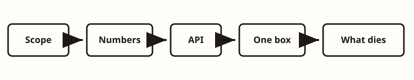
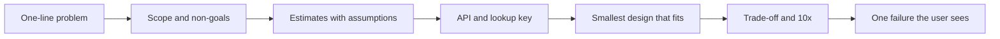
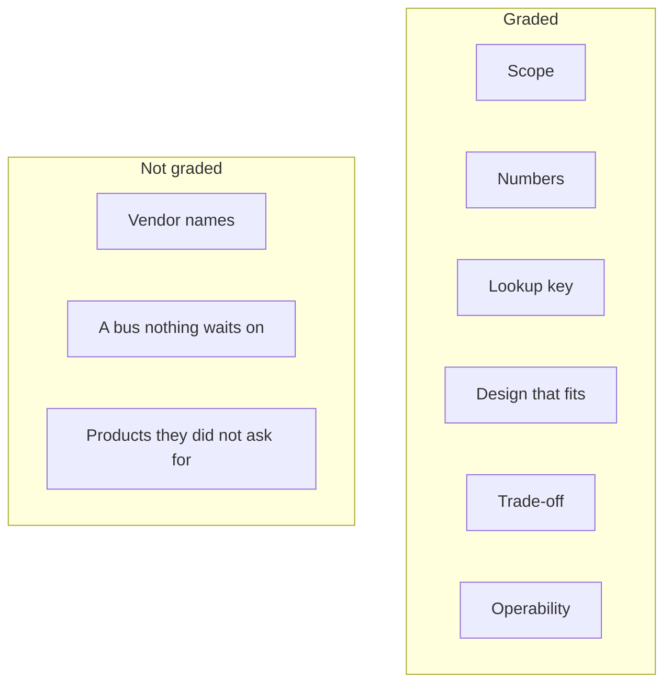

<!-- day-nav -->
[← Start](../START.md) · [Day 2 — Vague problem to requirements →](02-vague-problem-to-requirements.md)

# Day 1 — What the interviewer is grading

**Do now**

1. Set a timer.
2. Attempt the problem. Stop at the attempt line. Do not scroll.
3. Then read.

## Time box

35 minutes.

| Minutes | Do this |
|---|---|
| 0–8 | Attempt below. Stop when the time is up, even if the list is short. |
| 8–28 | Read the rest of this page. |
| 28–35 | Close it and say, out loud, how you will spend a 35-minute interview. No boxes yet. |

## Intent

Facing a senior or staff interview, leave able to separate graded signal from a technology tour. The signals are scope, numbers, a lookup key, a design that matches those numbers, a trade-off, and what the user sees when something dies.

The running product this week is a pastebin. Today you do not design it. You decide what a good hour on it would even be.

## Problem

The interviewer says:

> Design a pastebin. People paste text and share a link.

That is the whole problem. Same sentence all week. On day 7 it is closed-book.

## Attempt before reading

Set a timer for 8 minutes. Do not scroll. On paper, write:

1. Six things you believe this interview actually grades.
2. A minute-by-minute spend of 35 minutes.
3. Five technologies you will not mention unless asked.
4. Three questions you would ask before drawing anything.

If you drew a queue, a cache, and three databases, that page is the anti-pattern this day exists to kill. Keep it anyway, so you can see the difference after you read.

---

**Stop. The sections below are the lesson, not the attempt.**

---

## What is graded

A senior or staff interviewer is not scoring vocabulary. They are scoring whether you can shrink a vague product, attach numbers, and live with the consequences. The hour has six signals. Everything else is optional color.

| Signal | What "good" sounds like on this problem | What does not count |
|---|---|---|
| Scope | You lock what a paste is, who can read it, and what you will not build, before any box. | A feature list that grows while you draw. |
| Numbers | QPS, stored bytes, and bandwidth, each with the assumption that produced it. | "High traffic" or a single QPS with no division. |
| API and key | The create and the read, and the field you actually look up. | "REST" or "a NoSQL document." |
| Design that fits | The smallest system that meets those numbers, including the durability point. | A tour of every tier you have used at work. |
| Trade-off | A real alternative, what you gave up, and the first thing that breaks at 10×. | "This is more scalable" with no unit. |
| Failure and ops | One dependency down, the user-visible result, the signal that would page you. | "We'll have three replicas" as a personality. |

Staff credit is not a seventh signal called "more boxes." It is a sharper trade-off and a failure you can operate. A staff answer often has **fewer** components than a senior answer that got nervous.

What staff sounds like on this problem: you name the non-goal before they ask; you refuse a tier with a unit, not a vibe; when they pull one deep dive, you stay there for five minutes instead of renaming every box. The deep dive they usually pull on a pastebin is durability of create, the id space, expiry correctness, or the box dying. If you spent minute 12 inventing a bus, you have no time left when they ask the real question.

Communication is the medium, not a separate project. You structure the hour, you stop talking, you let them pull one deep dive. A beautiful design they could not follow is a miss. Silence after a locked non-goal is signal. Filling the silence with Kafka is not.

## What is not graded

- Vendor names, unless they ask what you would run. Say the access pattern first.
- Protocol derivations. Consensus, when you need it at all, is a dependency with an unavailable window. That is not this week.
- Syntax highlighting, malware scanning, search, accounts, a public "trending" page. Those are other products.
- AI or ML. Nothing in this course, and nothing in this interview, asks you to rank or classify pastes.
- Drawing the end-state multi-region system in the first ten minutes.

If you hear yourself say "we'll just use Kafka," you have left the rubric. There is no async work in the basic pastebin: the user is waiting for the link, and the reader is waiting for the bytes.

## How to spend the 35 minutes

This is the script. Days 2–6 teach the steps. Day 7 runs them on a timer. Memorize the shape, not a script word for word.

| Clock | Step | Leave the room with |
|---|---|---|
| 0:00–5:00 | Requirements and non-goals | Behavior, constraints, explicit non-goals |
| 5:00–10:00 | Estimates, out loud | Write QPS, read QPS, bytes stored, egress, and the assumption you trust least |
| 10:00–16:00 | API and data model | Endpoints, the lookup key, retention, what you refuse to index |
| 16:00–26:00 | One design, then paths | A whiteboard, a read path, a write path |
| 26:00–33:00 | Their deep dive | One of: id space, durability, expiry, or the box dying |
| 33:00–35:00 | Close | What you did not build, and the 10× break |

If they interrupt at minute 6 with "let's draw," you draw, and you write the missing number in the corner so it does not vanish. You do not pretend the interruption was your plan. If they interrupt with "skip capacity, we know the scale," write the assumption they just granted in one line anyway: without it, the 10× question at minute 33 has nothing to stand on.

## Requirements, at grading altitude

You will lock these properly on day 2 and compute them on day 3. Today, notice which sentences are requirements and which are already a design.

A pastebin, until you are told otherwise:

- A person submits text and gets a link. Anyone with the link can read the text until it expires.
- You do not know QPS yet. You will assume it, say the assumption, and proceed.
- Non-goals are part of the answer. Accounts, a public directory, edit history, forever-retention, and rendering the paste as HTML are the ones that silently turn this into a different interview.

The two numbers that will dominate, before you have computed them: **reads, if links are shared**, and **retained bytes, which are ingest times lifetime**. A candidate who talks only about write QPS is grading themselves.

Do not memorize a QPS today. Day 3 derives the figure you will reuse all week. A borrowed number you cannot recompute is hand-waving with extra steps.

## Design, at grading altitude

The design a senior defends in week 1 is one service that stores metadata and bytes, acknowledges a create only after those bytes are durable, and reads by primary key. You do not need a cache, a queue, a CDN, or a second region to say that sentence. Days 4 and 5 make it precise. If you cannot say why each extra box exists, it is not a design. It is decoration.

The graded move is the refusal. "I am not adding a CDN until egress says so. I am not adding a queue because the user is waiting for the write." That refusal is the design, at this altitude.

A wrong refusal sounds like taste: "I like simple systems." A right refusal sounds like a unit: "I have not shown egress that needs an edge, and the create path has no work the user is willing to wait off-path for." If they push "but every production system has a cache," answer with the miss you have not designed yet and the stale read you would own on delete. You are not refusing caches forever. You are refusing to invent a problem the numbers have not asked.

## Diagrams

You should be able to redraw both of these without the page. They are diagrams of the **hour**, not of the pastebin. The pastebin pictures start on day 2.

### Where the time goes

Six stops, in order. Skipping from the problem to "design" is how a tour starts. If you cannot redraw this sequence from memory, you do not own the hour yet, whatever pastebin you could draw.

### Graded signal versus a tour

The left column is six sentences you can say with a number or a failure attached. The right column is color that burns the deep-dive clock. A staff picture often looks smaller than the tour because the tour was never graded.

## Failure the user sees, at grading altitude

You do not need the full pastebin drawn to practice this signal. Pick **one** dependency and finish the sentence: what the creator sees, what the reader sees, and what pages you.

On a one-box pastebin altitude, the dependency is usually the host, the disk under the bodies, or the primary that holds the row. Creator-visible: create returns an error, or hangs past the client's patience. Reader-visible: the link 5xxs, or — worse, if you lied about durability — a 201 the next GET cannot find. That second case is not "eventual." It is a broken ack. Page on create error rate and on "row exists, body missing," not on 404 rate: 404 is a normal miss, an expired paste, or a bad link.

What does not count as failure signal: "we'll have replicas" with no sentence about what the user sees in the window before promotion, and no sentence about whether a create that already returned 201 can 404 after. Replicas without that sentence are furniture.

## Trade-offs

**Choice.** Spend the first ten minutes on scope and numbers. Do not open with a topology.

**Alternative.** Start drawing "a standard web scale architecture" immediately, and backfill requirements if they ask.

**What you give up by choosing scope first.** You might get cut off before the picture is pretty. A partial design with locked non-goals still scores. A pretty picture with no non-goals does not. You also give up the comfort of looking "senior" in minute two. Looking busy with boxes is not the same as being graded.

**Why you still choose it.** The deep dive they actually care about — durability, id space, expiry, the dead box — needs the numbers and the non-goals underneath it. A tour leaves you nowhere to stand when they ask what the user sees.

**10× break.** Ten times the traffic does not make the opening move wrong. It asks which box dies. The candidate who drew a CDN, a cache, and a queue in minute 2 still cannot answer, because they never computed the byte rate those boxes were supposed to absorb. The 10× question punishes a tour harder than it punishes a small design. You will compute the actual break on day 3 and attach it to a box on day 5. Today the point is: you cannot name a 10× break you have not measured, and "we'd scale out" is not a break — it is a hope without a unit.

## Talking points

**Say.** "I'll spend five minutes locking what this is not. Then I'll put QPS, storage, and bandwidth on the board with the assumptions. Then one design that meets those numbers. I expect you to pull a deep dive; I'd rather go deep on durability or the id space than add tiers."

**Say.** "Reads will dominate if a link is shared. Storage will be dominated by how long bytes live, not by write QPS. I don't have the figures yet; I won't invent a round number I can't divide back to."

**Say.** "If one dependency dies, I want the user-visible result and the page named before I add a second region. A replica I have not reasoned about is not a mitigation I have."

**Hand-waving.** "We'll use a microservice architecture." That sentence has no user, no number, and no failure.

**Hand-waving.** "Kafka for scale." Nothing in the problem is asynchronous. Naming a log does not create work that can wait.

**Hand-waving.** "Cassandra because it scales horizontally." You have not shown a query the single primary key cannot serve.

**Hand-waving.** "High availability with three replicas." Availability of what path, in what failure, with what user-visible result during the window? Without those, you named a topology.

**If they ask "what are you optimizing for?"** Say: a correct create and a correct read, durable before the ack, simple enough to operate. Not a platform.

**If they ask you to list technologies.** Name them after the boxes, as implementations of an access pattern, and keep going. Do not let the list become the interview.

**If they say "just draw something so we have a picture."** Draw the smallest thing that can create and read, put a blank for the number you have not locked, and say out loud which non-goals still apply. Do not reward the interruption by inventing tiers.

## Say this in the room

I am grading myself on six things: scope before boxes, numbers with assumptions, the create and read and the lookup key, the smallest design that meets those numbers, one real trade-off with a 10× break, and one dependency down with a user-visible result and a page. I am not grading myself on vendor names, on a bus nothing waits on, or on products you did not ask for. Reads will dominate if the link is shared; retained bytes will dominate storage; I will not invent a QPS I cannot recompute. I will refuse a CDN until egress asks, and a queue because the user is waiting on the write. If you pull a deep dive, I would rather spend it on durability of the ack, the id space, expiry, or the box dying than on adding tiers.

## Kit artifact

One rubric row, for when a kit exists. Not the kit.

| Dimension | A 3 sounds like |
|---|---|
| Scope before boxes | Non-goals were spoken before any component was drawn. |

The kit's grader, later, should score that row by quoting the candidate. It should not award points for naming a vendor. You can score yourself on this row tonight without the kit: look at your 8-minute page and mark whether a non-goal appears above the first box.

## Design log

Copy [the template](../design-log/TEMPLATE.md) only if you want to keep today. Mocks are mandatory; lesson days are not.

For today, five lines: the six signals you will actually practice, and one sentence you will stop saying in interviews. That sentence is the gap.

Next: [Day 2 — Vague problem to requirements](02-vague-problem-to-requirements.md).

---

<!-- day-nav -->
[← Start](../START.md) · [Day 2 — Vague problem to requirements →](02-vague-problem-to-requirements.md)
