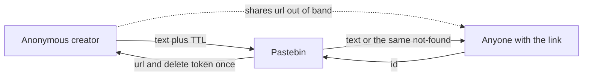
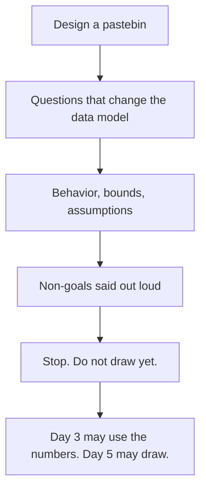

<!-- day-nav -->
[← Day 1 — What the interviewer is grading](01-what-the-interview-is-grading.md) · [Day 3 — Capacity math out loud →](03-capacity-math-out-loud.md)

# Day 2 — Vague prompt to requirements

## Time box

35 minutes.

| Minutes | Do this |
|---|---|
| 0–12 | Attempt. Requirements only. No boxes, no vendor names. |
| 12–30 | Read. Mark every line you would change on your page. |
| 30–35 | Say the non-goals out loud, from memory, with one reason each. |

## Intent

Facing a one-line prompt, leave able to lock behavior, constraints, and non-goals before any box is drawn. A requirement names observable behavior or a bound. A design names a component. If your page has a component on it, you left this day early.

## Problem

> Design a pastebin. People paste text and share a link.

The interviewer will not add constraints unless you ask or assume them. Assumptions you state out loud are requirements. Assumptions you hide are land mines.

## Attempt before reading

12 minutes. Do not scroll. Write four lists:

1. Clarifying questions, at most six. Star the ones whose answer would change the data model, not just the UI.
2. Functional behavior you are locking if they say "you decide."
3. Numbers you are assuming, with units. You will not be graded today on arithmetic. You will be graded on whether the number is an assumption or a wish. Derivation is day 3; do not look ahead.
4. Non-goals. At least five. Each one is a product you are refusing to design in this hour.

If your functional list contains "scalable," "fast," or "secure" with no user-visible meaning, rewrite those three words before you read on.

---

**Stop. Everything below is the worked requirements for the Week 1 pastebin.**

---

## Requirements

### What you ask before you assume

Ask these. If the interviewer says "up to you," lock the answer in the same breath and move on. Do not ask questions you are not willing to answer yourself.

| Ask | Lock if they shrug | Why it changes the design |
|---|---|---|
| Text only, or files and images? | UTF-8 text only. | Files are an object-storage problem with a different size curve. |
| Who can read a paste? | Anyone with the link. No public directory. | A directory is a feed. A link is a primary-key read. |
| Do links last forever? | No. The creator picks from an allow-list. | Retention dominates storage. "Forever" makes the storage answer unbounded. |
| Accounts? | No. Anonymous create. | Accounts add a login dependency on the write path. |
| Can the creator delete? | Yes, with a secret returned once at create time. | Otherwise a leaked URL is permanent until expiry. |
| Can they edit or replace? | No. | Edit is version history and cache invalidation. A new paste is a new id. |
| Custom or vanity URLs? | No. The service mints the id. | Vanity slugs are squatting, hot keys, and a second lookup table. |

Two more you should raise even if they do not, because they are how pastebins embarrass people:

- The body is untrusted. You will not serve it as HTML. A paste that contains a script is text, not a page on your origin.
- Expiry is checked on the read path. A background sweeper is garbage collection, not correctness. A sweeper that is behind must not resurrect a paste that should be gone, and it must not be why a paste stays readable.

### Functional behavior

1. **Create.** Client sends a UTF-8 body and a TTL from the allow-list. Service returns an id, a URL, the expiry time, and a delete token. The token is shown once.
2. **Read.** Client sends the id. If the paste exists and `now < expires_at`, the body comes back as `text/plain` with `X-Content-Type-Options: nosniff`. If it does not exist, or it exists but is expired, the response is the same not-found. You do not tell strangers which of those two it was.
3. **Delete.** Client sends the id and the delete token. Success removes the paste. A wrong token and an unknown id look the same from the outside.
4. **Syntax hint.** Optional short label ("python", "sql"), stored and returned as a header. The service does not highlight, render, or execute anything.
5. **Expiry allow-list.** 1 day, 7 days, 30 days, 365 days. Default 30 days. The client sends a duration, not an absolute timestamp. The server clock computes `expires_at`. You do not accept an arbitrary duration, because your storage assumption depends on this list.

Create is acknowledged only after the body and the metadata are durable. That is a requirement. The mechanism is day 5. Do not "solve" it with a product name today.

### Constraints you state as assumptions

These are the locks day 3 will turn into arithmetic. State them as assumptions, not as facts you measured.

| Assumption | Value | If the interviewer overrides you |
|---|---|---|
| New pastes | 10 million per day | Recompute. Do not scale every tier by vibes. |
| Reads per write | 50 | Links are shared. If they say 1:1, the product is a private notepad and egress stops being the story. |
| Mean body | 10,000 bytes | This is the sensitive one. Instrument it first in a real system. |
| Peak vs average | 3× | Diurnal peak, not a ticket drop. Do not stack a second hidden safety factor on top. |
| Effective retention | 45 days of ingest resident | Mix of the allow-list, weighted toward the default. Worst case on the list is everyone picking 365 days. |
| Max body | 1,000,000 bytes | Reject oversize. Do not truncate. |
| Regions | One | Multi-region is a non-goal this hour. |
| Id | Service-minted, unguessable, never reused | Width is a data-model question for day 4, because expired ids must not be recycled into a new paste. |

Units: 1 KB means 1,000 bytes in this course, and 1 GB means 10^9 bytes. Say that once so nobody "corrects" you with 1024 and thinks the design changed.

Latency, said as a budget rather than a dream: a read of a hot paste should be a primary-key lookup plus a short byte read, tens of milliseconds of server time in-region, not a global 100 ms promise. A create is bounded by durability, not by the network. You will put a number on that when you know the fsync story. "Low latency" is not a requirement.

Availability: one region is acceptable. You are not promising 99.99% today. You are promising that a lost disk is a stated failure, not a surprise. Day 5 owns that sentence.

### Non-goals

Say these before you draw. Each one is a different interview you just declined.

- Accounts, profiles, "my pastes."
- A public index, trending page, or search.
- Edit, replace, version history, or comments.
- Vanity slugs and custom domains.
- Binary uploads, images, and attachments.
- Syntax highlighting, execution, or a malware-scanning pipeline. (Abuse control is a follow-up, not a subsystem you design today. You will name where it would sit: on create, before the durable write.)
- End-to-end encryption beyond TLS. Disk encryption is an operational default, not a box.
- Forever retention.
- Multi-region active-active.
- Rendering a website on the paste URL. The paste URL returns text. If a UI exists, it is a different origin that inserts the body as text, not as HTML.
- A cache, a queue, a CDN, or a second service. Those are designs. They are not requirements. They have to earn a place from a number on day 3 or a fault on day 5.

Privacy in one line: the URL is the capability. You do not add a public ACL model. Anyone who has the URL can read until expiry or deletion. Say that so "private paste" does not sneak in as a second visibility flag you then have to enforce everywhere.

## Design

There is no topology today. The design move is the lock itself.

The product you are designing is a **capability-URL blob with a deadline**. Create mints an unguessable id. Read is a point lookup. Delete is the same lookup plus a secret. Retention is an allow-list so storage stays bounded. The body is opaque UTF-8 bytes, served as plain text.

That sentence is enough design to start day 3. If you add a box, you should be able to point at the requirement it serves. "Scale" is not a requirement you have written down yet.

### The requirement that will bite

Expired and missing must be indistinguishable to a reader. That single rule forbids a cute "this paste expired" page, and it forbids recycling ids. Recycling would hand a new writer's content to anyone who still holds an old link. You will size the id space on day 4 against **ids ever minted**, not against rows currently alive.

### The requirement that is not a cache

A hot link is still a point read of one id. Do not "solve" popularity in the requirements. Note it as a question for later: popularity changes load shape, not the contract.

## Diagrams

### Context and trust

The trust boundary is the service. Clients are untrusted: bodies are hostile, clocks are wrong (which is why the client does not send `expires_at`), and the delete token is a bearer secret. There is no identity provider on the picture, on purpose. The link crosses a human channel you do not control. That channel is not your system, and you do not "secure" it with a microservice.

### From a vague sentence to a lock

If your arrow from the prompt points at "pick a database," redo the diagram.

## Trade-offs

**Choice.** A capability URL, anonymous create, no accounts.

**Alternative.** Authenticated owners. Every paste has a user id. Read is open or private based on a flag. Delete uses the session.

**What you give up.** Lost URL means the creator's only remaining power is the delete token, which they also have to keep. There is no "email me my pastes." Support cannot verify ownership, because there is no owner. A token in a proxy log is a bearer secret; you will store only a hash (day 4), but the plaintext still exists on the client.

**Why you still choose it.** The prompt is "share a link," not "build a user system." Accounts put a login dependency in front of create, and they invite a private/public matrix you then have to get right on every read. The capability URL makes the read path one key.

**10× break.** Ten times the users does not flip this choice. Accounts at 10× are still a policy problem, not a scale win. What 10× will break is egress, metadata QPS, or backup, which you have not earned the right to name precisely until day 3. Do not "upgrade" to accounts because the system got bigger.

Second choice, shorter, because interviewers push it: **no public listing.** The alternative is a homepage of recent pastes. You give up discovery and "growth." You avoid a fan-out or a ranking problem, abuse on a public wall, and a query that is not a primary key. At 10× a listing becomes its own product (a feed). It is still a non-goal. Popularity of a single link remains a point read.

## Talking points

**Say.** "I'm treating the URL as a capability. No accounts, no directory, no edits. Expiry comes from a fixed allow-list, default 30 days, server clock. Expired and missing look the same. I will not render the body as HTML."

**Say.** "My load assumptions are 10 million new pastes a day, 50 reads per write, 10 KB mean body, 3× peak, about 45 days of bytes resident. I have not done the arithmetic yet; I will, and these are the knobs if you disagree."

**Say.** "Abuse limiting sits on create, before the durable write. I'm not designing the limiter unless you want that as the deep dive. The contract doesn't require it for correctness of a single honest user."

**Hand-waving.** "It should be secure." Say instead: TLS, body served as `text/plain`, delete token stored hashed, ids unguessable and never reused, no HTML on the paste origin.

**Hand-waving.** "We'll support private and public and unlisted." You just created three authorization modes. Decline unless they insist, and if they insist, private means "we need accounts," which you had as a non-goal. Make them choose.

**Hand-waving.** "Expire with a cron job." A delayed job is not the read contract. The read checks `expires_at`. The job only reclaims space.

**If they say "make it like Pastebin.com."** Take the behavior (text, link, expiry), not the ads, accounts, or syntax-highlighting farm. Say which parts you are copying and which you are leaving.

## Kit artifact

One checklist row. The rest of the requirements checklist belongs to the kit, sold separately. Practice this row now.

| Row | Lock |
|---|---|
| Non-goals for a pastebin hour | Accounts, listing, edit, vanity ids, forever-retention, HTML rendering, search, multi-region. |

If you cannot recite the row, you are not done with day 2. The kit is not required to recite it.

## Design log

From your pre-read page: which non-goal did you miss, and which assumption did you state as a fact? One gap, one sentence.

Next: [Day 3 — Capacity math out loud](03-capacity-math-out-loud.md).

---

<!-- day-nav -->
[← Day 1 — What the interviewer is grading](01-what-the-interview-is-grading.md) · [Day 3 — Capacity math out loud →](03-capacity-math-out-loud.md)
