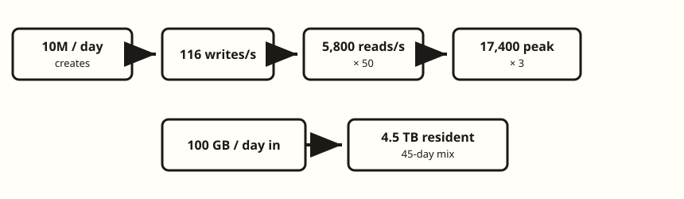
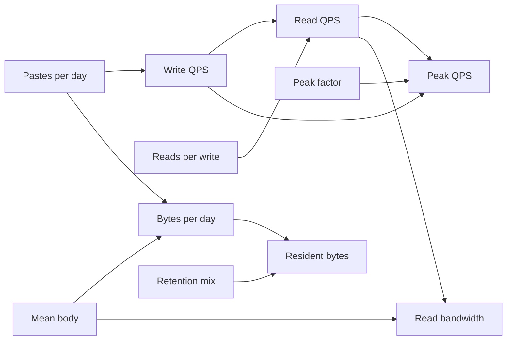
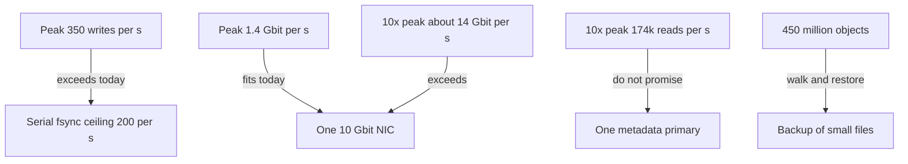

<!-- day-nav -->
[← Day 2 — Vague problem to requirements](02-vague-prompt-to-requirements.md) · [Day 4 — API and data model first →](04-api-and-data-model-first.md)

# Day 3 — Capacity math out loud

**Do now**

1. Set a timer.
2. Attempt the problem. Stop at the attempt line. Do not scroll.
3. Then read.

## Time box

40 minutes. This day runs long if you recompute; stop at 40 anyway.

| Minutes | Do this |
|---|---|
| 0–15 | Attempt. Arithmetic on paper, spoken. |
| 15–35 | Read. Recalculate any line you do not believe. |
| 35–40 | Close the page and recompute write QPS, retained bytes, and peak egress from the assumptions only. |

## Intent

Facing a blank estimate, leave able to compute QPS, storage, and bandwidth out loud, every assumption visible, no stacked safety factors. The pastebin locks from day 2 are the inputs. If your numbers disagree with the table below, one of you has an arithmetic error or a different assumption. Find which. Do not average them.

## Problem

> Design a pastebin. People paste text and share a link.

The interviewer adds: "Put some numbers on it."

## Attempt before reading

15 minutes. Do not scroll. Using only the locks you remember from day 2 (look back at your own notes, not at day 2's solution if you can help it):

1. Average write QPS and average read QPS.
2. Peak write QPS and peak read QPS.
3. New bytes per day, and bytes resident under your retention assumption.
4. Average and peak read bandwidth.
5. The assumption you would instrument first, and what multiplies if it is 10× wrong.

Show the division. "About a million QPS" with no numerator is a zero.

---

**Stop. Worked arithmetic below. Do not "fix" your page before you have compared term by term.**

---

## Requirements the numbers must respect

Restated so this page stands alone. These are assumptions, said out loud, not measurements.

- 10 million new pastes per day.
- 50 reads per write, because a link is shared. Not because 50 is a magic constant.
- Mean body 10,000 bytes. Cap 1,000,000 bytes. Reject over the cap; it does not enter the mean.
- Peak is 3× the average. This is a daily cycle, not a launch.
- TTL allow-list: 1, 7, 30, 365 days. Default 30. Effective resident set: **45 days of ingest**. Worst case on the allow-list: everyone chooses 365 days.
- One region. Ids are never reused. UTF-8 text. No listing.
- Decimal units: 1 KB = 1,000 bytes, 1 GB = 10^9 bytes, 1 TB = 10^12 bytes. A factor of 1.024 is not a design change. Hiding the convention is.

You do not add a "times two for safety" after the 3× peak. If you want headroom, name it as a separate assumption. Hidden factors make the next person unable to check you, including the interviewer.

## Design by arithmetic

Speak it like this. The table underneath is the same math, written down so you can check.

### Out loud

"Ten million new pastes a day. There are 86,400 seconds in a day. Ten million divided by 86,400 is 115.7 writes a second. I will call that **116 write QPS** so the next product is clean. The error is under one percent. I will not round again on top.

A whiteboard shortcut is 10^5 seconds in a day, which gives 100 writes a second. I'll say both: 100 if I'm moving fast, 116 if I'm about to multiply. I won't pretend they're different designs.

I assumed 50 reads per write. 116 times 50 is **5,800 read QPS** average.

Peak is 3 times, and I say why: people are awake, this is not a flash sale. About **350 write QPS** peak and **17,400 read QPS** peak.

Mean body 10 KB, decimal. Ten million times 10 KB is **100 GB of new text per day**. Writes on the wire are 116 times 10 KB, about **1.2 MB/s** average. Writes are not the bandwidth problem.

Retention: no forever. I assumed the mix of the allow-list behaves like **45 days** of ingest sitting on disk. 100 GB times 45 is **4.5 TB** of bodies. Worst case, everyone picks a year: 100 GB times 365 is **36.5 TB**. I will say the worst case so 4.5 TB doesn't look like a measurement.

Metadata: I'll budget 300 bytes per row, which is generous for an id, a few timestamps, a hash, and a length. Ten million times 300 bytes is 3 GB a day, times 45 days is **135 GB**. It does not move the storage decision. Bodies do.

Live rows at 45 days: 10 million times 45 is **450 million** objects. That number is an id-space input and a filesystem input. It is not 'a large table' in the abstract. I'll size the id on day 4 against ids ever minted, not just live rows, because I don't recycle links.

Read bandwidth: 5,800 times 10 KB is **58 MB/s** average, which is about 460 Mbit/s. Peak is three times that, **174 MB/s**, about **1.4 Gbit/s**.

Durability tax, because QPS without fsyncs is a lie. I assume one fsync costs 5 milliseconds and only one is in flight, as a planning number, not a benchmark. Per-paste fsync then tops out at 1 / 0.005 = **200 writes a second**. Average writes at 116 fit. Peak at 350 does not. I will not lower the peak to make the fsync fit. I will group commits on day 5 and acknowledge only after the fsync returns.

The assumption I instrument first is the mean body size. If the mean is 100 KB, storage and egress go up tenfold and a single 10 Gbit NIC is already the wrong story **today**, not at 10× traffic. The second assumption is the read ratio. If it is 5:1, I overstated the read path by 10×. The third is the 45-day mix."

### Check table

| Quantity | Expression | Result |
|---|---|---|
| Write QPS, average | 10,000,000 / 86,400 | 115.7 → **116** |
| Read QPS, average | 116 × 50 | **5,800** |
| Write QPS, peak | 116 × 3 | **~350** |
| Read QPS, peak | 5,800 × 3 | **17,400** |
| Ingest | 10,000,000 × 10,000 bytes | **100 GB/day** |
| Bodies resident | 100 GB/day × 45 | **4.5 TB** |
| Bodies, worst allow-list | 100 GB/day × 365 | **36.5 TB** |
| Metadata resident | 300 B × 10,000,000 × 45 | **135 GB** |
| Live objects | 10,000,000 × 45 | **450 million** |
| Read bandwidth, average | 5,800 × 10,000 | **58 MB/s** (~460 Mbit/s) |
| Read bandwidth, peak | 17,400 × 10,000 | **174 MB/s** (~1.4 Gbit/s) |
| Write bandwidth, average | 116 × 10,000 | **~1.2 MB/s** |
| Serial fsync ceiling | 1 / 0.005 s | **200 writes/s** |

Steady-state deletes match creates once retention is full: about 116 deletes a second average, each a metadata delete and a body reclaim. Same order as writes. Not a new tier. Not free. Do not forget them when you talk about disk amplification, and do not design a stream processor for them.

### What these numbers do *not* say

They do not say "add Redis." A hot paste is one key. One viral id that absorbs a large fraction of the 17,400 reads is the easy case: one row, one body, page cache. Uniform reads over 450 million objects are the harder disk shape, and 174 MB/s is still inside a single modern NVMe. The number that fails a **serial** durability story is the 200 fsync/s ceiling, not the read QPS.

They do not say "add a CDN." Peak egress at 1.4 Gbit/s fits a 10 Gbit NIC with room. A CDN is a non-goal until a number says the origin should not be the one serving bytes. That number is the 10× line below, or a mean body size you got wrong.

They do not say you are available. Capacity is not durability. A box that can push 174 MB/s still loses every paste when its disk dies. That split is day 5.

### 10× traffic, same assumptions otherwise

Ten times the ingest, same read ratio, same mean size, same 3× peak, same 45-day mix.

| Quantity | At the locked scale | At 10× |
|---|---|---|
| Write QPS, peak | ~350 | ~3,500 |
| Read QPS, peak | 17,400 | ~174,000 |
| Ingest | 100 GB/day | 1 TB/day |
| Bodies resident | 4.5 TB | 45 TB |
| Read bandwidth, peak | 1.4 Gbit/s | ~14 Gbit/s |
| Write bandwidth, peak | ~3.5 MB/s | ~35 MB/s |

Read this table as "which sentence stops being true," not as a shopping list.

- **14 Gbit/s** does not fit one 10 Gbit NIC. That is the first throughput break. It is a read-path, egress break.
- **174k primary-key reads/s** is where I stop promising one metadata primary, even with the index cached. I will not pretend I benchmarked Postgres in the room. I will say 17k point reads are a load test I expect to pass, and 174k is a cache or a read replica I have not earned yet at today's number.
- **35 MB/s of body writes** still fits a disk. The 10× write problem is not bandwidth. Group commit still has to flush a fatter batch inside a few milliseconds. If it cannot, create latency climbs or you ack a lie. You do not ack before the fsync.
- **45 TB and 4.5 billion live objects** (10 × 450 million) is an operations problem: backup, restore, inodes or packed files. Not a reason to introduce a queue.

Ids: you will check on day 4 that the key width still works at this 10×, over years, because you never reuse an id. Do not hand-wave "64-bit will do" without the birthday bound.

## Diagrams

### The only order that stays checkable

Every arrow is a multiplication you can invert. If you cannot invert it, you do not understand your own estimate.

### Which number threatens which limit

The left edges are today's locks or the 10× column. The right edges are limits. A limit with nothing pointing at it is a tier you have not justified. Leave it off the whiteboard.

## Trade-offs

**Choice.** Quote average and peak. Design durability for the **peak write** rate and the **resident byte** total. Design egress for the **peak read** byte rate. Do not design for the average and mention peak as a footnote.

**Alternative.** One number, "roughly 10k QPS," used as both read and write, average and peak.

**What you give up.** The estimate takes four minutes and sounds pedantic. You will be slightly wrong (the true average is 115.7, not 116).

**What you refuse to give up.** Checkability. Anyone in the room can divide 10 million by 86,400 and catch you.

**10× break.** Named above: one NIC at ~14 Gbit/s, and a metadata primary you should not promise at ~174k point reads/s. Group commit is what keeps the write path honest before you ever get to 10×, because 350 already misses a 200/s serial fsync ceiling. The break is specific. "We'd shard" is not a break; it is a tactic you have not aimed.

Sensitivity is the other trade-off worth saying. You can hold traffic fixed and be wrong about the mean size by 10×. That hurts as much as 10× traffic, and it is more likely. Say which knob you fear.

## Talking points

**Say.** The out-loud script, shorter if they are impatient: "116 writes a second average, 5,800 reads, times three at peak. 100 GB a day in, 4.5 TB resident at a 45-day mix, 36 TB if everyone picks a year. Peak egress about 1.4 Gbit/s. Serial fsyncs at 5 ms only buy me 200 writes a second, so peak writes need a group commit. The mean object size is the assumption I'd instrument first."

**Say.** "I used decimal KB. I did not put a safety factor on top of the 3×. If you want one, tell me the factor and I'll multiply once, in the open."

**Hand-waving.** "A few thousand QPS, so we're fine." Fine compared to what limit? Say the limit.

**Hand-waving.** "Storage won't be a problem." 4.5 TB of bodies is comfortable. 450 million files may not be, and 36 TB is the allow-list worst case you already permitted. Those are different sentences.

**Hand-waving.** "We'll cache 90% so the database sees 580 QPS." You just introduced a hit-rate assumption you did not need. Today's read QPS does not force a cache. A hit rate you invented to justify a picture is the stacked factor in disguise. Day 5 keeps the cache off the diagram until a number requires it.

**If they challenge 50:1.** Good. Recompute reads and egress only. Do not rebuild the whole product. 10:1 is 1,160 read QPS average and about 280 Mbit/s peak. Still the same shape.

**If they challenge 5 ms fsync.** Even better. Ask what disk they want you to assume. The structure of the answer (ceiling = 1 / fsync time, compare to peak writes) does not change. A 1 ms fsync raises the serial ceiling to 1,000/s, and peak fits without group commit. Say that. Do not pretend every disk is the same.

## Kit artifact

One estimation-sheet row. The sheet itself is the kit, later. Practice the row:

| Assumption | Value | If it is 10× worse |
|---|---|---|
| Mean body size | 10,000 bytes | Resident bytes and egress ×10. NIC story breaks at today's traffic, not at 10× QPS. |

Write your own second row tonight for the retention mix. That is the exercise, not something the kit can do for you.

## Design log

Record the line you got wrong on the attempt, and whether it was arithmetic or a different assumption. One gap. If you got the table right and could not say which limit it threatens, the gap is the limit, not the multiplication.

Next: [Day 4 — API and data model first](04-api-and-data-model-first.md).

---

<!-- day-nav -->
[← Day 2 — Vague problem to requirements](02-vague-prompt-to-requirements.md) · [Day 4 — API and data model first →](04-api-and-data-model-first.md)
