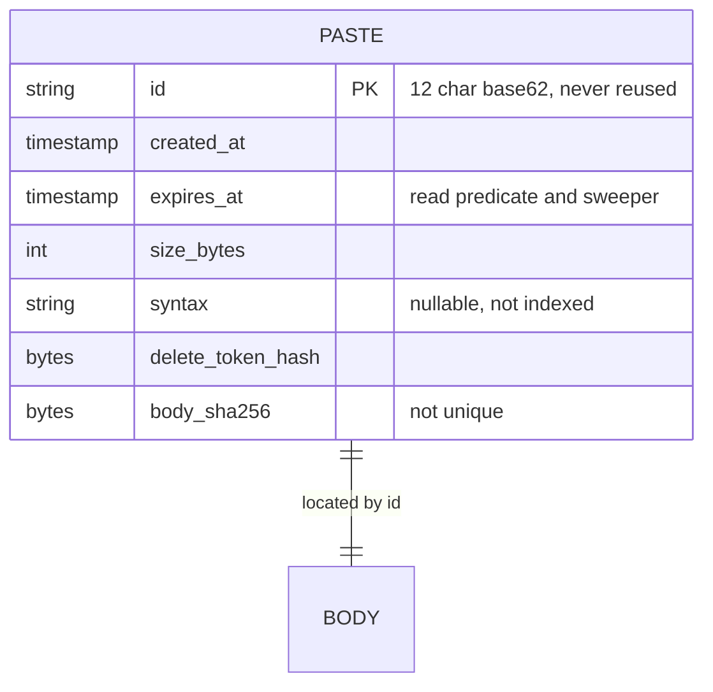
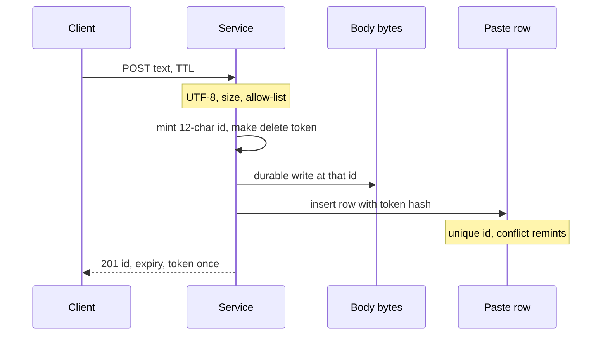

<!-- day-nav -->
[← Day 3 — Capacity math out loud](03-capacity-math-out-loud.md) · [Day 5 — One box, and why it breaks →](05-one-box-and-why-it-breaks.md)

# Day 4 — API and data model first

**Do now**

1. Set a timer.
2. Attempt the problem. Stop at the attempt line. Do not scroll.
3. Then read.


## Time box

35 minutes.

| Minutes | Do this |
|---|---|
| 0–12 | Attempt. Endpoints, status codes, and a schema. No load balancer. |
| 12–30 | Read. Fix your schema; do not add a cache to punish yourself. |
| 30–35 | Recompute the id width from memory. The bound is the point, not the drawing. |

## Intent

Facing pressure to draw servers, leave able to put endpoints, retention, and the real lookup key down first. For this pastebin the key is the id. The body is a value. Expiry is a predicate on the read, not a hope about a sweeper.

## Problem

> Design a pastebin. People paste text and share a link.

The interviewer says: "Write the API and the data model. Don't draw the fleet yet."

## Attempt before reading

12 minutes. Do not scroll. Produce:

1. Create, read, and delete. Method, path, and the two or three status codes that matter.
2. The row you store. Mark the primary key. Mark fields you will index, and say which query uses each index.
3. How long the id is, and whether an expired id can be issued again. If you cannot justify the length, write "I don't know yet" rather than "8 characters looks like a short link."
4. What the delete secret is, and whether you store it raw.

Day 3's numbers you may use: about 10 million new pastes a day, about 450 million live at a 45-day mix, ids never reused. If you did not keep them, assume those three and label them as assumptions.

---

**Stop. Worked API and model below.**

---

## Requirements this model has to satisfy

From day 2, only what changes the schema:

- Anonymous create. No user table.
- Read by id. No list, no search, no secondary lookup by syntax.
- TTL allow-list 1 day, 7 days, 30 days, 365 days. Default 30 days. Client sends a duration. Server sets `expires_at` from its own clock.
- Expired and missing are the same response.
- Delete token shown once. A wrong token must not confirm that the id exists.
- Body is UTF-8, at most 1,000,000 bytes, served as `text/plain`, never as HTML.
- Ids are unguessable and **never reused**, including after expiry or delete. The birthday bound is over every id ever minted, not over the 450 million live rows.
- Acknowledge create only after metadata and body are durable. The schema has to be able to express "row points at bytes that already exist." Placement of the bytes is day 5. The pointer is today.

Non-goals that keep tables out of the model: accounts, vanity slugs, edit history, content dedupe, a public feed.

## API

Raw body on create, not a JSON string. A JSON envelope means escaping, and the 1,000,000 byte cap becomes a cap on the envelope instead of the paste. JSON is for the small response, where structure is useful.

### Create

```
POST /v1/pastes
Content-Type: text/plain; charset=utf-8
X-Paste-TTL: 30d
X-Paste-Syntax: python          (optional, ≤ 32 bytes, not interpreted)

<raw UTF-8 body, ≤ 1,000,000 bytes>
```

`X-Paste-TTL` is one of `1d`, `7d`, `30d`, `365d`. Omitted means `30d`.

```
201 Created
Content-Type: application/json

{
  "id": "7Kq2mP9xL0aB",
  "url": "https://paste.example/7Kq2mP9xL0aB",
  "expires_at": "2026-11-02T17:44:00Z",
  "delete_token": "<url-safe secret, shown once>"
}
```

| Status | When |
|---|---|
| 201 | Row committed and body durable. |
| 400 | TTL not in the allow-list, or body is not valid UTF-8, or syntax label is too long. |
| 413 | Body longer than 1,000,000 bytes. Nothing is written. |
| 500 | Mint or storage failed after retries you are willing to hide. Client may retry the same bytes; that creates a **second** paste. Creates are not idempotent. Say this. There is no idempotency key in v1, because anonymous clients will not keep one. A double-submit is two links. |

Do not return 409 to the client for an id collision. Collision handling is internal: see the model.

### Read

```
GET /v1/pastes/{id}
```

```
200
Content-Type: text/plain; charset=utf-8
X-Content-Type-Options: nosniff
X-Paste-Expires-At: 2026-11-02T17:44:00Z
X-Paste-Syntax: python          (only if one was stored)

<raw body>
```

```
404
Content-Type: application/json

{"error":"not_found"}
```

404 covers: never minted, expired, deleted, wrong-looking id. Same body, same code. Do not return 410 for expired. 410 is how you leak the distinction the requirement forbids.

The server checks `expires_at` on this path. A sweeper that has not run yet must not matter.

### Delete

```
DELETE /v1/pastes/{id}
X-Delete-Token: <secret from create>
```

| Status | When |
|---|---|
| 204 | Token matched a live row. Paste is no longer readable. |
| 404 | Unknown id, expired, already deleted, or token mismatch. Same body as read-not-found. |

Compare the token to the stored hash in constant time after you have a row. If you return early on a missing id, timing still leaks existence to a careful caller. Ids are unguessable, so this is a statement you make, not a second system you build. Do not invent a padding protocol in the interview unless they take the deep dive there.

There is no list endpoint, no PATCH, no search query parameter. If you feel the need for one, you are designing a different product. Say so and refuse.

Rate limiting is not an endpoint. If they ask, the only place it changes the contract is create: too many creates from one source become 429 **before** the durable write, so you do not spend a fsync on abuse. You do not have a budget for the limiter's numbers today. Do not fake one.

What staff sounds like on the API: every status code has two audiences, the client and the pager, and you name both. A 404 tells the client "gone" and tells the pager "normal." A 5xx tells the client "try again later" and tells the pager "something is wrong." Mix those up and your alerts stop meaning anything. You also say what you are declining, with its cost, before it gets requested: "no idempotency key, so a retry after a lost response is a second paste, and I can tell you roughly how many." The table below gives that number.

## Data model

One table. No user table. No "paste_stats" table. The body is not a column you index and not a column you `SELECT *` casually. The row stores a pointer that day 5 will resolve to a file path derived from the id. There is no path column to get wrong.

| Column | Type | Role |
|---|---|---|
| `id` | 12-character base62, primary key | The only lookup key. |
| `created_at` | timestamp | Server clock. Not a lookup. |
| `expires_at` | timestamp | Read predicate. Sweeper predicate. |
| `size_bytes` | integer | What you stored, not what the client claimed. |
| `syntax` | short string, nullable | Returned as a header. Not indexed. |
| `delete_token_hash` | 32-byte hash | SHA-256 of the token. Never the token. |
| `body_sha256` | 32 bytes | Integrity on read, optional to check. **Not unique.** Dedupe is a non-goal: two users pasting the same text get two ids. |

Index the primary key. Add a secondary index on `expires_at` so the sweeper can find today's garbage without scanning 450 million rows. That index is large. It is still metadata, on the order of the 135 GB budget, not a reason to introduce a second database. There is no index on `syntax`, none on `body_sha256`, none on the token hash. Delete looks up by `id` and then compares the hash.

Token: 128 bits from a cryptographic generator, encoded url-safe, returned once, hashed before it hits the row. If the database leaks, old tokens are not sitting in plaintext. The client that lost the token cannot be helped. That was the trade for having no accounts.

Store the absolute `expires_at`, not a TTL code plus `created_at`. The read predicate becomes one comparison against an indexed column, not arithmetic on every row. And if the allow-list changes next year, old pastes keep the deadline they were promised, with no migration. The cost is eight bytes a row, which is noise next to the 135 GB budget.

### Id width

Alphabet: base62, case-sensitive, `[0-9A-Za-z]`, 62 symbols. Twelve characters.

Space = 62^12 ≈ 3.23 × 10^21.

You never reuse an id. At 10 million mints a day for 10 years you mint 10^7 × 365 × 10 = 3.65 × 10^10 ids. Expected collision count is about n² / (2 × space) ≈ **0.2** over that decade. A unique primary key plus a remint handles a collision that rare. The width is so the remint is not the write path. The unique constraint is the real guarantee.

Check the traps out loud:

| Width | Space | Expected collisions, 10 years at 10M/day | Verdict |
|---|---|---|---|
| 8 | ~2.2 × 10^14 | Millions over a decade of mints, and hundreds even among the 450 million **live** ids | Too small. Looks like a short link. Unsafe. |
| 10 | ~8.4 × 10^17 | Hundreds over a decade of mints | Remint would be a trickle of real events, and it gets worse if the product lives. Don't. |
| 12 | ~3.2 × 10^21 | ~0.2 per decade | The choice. |
| 16 | much larger | Effectively none | Fine, longer URL. Unnecessary at this mint rate. |

At the day-3 10× traffic for a decade (100 million mints a day), twelve characters expects on the order of **20** collisions in ten years. Still a remint, not a new id scheme. Say that when they push 10×. Do not jump to 128-bit hex "to be safe" without stating the cost (URL length) and the benefit (you already had a unique index).

Generation: read 12 symbols from that space (rejection-sample off a random byte stream so the distribution is uniform; do not use `random % 62` on a biased byte and call it done — one sentence, not a cryptography lecture). `INSERT`. On primary-key conflict, mint again, up to three times, then fail the request with 500. Do not check-then-insert as two steps without the unique constraint. The constraint is what closes the race.

Case sensitivity is the give-up. A human reading an id over the phone will confuse `0` and `O`. These URLs are copied, not dictated. If support must read them aloud, switch the alphabet to a case-insensitive one (Crockford base32) and lengthen the id; sixteen base32 characters is the range where the decade bound is comfortable again. Do not switch in the middle of the interview unless they take that deep dive. Pick base62-12 and name the support cost.

### Read and delete predicates

A row is readable only when it exists and `expires_at > now()`. Delete of an expired row is a 404, same as a missing row: there is nothing to delete from the caller's point of view. The sweeper may still be about to reclaim it.

The sweeper is not on the read path. Order of reclaim, which day 5 will share with the crash story: the body goes away only after you have decided the row must not be readable, or a concurrent read could observe a live row and a missing body. The model-level rule is: **a committed row always refers to bytes that were durable at commit time.** A missing file behind a live, unexpired row is a 500 and a page, not a quiet 404. A quiet 404 would hide data loss. Expired or deleted is the only legitimate absence.

### What you store that you must not store

- The raw delete token.
- The client IP, "for security," unless you have a retention story for it. Not in this schema. Abuse limiting can see the IP in memory and forget it.
- A password, an email, or a user id. You have no accounts.
- HTML, a rendered form of the body, or a preview image.

## Design

The design is the key. One id, one row, one body, addressed by that id. Create validates, mints, durably writes bytes, then commits the row, then returns the secret. Read is a primary-key get plus the expiry predicate plus a body read. Delete is a primary-key get plus a hash compare plus a removal.

You can implement that on one box (day 5) or on twenty. The API does not change. If a proposed box does not serve one of these three calls, it is not in the design yet.

Creates are not idempotent. Say it before someone asks you for a dedupe window you did not require. If they want "retry does not double-create," that is a new requirement: the client must send a token and you must store it with a retention at least as long as the retry window. That is a different row. Do not add it silently.

## Diagrams

### The only record



`BODY` is not a second entity you query. It is the bytes the id already names. Drawing it stops you from stuffing 10 KB to 1 MB values into the row you want to index. Notice what the picture refuses: no user, no tag, no version, no second key. Every missing entity is a non-goal from day 2 that the schema now enforces. If an interviewer asks "where would accounts go," the honest answer is "a new entity and a new read path," not a nullable `user_id` you slipped in.

### Create, as far as the model cares



The arrow order is the contract: bytes durable, then the row, then the response. A row that commits first can be read by someone you already handed the id to, or by a retry, before the bytes exist. You never hand the id out before commit, and you still do not commit the row first. Day 5 is where this order meets a crash. The sequence belongs here because the schema is what makes the order expressible: the row is a claim that the bytes exist.

## Failure the user sees, at the contract

The create sequence has no failure arrows on purpose, so that its order stays readable. Here are those failures, one arrow at a time. This table is the API's real contract.

| Fails at | Creator sees | What exists afterwards | Who can read it |
|---|---|---|---|
| Validation | 400 or 413 | Nothing | Nobody. No id was minted. |
| Body write | 500 | Maybe a partial temp file, no row | Nobody. The id was never returned. |
| Row commit | 500 | A durable body with no row: an orphan | Nobody. Reads go through the row. A janitor reaps it. |
| Response lost after commit | Timeout | A complete, live paste | Nobody holds the id. It cannot be deleted. It lives until expiry. |

The last row is the cost of having no idempotency key, and you should be able to put a size on it. If 0.1% of creates lose the response after commit, that is 10,000 unreachable pastes a day, about 100 MB, all expiring on schedule. That is cheap enough to accept out loud. A retry from that client makes a second, reachable paste, which is the behavior the API already promised.

On the read side: if metadata is unreachable, the answer is **503**, never 404. A 404 tells a person their paste expired, it can be cached by anything between you and them, and it does not page anyone. A live row with no body is **500** and pages `body_missing`. One more failure the schema owns: `expires_at` comes from the server clock, so a clock that jumps forward makes live pastes 404 early. On one box that is one clock under NTP. Once there are several app servers, compare against the database's `now()` so that a single bad host cannot expire everyone's links.

## Trade-offs

**Choice.** Twelve-character base62 ids, never reused, unique primary key, remint on conflict.


**Alternative.** An 8-character id, or a counter, or a vanity slug the user picked.


**What you give up.** URLs are a bit longer and case-sensitive. You cannot have `paste.example/interview-tips` as a feature. Sequential ids would be shorter to log and easier to cursor, and you give that up too.


**Why.** An 8-character random id collides under the live set you already computed, let alone under a decade of unreused mints. A counter is guessable: capability URLs that are guessable are a public listing with extra steps. A user-chosen slug is a second unique key, a squatting fight, and a hot key the user picked on purpose.


**10× break.** Ten times the mint rate for ten years still leaves a handful of expected collisions at 12 characters, absorbed by the unique index. The id scheme does not break at 10×. What breaks at 10× is egress and metadata QPS (day 3), not the primary key. If you hear yourself redesigning the id at 10×, you are avoiding the NIC. Do the birthday arithmetic once, then stop.

Second trade-off, because it shows up as a schema argument: **hash the delete token, do not encrypt a reversible copy "in case support needs it."** You give up support-assisted recovery. You already gave that up when you refused accounts. A reversible secret in the row is a second copy of the bearer token waiting for a backup to leak. At 10× the number of tokens, the choice is the same. More rows do not make plaintext storage safer.

Third, because it is the one a staff interviewer actually probes: **no idempotency key in v1.** The alternative is an optional `Idempotency-Key` header, stored with the resulting id for at least the client's retry window, maybe 24 hours, so a retry returns the same paste. What you give up by refusing it: duplicates on retry, and the unreachable pastes sized above. Why you still refuse it: anonymous browser clients will not keep a key across a reload, and the key table is a second unique index on every create. The trigger to reverse it is a programmatic client, such as CI jobs posting logs, retrying on timeouts. At 10× the number of duplicates grows with the error rate, not with traffic. The decision only changes when the type of client changes.

## Talking points

**Say.** "Lookup is `GET` by a 12-character base62 id. I never reuse ids. Over ten years at ten million a day that's about 3.7 times 10 to the 10 mints into a 62 to the 12 space, well under one expected collision, and the primary key remints if I'm unlucky. Eight characters is too small; I checked it against the 450 million live rows, not against a vibe."

**Say.** "Expired and never-existed are both 404 with the same body. The sweeper is garbage collection. `expires_at` is on the read. Delete token is 128 bits, stored as a hash, returned once. No user table."

**Say.** "The body is not an indexed column. The row is a claim that the bytes for this id are already durable. I haven't picked the disk layout yet."

**Hand-waving.** "We'll use a GUID." Which width, which alphabet, reused or not? A UUID is a fine 122-bit random value if you still do the collision sentence and accept the string length. The letters G-U-I-D are not the sentence.

**Hand-waving.** "Soft delete with a flag, and we'll hide it in the app." A flag you can forget on one query is how expired content comes back. Prefer absence for the read path: once delete commits, the row is not readable. A tombstone is justified if replicas could resurrect it. You have not drawn replicas yet. Do not add a tombstone column "for later" without saying what would resurrect the row.

**Hand-waving.** "Index everything so we're flexible." You just taxed every create. Name the query. The only secondary query you have is the sweeper.

**If they ask for edit.** "That's a new id, or it's a different product with versions and cache invalidation. I'm not adding `version` to this row in this hour."

**If they ask where the file path is stored.** "Derived from the id, so there's nothing to diverge. If I later pack bytes into volumes, the row grows an offset and a length. Not before I need it."

**Say.** "If metadata is down, reads get 503, not 404. A 404 tells a person their paste is gone and tells my pager everything is normal. Both would be lies."

**Hand-waving.** "Return 404 if the database is unavailable, it's the safe default." It is the unsafe default. It hides an outage behind a normal miss, and an intermediary may cache it.

**If they ask for idempotency.** "That's a new requirement and a new table: key to id, kept for the retry window, enforced by a unique constraint. Is this a browser product, or are scripts retrying?"

**If they ask about clocks.** "The server sets `expires_at`, never the client. With more than one app host, I'd evaluate expiry against the database clock so that one host's skew cannot expire links early."

## Say this in the room

Three calls. POST a raw text body with a TTL from the allow-list, and get back a 12-character base62 id, the expiry, and a delete token, once. GET by id returns `text/plain` with `nosniff`, or one 404 for missing, expired, or deleted. DELETE with the token returns 204, or that same 404. One table keyed by the id, which is never reused; at ten million a day for ten years, that is well under one expected collision, and the unique key remints if I'm unlucky. The token is stored as a SHA-256 hash. The only secondary index is `expires_at`, for the sweeper. The read checks expiry itself. Bytes are durable before the row commits, and the row commits before I return the id. If metadata is down, reads are 503, not 404. Creates are not idempotent: a lost response leaves a paste nobody can reach until it expires, and I've sized that as cheap.

## Kit artifact

One stencil note for the data-model blank. The blank itself is in [stencils](../stencils/README.md). The kit, later, should ask for these four lines and not for a vendor.

| On the data-model stencil | Pastebin answer |
|---|---|
| Lookup key | `id`, 12-char base62, never reused |
| Secret stored | hash only |
| Load-bearing time | `expires_at` on the read path |
| Indexes | primary key, plus `expires_at` for the sweeper |

## Design log

Did your attempt recycle ids, or did you pick a width you could not justify? Write the bound you can now say, in one sentence, as the gap if you missed it. If you got the width and missed "same 404," that is the gap instead. One gap.

Next: [Day 5 — One box, and why it breaks](05-one-box-and-why-it-breaks.md).

---

<!-- day-nav -->
[← Day 3 — Capacity math out loud](03-capacity-math-out-loud.md) · [Day 5 — One box, and why it breaks →](05-one-box-and-why-it-breaks.md)
