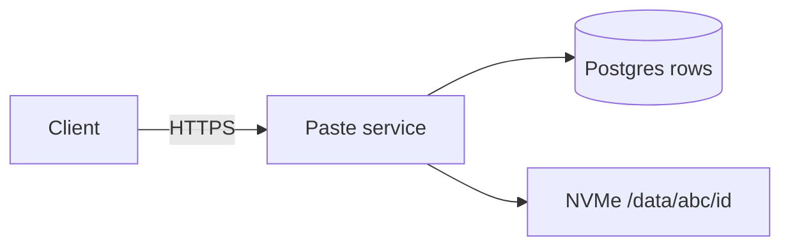
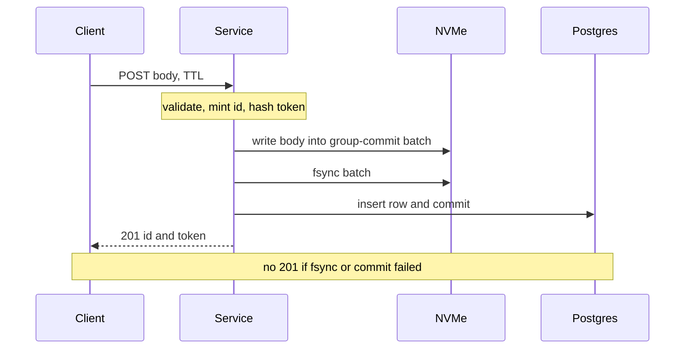
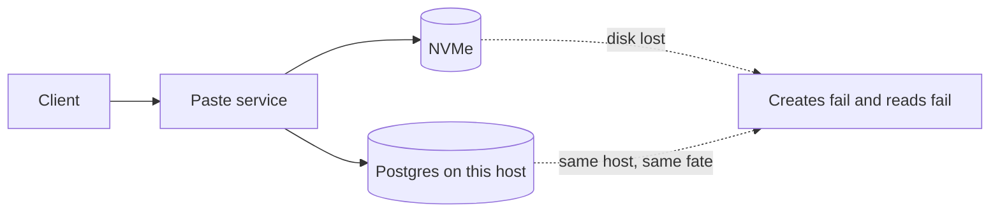

<!-- day-nav -->
[← Day 4 — API and data model first](04-api-and-data-model-first.md) · [Day 6 — A diagram that survives →](06-a-diagram-that-survives.md)

# Day 5 — One box, and why it breaks

**Do now**

1. Set a timer.
2. Attempt the problem. Stop at the attempt line. Do not scroll.
3. Then read.


## Time box

40 minutes.

| Minutes | Do this |
|---|---|
| 0–12 | Attempt. Draw the smallest system that meets day 3's numbers and day 4's contract. |
| 12–32 | Read. |
| 32–40 | Redraw the one box from memory and say the first reason you would add a second machine. |

## Intent

Facing pressure to distribute immediately, leave able to show a correct single box and the first limit that forces a split. The split has to be a number or a fault. "It's more production-like" is not a limit.

## Problem

> Design a pastebin. People paste text and share a link.

The interviewer says: "Keep it on one box as long as you honestly can."

## Attempt before reading

12 minutes. Do not scroll. One page:

1. The processes and the disks on that single host. Name what each stores.
2. The order of writes on create, and the point at which you return 201.
3. The first limit. Not five limits. The first one that makes "one box" a bad production answer, and whether that limit is QPS or something else.
4. What you are explicitly not adding: cache, queue, CDN, second region, or a second service.

You may use the locked results: peak about 350 writes/s and 17,400 reads/s, peak egress about 1.4 Gbit/s, about 4.5 TB and 450 million live objects, serial fsync ceiling about 200/s if one fsync takes 5 ms and nothing is batched.

---

**Stop. The one-box design is below.**

---

## Requirements this box must already meet

- Create, read, delete as on day 4. Same 404 for missing, expired, and bad delete token.
- 201 only after the body is durable and the row is committed.
- Expired reads are correct even if garbage collection is behind.
- Today's traffic: ~116 write QPS average, ~350 peak; ~5,800 read QPS average, ~17,400 peak; ~1.4 Gbit/s peak egress; ~1.2 MB/s average body ingest.
- Resident bodies ~4.5 TB at the 45-day mix. Metadata ~135 GB. Live objects ~450 million.
- One region. No accounts. No listing.

If your drawing needs a second host to meet the **QPS and the bandwidth**, the drawing is ahead of the numbers. If it has no story for a dead disk, it is not finished either. Those are different sentences. Keep them apart.

## Design

One host. One paste service. Postgres on that host for the row. One NVMe for bodies, laid out so you do not put hundreds of millions of directory entries in one folder. Nothing else.

```text
client --HTTPS--> paste service
                     |-- Postgres (the row, local)
                     |-- NVMe /data/{id[0:3]}/{id}   (the body)
```

That is the whole fleet. TLS ends at the service. There is no separate cache process, no queue, no CDN, and no second region. A background sweeper is a loop in the same service, not a platform.

### Why this meets the read numbers

Peak read is 17,400 QPS and 174 MB/s. A single NVMe can move that. A 10 Gbit NIC can move 1.4 Gbit/s with room left. A metadata primary serving point lookups, with the hot part of a 12-character primary key cached in its buffer pool, is in the range you load-test rather than the range you refuse. You do not "know" 17k will pass. You know it is the wrong moment to introduce a cache to feel safe. Say you would load-test the point read before you bet a launch on it, and that the test is not a new tier.

A viral paste is the easy shape: one row, one file, page cache. Uniform traffic over 450 million objects is the hard shape, and it is still the same 174 MB/s. Popularity is not why you shard.

### Why per-paste fsync does not meet the write peak

Day 3's ceiling: a 5 ms fsync, one in flight, is 200 writes a second. Peak is ~350. Average (116) fits in the naive story. Peak does not. You do not drop the peak assumption.

**Group commit, still on this box.** Writes that arrive while a flush is in flight share the next fsync. You acknowledge a create only after that fsync has returned **and** the row commit has returned. Create latency sits around one fsync, a planning figure of a few milliseconds on a drive with power-loss protection, not around a queue of 350 private fsyncs. A crash loses nothing you have acknowledged. It can lose a batch you have not acknowledged; those clients retry and mint new ids.

Postgres will group-commit its own WAL if you let more than one insert be in flight. Metadata at 350 rows/s is not the disk story. The body flush is.

Say how small the batching is, so nobody hears "batching system." During one 5 ms fsync at 350 arrivals a second, about 1.75 creates arrive (350 × 0.005). So at 1×, group commit is two writes sharing a flush. The ceiling becomes roughly 200 flushes a second times the batch size, and the batch grows with load on its own. At 10×, 3,500 a second, a flush carries about 17. Same mechanism, fatter batch, and the same rule: no 201 until the flush returns.

Do not acknowledge first and flush in the background. That turns 201 into a promise you cannot keep, and it invents a queue you spent this week refusing.

### Body layout on the one disk

Path: `/data/{first 3 characters of id}/{id}`.

62^3 = 238,328 prefixes. At 450 million live objects that is about **1,900 files per directory** if the prefixes fill evenly, which random ids do. Lazy directory creation is fine; you will still touch essentially all prefixes.

This is part of correctness of the one box, not a distributed design. One directory of 450 million files will fall over in lookup and in backup long before QPS does.

You do not store the path in the row. The id is the path. There is nothing to diverge except a bug.

### Write order

1. Validate UTF-8, size ≤ 1,000,000, TTL in the allow-list. Reject before any durable write.
2. Mint a 12-character id. Generate a 128-bit delete token. Hash it.
3. Write the body to a temp name in the prefix directory and put it in the current group-commit batch.
4. Fsync the batch (file and directory entry).
5. Insert the row. On primary-key conflict, mint a new id and repeat, up to three times. The wasted body from a collided id is an orphan, not a read.
6. Commit.
7. Return 201 with the id and the plaintext token.

If step 6 fails, the client gets an error, not a link. The fsynced file is an orphan. Orphans are not readable: reads go through the row.

### Read order

1. Point lookup by id.
2. No row, or `expires_at <= now()`: **404**, same body either way.
3. Row is live and the file is missing: **500**, and a `body_missing` metric. That is data loss, not expiry. A quiet 404 would hide it.
4. Otherwise stream the file as `text/plain` with `nosniff`.

### Delete and sweeper

User delete of a **live** paste: commit the row deletion first, then unlink the file. A crash between them leaves an orphan file, which nobody can address. The opposite order is worse: a live row whose file disappeared becomes a 500 for every reader.

Expiry does not need a flag. The read already checks `expires_at`. The sweeper, using the secondary index, deletes the row (or simply unlinks and then deletes; the row is already unreadable once expired) and unlinks. Steady state is about 116 deletes a second, the same order as creates. Run it as a loop with a limit per batch so it cannot starve reads. A sweeper that is hours behind wastes disk. It does not serve expired text. Those are different bugs. Page on disk, not on "sweeper ran a bit late," unless disk is the consequence you are watching.

### What one box does not give you

A process restart drops in-flight creates. There is no drain. Clients retry; because create is not idempotent, a retry after a lost response may mint a second paste. You already said that in the API. Do not "fix" it with a queue on this day.

Disk full: creates fail, reads of existing pastes still work, until the disk error takes the volume with it. Alarm on free space. Provisioning choice, said in the open: size for the **4.5 TB** mix with headroom (on the order of 2×, named as headroom for mix drift, not as a silent factor on QPS), and alarm when the share of 365-day pastes leaves the mix you assumed. The allow-list worst case is 36.5 TB. You are choosing not to buy that disk on day one. Say so.

Backup of hundreds of millions of small files is the operational cliff. A tool that walks inodes will not finish just because GET is fast. A streaming replica of Postgres is easy relative to a second copy of this directory. This is the heart of the split.

### The first split, which is not QPS

**Interview picture:** the one box above meets throughput and the contract.

**Production sentence, kept separate:** you do not ship one disk to users and call the paste durable. A dead NVMe is total loss of every body, and the metadata replica you wish you had is not a body replica.

The first machine you add is for **durability and restore**, not for read QPS and not for fashion.

- A Postgres streaming replica protects the rows. It does not, by itself, protect `/data`.
- Copying 450 million files to a second disk is the same inode problem as backup.
- So the body store is what you change when you split: object storage, where PUT is the durability ack and you do not operate the inodes, **or** a small number of append-only volume files on disk (row gains offset and length; backup is large files; compaction is the new operational job). Both preserve the contract: bytes durable, then row commit, then 201.

You do not have to build either one in the first drawing. You have to say which limit forces it. The limit is **disk loss and restore of 450 million small files**, at today's traffic. The 10× limit is different and is below.

A cache is still not on the list. Nothing in the read number requires it. Adding Redis because "pastebins have caches" is the tour day 1 exists to stop.

What staff sounds like here is the order: prove the one box can serve the numbers, name the first real limit, and refuse every other tier. The room wants to see that you can leave a cache off a whiteboard without flinching. The durability sentence ("I would not ship a single disk") comes after the proof, not instead of it. Saying "we'd use S3" as the opening move skips both: you never showed that QPS fits, and you never said why the local directory fails. A staff answer is smaller than a nervous senior's, and it owns the one break it would take.

## Diagrams

### The whiteboard



Three boxes, if you count the client. If you cannot redraw this in a minute, you do not know the design yet, whatever else you add later. The labels that matter are the ones that are not boxes: HTTPS at the edge of the service, the lookup key on the Postgres arrow, and the path-from-id on the NVMe arrow. An unlabeled arrow is a place a cache or a queue can sneak in while you are looking at something else.

### Create, including the durability point



### Disk dies



User-visible result: the site is down, and if this disk was the only copy, the pastes are gone, not "eventually consistent." That sentence is the failure overlay. A replica you have not drawn is not a mitigation you have. Caption it that way when you redraw: "sole copy, RPO is everything." The dotted arrow is not a recovery plan. It is the cost of the picture you chose.

## Failure the user sees, on this box

The diagram shows the disk dying. Finish the sentence for it and for the failure that hides under "restart."

**Disk dies.** Creates fail. Reads fail. If this disk was the only copy, every paste is gone. RPO is everything. Then put a number on RTO even if you add a nightly copy, because that is the number a staff interviewer asks for. 4.5 TB streamed as large files at 500 MB/s takes about 2.5 hours. The same bytes as 450 million small files, at a planning figure of 5,000 files a second per restore stream, take 90,000 seconds: about **25 hours**. And a nightly copy means an RPO of up to a day of pastes that already got a 201, which breaks the durability sentence you put in the contract. That arithmetic, not taste, is why the first split is the body store.

**Process restarts, disk intact.** In-flight group commits that have not acked fail. Every paste that got a 201 survives: the fsync and the commit finished. A client that timed out may retry and mint a second paste; that is the API contract, not a bug to cover with a queue. There is no drain. Page on restart count if it flaps, and on the create error spike, not on 404.

**Disk filling** is the paragraph above, in one user-visible line: creates fail while reads keep working, and you page on days-to-full, because percent-full pages you too late.

## Trade-offs

**Choice.** One host, group commit, prefix-sharded files, Postgres for the row. No cache.


**Alternative A.** One file's worth of architecture: body inline in Postgres as a large column.


**What A gives up if you refuse it (you do).** You give up a single transactional commit that makes the crash window smaller: row and body would commit together. You accept orphans and a janitor, and you accept a directory layout.


**Why you refuse A.** The 4.5 TB, the WAL amplification of 10 KB to 1 MB values, vacuum, and backup of a database that is mostly dead bytes. The row is a claim about bytes, not the bytes. You want to be able to move the bytes to object storage later without rewriting the API. An inline column delays that move and makes today's backups worse. The crash window of "fsync file, then commit row" is understandable. Prefer it.


**Alternative B.** Object storage immediately, service and Postgres still "small," bucket elsewhere.


**What you give up by not choosing B today.** A cleaner durability ack (the PUT) and no inode estate. You are choosing a picture you can draw and crash-reason about in one interview, at a QPS that does not need the network hop.


**When B wins.** As soon as the question is "ship it" or "the disk died" or "how do you restore," not when the question is "does one box serve 17k reads." Take B as the first split. Do not take B as the first drawing unless they forbid local disk.


**10× break.** Peak egress goes to about **14 Gbit/s**, which does not fit one 10 Gbit NIC. Peak metadata reads go to about **174k/s**, which you do not promise from one primary. Peak body writes are only about 35 MB/s; the disk's byte rate is not the 10× write break. Group commit gets fatter and must still finish. Resident bodies become about 45 TB and about 4.5 billion objects, which makes the inode and restore problem you already have at 1× into the main event.

So: at 1× you split for durability and restore, when you decide to ship. At 10× you also split the **read path** (more than one NIC, and a plan for metadata reads) even if durability were solved. A cache of hot metadata and hot bodies is now justified by a number, and not before. You still do not need a queue. Creates are still a request the user waits on.

Name the refusal inside each alternative. Against A (inline blobs): you refuse the transactional comfort because you refuse the backup cost. Against B (object storage first): you refuse the cleaner ack because you refuse to skip the one-box proof. Against a cache: you refuse a miss path and a stale-after-delete hazard you have not been asked to design. Against a queue: you refuse work that is still on the user's critical path. A staff refusal names the unit it is waiting for.

## Talking points

**Say.** "One service, Postgres, one NVMe, files under a three-character prefix. About two thousand files per directory at today's live set. I group-commit body fsyncs because a serial 5 ms fsync only buys 200 writes a second and peak is 350. I ack after fsync and row commit. I do not ack early."

**Say.** "QPS fits. I still wouldn't ship a single disk. The first extra machine is a durability story for the bodies, object storage or packed volumes, because replicating 450 million files is the hard part. A cache does not fix a dead disk."

**Say.** "If the file is missing and the row is live and unexpired, that's a 500 and a page, not a 404. 404 is only for gone on purpose."

**Hand-waving.** "We'll put it in S3." Acceptable only after you have said why the local directory fails. As a first sentence, it skips the one-box proof and it skips the write order. If you do open with object storage, the next sentence has to be: "PUT, then commit the row, 201 only after both; a failed row commit leaves an orphan object I have to reap."

**Hand-waving.** "Redis in front for speed." In front of which number? 17k reads did not ask for it. You also just created a miss path and an invalidation story on delete and expiry. That is a larger design than the one you have, and it is wrong if the cache can serve a paste the row would 404.

**Hand-waving.** "Three stateless replicas behind a load balancer." Stateless is a fiction while the disk is local. Replicas that do not share the body store serve reads only if you have already moved the bytes. You added a fleet and kept the hard problem.

**Hand-waving.** "The sweeper handles expiry." It handles space. The read handles expiry.

**If they ask what you page on.** Free space under the headroom you named. Fsync latency climbing so group commit stops meeting the peak. `body_missing` above zero. Error rate on create. Not 404 rate: 404 is a normal read of a bad or expired link.

**If they ask what the user sees when the host reboots.** In-flight creates fail. Completed pastes are readable when the process is back, if the disk is back. You have no second site. Do not invent failover you did not draw.

**Hand-waving.** "We'll just put another disk next to it." Two disks on one host share the power supply, the controller, and the person who misconfigures a RAID. That is not the durability split. The durability split moves the bytes to a store whose failure domain is not this host.

**If they ask how long a create takes.** "Around one fsync, a few milliseconds on a drive with power-loss protection, because the batch waits for the flush. If fsync latency climbs so the batch cannot clear 350 a second, creates get slow, then time out, then get retried into duplicates. That is the page, before inventing a queue."

**If they insist on Redis "just in case."** "Then I have to design the miss, the invalidation on delete and expiry, and a rule that a cache never serves a paste the row would 404. That is a larger design than the one that meets the numbers. Show me the number that requires it, or leave it off."

## Say this in the room

One service, Postgres, and one NVMe, files under a three-character prefix, about two thousand files per directory at today's live set. I group-commit body fsyncs because a serial 5 ms flush only buys 200 writes a second and peak is 350. I ack after the fsync and the row commit, never before. Peak read is about 17k QPS and 1.4 Gbit/s; that fits one host, and I would load-test the point read before I bet a launch on it. I would still not ship a single disk: the first extra machine is a durability story for the bodies, object storage or packed volumes, because restoring 450 million small files is about a day, not a couple of hours. A cache does not fix a dead disk. Disk dies: site down, pastes gone if this was the only copy. Process restarts: in-flight creates fail, committed ones survive. Disk filling: creates fail, I page on days-to-full. At 10× the NIC and the metadata primary break; that is when a cache earns a place, not before. No queue: the user is waiting for the write.

## Kit artifact

One trade-off card row. The card is the kit, later. The row is what you practice:

| Choice | You take it when | You refuse it when |
|---|---|---|
| Add a tier beyond one box | A named limit: dead disk and restore, or a 10× NIC / metadata QPS figure | The only reason is that the picture looks small |

## Design log

One sentence: the first limit you wrote down on the attempt, and whether it was actually QPS. If it was QPS, the gap is the restore and inode limit. If you already had durability but acked before fsync, that is the gap instead.

Next: [Day 6 — A diagram that survives](06-a-diagram-that-survives.md).

---

<!-- day-nav -->
[← Day 4 — API and data model first](04-api-and-data-model-first.md) · [Day 6 — A diagram that survives →](06-a-diagram-that-survives.md)
