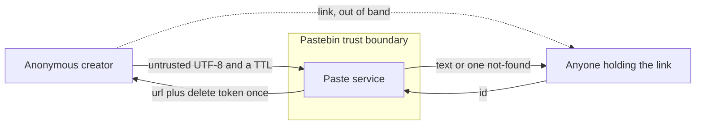
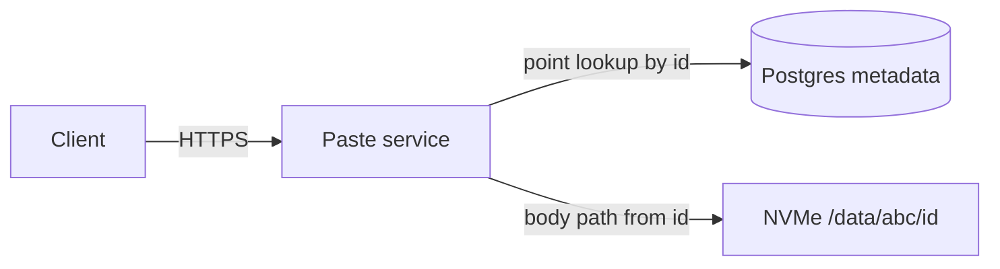
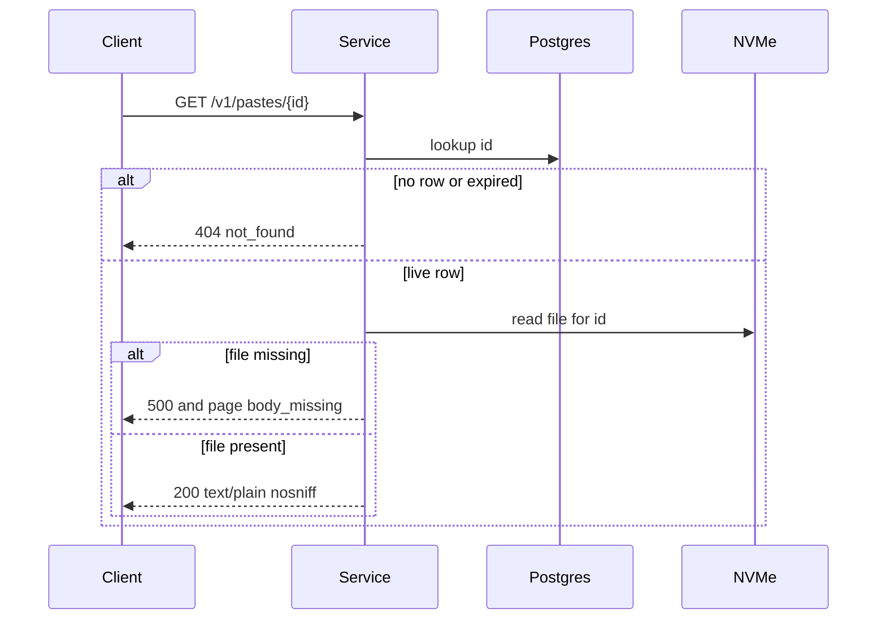
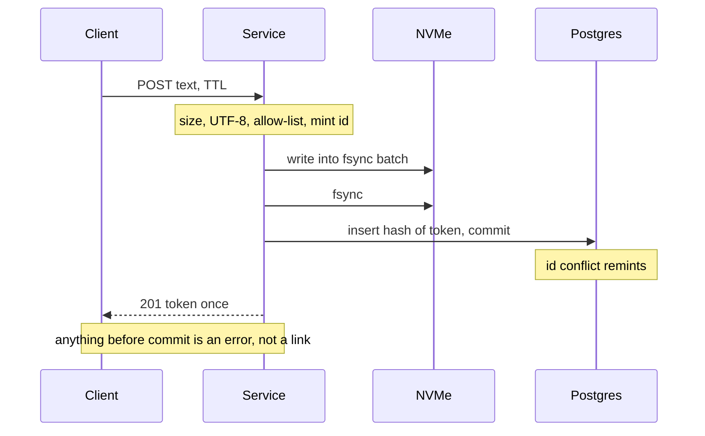
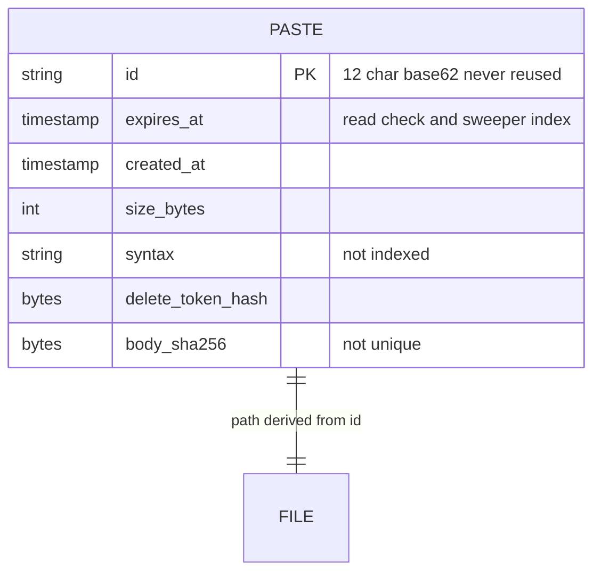
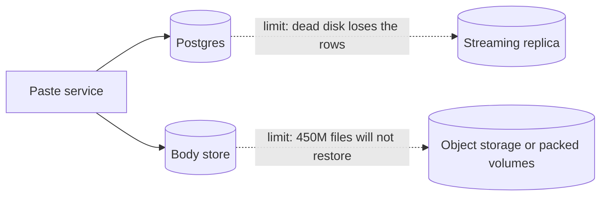
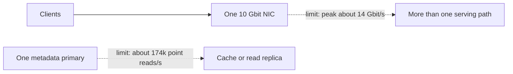
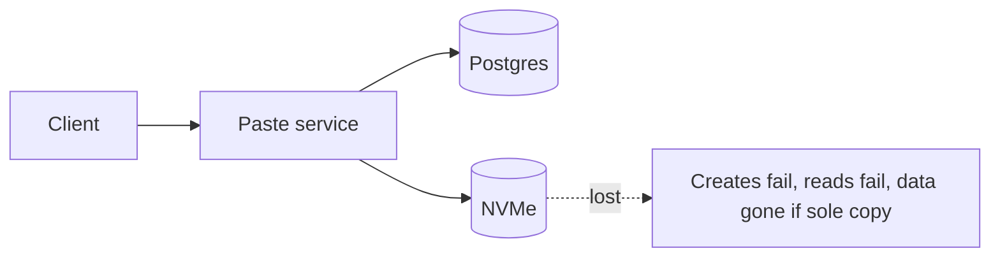

<!-- day-nav -->
[← Day 5 — One box, and why it breaks](05-one-box-and-why-it-breaks.md) · [Day 7 — Timed dry run (pastebin) →](07-timed-dry-run-pastebin.md)

# Day 6 — A diagram that survives

**Do now**

1. Set a timer.
2. Attempt the problem. Stop at the attempt line. Do not scroll.
3. Then read.


## Time box

35 minutes.

| Minutes | Do this |
|---|---|
| 0–10 | Attempt. Draw from memory. Do not open days 2–5. |
| 10–25 | Compare with the filled blanks below. Correct the picture, not the prose. |
| 25–35 | Close this page and redraw all six types from a blank sheet. |

## Intent

Facing a sketch that will not take questions, leave able to redraw context, whiteboard, read path, write path, data model, and both overlays from memory. A diagram that needs a legend will not survive. A diagram that cannot answer "what if this dies" or "where is the ack" will not survive either.

The pastebin design does not change today. If a box appears here that day 5 did not have, it is an overlay, and it is marked as not built.

## Problem

> Design a pastebin. People paste text and share a link.

The interviewer says: "Draw it. I'll ask questions from the picture."

## Attempt before reading

10 minutes. Blank page. Six regions, labeled:

1. Context
2. Whiteboard
3. Read path
4. Write path
5. Data model
6. One overlay: either scale or failure

No vendor logos. No unlabeled arrows. If you draw a cache, write the number that required it next to the box. If you cannot write the number, erase the box before you read on.

---

**Stop. Filled blanks below are the Week 1 pastebin, not a new design.**

---

## Requirements the pictures must not contradict

- Capability URL, no accounts, no listing, no HTML.
- Id is 12-character base62, never reused. Delete token stored as a hash.
- Expired and missing are the same 404. A live row with a missing body is a 500.
- 201 only after body fsync and row commit. Group commit because peak writes (~350/s) exceed a serial 5 ms fsync (~200/s).
- One host for the interview picture: service, Postgres, NVMe prefix directory `/data/{id[0:3]}/{id}`.
- Traffic worth writing in the corner of the whiteboard: ~5,800 read QPS average, ~17,400 peak, ~1.4 Gbit/s peak egress, ~4.5 TB resident, ~450 million live objects.
- Scale overlay is the 10× question or the durability split. It is not the current fleet.

## Design

You already have the design. Today's skill is making each picture answer exactly one kind of question so a probe does not smear them together.

| Type | The question it answers | The question it must refuse |
|---|---|---|
| Context | Who is outside, and what are they allowed to do? | Where the bytes sit |
| Whiteboard | What are the few boxes and the ack path? | Every failure at once |
| Read path | What is checked, in what order, and what is returned? | How you would shard |
| Write path | What is durable before 201? | How you would add a CDN |
| Data model | What is the key, what is indexed, what is hashed? | The NIC |
| Scale overlay | Which limit, and which single addition removes it? | A second product |
| Failure overlay | One dependency down: what does the user see, what is already safe? | A full disaster-recovery design |

The course counts **six types**. Read path and write path are one type and two drawings, because one combined sequence is how the ack gets lost. Scale is drawn twice below, because durability and 10× are different limits. Failure is the last picture. That is eight figures for six types, on purpose. Do not merge the overlays back onto the whiteboard. An overlay you bake into the base picture becomes a fleet you have to defend at today's QPS.

### How you talk while you draw

Draw the whiteboard first, after requirements and numbers, not before. When they interrupt, park the question in the overlay it belongs to: "I'll finish the write path, then I'll kill the disk on a separate sketch." That sentence is the skill.

Corner of the whiteboard, small: the four numbers above. A picture without the numbers cannot survive "will it fit?"

## Diagrams

### 1. Context

Actors and the trust boundary. The channel they use to share a link is outside the system.



Nothing inside the boundary is an identity provider. The body is untrusted data. The delete token is a bearer secret the creator has to keep. You do not control the out-of-band share, and you do not draw it as a component.

ASCII, if the marker is faster than mermaid:

```text
[creator] -- text, TTL --> [ paste service ]
[creator] <-- url, token --
[creator] .. link ..> [reader] -- id --> [ paste service ]
[reader] <-- text or 404 --
```

### 2. Whiteboard

Few boxes. Arrows labeled. Stores named by what you look up, with the implementation in the same box so you are not playing coy, and not so you can start a vendor debate.



Say while drawing: "One host. Group commit on the NVMe. I ack after the fsync and the row commit. Peak read is about 1.4 Gbit/s, which this NIC can do. I am not drawing a cache."

```text
[client] --HTTPS--> [paste service]
                       |                |
                       | by id          | path = id
                       v                v
                  [Postgres]     [NVMe ab/c + file]
```

If they ask "which Postgres features," you say: primary key, one secondary index on `expires_at`, group commit on the WAL. You do not open a feature tour.

### 3. Read path



The branch is the entire senior content of this diagram. A straight arrow from client to disk is a tour of optimism.

### 4. Write path



User delete, if they ask you to add it to this picture rather than a new one: commit the row removal, then unlink. Say it. Do not draw a second system.

### 5. Data model



On paper, a box with the primary key underlined is enough. Write "no user table" in the margin so you do not invent one under stress.

### 6. Scale overlay

Not built. Draw it only beside the whiteboard, in another box on the page, when they ask "what breaks at 10×" or "what do you add before you ship."

Two different additions, two different limits. Do not stack them into one "scaled architecture" sketch.

Durability split, today's traffic, when the question is shipping rather than QPS:



10× traffic split, when the question is the multiple:



The arrow label is the limit being removed. An overlay arrow without a limit is how caches sneak in. There is still no queue on either overlay. Create is still synchronous.

### 7. Failure overlay

One dependency. The disk.



Say: "This host is one failure domain. I have not drawn a replica, so I don't get to claim the pastes survive. In-flight group commits that have not acked are the client's problem to retry. Commits that returned 201 die with the disk if it was the only copy."

If they want a second failure, take a new sketch. The good second one is **the process restarts, disk intact**: reads of committed pastes come back when the process does; in-flight creates fail; no drain. Do not put both failures on one arrow.

## Trade-offs

**Choice.** Six sparse pictures, overlays kept off the base whiteboard.


**Alternative.** One comprehensive diagram with cache, replica, object storage, the sweeper, metrics, and TLS all at once.


**What you give up.** A single artifact you could hand to a new hire as "the architecture." This is an interview, not a design doc. You give up completeness in the first picture.


**What you get.** Any question maps to one picture. You can redraw under pressure. You do not defend a CDN you only drew because there was space on the page.


**10× break.** The scale overlay is the break, and it stays an overlay: ~14 Gbit/s against one NIC, ~174k reads/s against one metadata primary, ~45 TB and billions of objects against the restore story you already told at 1×. If the 10× sketch replaces your whiteboard, you will be unable to answer a question about today's ack path, because the ack path is now smeared across tiers you added for a hypothetical. Keep both pictures.

A second trade-off inside the failure overlay: **show total loss on one disk, rather than drawing a replica you will not have time to specify.** You give up the appearance of being production-ready. You gain an honest RPO: everything, if this disk is the only copy. The moment they ask you to fix it, you move to the durability overlay and talk about PUT-then-commit or a replica. You do not quietly add the replica to the failure picture and call the failure handled.

## Talking points

**Say.** "I'll draw context, then three boxes, then the read branch and the write ack separately. Numbers sit in the corner. Overlays stay off to the side until you ask what breaks."

**Say.** "404 is a branch on the read sequence, not a note in the margin. Missing file under a live row is the other branch, and it pages."

**Say.** "The scale picture is not the design you came in on. The design is the one box. The overlay is the limit."

**Hand-waving.** An arrow labeled "async." Async to where, and is the user waiting? On this product they are waiting. There is no async arrow on the write path.

**Hand-waving.** A box labeled "distributed cache" with no hit, miss, or expiry behavior. That box cannot survive the question "can I read a paste you already deleted?"

**Hand-waving.** A failure drawing that ends at "we'd fail over." To what, with what RPO, and what does the client see during the minutes you have not drawn?

**Practice.** Turn the page over and redraw the whiteboard and the write sequence in four minutes. If the fsync and the commit swap order, you do not know the design yet. Do it again. Then add the 404 branch from memory.

## Kit artifact

The blanks in [stencils/README.md](../stencils/README.md) are the hookup. The kit, sold separately, should ship those blanks and this pastebin as the worked example, not a second visual language.

| Stencil | Filled on this day by |
|---|---|
| All six types | The figures above. Overlays labeled with the limit, or erased. |

If your memory redraw is missing the read-path branch, that is what you practice, not a new stencil.

## Design log

After the closed-book redraw: which of the six you could not reproduce, in one sentence. That is the gap. Do not log "I should review diagrams."

Next: [Day 7 — Timed dry run](07-timed-dry-run-pastebin.md). On day 7 you do not open this page.

---

<!-- day-nav -->
[← Day 5 — One box, and why it breaks](05-one-box-and-why-it-breaks.md) · [Day 7 — Timed dry run (pastebin) →](07-timed-dry-run-pastebin.md)
