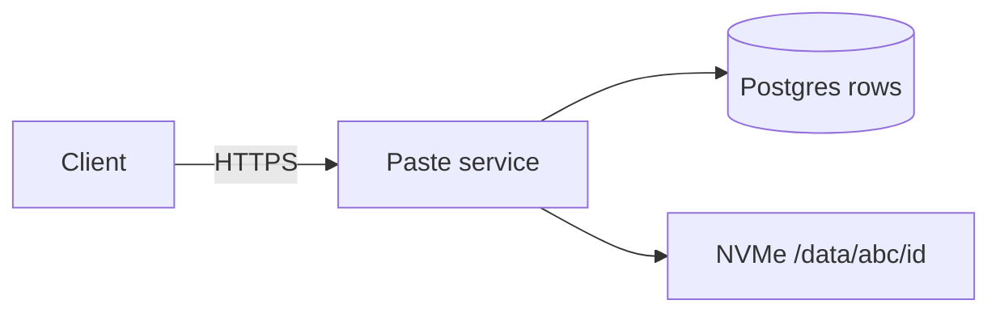
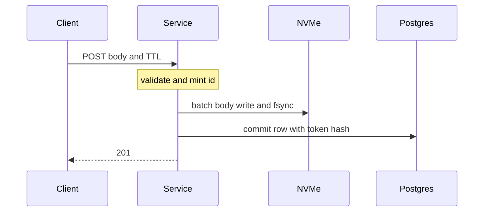
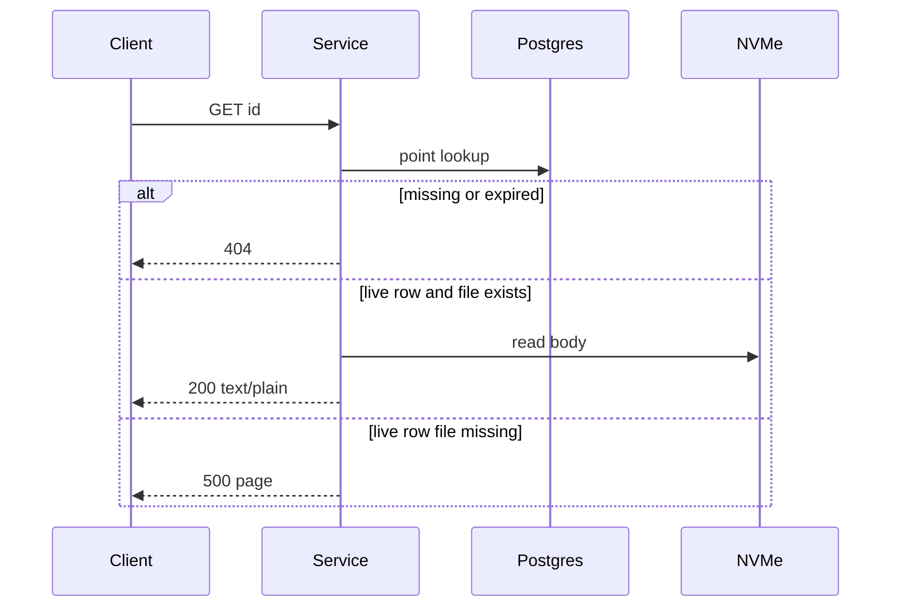

<!-- day-nav -->
[← Day 6 — A diagram that survives](06-a-diagram-that-survives.md) · [Checklist →](../CHECKLIST.md)

# Day 7 — Timed dry run (pastebin)

## Time box

35 minutes for the attempt, then 10 minutes to score and log. The 10 minutes are not part of the interview clock. Do not use them to keep designing.

## Intent

Facing a closed-book timer, leave able to run the pastebin in about 35 minutes with no notes, score it on a senior/staff rubric, and file the first real design-log entry. The reference exists so you can see the gap. It is not part of the attempt. Reading it early is failing the day on purpose.

## How to run

- Blank paper or a blank file. No notes, no day 2–6 pages, no search, no chat.
- The only prompt you may have open is [prompts/pastebin.md](../prompts/pastebin.md). It says the same thing as the problem section below. It does not help you.
- Do not scroll past the attempt barrier on this page. The rubric is above the barrier so you can score without spoiling yourself. The design is below it.
- Timer visible. When it hits 0, you stop, even mid-arrow.
- Then score, then write the log from your page, then scroll.

If you already scrolled, close the page. Do this mock tomorrow, from memory, or it measures nothing.

## Timer

| Clock | You are doing | You are not doing |
|---|---|---|
| 0:00–5:00 | Behavior, bounds, non-goals. Assumptions stated as assumptions. | Drawing a fleet |
| 5:00–10:00 | QPS, storage, bandwidth. Average and peak. Show the division. | Adding a cache to make a number feel small |
| 10:00–16:00 | API and data model. The lookup key. | Vendor selection |
| 16:00–26:00 | The design that fits those numbers. Read path and write path apart. | A second product (accounts, search, rendering) |
| 26:00–33:00 | One deep dive they would pull, or that you nominate: you only get one. | A tour of every weakness you can name |
| 33:00–35:00 | What you did not build, and the 10× break in one sentence. | New components |

If you are still listing features at minute 8, skip to numbers. A missing non-goal you notice at the end can be one spoken line. A missing number cannot be reconstructed from a pretty picture.

## Problem

> Design a pastebin. People paste text and share a link.

That is the entire prompt. Same product as the week. Closed book anyway, because the week was the method, and this hour is whether you can run it.

## Rubric

Score 1–4 on each dimension. A senior-shaped loop is mostly 3s. A staff-shaped loop is not "more boxes." It is a 4 on the deep dive and a 4 on failure, with the rest at least a 3.

Write the score from your page only. "I think the reference will say…" is not a score you are allowed to make yet, because you have not earned the scroll.

### Requirements

| Score | Anchor |
|---|---|
| 1 | Components first. No non-goals. |
| 2 | Behaviors listed. Constraints are adjectives. Non-goals showed up after the drawing, if at all. |
| 3 | Behavior, constraints, and non-goals locked before the design. The questions you asked would have changed the model. |
| 4 | As a 3, and each non-goal is a different product you refused, with a reason, not a list you memorized and cannot defend. |

### Estimates

| Score | Anchor |
|---|---|
| 1 | No numbers, or a single QPS with no numerator. |
| 2 | Numbers exist. Units or assumptions are missing, so nobody can redo the division. |
| 3 | Write QPS, read QPS, storage, and bandwidth. Average and peak are separate. Every assumption is spoken. |
| 4 | As a 3, plus the assumption you trust least, and a 10× move tied to a named limit rather than to a new slogan. |

### API and data

| Score | Anchor |
|---|---|
| 1 | No API. The database brand is the model. |
| 2 | Endpoints exist. The lookup key, retention, or the "gone" behavior is vague. |
| 3 | Create, read, and delete. A real lookup key. Retention that bounds storage. A defined result when the object should not be served. |
| 4 | As a 3, plus an id or key scheme you can justify with a bound, secrets not stored raw, and a distinction you refused to leak to the client. |

### Design

| Score | Anchor |
|---|---|
| 1 | A technology tour, or boxes that ignore the numbers you just wrote. |
| 2 | A plausible system that is heavier than the numbers, or a single box with no durability point. |
| 3 | The smallest design that meets the numbers, with an explicit point where the write is acknowledged. |
| 4 | As a 3, extra tiers refused unless a number or a fault demands them, and the crash order on the write is something you can say without the picture. |

### Deep dive

| Score | Anchor |
|---|---|
| 1 | You cannot go past the boxes. |
| 2 | Under a push, the answer is a product name or "we'd shard." |
| 3 | One dive, with a choice and a cost. |
| 4 | The dive uses arithmetic or a concrete fault to confirm or change a decision. You can name what that dive did **not** solve. |

### Failure and ops

| Score | Anchor |
|---|---|
| 1 | "We'll have replicas," and no user-visible behavior. |
| 2 | A dependency is named. Impact and detection are fuzzy. |
| 3 | One dependency down. What the user sees. What is already durable. What you would page on. |
| 4 | As a 3, plus the crash window you still have after the mitigation you actually drew. |

Do not average these into one vanity number. The log wants the six scores and **one** gap: the lowest dimension, or the 3 that should have been a 4.

## Attempt first

Do the 35 minutes now.

When the timer stops:

1. Score the six dimensions from the anchors above. Evidence is a phrase that exists on your paper.
2. Copy [design-log/TEMPLATE.md](../design-log/TEMPLATE.md) somewhere private. Fill it. Scores are final once written.
3. Only then cross the barrier.

---

# Attempt barrier

You are about to read the reference design for the pastebin.

If your timer has not hit zero, go back up. If your design log is not filled, go back up. The reference will feel obvious after a week of lessons. That feeling is not a score.

---

## Reference design

This is the design the week built, compressed to what a 35-minute page can hold. It is not a second product and it is not the only legal wording. It is the bar your page was aiming at. Use it to write the one-line amendment in the log. Do not edit the scores.

### Requirements

**In.** An anonymous client sends UTF-8 text and gets a link. Anyone with the link can read the bytes until they expire. The creator can delete with a secret returned only at create time. Optional syntax label, stored and echoed, never executed or rendered. TTL is an allow-list: 1 day, 7 days, 30 days, 365 days. Default 30 days. The client sends a duration; the server clock sets `expires_at`. Cap the body at 1,000,000 bytes. Reject oversize; do not truncate.

**Contract details that are requirements, not polish.** Expired and never-existed are the same 404. The read checks expiry; a sweeper only reclaims space. The paste URL is `text/plain` with `nosniff`, never an HTML page. Create returns 201 only after the body and the row are durable. Creates are not idempotent: a retry can mint a second paste.

**Assumptions, if they said "you pick."** 10 million new pastes a day. 50 reads per write. Mean body 10,000 bytes (decimal KB). Peak is 3× average, diurnal, no extra hidden factor. The TTL mix behaves like 45 days of ingest resident. One region.

**Out.** Accounts, public listing, search, edit and versions, vanity slugs, binaries, highlighting, malware pipelines, end-to-end encryption beyond TLS, forever retention, multi-region, a cache, a queue, a CDN. Abuse limiting is a follow-up on the create path, before the durable write, not a system you design unless that was the deep dive you nominated.

### Estimates

| Quantity | Result |
|---|---|
| Write QPS | 10,000,000 / 86,400 ≈ **116** average, **~350** peak |
| Read QPS | 116 × 50 = **5,800** average, **17,400** peak |
| Ingest | **100 GB/day** |
| Bodies resident | 100 GB × 45 days = **4.5 TB** (worst allow-list: **36.5 TB**) |
| Metadata | ~300 B/row → **~135 GB** resident. Not the storage decision. |
| Live objects | **~450 million** |
| Read bandwidth | **58 MB/s** average, **174 MB/s** peak ≈ **1.4 Gbit/s** |
| Write bandwidth | **~1.2 MB/s** average. Not the bottleneck. |
| Serial fsync | 5 ms, one in flight → **200 writes/s**, which misses the 350 peak |

Sensitive assumption: mean body size. If it is 10×, egress breaks a single NIC at today's traffic. Second: the 45-day mix.

**10× traffic:** peak egress ~14 Gbit/s (one 10 Gbit NIC dies), peak metadata reads ~174k/s (do not promise one primary), resident bodies ~45 TB. Peak body-write bandwidth is only ~35 MB/s. The write path does not become bandwidth-bound. It becomes a fatter group commit, and the restore problem gets worse.

### API and data

`POST /v1/pastes` with a raw `text/plain` body, `X-Paste-TTL`, optional `X-Paste-Syntax`. `201` JSON: `id`, `url`, `expires_at`, `delete_token` once. `400` bad TTL or bad UTF-8. `413` too big.

`GET /v1/pastes/{id}` → `200` `text/plain` or `404 {"error":"not_found"}` for missing, expired, and deleted alike.

`DELETE /v1/pastes/{id}` with `X-Delete-Token` → `204`, or the same `404` if the id is unknown, expired, or the token is wrong.

One table, `Paste`. Primary key `id`, 12-character base62, **never reused**. Columns: `created_at`, `expires_at`, `size_bytes`, nullable `syntax`, `delete_token_hash`, `body_sha256` (integrity, not unique, no dedupe). Secondary index on `expires_at` for the sweeper only. No user table. The body is not an indexed column; the path is derived from the id.

Id bound, worth the deep dive if you took it: 62^12 ≈ 3.2 × 10^21. Ten years at 10 million a day mints ~3.7 × 10^10 ids. Expected collisions over that decade are a fraction of one. A unique key remints on conflict, up to three times. Eight characters is too small against the live set alone. Ten times the mint rate for a decade is still a handful of remints, not a new scheme. Case-sensitive URLs are the give-up; these links are copied, not read over the phone.

Delete token: 128-bit, url-safe, shown once, SHA-256 in the row.

### One box

```text
client --HTTPS--> paste service
                     |-- Postgres (row, on this host)
                     |-- NVMe /data/{id[0:3]}/{id}
```

62^3 prefixes ≈ 238k directories, about 1,900 files each at 450 million objects. One flat directory is an outage you chose.

Group commit on the body fsync. Insert and commit the row after the fsync. Then 201. Never ack early. Postgres at 350 small inserts a second is not the story; the body flush is.

**Read.** Lookup. If no row or expired, 404. If the row is live and the file is missing, 500 and page `body_missing`. Else stream the file.

**Delete.** Commit the row removal first, then unlink, so a concurrent read does not observe a live row with no bytes. Crash between them: orphan file, not a 500. Expiry is already enforced by the read; the sweeper only reclaims, on the order of ~116 deletes a second once full.

**Explicitly absent.** Cache, queue, CDN, load balancer, second service, second region. QPS and 1.4 Gbit/s fit one host. You say you would load-test 17k point reads rather than pretend you benchmarked them in the room.

### Diagrams you should have had

Whiteboard:



Write path:



Read path:



Failure, one dependency, the disk. No replica is drawn, so none is claimed:


### Trade-off and the split

**Choice.** One box with group commit and a prefix layout, because the QPS and the NIC fit.

**Refused.** Inline blobs in Postgres (WAL and backup of 4.5 TB of dead bytes). Redis "for speed" (no miss path you need, and a stale cache would violate the 404 rule). A queue (the user is waiting for the link).

**First split, when the question becomes "ship it" rather than "does it serve."** Not a cache. A dead disk loses every paste. Replicating Postgres does not replicate `/data`. Copying 450 million files is the restore problem. Move bodies to object storage (PUT, then commit the row, reap orphan objects) or pack them into append-only volumes (row gains offset and length). That is durability, at today's traffic.

**10×.** Add serving capacity because of ~14 Gbit/s, and stop promising one metadata primary at ~174k reads/s. A cache is finally allowed, because you have a number. You still do not have a queue.

Disk you buy: on the order of 2× the 4.5 TB mix, headroom named as mix drift, not as a silent QPS factor. You are not buying 36.5 TB on day one. Alarm when the 365-day share leaves the assumption. Page on free space, on fsync latency, on `body_missing` above zero, on create errors. Do not page on 404.

### What staff sounded like in the last eight minutes

Any one of these, done properly, is the deep dive. Doing all of them is how you run out of clock.

- Id width with the birthday bound and "never reuse," including why 8 characters fails.
- Group commit versus the 200/s serial ceiling, and the refusal to ack before fsync.
- Same 404 for expired and missing, versus 500 when a live row has no file.
- Why the first extra machine is restore of the bodies, not a CDN.

Hand-waving, even if the picture was fine: "Kafka for scale," "Cassandra," "a microservice per verb," "the sweeper handles correctness," "Redis because pastebins have caches," "we'll fail over" with no second copy drawn.

### After you read this

Add one amendment line to the log: the concrete miss (a number, a branch, or a tier you added). Leave the scores alone. Tomorrow is not a restatement of this page. The next written lessons are not in the repo yet. The curriculum says what they will be. Do not skip ahead by inventing a distributed pastebin from this reference; day 5 already told you the first split and told you not to draw it until the limit is the question.

---

<!-- day-nav -->
[← Day 6 — A diagram that survives](06-a-diagram-that-survives.md) · [Checklist →](../CHECKLIST.md)
