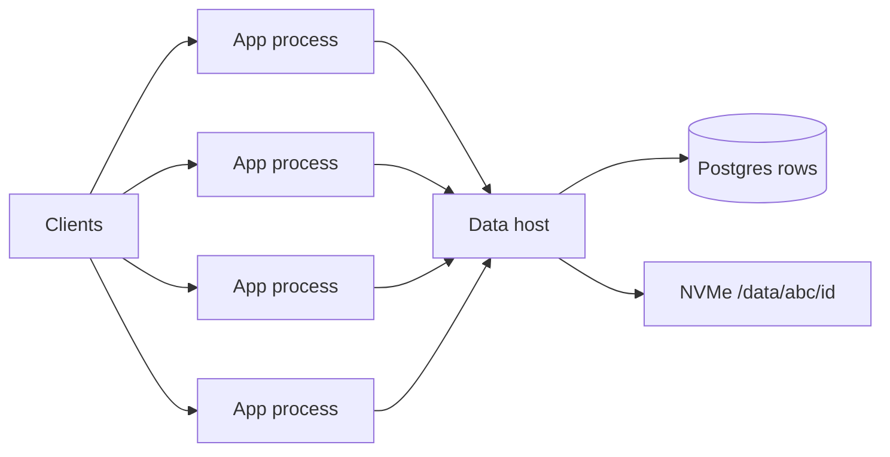
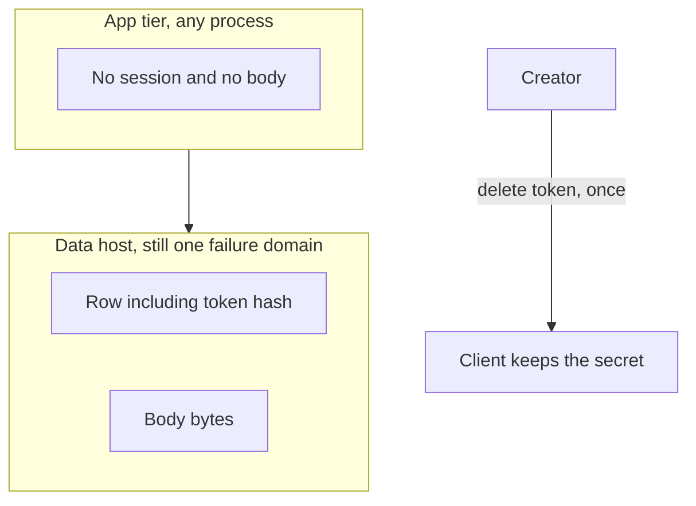

<!-- day-nav -->
[← Day 7 — Timed dry run (pastebin)](07-timed-dry-run-pastebin.md) · [Day 9 — Load balancing and draining →](09-load-balancing-and-draining.md)

# Day 8 — The second box

**Do now**

1. Set a timer.
2. Attempt the problem. Stop at the attempt line. Do not scroll.
3. Then read.

## Time box

35 minutes.

| Minutes | Do this |
|---|---|
| 0–10 | Attempt. One page. The break first, then the box that fixes it. |
| 10–28 | Read. If your second box does not name where the bytes still live, fix that before you add a third box. |
| 28–35 | Close the page. Say which state is not on the app tier, and why a second process does not make the disk durable. |

## Intent

Facing a saturated process, leave able to split a stateless app tier and say where session and file state still sit. The second box is a fix for a process that cannot take the peak, not a new architecture.

## Problem

> Design a pastebin. People paste text and share a link.

The interviewer says: "Your one box meets the NIC math. The process does not. Add the next machine, and tell me what is still single."

## Attempt before reading

10 minutes. Do not scroll. Use the locks you already have: peak about 17,400 reads/s and 350 writes/s, bodies on a local NVMe, Postgres for the row, 201 only after the body is durable and the row commits. No cache yet.

Write:

1. The limit of **one OS process**, as a number you could be wrong about. Not "it won't scale."
2. The second box. What it runs. What it must not store.
3. Where the body bytes sit after the split, and where a session would sit if you had one.
4. One sentence on what this split does **not** fix (disk loss, the 450 million files, metadata durability).

If the second box is a cache, a queue, or a CDN, erase it. Those fix different breaks. This break is the process.

---

**Stop. The second box below is the app tier, not a platform.**

---

## Requirements

Unchanged contract. Anonymous create, capability URL, same 404 for missing and expired, 201 only after durable body and committed row, ids never reused, no accounts, no listing.

The new assumption, same kind as the 5 ms fsync, said out loud so it can be thrown out:

**One paste process, one event loop, saturates at about 8,000 streaming reads a second.** Planning ceiling, not a benchmark. Peak read is 17,400. You are over by about 2×. A second hidden safety factor is not allowed; if the real ceiling is 30,000, you delete this box.

Why a process ceiling exists even though the NIC and the NVMe were fine on day 5: the host can move 174 MB/s, and a single thread copying those bytes onto TLS sockets cannot. Deploys make the same box mandatory. Restarting the only process is an outage for every in-flight create and every read, even when the disk is healthy.

There is still **no session**. Do not invent one so the second box has something to stick.

## Design

You do not clone the whole host. A second full copy with its own NVMe would fork the bytes. Reads would disagree. That is a split-brain pastebin, not a scale-out.

You narrow the original machine and add app machines.

```text
clients
   |
   v
[app host 1] [app host 2] [app host 3] [app host 4]   stateless paste process
      \            |            |           /
       \           |            |          /
        v           v            v         v
                       [data host]
                |-- Postgres (the row)
                |-- NVMe /data/{id[0:3]}/{id}
```

Four app processes because 17,400 / 8,000 is 2.2, and you want one process to die or drain without falling through the ceiling. Two are 16,000, under the peak even while both are up. Three meet the peak only while all three are up; one down leaves 16,000 against 17,400. Four leaves 3×8,000 = 24,000. Say that. Do not draw thirty.

**Stateless means:** any app process can take any request. Kill one and the others still create, read, and delete. A deploy replaces one process at a time. You will define drain on day 9. Today the claim is only that the process is not the sole place a request can land.

**Session state sits nowhere.** The URL is the capability. The delete token lives with the creator, and only its hash sits in the row. There is no login cookie, no server-side session map, and nothing to pin to a process. If a load balancer later offers stickiness, you refuse it. Sticky sessions would put state back on one process, which is the box you just split, and you have no session to stick.

**File state still sits on the one data host.** The app tier does not have the bodies. Each app opens Postgres over the network and reads or writes `/data/...` on that host (a directory that host exports to the app tier, or a tiny file API on the data host — one sentence, not a new product). The path is still derived from the id. The write order does not change: body durable on that NVMe (group commit, same 200/s serial ceiling, so the batching from day 5 stays), then row commit, then 201.

**Database state still sits on that same host.** The second box did not replicate Postgres. You will do that when the break is a dead primary, not a hot event loop. Day 13.

What you refuse while drawing this:

- A cache. The primary is not the break you were given. The process was.
- A queue. The user is still waiting for the link. The app processes do the create inline.
- Putting the NVMe on every app host. That is N copies you do not reconcile.
- Calling the app tier highly available. Four processes hide a process crash. They do not hide the data host. Say the failure domain out loud: **the data host is still one disk and one Postgres.** Day 5's restore problem is exactly where you left it. 450 million files, one NVMe. You added machines in front of it.

Memory on an app process stays small. It holds the in-flight body only until the data host has it. It does not accumulate pastes. If it does, you have accidentally built a second store.

Create is still not idempotent. A client that retries after a killed process can mint a second paste. The second box does not fix that. Do not "solve" it today with a dedupe log you did not require.

### How many, said as arithmetic

Peak reads 17,400. Ceiling 8,000 per process. Minimum at peak is 4 processes so that one can be down and 24,000 of ceiling remains against 17,400. Two processes are 16,000, which does not meet the peak. Three leave 16,000 when one drains, so they fall through. You are not buying a fleet to feel calm. If they change the ceiling to 20,000, one process meets the peak and two keep the spare. The four on this page was the 8,000 assumption, not a law. Good. The ceiling was an assumption.

Peak writes, 350/s, are not why you have four processes. Group commit on the data host still absorbs them. The app tier spends almost nothing on a write compared with streaming a read. Do not size the tier from the write number.

### What the hop costs, in numbers you can say

The split turned two in-process calls into two network calls per read: a point lookup on Postgres and a file read on the data host. Say what that does to the things you can now run out of.

**Connections.** Little's law on the row lookup: at peak with one process down, each survivor takes about 5,800 reads a second (17,400 / 3). If a point lookup holds a connection for about 2 ms, that is about 12 queries in flight per process. A pool of 20 per process is comfortable. Four pools of 20 are 80 connections. Postgres ships with a default `max_connections` of 100, and you want a few left for the sweeper, migrations, and the human who logs in during an incident. So the pool size is a number you set on purpose, from the arrival rate and the hold time, not a library default of 50 per process that quietly asks for 200. That is the first thing the second box can break that the first box could not.

**Bytes and latency.** The data host NIC still carries about 1.4 Gbit/s at peak, day 5's number, now pointed at four app hosts instead of the internet; each app host carries a third of it with one down. Nowhere near 10 Gbit/s. The hop costs two same-zone round trips per read, a fraction of a millisecond each. It is a latency cost, not a bandwidth break, at 1×. Say it so the interviewer hears you priced it.

**Headroom, per process.** Four up: about 4,350 reads a second each, a bit over half the 8,000 ceiling. One down: 5,800 each, about 72%. That is the number to watch on a dashboard. A process that sits above 80% of its planning ceiling at the daily peak is the signal that the 8,000 was optimistic, before a deploy turns it into an outage.

**Deploys, said as arithmetic.** Rolling one process at a time leaves three, 24,000 of ceiling against 17,400. Rolling two at once at peak leaves 16,000. So the deploy rule falls out of the same number that sized the tier: one at a time during the busy hours, and the rollout halts on the first process that fails to come back. A bad build that keeps rolling takes you to two, and a deploy alone melts the tier. The deploy rule and the sizing rule are the same sentence.

What staff sounds like here is narrowing, not adding. Split exactly the thing that broke, the process, then say unprompted what the split moved: a connection budget, a network hop, and a data host that now has four clients instead of one. The interviewer is listening for whether you can tell a box that removed a limit from a box that relocated it.

## Diagrams


### Whiteboard



Say while drawing: "Three numbers in the corner. Peak 17,400 reads. Planning ceiling 8,000 per process. Four processes, so one down still clears peak. Bytes and rows stay on one data host."

Caption it, under the drawing: "Four identical apps, one data host. Any app takes any request. The fan-in arrow is the failure domain." The arrows from the apps converge on one box on purpose. If you draw the data host as a cylinder off to the side, it reads like a utility. Draw it as the thing every arrow lands on, because that is what it is now.

### Where state sits



The picture is the lesson. If session or file state appears inside the app box, the tier is not stateless and a deploy will either drop creates or serve disagreement.

Caption: "Nothing in the app box survives a restart, and nothing needs to." The client-side secret is drawn outside both boxes on purpose. It is the only state that is not on the data host, and it is on the creator's device, not yours.

## Failure the user sees, after the split

The second box changed which failures are small. Say each one as a user sentence, then as a page.

**One app process dies.** In-flight reads and creates on that process fail, about a quarter of everything in flight at that moment. Reads retry cleanly. A create the client retries after a lost response may become a second paste, which the API already said. The other three carry 5,800 reads a second each, under the 8,000 ceiling. Users mostly see a blip, if the thing in front of the apps stops sending to the dead one. That last clause is day 9. Today, say that a dead process still being sent traffic is the user-visible failure, not the death itself.

**The data host dies.** Everything fails: four healthy app processes return 5xx, quickly if they have timeouts, slowly if not. RPO and RTO are exactly day 5's: sole copy, and about a day to restore 450 million small files. Say this one first when asked "what's still single."

**The data host is slow, not dead.** The interesting one. Fsync latency climbs, or a long query holds locks. Every app process now holds its in-flight requests longer. By Little's law, 5,800 reads a second at 50 ms instead of 2 ms is about 290 in flight per process instead of 12, and the 20-connection pool is exhausted. Users see creates time out and reads slow across all four apps at once. A fifth app process makes it worse: more callers on the same slow host. Page on data host latency and pool wait time, not app CPU, which will look idle.

## Trade-offs

**Choice.** Four stateless app processes in front of one data host. No sticky sessions. Bodies stay on the one NVMe.

**Alternative.** A bigger single process, or sticky sessions to a copy of the cache you do not have yet, or a second data host with its own disk.

**What you give up.** A network hop to Postgres and to the bytes, on every create and every read. In-process calls became remote calls. A slow data host now stalls four app processes instead of one. You also give up the ability to reboot "the server" as one thing; you have a role split to operate.

**Why you still do it.** 17,400 does not fit an 8,000 ceiling, and a deploy of the only process is a total outage that the NIC math never mentioned. The hop is the cost of being able to restart an app without restarting the disk.

**Name the refusal inside each alternative.** Against the bigger single process: you refuse it because a bigger process is still the only thing you can restart, and every deploy is still an outage; the ceiling moved, the restart did not. Against sticky sessions: you refuse them because there is no session to stick, and stickiness converts a dead process into a group of clients who cannot move. Against a second data host with its own NVMe: you refuse it because two disks with two copies you do not reconcile serve disagreement, and the fix for that is replication, which is a different day with a different break. Against a cache: you refuse it because the primary was not shown to be the break. Each refusal names the break it would actually fix, which is why it is not on this page.

**10× break.** Peak reads go to about 174,000. At 8,000 per process, 22 meet the peak and 23 keep one down (22×8,000 clears 174,000). You can still call that an app tier. The data host does not come along for free: one NIC at ~14 Gbit/s still dies, and one Postgres still sees every metadata read. The second box fixed the event loop. It did not fix egress or the primary. Do not "add more app servers" as the answer to a full disk.

## Talking points

**Say.** "One process, I'm calling the ceiling 8,000 streaming reads a second, planning number, not a benchmark. Peak is 17,400, so I want four processes and I want any of them to take any request. One down leaves 24,000, which still clears peak. Two do not meet the peak, and three fall through on a drain. There is no session. The delete token is on the client, the hash is in the row. The files are still on one NVMe. Four app boxes do not make that disk durable."

**Say.** "I size from peak reads, not from writes. Writes are 350 a second and they still group-commit on the data host. The 201 order is unchanged: body durable, then row, then the response."

**Hand-waving.** "We'll make the app stateless and put it on Kubernetes." The noun is not the split. Where do the bytes sit, and what happens when that one disk dies?

**Hand-waving.** "Sticky sessions for safety." Safety of what? You have no session. Stickiness turns a dead process into a pile of clients who cannot move.

**Hand-waving.** "The second box is Redis." Redis does not accept the TCP connection or run the expiry check. The process was the saturated thing. A cache fixes a melted primary, which you have not shown yet.

**If they ask what the user sees when one app dies.** In-flight requests on that process fail. The other three keep serving. Clients retry. A retry of a create that might have committed is a second paste. You already sold that in the API. Reads retry cleanly.

**If they ask how many connections Postgres sees.** "Four pools. I size each from arrival rate times hold time: about 5,800 a second at peak with one down, about 2 ms per lookup, so about 12 in flight. Twenty per process, 80 total, under the default 100 with room for the sweeper and an operator. A library default of 50 per process would ask for 200 and fail the day someone scales to four."

**Hand-waving.** "Just autoscale the app tier." On what signal? CPU on the apps goes down when the data host is slow, because they are waiting. An autoscaler watching app CPU scales in during the incident. Scale on request rate against the per-process ceiling, and never as the answer to a slow dependency.

**If they ask whether the data host should keep running an app process too.** It can, and then it is a special replica with a local disk the others do not have. You refuse the special case. Apps are identical. The data host serves Postgres and the files. One role each.

## Say this in the room

One process, I'm calling the ceiling 8,000 streaming reads a second, a planning number I'd load-test. Peak is 17,400, so four identical app processes: one down leaves 24,000, which clears peak; two don't meet it and three fall through on a drain. Any process takes any request because there is no session. The URL is the capability, the delete token is on the client, its hash is in the row. Bodies and rows stay on one data host, so the hop is new: I size each connection pool from arrival rate and hold time, twenty per process, eighty total, under Postgres's hundred. Deploys go one process at a time at peak, same arithmetic. One app dies: a blip and maybe a duplicate create on retry. Data host dies: everything is down and day 5's restore problem is untouched. Data host slow: all four apps stall together and more apps make it worse. Four app boxes do not make that disk durable. That is the next split, and it is not a cache.

## Kit artifact

One checklist row, for when a kit exists. Not the kit.

| Row | Lock |
|---|---|
| Second box | App process only. Session: none. Files and rows: still one data host. The limit written next to the box is the per-process read ceiling, not the word stateless. |

If your attempt cannot say where the file went, you are not done. The kit cannot place it for you.

## Design log

One line: the ceiling you used, and whether your second box accidentally stored bytes or a session. That miss is the gap.

Next: [Day 9 — Load balancing and draining](09-load-balancing-and-draining.md).

---

<!-- day-nav -->
[← Day 7 — Timed dry run (pastebin)](07-timed-dry-run-pastebin.md) · [Day 9 — Load balancing and draining →](09-load-balancing-and-draining.md)
