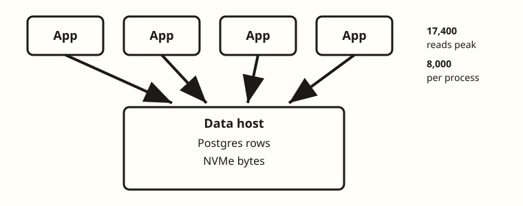
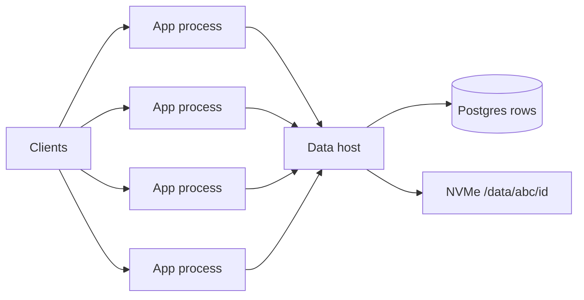
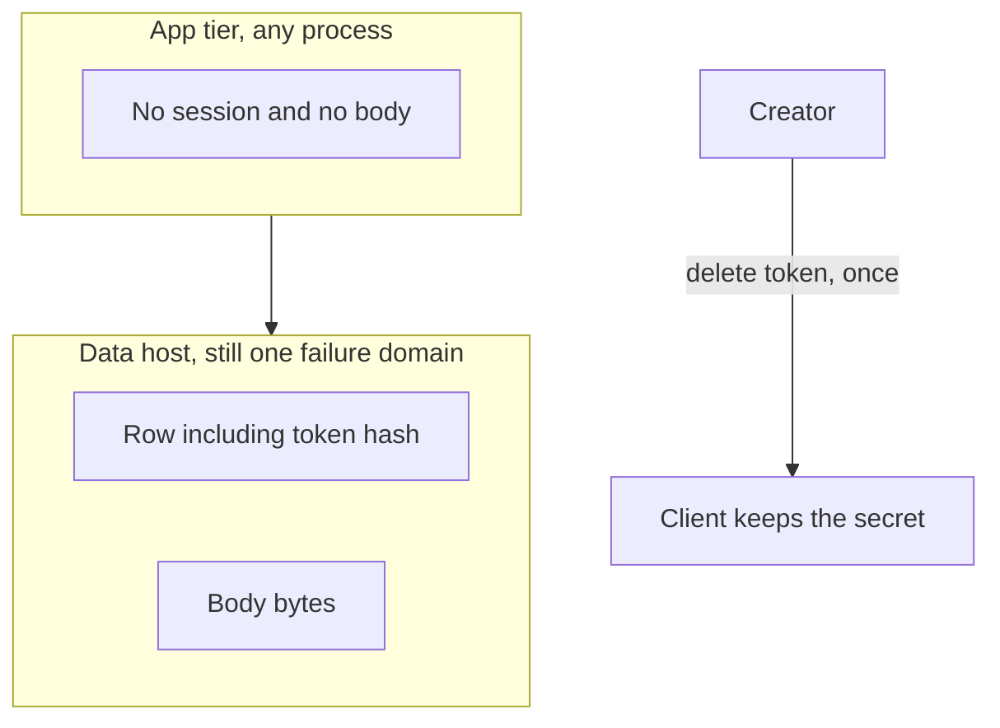

<!-- day-nav -->
[← Day 7 — Timed dry run (pastebin)](07-timed-dry-run-pastebin.md) · [Day 9 — Load balancing and draining →](09-load-balancing-and-draining.md)

# Day 8 — The second box

**Do now**

1. Set a timer.
2. Attempt the problem. Stop at the attempt line. Do not scroll.
3. Then read.



## Time box

35 minutes.

| Minutes | Do this |
|---|---|
| 0–10 | Attempt. One page. The break first, then the box that fixes it. |
| 10–28 | Read. If your second box does not name where the bytes still live, fix that before you add a third box. |
| 28–35 | Close the page. Say which state is not on the app tier, and why a second process does not make the disk durable. |

## Intent

Facing a saturated process, leave able to split a stateless app tier and say where session and file state still sit. The second box is a fix for a process that cannot take the peak, not a new architecture.

## Problem

> Design a pastebin. People paste text and share a link.

The interviewer says: "Your one box meets the NIC math. The process does not. Add the next machine, and tell me what is still single."

## Attempt before reading

10 minutes. Do not scroll. Use the locks you already have: peak about 17,400 reads/s and 350 writes/s, bodies on a local NVMe, Postgres for the row, 201 only after the body is durable and the row commits. No cache yet.

Write:

1. The limit of **one OS process**, as a number you could be wrong about. Not "it won't scale."
2. The second box. What it runs. What it must not store.
3. Where the body bytes sit after the split, and where a session would sit if you had one.
4. One sentence on what this split does **not** fix (disk loss, the 450 million files, metadata durability).

If the second box is a cache, a queue, or a CDN, erase it. Those fix different breaks. This break is the process.

---

**Stop. The second box below is the app tier, not a platform.**

---

## Diagrams

### Whiteboard



Say while drawing: "Three numbers in the corner. Peak 17,400 reads. Planning ceiling 8,000 per process. Four processes, so one down still clears peak. Bytes and rows stay on one data host."

### Where state sits



The picture is the lesson. If session or file state appears inside the app box, the tier is not stateless and a deploy will either drop creates or serve disagreement.

## Requirements

Unchanged contract. Anonymous create, capability URL, same 404 for missing and expired, 201 only after durable body and committed row, ids never reused, no accounts, no listing.

The new assumption, same kind as the 5 ms fsync, said out loud so it can be thrown out:

**One paste process, one event loop, saturates at about 8,000 streaming reads a second.** Planning ceiling, not a benchmark. Peak read is 17,400. You are over by about 2×. A second hidden safety factor is not allowed; if the real ceiling is 30,000, you delete this box.

Why a process ceiling exists even though the NIC and the NVMe were fine on day 5: the host can move 174 MB/s, and a single thread copying those bytes onto TLS sockets cannot. Deploys make the same box mandatory. Restarting the only process is an outage for every in-flight create and every read, even when the disk is healthy.

There is still **no session**. Do not invent one so the second box has something to stick.

## Design

You do not clone the whole host. A second full copy with its own NVMe would fork the bytes.

You narrow the original machine and add app machines.

```text
clients
   |
   v
[app host 1] [app host 2] [app host 3] [app host 4]   stateless paste process
      \            |            |           /
       \           |            |          /
        v           v            v         v
                       [data host]
                |-- Postgres (the row)
                |-- NVMe /data/{id[0:3]}/{id}
```

Four app processes because 17,400 / 8,000 is 2.2, and you want one process to die or drain without falling through the ceiling. Two are 16,000, under the peak even while both are up. Three meet the peak only while all three are up; one down leaves 16,000 against 17,400.

**Stateless means:** any app process can take any request. You will define drain on day 9.

**Session state sits nowhere.** The URL is the capability. The delete token lives with the creator, and only its hash sits in the row.

**File state still sits on the one data host.** The app tier does not have the bodies. The write order does not change: body durable on that NVMe (group commit, same 200/s serial ceiling, so the batching from day 5 stays), then row commit, then 201.

**Database state still sits on that same host.** The second box did not replicate Postgres. You will do that when the break is a dead primary, not a hot event loop. Day 13.

What you refuse while drawing this:

- A cache. The primary is not the break you were given. The process was.
- A queue. The user is still waiting for the link. The app processes do the create inline.
- Putting the NVMe on every app host. That is N copies you do not reconcile.
- Calling the app tier highly available. Four processes hide a process crash. They do not hide the data host. Say the failure domain out loud: **the data host is still one disk and one Postgres.** Day 5's restore problem is exactly where you left it. 450 million files, one NVMe. You added machines in front of it.

Memory on an app process stays small. It holds the in-flight body only until the data host has it.

Create is still not idempotent. A client that retries after a killed process can mint a second paste.

### How many, said as arithmetic

Peak reads 17,400. Ceiling 8,000 per process. Minimum at peak is 4 processes so that one can be down and 24,000 of ceiling remains against 17,400.

Peak writes, 350/s, are not why you have four processes. Group commit on the data host still absorbs them.

## Trade-offs

**Choice.** Four stateless app processes in front of one data host. No sticky sessions. Bodies stay on the one NVMe.

**What you give up.** A network hop to Postgres and to the bytes, on every create and every read. In-process calls became remote calls.

**Why you still do it.** 17,400 does not fit an 8,000 ceiling, and a deploy of the only process is a total outage that the NIC math never mentioned. The hop is the cost of being able to restart an app without restarting the disk.

**10× break.** Peak reads go to about 174,000. At 8,000 per process, 22 meet the peak and 23 keep one down (22×8,000 clears 174,000). The data host does not come along for free: one NIC at ~14 Gbit/s still dies, and one Postgres still sees every metadata read.

## Say this in the room

One process, I'm calling the ceiling 8,000 streaming reads a second, planning number, not a benchmark. Peak is 17,400, so I want four processes and I want any of them to take any request. One down leaves 24,000, which still clears peak. Two do not meet the peak, and three fall through on a drain. There is no session.

## Kit artifact

One checklist row, for when a kit exists. Not the kit.

| Row | Lock |
|---|---|
| Second box | App process only. Session: none. Files and rows: still one data host. The limit written next to the box is the per-process read ceiling, not the word stateless. |

If your attempt cannot say where the file went, you are not done. The kit cannot place it for you.

## Design log

One line: the ceiling you used, and whether your second box accidentally stored bytes or a session. That miss is the gap.

Next: [Day 9 — Load balancing and draining](09-load-balancing-and-draining.md).

---

<!-- day-nav -->
[← Day 7 — Timed dry run (pastebin)](07-timed-dry-run-pastebin.md) · [Day 9 — Load balancing and draining →](09-load-balancing-and-draining.md)
