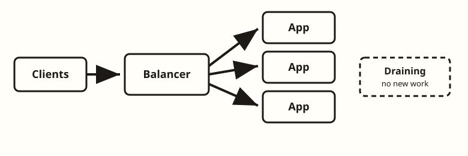
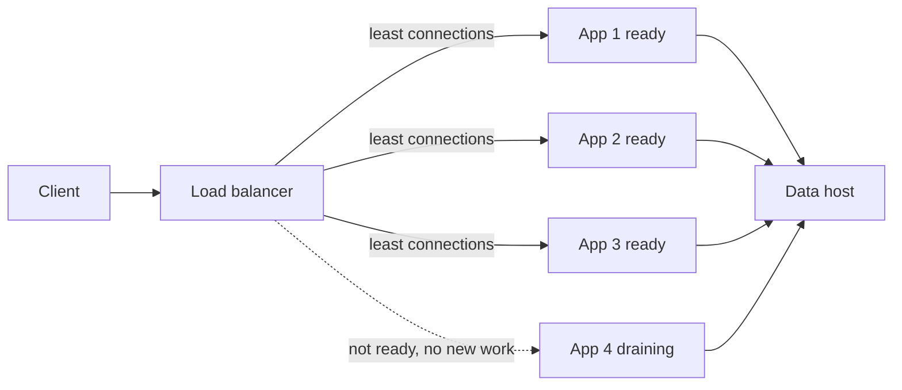
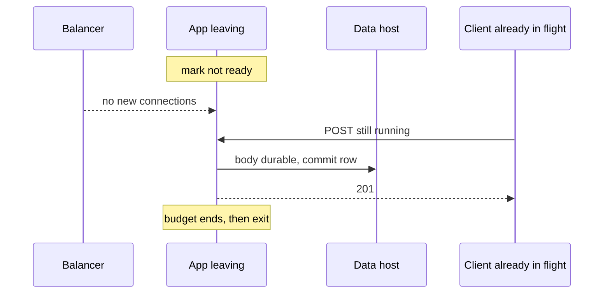

<!-- day-nav -->
[← Day 8 — The second box](08-the-second-box.md) · [Day 10 — Cache-aside for the melted read →](10-cache-aside-for-the-melted-read.md)

# Day 9 — Load balancing and draining

**Do now**

1. Set a timer.
2. Attempt the problem. Stop at the attempt line. Do not scroll.
3. Then read.

## Time box

35 minutes.

| Minutes | Do this |
|---|---|
| 0–10 | Attempt. How a request picks a process, and what a deploy does to a create that has already started. |
| 10–28 | Read. Mark the place your answer kills in-flight work. |
| 28–35 | Say the drain sequence from memory: unhealthy, wait, finish, exit. Name what a retry of create still does. |

## Intent

Facing uneven load, leave able to choose balancing, health checks, and drain behavior, and say what each does to in-flight work. The balancer is the fix for four processes that clients cannot see. It is not a product.

## Problem

> Design a pastebin. People paste text and share a link.

The interviewer says: "You drew four app processes. Who sends work to them, and what happens to a create when you deploy?"

## Attempt before reading

10 minutes. Do not scroll. The tier from day 8 is in place: four stateless app processes, no session, bodies and rows still on one data host, peak about 17,400 reads/s.

Write:

1. How a new connection chooses a process. One policy, and the pastebin fact that makes a fancier policy unnecessary or necessary.
2. What a health check is allowed to touch. What it must not touch.
3. The steps of a deploy that do not drop a create already past the point of durability, and the steps that still can.
4. What you refuse: sticky sessions, a check that depends on the data host being bored, a second balancer tier you cannot justify.

---

**Stop. Balancing and draining below. No new store.**

---

## Requirements

Same pastebin. Creates are not idempotent. A create that might have committed, if the client never saw the 201, becomes a second paste on retry. That fact is why drain exists. A read has no such tax: a failed read is safe to retry.

The user-visible requirement you are adding: a deploy or a crash of one process does not take the link-reading product down, and a create either finishes or fails cleanly. "Cleanly" means the client gets an error or a 201, not a hung socket, and you do not ack a paste the data host does not have.

You are not promising zero double-creates across a crash. You are promising a deploy does not manufacture them by killing workers mid-request.

## Design

One load balancer in front of the four app processes. Clients keep a single address. The balancer does not terminate the paste contract; it forwards HTTP. TLS can end at the balancer so the app ceiling from day 8 (8,000 streaming reads, which included TLS copy) goes up. Say whether your ceiling assumed TLS. If the balancer terminates TLS, restate the ceiling before you keep four processes out of habit. A planning move: TLS offload may take a process from 8,000 to something higher. You still keep four, because a deploy removes one, and 17,400 has to fit in three times the new ceiling. At the old ceiling that is 3×8,000 = 24,000. Two processes are 16,000, under the peak even before anyone restarts. Three with one down are the same 16,000, so they fall through during a drain. Do the division in the room. Do not leave "four" as folklore from yesterday.

### How a request picks a process

**Choice: least connections,** not round robin and not a hash of the URL.

Reads stream a body. A 1 MB paste (the cap) occupies a connection far longer than a 1 KB paste. Round robin counts requests and will pin a process to several max-size downloads while another process is idle. Least connections tracks in-flight work, which is the unevenness you actually have.

You do not hash the paste id to pin a process. There is no local cache on the process yet, and there is no session. Pinning buys nothing and makes one viral id a single-process incident. When a cache exists, it will be shared. The app stays unpinned.

Least connections needs the balancer to see the connections. That is ordinary. You do not build your own balancer.

### Health checks

Two different questions. Do not collapse them.

**Ready.** Should this process receive new work? Yes when it is up and not draining. The check is `GET /healthz` on the process, which answers 200 if the event loop is scheduling. It does **not** open Postgres and it does **not** read the NVMe.

A deep check feels serious and fails open in the dangerous direction: if the data host hiccups, every app fails the check, the balancer marks the whole tier dead, and a one-second stall becomes a total outage. The data host is allowed to be the thing that then returns 500s. That is a smaller outage than "no process is eligible." Page on those 500s. Do not encode the dependency into the membership check.

**Live.** Is the process wedged? A live check that fails restarts that one process. It still does not query the primary.

### Draining

Deploy one process at a time. For the process leaving:

1. Mark it **not ready**. The balancer must stop sending new connections. In-flight connections stay.
2. Wait until the balancer has observed the failure, on the order of one check interval. A planning interval: **2 seconds**, said as an assumption. Work already running continues.
3. The process finishes in-flight requests, up to a **drain budget of 5 seconds**. A create at this QPS is a group-commit plus a row insert, well under that. A read of a 1 MB body on a slow client might not finish. When the budget expires, the process closes what remains and exits.
4. Only then is the process gone. The other three are ready the whole time. One down leaves 3×8,000 = 24,000 against a 17,400 peak. Two down would leave 16,000, which does not clear it. That is why the deploy moves one process, not two.

What this does to in-flight work:

- A create that reaches commit inside the budget returns 201. The client got the link. Good.
- A create still running when the budget expires is cut. If the row had not committed, the client sees an error and a retry mints a new id. An orphan body may exist on the NVMe. The read path cannot see it, because reads go through the row. Same orphan story as day 5.
- A create that committed and then lost the response still looks, to the client, like a failure. Drain does not close that window. It makes the window a crash, not a deploy. Deploys are the common case. You refuse to widen them with `SIGKILL`.
- A read that is cut is retried by the client against another process. No double effect.

**SIGKILL** as a deploy is the anti-pattern. It treats every in-flight create as a crash. Draining is the fix.

Two details make or break the drain, and both are where real rollouts produce errors:

- **Keep the listener open during step 2.** Not ready is a flag the balancer reads, not a closed socket. For the two seconds before the balancer notices, new connections still arrive. A process that closes its listener on `SIGTERM` turns those into connection-refused errors for every client that landed in the window. At about 4,350 reads a second per process, two seconds is roughly 8,700 requests. Serve them; they are short.
- **Close keep-alive connections on purpose.** The balancer holds a pool of idle HTTP connections to each app. A draining process answers its last requests with `Connection: close` so those pooled connections migrate to the other three instead of being reset mid-reuse. Skip this and the "clean" drain still produces a burst of resets that look like a network problem.

Total rollout time is arithmetic too: about 2 seconds to be noticed, up to 5 to drain, plus however long the new process takes to pass ready. Call it under 30 seconds per process and a couple of minutes for four. Fast enough that "deploy during the trough" is a preference, not a requirement.

You drain before a machine leaves, not only before a binary leaves. A balancer that keeps sending to a process you are about to delete is how a rolling update becomes a 10% error rate you call "deploy noise."

### When least connections lies

Least connections has one failure mode a staff interviewer probes for. A process that fails fast, returning 500 in a millisecond because its path to the data host broke, finishes every request immediately. It always has the fewest open connections. So the balancer sends it **more** traffic, not less. One broken app can eat far more than a quarter of the requests: a black hole that the policy rewards.

The shallow ready check does not catch it, by design; the process is alive. The fix is passive: the balancer watches the responses it already forwards and ejects a process whose 5xx rate jumps relative to its peers, for a short cooldown. Bound the ejection: **at most one of four** out at a time. If all four start failing together, that is the data host, and ejecting them would rebuild exactly the deep-health-check outage you refused. The bound is the difference between "isolate the odd one out" and "drain the tier because the database sneezed."

### What the balancer must not be

It is not sticky. It is not a second cache. It is not where you put rate limits yet (day 17); a limit that lives only here is invisible to a second entry point. It is not highly available in this drawing until they ask. One balancer is a new single process. Say so. The fix, when they ask, is two balancers sharing a virtual address, which is a copy of a well-known pattern, not a pastebin idea. You do not spend the interview on that protocol. You name the failure: balancer dies, nothing is reachable, data is untouched.

## Diagrams

### Who receives new work

The dotted edge is the whole deploy story. In-flight on app 4 is not drawn as "deleted." Three ready processes are the headroom from day 8: 3×8,000 still clears peak.

Caption it: "Dotted means no new work, not dead. Three solid edges carry 17,400 against 24,000." Write the policy on the edges, not in a legend. An edge labeled "least connections" is a decision; an unlabeled edge from a box called LB is a noun.

### Drain against the 201

If the 201 arrow is missing and the process exits anyway, say whether the row committed. That sentence is the difference between an error the client can retry and a paste that exists with no owner holding the link.

Caption: "201 leaves before the exit, or the client never had the link." The order in the sequence is the guarantee. Draw the exit note after the 201 arrow, and say aloud that a budget which ends before the commit returns leaves an orphan body and an error, not a paste. Only a response lost after commit leaves a paste nobody holds the link to.

## Failure the user sees, in front of the apps

**A process crashes (not a deploy).** No drain. In-flight creates on it fail; some may have committed, and their retries become second pastes. Then the detection window: checks every 2 seconds, marked out after two misses, so up to about 4 seconds in which the balancer still sends new connections to a dead process. Those fail at connect. A balancer that retries a failed connect on another process hides them for reads; it must not retry a POST whose request body already reached the app, because that is the double-create you built drain to avoid. Users see a few seconds of errors on roughly a quarter of new requests, then nothing.

**One app loses its path to the data host.** Process alive, ready check green, every request a fast 500. Without outlier ejection, least connections feeds it more and users see well over a quarter of requests fail. With bounded ejection, it is out within seconds and users see a short spike. Page on per-process 5xx skew, not only on the total.

**The data host stalls for a few seconds.** All four apps return 500s or slow responses. Ready stays green on all four, which is correct: there is nowhere better to send traffic. Users see errors for the stall. If you had a deep check, they would see errors for the stall plus however long it takes four processes to flap back into rotation.

**The balancer dies.** Nothing is reachable; every paste is intact. RPO zero, RTO is however long it takes to replace one stateless box. That is the honest sentence until they ask for the pair with a shared address.

## Trade-offs

**Choice.** Least connections, shallow ready check, drain with a 5 second budget, one process at a time.

**Alternative.** Round robin, a health check that runs `SELECT 1` against Postgres, and a deploy that kills the process when the new one is up.

**What you give up.** Least connections is a vaguer spread than a hash you could simulate on paper. A shallow check will keep sending traffic to apps that are about to return 500 because the data host is sick. You accept those 500s so a sick dependency cannot empty the pool. The drain budget will cut a slow 1 MB download. That reader retries. You are not cutting to be cruel; you are bounding the deploy.

**Why.** Round robin mis-loads max-size pastes. A deep health check couples membership to the database. Kill-and-replace turns every deploy into the double-create window you already dislike, multiplied by how often you ship.

**Name the refusal inside each alternative.** Against round robin: you refuse it because it counts requests on a product whose cost is bytes, and the 1 MB cap is a hundred times the mean. Against the deep check: you refuse a membership rule that converts a dependency blip into "no eligible process." Against kill-and-replace: you refuse to make every deploy a crash for in-flight creates. Against hashing the id to a process: you refuse to turn a viral paste into a single-process incident for a locality you have no cache to exploit. Least connections earns its place only with bounded outlier ejection beside it; without that, it rewards the fastest failure.

**10× break.** Peak reads at ~174,000. Least connections still works; the balancer itself must accept that many connections. A single small balancer CPU becomes the ceiling you did not have at 1×. Two balancers, or the TLS offload moving to a tier that is actually sized, is the fix. It is still not a cache. Do not "solve" a saturated balancer by pinning paste ids.

## Talking points

**Say.** "Least connections, because body sizes vary up to 1 MB and round robin will not see that. Health is process liveness only. If I make it check Postgres, a database blip drains the whole tier. Deploys mark one process not ready, let in-flight creates finish for a few seconds, then exit. I do not kill."

**Say.** "Drain does not make create idempotent. It stops the deploy from being the thing that loses the 201. A client retry can still mint a second paste if the response was lost after commit."

**Hand-waving.** "The load balancer handles it." Handles which policy, and what does it do with a connection that is mid-POST?

**Hand-waving.** "We'll use round robin, it's more fair." Fair to requests, unfair to bytes. This product's cost is bytes.

**Hand-waving.** "Active health checks against the dependency so we never send users to a broken path." You will send them nowhere, which is worse, and you will flap.

**If they ask about websockets or long polls.** You have none. Do not invent a 30-minute drain. The longest honest request is a 1 MB read on a slow link, and you cap it with the budget plus a server-side write timeout. Day 20 owns timeouts. Today, name the budget.

**If they ask: "Least connections sends traffic to a broken box, doesn't it?"** "Yes, if it fails fast. A process returning instant 500s always looks least loaded. So the balancer ejects a process whose 5xx rate is out of line with its peers, one at a time at most. If all four fail together, that's the data host, and I keep them in."

**If they ask why the process doesn't just stop listening on SIGTERM.** "Because the balancer takes about two seconds to notice not ready. Closing the listener turns those two seconds into connection-refused for every client in the window. Flag first, keep serving, close idle keep-alives, then exit after the budget."

**If they ask whether the balancer should retry failed requests.** "Reads and connect failures, yes, once, on another process. A POST that reached an app, no. The balancer cannot know whether the row committed, and a blind retry is a second paste."

**If they ask what you page on.** A process flapping ready. A deploy whose drain budget expires while creates are still in flight, counted. Error rate on the balancer. Not the 404 rate.

## Say this in the room

One balancer, least connections, because body sizes run from about 10 KB to the 1 MB cap and round robin counts requests, not bytes. Least connections rewards a box that fails fast, so the balancer ejects an outlier on 5xx skew, at most one of four; if all four fail, that's the data host and they stay in. The ready check is process-only. It never queries Postgres, because a database blip should be 500s, not an empty pool. Deploy one process at a time: flag not ready, keep the listener open the two seconds the balancer needs to notice, close keep-alives, finish in-flight creates within five seconds, exit. Three left is 24,000 against 17,400. Drain doesn't make create idempotent; it stops deploys from being the thing that loses a 201. The balancer retries reads, never a POST that reached an app. If the balancer dies, nothing is reachable and nothing is lost. I'd pair it when you ask.

## Kit artifact

One checklist row.

| Row | Lock |
|---|---|
| Drain | Not ready, stop new work, finish in-flight creates up to a named budget, then exit. No sticky session. Health check does not include the database. |

## Design log

One line: what your attempt did to a create that had already started when the process left. If the answer was "kill it," that is the gap.

Next: [Day 10 — Cache-aside for the melted read](10-cache-aside-for-the-melted-read.md).

---

<!-- day-nav -->
[← Day 8 — The second box](08-the-second-box.md) · [Day 10 — Cache-aside for the melted read →](10-cache-aside-for-the-melted-read.md)
