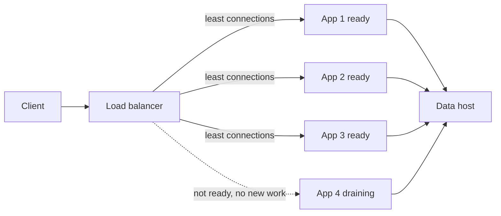
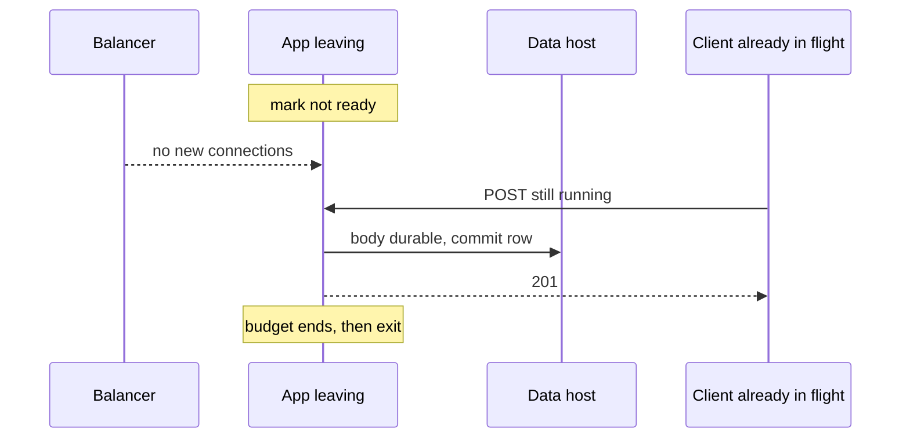

<!-- day-nav -->
[← Day 8 — The second box](08-the-second-box.md) · [Day 10 — Cache-aside for the melted read →](10-cache-aside-for-the-melted-read.md)

# Day 9 — Load balancing and draining

**Do now**

1. Set a timer.
2. Attempt the problem. Stop at the attempt line. Do not scroll.
3. Then read.

## Time box

35 minutes.

| Minutes | Do this |
|---|---|
| 0–10 | Attempt. How a request picks a process, and what a deploy does to a create that has already started. |
| 10–28 | Read. Mark the place your answer kills in-flight work. |
| 28–35 | Say the drain sequence from memory: unhealthy, wait, finish, exit. Name what a retry of create still does. |

## Intent

Facing uneven load, leave able to choose balancing, health checks, and drain behavior, and say what each does to in-flight work. The balancer is the fix for four processes that clients cannot see. It is not a product.

## Problem

> Design a pastebin. People paste text and share a link.

The interviewer says: "You drew four app processes. Who sends work to them, and what happens to a create when you deploy?"

## Attempt before reading

10 minutes. Do not scroll. The tier from day 8 is in place: four stateless app processes, no session, bodies and rows still on one data host, peak about 17,400 reads/s.

Write:

1. How a new connection chooses a process. One policy, and the pastebin fact that makes a fancier policy unnecessary or necessary.
2. What a health check is allowed to touch. What it must not touch.
3. The steps of a deploy that do not drop a create already past the point of durability, and the steps that still can.
4. What you refuse: sticky sessions, a check that depends on the data host being bored, a second balancer tier you cannot justify.

---

**Stop. Balancing and draining below. No new store.**

---

## Diagrams

### Who receives new work

The dotted edge is the whole deploy story. In-flight on app 4 is not drawn as "deleted." Three ready processes are the headroom from day 8: 3×8,000 still clears peak.

### Drain against the 201

If the 201 arrow is missing and the process exits anyway, say whether the row committed. That sentence is the difference between an error the client can retry and a paste that exists with no owner holding the link.

## Requirements

Same pastebin. Creates are not idempotent. A create that might have committed, if the client never saw the 201, becomes a second paste on retry. That fact is why drain exists. A read has no such tax: a failed read is safe to retry.

The user-visible requirement you are adding: a deploy or a crash of one process does not take the link-reading product down, and a create either finishes or fails cleanly. "Cleanly" means the client gets an error or a 201, not a hung socket, and you do not ack a paste the data host does not have.

You are not promising zero double-creates across a crash. You are promising a deploy does not manufacture them by killing workers mid-request.

## Design

One load balancer in front of the four app processes. TLS can end at the balancer so the app ceiling from day 8 (8,000 streaming reads, which included TLS copy) goes up. A planning move: TLS offload may take a process from 8,000 to something higher.

### How a request picks a process

**Choice: least connections,** not round robin and not a hash of the URL.

Reads stream a body. A 1 MB paste (the cap) occupies a connection far longer than a 1 KB paste.

You do not hash the paste id to pin a process. There is no local cache on the process yet, and there is no session.

Least connections needs the balancer to see the connections. That is ordinary. You do not build your own balancer.

### Health checks

Two different questions. Do not collapse them.

**Ready.** Should this process receive new work? The check is `GET /healthz` on the process, which answers 200 if the event loop is scheduling.

A deep check feels serious and fails open in the dangerous direction: if the data host hiccups, every app fails the check, the balancer marks the whole tier dead, and a one-second stall becomes a total outage. The data host is allowed to be the thing that then returns 500s. That is a smaller outage than "no process is eligible." Page on those 500s.

**Live.** Is the process wedged? A live check that fails restarts that one process. It still does not query the primary.

### Draining

Deploy one process at a time. For the process leaving:

1. Mark it **not ready**. The balancer must stop sending new connections. In-flight connections stay.
2. Wait until the balancer has observed the failure, on the order of one check interval. A planning interval: **2 seconds**, said as an assumption. Work already running continues.
3. The process finishes in-flight requests, up to a **drain budget of 5 seconds**. A create at this QPS is a group-commit plus a row insert, well under that. A read of a 1 MB body on a slow client might not finish. When the budget expires, the process closes what remains and exits.
4. Only then is the process gone. The other two are ready the whole time.

What this does to in-flight work:

- A create that reaches commit inside the budget returns 201. The client got the link. Good.
- A create still running when the budget expires is cut. If the row had not committed, the client sees an error and a retry mints a new id. An orphan body may exist on the NVMe. The read path cannot see it, because reads go through the row. Same orphan story as day 5.
- A create that committed and then lost the response still looks, to the client, like a failure. Drain does not close that window. It makes the window a crash, not a deploy. Deploys are the common case. You refuse to widen them with `SIGKILL`.
- A read that is cut is retried by the client against another process. No double effect.

**SIGKILL** as a deploy is the anti-pattern. It treats every in-flight create as a crash. Draining is the fix.

You drain before a machine leaves, not only before a binary leaves. A balancer that keeps sending to a process you are about to delete is how a rolling update becomes a 10% error rate you call "deploy noise."

### What the balancer must not be

It is not sticky. It is not where you put rate limits yet (day 17); a limit that lives only here is invisible to a second entry point.

## Trade-offs

**Choice.** Least connections, shallow ready check, drain with a 5 second budget, one process at a time.

**What you give up.** Least connections is a vaguer spread than a hash you could simulate on paper. A shallow check will keep sending traffic to apps that are about to return 500 because the data host is sick. You accept those 500s so a sick dependency cannot empty the pool.

**10× break.** Peak reads at ~174,000. A single small balancer CPU becomes the ceiling you did not have at 1×.

## Say this in the room

Least connections, because body sizes vary up to 1 MB and round robin will not see that. Health is process liveness only. If I make it check Postgres, a database blip drains the whole tier. Deploys mark one process not ready, let in-flight creates finish for a few seconds, then exit. I do not kill.

## Kit artifact

One checklist row.

| Row | Lock |
|---|---|
| Drain | Not ready, stop new work, finish in-flight creates up to a named budget, then exit. No sticky session. Health check does not include the database. |

## Design log

One line: what your attempt did to a create that had already started when the process left. If the answer was "kill it," that is the gap.

Next: [Day 10 — Cache-aside for the melted read](10-cache-aside-for-the-melted-read.md).

---

<!-- day-nav -->
[← Day 8 — The second box](08-the-second-box.md) · [Day 10 — Cache-aside for the melted read →](10-cache-aside-for-the-melted-read.md)
