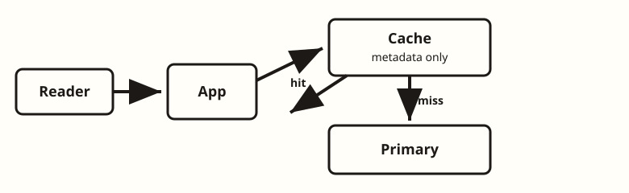
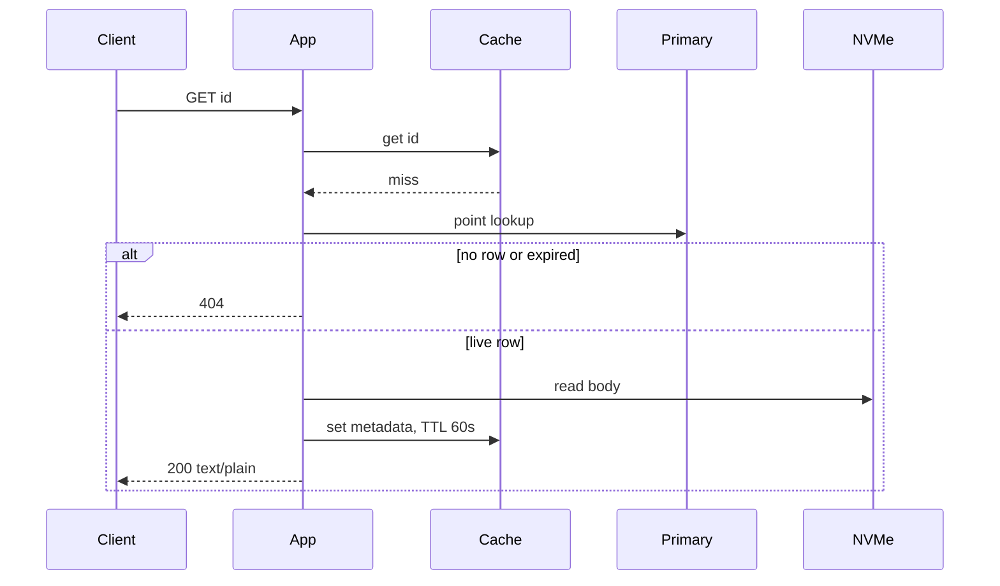
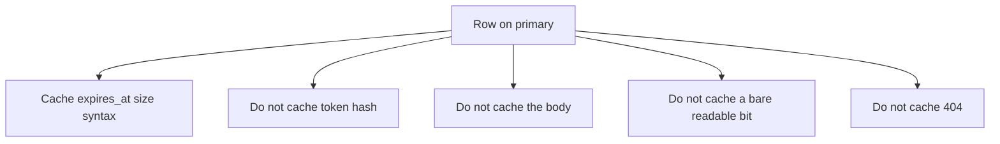

<!-- day-nav -->
[← Day 9 — Load balancing and draining](09-load-balancing-and-draining.md) · [Day 11 — Hot-key stampede →](11-hot-key-stampede.md)

# Day 10 — Cache-aside for the melted read

**Do now**

1. Set a timer.
2. Attempt the problem. Stop at the attempt line. Do not scroll.
3. Then read.

## Time box

40 minutes.

| Minutes | Do this |
|---|---|
| 0–12 | Attempt. The read that melts, the miss path, and the thing you will not put in the cache. |
| 12–32 | Read. If your cache can return a paste the row would 404, it is wrong. Fix the rule, not the vendor. |
| 32–40 | Say the miss path from memory, including delete. |

## Intent

Facing a database melted by reads, leave able to add cache-aside and name the miss path and what must not be cached. The cache is a fix for the primary's read ceiling. It is not a faster disk, and it is not where expiry becomes "whenever the entry says."

## Problem

> Design a pastebin. People paste text and share a link.

The interviewer says: "The app tier is no longer the ceiling. The primary is. Every read still asks it whether the paste is alive."

## Attempt before reading

12 minutes. Do not scroll. You have four app processes behind a balancer, rows on one Postgres, bodies on one NVMe. Peak is about 17,400 reads/s and 350 writes/s.

Write:

1. A planning ceiling for point reads on that primary **while it is also committing the writes**. Compare it to 17,400. If you are not over, do not add a cache; say what would have to change before you would.
2. The get path on a miss and on a hit. Where the body comes from. The body is not automatically the cached thing.
3. What you refuse to cache, by name: at least the delete-token hash, and the "this is readable" bit without `expires_at`.
4. What a delete must do to the entry, and the race you still have if a read fills the cache after the delete.

---

**Stop. Cache-aside below. The primary stays the source of the row.**

---

## Requirements

Contract unchanged. Expired and missing are the same 404. A live row with a missing body is a 500. Delete makes the paste unreadable at the origin when the row commit returns. You are about to bend that last sentence by a race you must name, not by a TTL you hope is short.

New planning ceiling, same status as the 5 ms fsync and the 8,000-read process:

**A primary that is group-committing a few hundred writes a second can serve about 15,000 point reads a second before its CPU saturates.** Not a benchmark. Peak reads are 17,400. You are over, barely, before you count the sweeper and the replica you do not have yet.

Day 5 told you not to add a cache to feel safe, and to load-test the 17,400 point reads. This day is that test coming back over the line you are willing to promise. If they tell you the primary does 80,000 point reads while writing, you take the cache back off and you do not argue. The box has to follow the ceiling.

The body bytes are not why the primary melts. The primary does not store them. Caching the 10 KB body in this box would be a different break (origin bandwidth, day 15). Today you cache the **row you use to decide**.

## Design

Cache-aside, also called lazy fill. The app talks to the cache. The cache does not talk to Postgres. There is no write-through and no subscriber on the WAL. A subscriber is a second system you have not failed yet.

The cache holds, keyed by paste id:

- `expires_at`
- `size_bytes`
- `syntax`, if any
- a generation, or simply enough to know the row was live when you read it

It does **not** hold:

- `delete_token_hash`. Delete is rare and must hit the primary. A cache that stores the hash is a second copy of a verifier you do not need on the read path, and a wider blast radius when the cache is dumped.
- The raw delete token. You never stored it at all.
- The body. Up to 1,000,000 bytes a value, 4.5 TB resident. That is not a cache. That is an unacknowledged second disk.
- A bare boolean "readable." Without `expires_at`, a hit cannot be re-checked, and expiry becomes "when the entry happens to die."
- A 404. Random ids from a scanner would fill the cache with negatives. Ids are unguessable, so this is abuse-shaped, not the product. You do not spend RAM on misses. A missing key means "ask the primary," not "we know it is absent."

One cache node is enough for the hot metadata. You are not sharding it today. Day 18 is what happens when nodes appear and disappear. Today, one process, a few gigabytes, in front of the primary. If it dies, every read misses and the primary sees the full 17,400, which is the ceiling you just said it cannot hold. That failure belongs on the overlay, not in a silent hope. Name it: cache down means you shed or you melt. Shedding is day 19. Today, say the dependency.

### Hit

1. App gets the key.
2. No entry: miss, below.
3. Entry present and `expires_at <= now` on the **app clock**: treat as 404. Do not serve the body. You may drop the entry. A sweeper being behind is irrelevant, same as day 5.
4. Entry present and not expired: read the body from the NVMe by id. If the file is missing, 500 and `body_missing`. The cache does not get to hide data loss.
5. Stream `text/plain` with `nosniff`.

The hit still checks expiry. The TTL on the cache entry is not the paste TTL.

### Miss

1. Point read on the **primary**, not on a replica you have not drawn.
2. No row, or row expired: 404. Do not fill a negative.
3. Live row: read the body from the NVMe. Missing file: 500, do not cache a success.
4. Then set the cache entry. TTL **60 seconds**, and you will jitter it on day 11. The 60 seconds is a bound on how long a missed invalidation can live, and a bound on memory. It is not how you delete.
5. Return the body.

Fill after you know the body exists, so you do not cache a row you just turned into a 500. If you prefer to cache the row even when you then 500, you may, but you must not cache a positive body you did not see. Keep the entry to metadata either way.

### Write and delete

Create does not need to warm the cache. The creator has the body. The first reader fills. Warming on create is how you spend cache RAM on pastes nobody reads. Most links are not viral. 450 million live objects will not fit, and you should not try.

Delete, after the row commit on the primary, **deletes the cache key** before you return 204. Order: commit the row removal, delete the key, unlink the file, then 204. If you 204 before the key is gone, a reader on another app can still hit. You wait for the cache delete. It is one round trip. The user who is deleting is not the one you were protecting with asynchrony.

The race you still have: a miss reads the primary **before** the delete commits, then `SET`s the cache **after** you `DEL` the key. The paste is readable again until the 60 second TTL, even though the row is gone. Day 11 will not fix this; a stampede lock is not an invalidation protocol. The patch you should be able to say, even if you do not build a framework: write a **tombstone** (`gone`, TTL a bit longer than the fill window, say 75 seconds) instead of a bare `DEL`, and the miss path must not overwrite a tombstone with a resurrected row. A late fill checks "tombstone wins." That is interview depth. A distributed transaction with the database is not.

Until the tombstone is in the picture, the honest contract is: origin reads can observe a deleted paste for up to one in-flight miss, and then for the TTL if you lose the race. Say it. Do not say "cache-aside is consistent."

Expiry does not delete the key. The read checks `expires_at`. A stale entry past expiry is a 404 on the hit path. That is why the timestamp is inside the value.

## Diagrams

### Miss path

There is no arrow from the cache to the primary. If you drew one, you built a different mechanism and you should say so.

### What must not be cached

## Trade-offs

**Choice.** Cache-aside of the metadata row, 60 second TTL, tombstone on delete, body stays on the NVMe, primary is the only fill source.

**Alternative.** A bigger primary, or a read replica for every GET, or write-through so the cache never misses a create.

**What you give up.** A dependency. Cache down throws the full read peak back at a primary you said cannot take it. You also give up a strict "delete is instantly invisible" unless the tombstone race is closed, and even then a reader who already passed the check is streaming. You accept a bounded race instead of a two-phase commit between Postgres and the cache.

**Why not the alternatives.** A bigger primary spends money on a ceiling you will hit again when the read ratio moves, and it does not give you a place to absorb a hot key tomorrow. A replica can serve stale deletes if you read it for this path; that refusal is day 13, and you will not sneak the replica in as "the cache." Write-through fills entries nobody reads and still needs the delete path. It does not remove the race; it moves it.

**10× break.** Peak reads ~174,000. Even a 90% hit rate, which you must not invent today as a silent factor, leaves 174,000 × 0.10 = 17,400 misses. That is the whole peak again, and it is over the 15,000 ceiling. At 10× the cache is necessary and not sufficient; you will need the hit rate stated in the open (day 21) and a plan for the miss storm (day 11). A 60 second TTL at 10× also means a deleted viral paste can be served from a stale entry to a much larger audience. The tombstone matters more as the site gets bigger, not less.

## Talking points

**Say.** "I'm over a planning ceiling of about 15,000 primary point reads a second once writes are in the picture, and peak is 17,400. Cache-aside on the metadata only. Miss reads the primary, then fills. Hit still checks `expires_at`. I do not cache the body, the token hash, or 404s."

**Say.** "Delete commits the row, writes a tombstone the fill path will not overwrite, then unlinks. TTL is how I bound a bug. It is not how I delete. A late fill after a bare DEL can resurrect a paste for the rest of the TTL. I will not call that consistent."

**Hand-waving.** "Redis in front, 90% hit rate, so the database sees 1,700." You smuggled the hit rate. Today you have not earned it. The miss path has to be correct at a 0% hit rate, which is a cold cache and a restart.

**Hand-waving.** "The cache expires the paste." The paste expires because of `expires_at` on the read. The cache entry expires so RAM and mistakes stay bounded.

**Hand-waving.** "We'll cache the rendered page." You do not render. `text/plain` is the response. A cached HTML page is the bug day 2 refused.

**If they ask what you page on.** Cache hit ratio collapsing to the floor, primary CPU, and `body_missing`. A low hit ratio on a quiet day may be fine. A low hit ratio at peak is the primary about to melt. Alert on primary CPU, not on a vanity hit-rate target.

**If they ask read-your-writes for the creator.** The creator does not need to GET. They have the bytes. A reader who is handed the URL a second later will miss, fill, and see the row, because the row committed before the 201. You do not read a replica on this path, so you do not have lag in the fill.

## Kit artifact

One checklist row.

| Row | Lock |
|---|---|
| Cache-aside | Miss path hits the primary, then fills. Value is the expiry decision, not the body and not the token hash. 404s are not stored. Delete cannot be "wait for TTL." |

## Design log

One line: whether your attempt could serve a deleted or expired paste from cache, and for how long. That duration is the gap if you could not name it.

Next: [Day 11 — Hot-key stampede](11-hot-key-stampede.md).

---

<!-- day-nav -->
[← Day 9 — Load balancing and draining](09-load-balancing-and-draining.md) · [Day 11 — Hot-key stampede →](11-hot-key-stampede.md)
