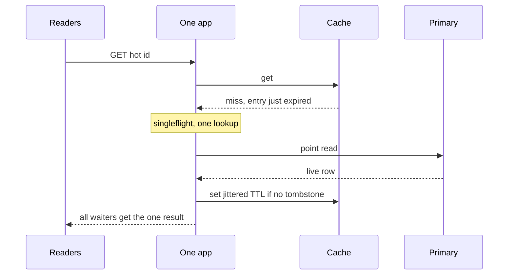
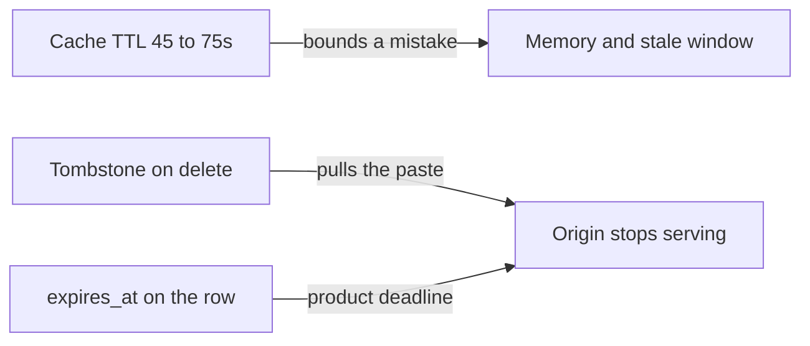

<!-- day-nav -->
[← Day 10 — Cache-aside for the melted read](10-cache-aside-for-the-melted-read.md) · [Day 12 — SQL or NoSQL from the broken query →](12-sql-or-nosql-from-the-broken-query.md)

# Day 11 — Hot-key stampede

**Do now**

1. Set a timer.
2. Attempt the problem. Stop at the attempt line. Do not scroll.
3. Then read.

## Time box

35 minutes.

| Minutes | Do this |
|---|---|
| 0–10 | Attempt. One hot id, the moment the cache entry dies, what hits the primary. |
| 10–28 | Read. If your fix is "lower the TTL," you made the stampede more frequent. |
| 28–35 | Say, from memory, the difference between a TTL and an invalidation, and one stampede control that is not a TTL. |

## Intent

Facing a hot pastebin key, leave able to stop a stampede without treating a TTL as invalidation. Popularity is still a point read. The failure is many misses at the same instant, not a hard key range.

## Problem

> Design a pastebin. People paste text and share a link.

The interviewer says: "One paste just got a large fraction of your reads. The cache entry expires. What happens to the primary in that second?"

## Attempt before reading

10 minutes. Do not scroll. Cache-aside of metadata is in place. TTL is 60 seconds. Peak reads are about 17,400/s. The primary's planning ceiling is about 15,000 point reads/s.

Write:

1. A concrete hot key. Pick a fraction of peak, one id, and the QPS that implies.
2. What the primary sees in the second the entry expires, if every app misses independently.
3. A control that collapses those misses. Say whether it is per process or per cluster.
4. How delete actually removes the entry. If the answer is "the TTL," start over.

---

**Stop. Stampede control below. TTL stays a bound, not a delete.**

---

## Diagrams

### One filler, many waiters

The other three app processes may do this once each. Draw a second arrow only if you are answering "is singleflight global?" The answer is no.

### Two clocks that are not the same

If a design merges these three into one timer, it will either serve deleted pastes or forget them too slowly to bound RAM. Keep the arrows apart.

## Requirements

Same contract. One id is still the only lookup. A viral paste is the easy disk shape from day 5: one row, one file, page cache on the NVMe. It is the hard **cache** shape, because a single key's expiry is a synchronization point for every reader.

You do not add a ranking page, a counter table, or a "trending" product to handle this. A view counter would be a new write hot spot. Non-goal, unless they force it, and then it is async and lossy and not on the read you are serving.

Assumption for this hour, spoken: **one id takes half of peak reads.** Half of 17,400 is **8,700 reads/s on one key.** The rest of the keyspace behaves as before. You can change the fraction; the shape of the answer should not change.

## Design

### What a stampede is

The hot entry is present. Those 8,700 reads/s hit the cache and then the NVMe (the body is not in the cache).

At TTL expiry, the next requests miss. In the same few milliseconds you can have hundreds of misses in flight, because 8,700/s means a new request about every 0.1 ms, and a primary round trip is a millisecond or more.

Aligned expiry is self-inflicted. If you fill every entry with `TTL = 60` from a cron-shaped warmup, you built the stampede. Jitter is the first control, and it is not sufficient by itself.

### TTL is not invalidation

Say these as different mechanisms.

| Mechanism | What it is for | What it is not |
|---|---|---|
| TTL plus jitter | Bounds memory. Bounds how long a bug or a missed delete can serve stale metadata. Spreads expiry so keys do not fall off together. | Not a delete. Not how expiry of the **paste** works. The paste expires because the read checks `expires_at`. |
| Tombstone on delete | Makes the origin stop serving a removed paste, and blocks the late-fill race from day 10. | Not a memory policy. A tombstone has its own short TTL so the key does not live for 45 days. |
| Paste `expires_at` | The product deadline. Checked on every hit and every miss. | Not a cache setting. |

If you "invalidate" by setting a short TTL and waiting, a delete is invisible for that whole TTL, and a viral paste multiplies the leak. The hot key is exactly the paste you most need to be able to pull.

### Controls that actually collapse a miss

You want **one** fill in flight for a given id, and everyone else waits for it or serves the previous value.

**Per-process singleflight.** Inside one app, concurrent misses for the same id share one primary lookup and one body read. Four processes mean up to four fills, not 8,700.

**Jittered TTL.** Set the entry TTL uniformly between **45 and 75 seconds**, not a flat 60. Keys, and rebuilds of the same hot key, do not expire on the minute.

**Stale-while-revalidate, as a sentence.** If you still have the previous entry, serve it for a bounded extra window (the jitter band is enough) while one singleflight refreshes. A hot key then never has a zero.

What you do not add:

- A distributed lock in the cache for every id, as the first design. Across four processes, singleflight already cut the miss fan-out from thousands to four. A lock service is a new dependency on the read path of your hottest key. Take it only if they show you dozens of app processes and a primary that still falls over at that fan-out. Then the lock is "one filler cluster-wide," with a short lease, and waiters that give up and 503 rather than all hitting the primary. Day 19 is the give-up.
- A counter of hits in the primary. That write path is hotter than the read you were protecting.
- Pre-warming every live paste. 450 million entries will not fit, and most are never read.

### The body of the hot key

8,700 reads/s times a 10 KB mean is about **87 MB/s** off the NVMe for that one file, or about **8.7 GB/s** if the viral paste is the 1 MB cap and you were wrong to use the mean. Do not "fix" it by putting the 1 MB value into the metadata cache under the same stampede logic and calling it done.

### Delete of the hot key

Tombstone, as on day 10. Singleflight waiters who are in flight with a pre-delete primary read must not overwrite the tombstone when they finish.

## Trade-offs

**Choice.** Per-process singleflight, jittered TTL, tombstone invalidation, stale-while-revalidate only inside the jitter band and never past `expires_at` or a tombstone.

**What you give up.** Singleflight adds wait time on a miss: the waiters take the latency of one primary read, and a slow filler slows them all. You need a timeout so a stuck filler does not pin 8,700 requests. Those timed-out waiters get a 503 or a single extra try, not a private trip to the primary.

**10× break.** Half of ~174,000 is about **87,000 reads/s on one key.** Four singleflights still protect the primary. The NVMe and the one app process streaming 87,000 responses do not. At a 10 KB body that is ~870 MB/s, near a full 10 Gbit NIC, from one key, and the process ceiling was 8,000 reads/s.

## Say this in the room

Half of peak on one id is about 8,700 reads a second. Steady state is a cache hit. The cliff is expiry or a cold cache. Per process I singleflight the miss, so four apps mean about four primary reads, not thousands. TTL is jittered between 45 and 75 seconds so I don't line the cliffs up.

## Kit artifact

One checklist row.

| Row | Lock |
|---|---|
| Hot key | Stampede control is singleflight, not a shorter TTL. TTL bounds memory and mistakes. Invalidation is the tombstone. Paste expiry is `expires_at`. |

## Design log

One line: how many primary reads your attempt produced when the hot entry expired. If you could not bound it, that number is the gap.

Next: [Day 12 — SQL or NoSQL from the broken query](12-sql-or-nosql-from-the-broken-query.md).

---

<!-- day-nav -->
[← Day 10 — Cache-aside for the melted read](10-cache-aside-for-the-melted-read.md) · [Day 12 — SQL or NoSQL from the broken query →](12-sql-or-nosql-from-the-broken-query.md)
