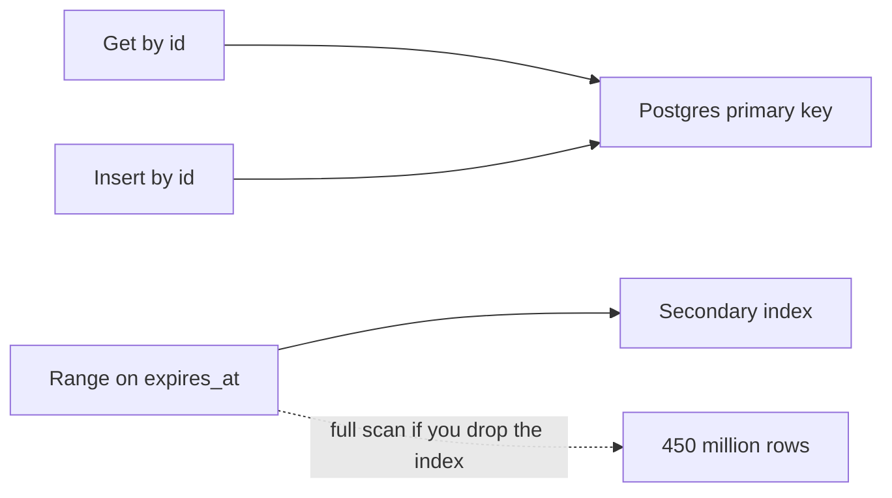
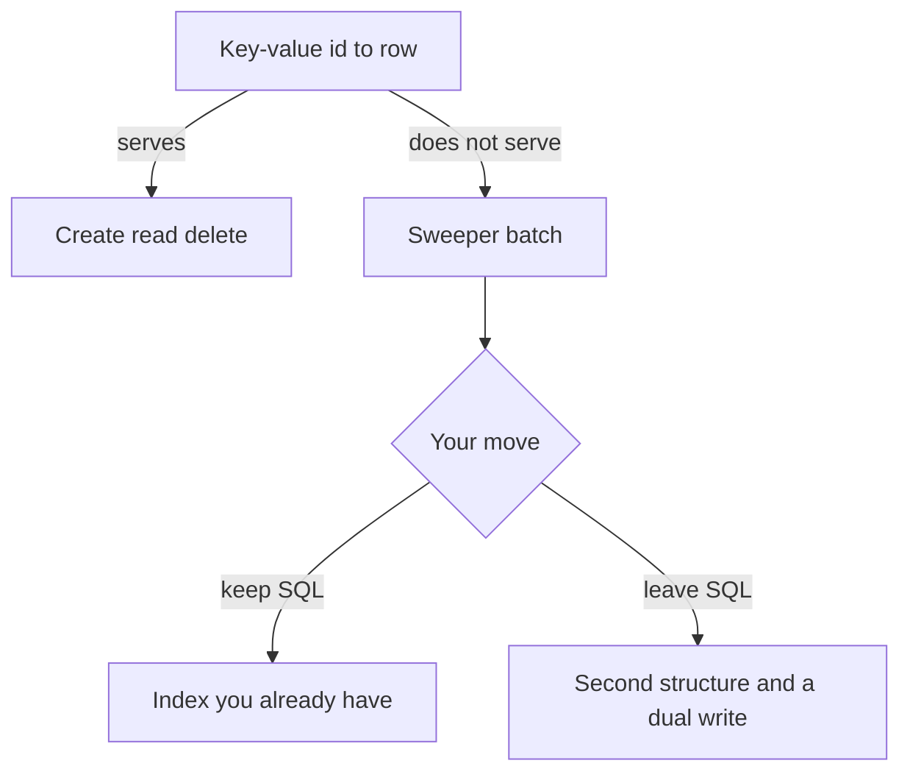

<!-- day-nav -->
[← Day 11 — Hot-key stampede](11-hot-key-stampede.md) · [Day 13 — Replication and the lagging read →](13-replication-and-the-lagging-read.md)

# Day 12 — SQL or NoSQL from the broken query

## Time box

35 minutes.

| Minutes | Do this |
|---|---|
| 0–10 | Attempt. List the queries you actually run. Mark the one a key-value store cannot answer. |
| 10–28 | Read. If you switched databases without a broken query, switch back. |
| 28–35 | Say the choice, what you gave up, and the query that would force the other store. |

## Intent

Facing a query the current store cannot serve, leave able to choose SQL or NoSQL from the access pattern and name what you give up. The store is a fix for a query shape. "NoSQL scales" is not a query.

## Problem

> Design a pastebin. People paste text and share a link.

The interviewer says: "Why is this still Postgres? Wouldn't a key-value store be a better fit?"

## Attempt before reading

10 minutes. Do not scroll. Metadata is a row in Postgres. Bodies are files on one NVMe. The cache holds a copy of the read decision, not the source of truth. About 350 writes/s peak, about 450 million live rows, one secondary index on `expires_at`.

Write:

1. Every query the system really runs. If you cannot point at a caller, it is not a query.
2. Which of those a primary-key store answers, and which it does not.
3. Your choice, SQL or a key-value store, and the concrete thing you give up.
4. The query someone in the room will propose that you refuse because it is a different product (a directory, a search).

Do not name a vendor as the answer. Name the access pattern first.

---

**Stop. The choice below stays SQL, for a reason you can point at.**

---

## Requirements

The queries the contract actually demands:

| Caller | Query | Rate, order of magnitude |
|---|---|---|
| Read and delete | Point get by `id` | Peak reads were 17,400 before the cache. After cache-aside, the primary sees misses, not the full peak. Writes and deletes ~350/s peak, ~116/s average. |
| Create | Insert by `id`, unique | Same write rate. |
| Sweeper | The ids whose `expires_at` is before now, in batches | About 116 deletes/s once retention is full. A batch is a range, not a point. |

There is still no "list my pastes," no search by syntax, no "most viewed." Those would be new queries. You do not get to invent them to justify a database, and you do not get to invent them to justify leaving one.

Bodies are not in this decision. A 10 KB to 1 MB value was already refused as a column, on day 5, because of WAL, vacuum, and backup. That refusal is about **value size**, not about SQL versus NoSQL. Putting the body in a document store does not make 4.5 TB of dead bytes a good idea. The body stays a file until day 14 moves it for the inode reason.

## Design

**Stay on Postgres for the row.** The access pattern is a point key plus one time range for garbage collection. A relational primary key does the point. The secondary index on `expires_at` does the range. You already sized that index inside the metadata budget, on the order of the 135 GB, not as a second cluster.

A key-value or wide-column store, used as "id → document," serves the point get and the insert. It does **not** serve "rows expiring now" unless you add a second structure. That second structure is the broken query, made visible:

```text
SELECT id FROM pastes
WHERE expires_at < now()
ORDER BY expires_at
LIMIT 1000;
```

If the store cannot answer that without a full scan of 450 million rows, the sweeper either scans the world or you redesign expiry. Scanning 450 million rows to delete 116 a second is the break. You do not "fix" a scan by calling the product scalable.

### What you would have to build to leave SQL

If they insist on a key-value primary for the row, expiry becomes a **bucket you write at create time**, not a predicate you discover later. Example shape, not a second design you adopt today: the key is the id, and you also write `expiry_bucket/{hour}/{id}` when you create. The sweeper reads the next hour bucket. You gave up a single index the database maintains, and you took a dual write. The dual write can fail halfway: a row that exists and a bucket that does not, so the sweeper never reclaims it, or a bucket that exists and a row that does not, so the sweeper deletes nothing and retries forever. Day 39's outbox is the grown-up version of that. You do not need it at 116 deletes a second against an index you already have.

So the "broken query" in this interview is not a query Postgres cannot run. It is the query a fashionable replacement cannot run. **The fix is to keep the store that answers it.** Refusing a migration is a design decision. Say it with the same confidence you would use to propose one.

### What would actually force a move

Be ready for the push. You leave this primary when one of these is the break, not before:

- **Write rate.** Thousands of commits a second that one primary cannot group-commit. You are at ~350 peak. Not this break. At 10×, ~3,500 peak commits, you will look again (day 24). The next step then is a partition key, which can still be SQL. Partitioning is not a synonym for NoSQL.
- **A query you agreed to serve** that is not a key and not a time range. Full-text search of bodies would be an index product. You refused search in week 1. Do not accept it now as a reason to change databases.
- **Value size.** Already handled by keeping bytes out of the row. Object storage later is not a NoSQL metadata decision.

A document store that still has a secondary index is SQL with a different license. Do not spend the hour on that distinction. Spend it on the range query.

### What you give up by staying

You give up horizontal write scaling as a default. One primary is the write bottleneck on purpose, at a rate that fits. You give up a schema-less row. Your schema is eight fields and has been stable since day 4; flexibility you will not use is not a feature. You take operational familiarity with a secondary index, vacuum, and a planner. You also take the duty to say the index costs writes: every create updates the `expires_at` index. At 350/s that cost is in the noise next to body durability. At a much higher write rate you would measure it. You do not drop the index to look faster and then full-scan.

You do not run a second metadata database "for the reads." The cache is the read scaling tool. Two metadata stores means two sources of truth and the tombstone problem doubled.

## Diagrams

Mermaid stands in for the whiteboard. SVG figures come later; do not wait on them.

### The only queries



### What a pure key-value store breaks



The right branch is real work. Take it when the left branch's primary cannot take the write rate. Not when the logo feels dated.

## Trade-offs

**Choice.** Postgres for metadata. Point key plus an `expires_at` index. Bodies not in the row. Cache in front for reads. No second metadata store.

**Alternative.** A key-value store keyed only by id, because every user-facing call is a point lookup.

**What you give up by refusing the alternative.** The ability to say "we can add nodes" as a write-scaling story. You also give up a slightly simpler mental model on the read path (one key, one value, no planner). You keep a sweeper that is a query, not an application-maintained bucket, and you keep a single commit for "row exists and will be found by expiry."

**What you would give up by accepting the alternative.** The range query, unless you build and fail the dual write yourself. That is a worse operational problem than a 135 GB index at a few hundred writes a second.

**10× break.** ~3,500 commits/s peak and ~4.5 billion live rows. The index still answers the same query; the primary may not keep up with the commits. The fix you reach for then is **partition the same table by id** (or by a hash of id), not "switch to NoSQL" as a sentence. A partition is still SQL if the range query becomes "each partition sweeps its own expiry index," or you add the time bucket at that moment because each partition's local index is the new dual-write problem. You do not pre-build that today. You name the rate that would make you.

## Talking points

**Say.** "The user-facing calls are point lookups by id. The sweeper is a range on `expires_at`, about a hundred deletes a second once we're full. Postgres does both. A key-value mapping does the point and full-scans 450 million rows to expire, or I maintain a second bucket and a dual write. I'm not taking that trade at 350 writes a second."

**Say.** "The body is not in this table, but that is because it is a large value, not because SQL is the wrong category. Object storage, when I add it, replaces the file layout. It does not replace the row."

**Hand-waving.** "NoSQL scales horizontally." Scale which query, at which rate you are missing?

**Hand-waving.** "Postgres can't handle 450 million rows." It can handle this access pattern. A table that does not fit a laptop is not a broken query. The broken query is a scan you run on the request path. The sweeper is batched and off to the side. The request path is a primary key.

**Hand-waving.** "We'll use both, SQL for the sweeper and NoSQL for the gets." You now have two writes on create and a consistency story you did not need. The cache already took the get load off the primary.

**If they demand search.** "That's a different product. An inverted index over 4.5 TB of text, with retention and the same 404 rule. I am not folding it into this row, and I am not switching the metadata store to sneak it in."

**If they ask about unique ids and compare-and-set.** The unique primary key is what makes a remint correct. A key-value put that does not fail on an existing key will reuse an id, which the contract forbids. Whatever store you pick has to support "insert if absent." Postgres does. Do not assume a document put does, unless you checked.

## Kit artifact

One trade-off card row.

| Choice | You take a key-value primary when | You keep SQL when |
|---|---|---|
| Metadata store | The write rate has broken one primary, and you have a plan for the expiry range that is not a full scan | The queries are a point key plus a range the index already serves |

## Design log

One line: the query your attempt could not answer after the store you picked. If you had no such query and still switched, the gap is the switch.

Next: [Day 13 — Replication and the lagging read](13-replication-and-the-lagging-read.md).

---

<!-- day-nav -->
[← Day 11 — Hot-key stampede](11-hot-key-stampede.md) · [Day 13 — Replication and the lagging read →](13-replication-and-the-lagging-read.md)
