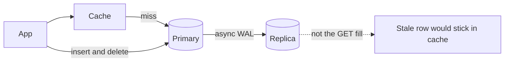
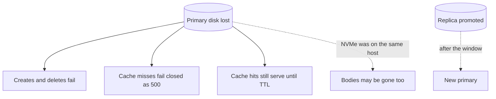

<!-- day-nav -->
[← Day 12 — SQL or NoSQL from the broken query](12-sql-or-nosql-from-the-broken-query.md) · [Day 14 — Object storage for the body →](14-object-storage-for-the-body.md)

# Day 13 — Replication and the lagging read

**Do now**

1. Set a timer.
2. Attempt the problem. Stop at the attempt line. Do not scroll.
3. Then read.

## Time box

40 minutes.

| Minutes | Do this |
|---|---|
| 0–12 | Attempt. What a replica protects, and which read you will not send to it. |
| 12–32 | Read. If every GET now goes to the replica, put the delete back on the primary path. |
| 32–40 | Say the user-visible lie a lagging replica tells, and the failover window you still have. |

## Intent

Facing a durability or read-scale wall, leave able to add replicas and refuse a lagging replica for reads that cannot lie. The replica is a fix for "the primary disk took the rows with it." It is not a place to hide the cache miss.

## Problem

> Design a pastebin. People paste text and share a link.

The interviewer says: "The primary dies. What is left of the metadata, and which reads are you willing to answer while a copy is behind?"

## Attempt before reading

12 minutes. Do not scroll. One Postgres primary on the data host. Cache-aside in front. Bodies still on that host's NVMe, which a Postgres replica does **not** copy. Peak writes about 350/s. Deletes must stop the paste at the origin.

Write:

1. The failure this replica fixes, in one sentence, and the failure it does not (the NVMe).
2. Sync or async, and what the 201 waits for.
3. The list of reads that may use the replica, and the list that must not.
4. What the user sees during promotion. Do not say "failover" without a window.

---

**Stop. One replica, used narrowly, below.**

---

## Diagrams

### What is allowed to lag

### Primary disk dies

The bottom arrow is the one candidates drop. Postgres replication did not save the file.

## Requirements

Metadata durability is the new requirement you are willing to say out loud: losing the primary's disk must not lose every row that already returned 201. You are **not** yet promising that for the bodies. A streaming replica of Postgres does not contain `/data`. If your attempt "failed over" and then 500'd every read because the files were on the dead host, you noticed the right split. Day 14 moves the bytes. Today, do not pretend the replica is a body replica.

Reads that cannot lie:

- **A delete that has committed must not be followed by a 200** from a copy that still has the row. That is the sharp one. Expiry is different: `expires_at` is in the row, so an old copy still expires on time if the read checks the timestamp. Lag does not un-expire a paste. Lag **does** resurrect a delete, and lag **does** 404 a create that has already returned 201 if you read the replica too soon.
- The cache fill must not use a stale row to repopulate an entry the tombstone just cleared. Filling from a lagging replica is how a delete comes back for the whole TTL.

Reads that can tolerate lag, and you should say so:

- The sweeper, if it is a little behind, reclaims a bit late. It must not delete a row the primary still considers live. Running the sweeper against a lagging replica is safe **only** for selecting candidates, and the delete itself has to be a conditional delete on the primary (`delete where id = ? and expires_at < now()`). A replica that is behind might hand you an id that was just extended... you cannot extend TTLs. You refused edits. So a candidate that is expired on the replica is expired on the primary, unless clocks are wildly wrong. The dangerous direction is the opposite: the replica has not seen a brand-new row yet, so it will not sweep it, which is fine. Sweep from the replica to spare the primary the index range, then delete on the primary with the predicate. If that sentence feels tight, sweep the primary. The range is ~116 rows/s of work. You do not need the replica for capacity. You need it for **a second copy**.

You are not promising multi-region. One replica, same region, different failure domain (different host, different disk, different rack if they ask — one phrase).

## Design

**One async streaming replica.** The primary ships its WAL. Create's 201 waits for the local commit on the primary, **not** for the replica to apply.

Why async: a sync commit waits for the replica on every create. At 350 writes/s you can afford the wait in milliseconds, and some interviewers will push you there. You choose async, and you say the RPO: **the last seconds of commits can be missing on the replica if the primary dies before they ship.** Those users got a 201 and a link.

Sync, if they force it: 201 waits for one replica ack. RPO for committed metadata becomes zero **for the row**, still not for the NVMe.

### What you refuse to read from the replica

**Cache misses for GET.** They go to the primary, as on day 10. A miss that hits the replica can fill the cache with a row that was deleted, or miss a row that was created, and then the cache makes the lie sticky for the TTL.

**Delete's compare-and-remove.** The token check and the row delete run on the primary. A delete that "succeeds" on a replica is not a delete.

**Create's insert.** Obvious, and worth saying because "read replica" sometimes gets implemented as "all statements." Inserts go to the primary.

### What the replica is for

- A second copy of the rows when the primary disk dies.
- Promotion, with a window.
- Optionally the sweeper's candidate scan, with the conditional delete on the primary.
- Not the interactive read path.

One replica, not three. Quorum is a later phase.

### Promotion, user-visible

Primary dies.

1. Apps' writes and authoritative reads fail. Cache hits still serve, until TTL, and they still enforce `expires_at`. A cache hit cannot see a delete that happened after it was filled, which you already accepted. A cache hit **can** keep the product readable for hot links while metadata is down. Cold keys 500, not 404. Do not convert "primary unreachable" into `not_found`. That hides an outage inside the contract for missing pastes.
2. You promote the replica. Planning window: **tens of seconds**, not zero. Say 30 seconds as a number they can hate. During it, creates fail, deletes fail, misses fail. Hits work.
3. Apps are pointed at the new primary. You need this switch to exist: a config or a proxy, not a hard-coded host on four app boxes that you redeploy by hand during the incident. One sentence. Do not design the control plane.
4. The old primary, if it returns with a split brain, must not accept writes. Fencing is the word. You do not explain STONITH for ten minutes. You say: a promoted replica is the only writer, and the old primary is not allowed back without a rebuild.

Bodies during this window still live on the old data host's NVMe. Reads of live rows 500 with `body_missing`.

## Trade-offs

**Choice.** One async replica. 201 does not wait for it.

**10× break.** ~3,500 commits/s have to ship. Read scale at 10× is still the cache and, later, the CDN.

## Say this in the room

Async replica for the rows. The 201 does not wait for it. If I lose the primary I can lose the tail that hadn't shipped, and those links 404 after I promote. I will not fill the cache from the replica, because a lagging delete would become a 200 for a full TTL. Misses stay on the primary.

## Kit artifact

One checklist row.

| Row | Lock |
|---|---|
| Lagging read | Replica is for row survival and promotion. Cache fill, get-after-delete, and create do not read it. 201 does not claim the replica has applied. |

## Design log

One line: a read your attempt sent to the replica that could lie, and what the user would have seen. If you had none, the gap is the RPO tail you forgot to say.

Next: [Day 14 — Object storage for the body](14-object-storage-for-the-body.md).

---

<!-- day-nav -->
[← Day 12 — SQL or NoSQL from the broken query](12-sql-or-nosql-from-the-broken-query.md) · [Day 14 — Object storage for the body →](14-object-storage-for-the-body.md)
