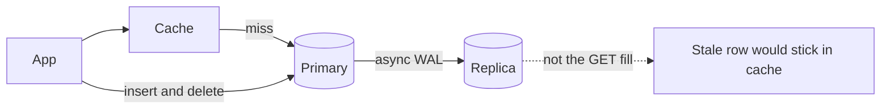
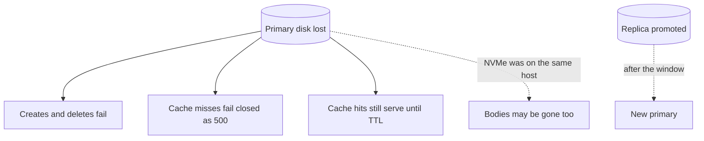

<!-- day-nav -->
[← Day 12 — SQL or NoSQL from the broken query](12-sql-or-nosql-from-the-broken-query.md) · [Day 14 — Object storage for the body →](14-object-storage-for-the-body.md)

# Day 13 — Replication and the lagging read

**Do now**

1. Set a timer.
2. Attempt the problem. Stop at the attempt line. Do not scroll.
3. Then read.

## Time box

40 minutes.

| Minutes | Do this |
|---|---|
| 0–12 | Attempt. What a replica protects, and which read you will not send to it. |
| 12–32 | Read. If every GET now goes to the replica, put the delete back on the primary path. |
| 32–40 | Say the user-visible lie a lagging replica tells, and the failover window you still have. |

## Intent

Facing a durability or read-scale wall, leave able to add replicas and refuse a lagging replica for reads that cannot lie. The replica is a fix for "the primary disk took the rows with it." It is not a place to hide the cache miss.

## Problem

> Design a pastebin. People paste text and share a link.

The interviewer says: "The primary dies. What is left of the metadata, and which reads are you willing to answer while a copy is behind?"

## Attempt before reading

12 minutes. Do not scroll. One Postgres primary on the data host. Cache-aside in front. Bodies still on that host's NVMe, which a Postgres replica does **not** copy. Peak writes about 350/s. Deletes must stop the paste at the origin.

Write:

1. The failure this replica fixes, in one sentence, and the failure it does not (the NVMe).
2. Sync or async, and what the 201 waits for.
3. The list of reads that may use the replica, and the list that must not.
4. What the user sees during promotion. Do not say "failover" without a window.

---

**Stop. One replica, used narrowly, below.**

---

## Requirements

Metadata durability is the new requirement you are willing to say out loud: losing the primary's disk must not lose every row that already returned 201. You are **not** yet promising that for the bodies. A streaming replica of Postgres does not contain `/data`. If your attempt "failed over" and then 500'd every read because the files were on the dead host, you noticed the right split. Day 14 moves the bytes. Today, do not pretend the replica is a body replica.

Reads that cannot lie:

- **A delete that has committed must not be followed by a 200** from a copy that still has the row. That is the sharp one. Expiry is different: `expires_at` is in the row, so an old copy still expires on time if the read checks the timestamp. Lag does not un-expire a paste. Lag **does** resurrect a delete, and lag **does** 404 a create that has already returned 201 if you read the replica too soon.
- The cache fill must not use a stale row to repopulate an entry the tombstone just cleared. Filling from a lagging replica is how a delete comes back for the whole TTL.

Reads that can tolerate lag, and you should say so:

- The sweeper, if it is a little behind, reclaims a bit late. It must not delete a row the primary still considers live. Running the sweeper against a lagging replica is safe **only** for selecting candidates, and the delete itself has to be a conditional delete on the primary (`delete where id = ? and expires_at < now()`). A replica that is behind might hand you an id that was just extended... you cannot extend TTLs. You refused edits. So a candidate that is expired on the replica is expired on the primary, unless clocks are wildly wrong. The dangerous direction is the opposite: the replica has not seen a brand-new row yet, so it will not sweep it, which is fine. Sweep from the replica to spare the primary the index range, then delete on the primary with the predicate. If that sentence feels tight, sweep the primary. The range is ~116 rows/s of work. You do not need the replica for capacity. You need it for **a second copy**.

You are not promising multi-region. One replica, same region, different failure domain (different host, different disk, different rack if they ask — one phrase).

## Design

**One async streaming replica.** The primary ships its WAL. The replica applies it. Create's 201 waits for the local commit on the primary, **not** for the replica to apply. You do not change the ack.

Why async: a sync commit waits for the replica on every create. That adds a network round trip to the latency you already bound by the body flush, and a dead replica then stops all creates. At 350 writes/s you can afford the wait in milliseconds, and some interviewers will push you there. The trade is availability of writes versus RPO. You choose async, and you say the RPO: **the last seconds of commits can be missing on the replica if the primary dies before they ship.** Those users got a 201 and a link. After failover, that link 404s. That is lost metadata, which will also look like `body_missing` if the file is still on the old disk and the row is not on the new primary — or the inverse, a row that made it and a file that did not, which you already 500. Say the ugly case plainly. Do not say "we replicate, so durability is solved."

Sync, if they force it: 201 waits for one replica ack. RPO for committed metadata becomes zero **for the row**, still not for the NVMe. A replica outage blocks creates or forces you to fall back to async under a named policy. Pick one policy now: if the replica is behind or down, you **keep serving reads and you stop claiming the RPO**, you do not halt the product, because this is a pastebin and a stuck create path is worse than a short RPO hole you already accepted. If you would rather halt creates than extend RPO, say that instead. Do not improvise both.

### What you refuse to read from the replica

**Cache misses for GET.** They go to the primary, as on day 10. A miss that hits the replica can fill the cache with a row that was deleted, or miss a row that was created, and then the cache makes the lie sticky for the TTL. The primary is there specifically for reads that cannot lie. The cache exists so the primary is not melted by the ones that are hits. You do not also point the miss at the replica "because the primary is busy." If the primary is busy, the fix is the hit rate and singleflight, not a stale fill.

**Delete's compare-and-remove.** The token check and the row delete run on the primary. A delete that "succeeds" on a replica is not a delete.

**Create's insert.** Obvious, and worth saying because "read replica" sometimes gets implemented as "all statements." Inserts go to the primary.

### What the replica is for

- A second copy of the rows when the primary disk dies.
- Promotion, with a window.
- Optionally the sweeper's candidate scan, with the conditional delete on the primary.
- Not the interactive read path.

One replica, not three. Quorum is a later phase. You have nothing to vote on. A second replica would be for "the replica might be the one that dies during failover," which is a real operational want and a box you can name without building a consensus lecture. You do not draw it until they ask what happens if you promote and the promoted node is behind... it is the only replica, so it is as caught up as shipping was. A second replica lets you promote the further-ahead one. Say that in a sentence if asked. Do not draw a cluster.

### Promotion, user-visible

Primary dies.

1. Apps' writes and authoritative reads fail. Cache hits still serve, until TTL, and they still enforce `expires_at`. A cache hit cannot see a delete that happened after it was filled, which you already accepted. A cache hit **can** keep the product readable for hot links while metadata is down. Cold keys 500, not 404. Do not convert "primary unreachable" into `not_found`. That hides an outage inside the contract for missing pastes.
2. You promote the replica. Planning window: **tens of seconds**, not zero. Say 30 seconds as a number they can hate. During it, creates fail, deletes fail, misses fail. Hits work.
3. Apps are pointed at the new primary. You need this switch to exist: a config or a proxy, not a hard-coded host on four app boxes that you redeploy by hand during the incident. One sentence. Do not design the control plane.
4. The old primary, if it returns with a split brain, must not accept writes. Fencing is the word. You do not explain STONITH for ten minutes. You say: a promoted replica is the only writer, and the old primary is not allowed back without a rebuild.

### The window and the tail, in numbers

**RPO as a count of links.** Async lag is usually well under a second on a healthy pair in one region. At peak writes of 350 a second, every second of lag at the moment of death is about 350 pastes that returned 201 and will 404 after promotion. At the 5 second lag alarm you would page on, that is about 1,750 links. At average traffic, about 116 per second of lag. Say the RPO as links that break, not as a duration; it is what the interviewer will ask next.

**The 30 seconds, decomposed.** Detection plus promotion plus repointing. Detection is a health check with a miss threshold: checks every 5 seconds, declared dead after three misses, about 15 seconds. Promotion and repointing the apps, about 10 to 15 more. Shorter detection is a real choice with a real cost: a two-miss threshold on a 2 second check promotes on a network hiccup, and a false promotion is how you get two primaries. You trade a longer write outage for fewer split-brain events, and for a pastebin you take the longer outage.

**What the window costs users.** At peak, 30 seconds of failed creates is about 10,500 creates (350 × 30). Reads are mostly fine for hot links on cache hits; cold links get 500. Deletes fail and must be retried by the user, which is the worst UX in the window because the person deleting is usually in a hurry.

**Shipping is not the bottleneck; apply is.** Each create writes a row and an index entry, a few hundred bytes to a kilobyte of WAL. At 350 a second that is well under 1 MB/s on the wire. The replica replays that WAL with essentially one process. At 1× it keeps up trivially. At 10× the replay, not the network, is what turns lag into a backlog.

**Sync is cheaper in latency than people think, and more expensive in availability.** A same-region round trip is a fraction of a millisecond, small next to the body fsync. The real price of sync is coupling: the replica's health becomes a create dependency. That is the sentence to say when the interviewer pushes on sync, because "it adds latency" is the weak reason and they know it.

### The old primary comes back

It holds the unshipped tail: rows that got a 201 and never reached the new primary. You do not merge them back during the incident. You rebuild the old node as a replica of the new primary, which discards that tail from the database, and you keep a copy of the discarded WAL so someone can decide later whether those pastes are worth restoring. Say "discard and record, reconcile later if at all." Merging two primaries' histories on the fly is the split brain you fenced against.

What staff sounds like here is pairing every replication word with a user count. "Async" comes with "about 350 links per second of lag." "Failover" comes with "30 seconds, about 10,500 failed creates at peak, hot reads still served." "Sync" comes with "the replica becomes a create dependency." The interviewer is not grading whether you know the modes. They are grading whether you price them.

Bodies during this window still live on the old data host's NVMe. If that host is what died, promotion of Postgres does not bring the bytes back. Reads of live rows 500 with `body_missing`. This is why the replica was not the durability story for the product. It was the durability story for the **rows**. The next day is the bytes. Do not skip ahead inside this drawing by magically moving `/data`.

## Diagrams

### What is allowed to lag

Caption it: "Writes and misses to the primary. Replica takes WAL, not reads." The dotted arrow to the banned box is the decision. If you erase it, the next person to look at the drawing will add the replica as a read source, because that is what replicas look like they are for.

### Primary disk dies

The bottom arrow is the one candidates drop. Postgres replication did not save the file.

Caption: "Rows survive with an RPO of the unshipped tail. Bytes do not survive at all." Two different RPOs on one drawing. Say both, in that order, and the interviewer hears that you know which loss is bigger.

## Failure the user sees, with a replica

**Primary dies, data host survives (process or Postgres crash only).** Detection and promotion, about 30 seconds. Creates and deletes fail. Hot cache hits serve; cold reads 500. After promotion, the unshipped tail, a few hundred links per second of lag, 404. Bodies are still on the NVMe, so every row that made it reads normally.

**Data host dies (disk and Postgres together).** Same 30 seconds of write outage, same unshipped tail. Then every read of a live row whose body was on that NVMe returns 500 with `body_missing`. The replica turned "everything is gone" into "every row survives and none of the bytes do." That is the worst user experience on this page: links that look alive and fail. It is also why day 14 exists.

**Replica dies.** Users see nothing. You have silently gone back to one copy of the rows. Page on it as a durability incident, not an availability one, because nothing will look wrong until the primary also fails.

**Replica lags past the alarm.** Users see nothing, because no interactive read uses it. RPO has grown to "the lag chart." This is the case for keeping the replica off the read path: lag stays an RPO problem and never becomes a correctness problem.

## Trade-offs

**Choice.** One async replica. 201 does not wait for it. GET misses and all writes use the primary. Replica is for promotion and for row survival. RPO is the unshipped tail.

**Alternative A.** Synchronous commit to one replica.

**What A costs.** Create latency gains a round trip, and a dead replica either halts creates or you degrade to async anyway. You buy a tighter RPO on the row only.

**Why you do not start there.** The hole you still have is the body on one NVMe. Tightening metadata RPO while the bytes have an RPO of "everything on that disk" is polishing the smaller loss. Take async, name the tail, move the bytes next. If the product later stores only metadata that must not vanish, revisit sync.

**Alternative B.** Serve cache misses from the replica to scale reads.

**Why you refuse B.** Delete and the moment after create are exactly the reads that cannot lie, and the cache will freeze whatever the replica got wrong. You already added cache-aside so the primary would not see the full 17,400. Using the replica as a second cache source reintroduces the lie the primary was kept for.

**Name the refusal inside each alternative.** Against sync (A): you refuse to make the replica's health a create dependency to tighten the RPO on the smaller loss while the body RPO is still "everything." Against replica reads (B): you refuse to let lag turn into a delete that comes back for a TTL. Against "zero-downtime failover" as a claim: you refuse a two-miss detection threshold that trades a 30 second outage for split-brain risk. Each refusal names which loss, or which lie, it would buy.

**10× break.** ~3,500 commits/s have to ship. Async replication lag becomes a backlog, not a few seconds, if the replica cannot apply WAL that fast. Then your RPO stops being "a moment" and becomes "the lag chart." The fix is a primary that can commit and a replica that can keep up, or sharding, not pointing readers at the lag to make the chart look less embarrassing. Read scale at 10× is still the cache and, later, the CDN. It is not this replica.

## Talking points

**Say.** "Async replica for the rows. The 201 does not wait for it. If I lose the primary I can lose the tail that hadn't shipped, and those links 404 after I promote. I will not fill the cache from the replica, because a lagging delete would become a 200 for a full TTL. Misses stay on the primary. And this replica does not contain the NVMe, so it is not the body durability story."

**Say.** "While I promote, planning tens of seconds, creates fail, cold reads 500, hot cache hits still serve if they haven't expired. I will not answer 404 just because the primary is down."

**Hand-waving.** "We'll have replicas, so we're fine." Fine for which copy, sync or not, and what does a delete return if the GET hits the other one?

**Hand-waving.** "Read scaling via the replica, cache aside." You built two stale paths. Pick the cache, keep the miss honest.

**Hand-waving.** "RPO zero" while the body sits on one disk. RPO of the row is not RPO of the paste.

**If they ask about read-your-writes.** The creator does not read. A friend who gets the link immediately could miss if you had sent them to a replica. You did not. The primary has the row before the 201, so the friend's GET misses, reads the primary, and sees it. That is the property you kept by refusing the lagging read.

**If they ask how many pastes you lose on failover.** "Lag times write rate. At 350 a second and sub-second lag, a few hundred links that got a 201 and now 404. At my 5 second alarm, about 1,750. That's the async price, and I'd say it to the product owner before launch."

**If they ask why not detect faster.** "I can, and I'd promote on network blips. A false promotion is two writers. For a pastebin I'd rather fail creates for 30 seconds than reconcile two histories."

**If they ask what happens to the old primary's extra rows.** "Rebuild it as a replica of the new primary, keep the discarded WAL, and decide later whether those pastes are worth restoring. I don't merge during the incident."

**If they ask what you page on.** Replica lag in seconds, past a bound you name (start at 5 seconds, change it when you have a chart). Replication broken. Failover longer than the window you told them. `body_missing` after a promotion, which means the row moved and the file did not.

## Say this in the room

One async replica, different host and disk, same region. The 201 waits for the local commit, not the replica, so the RPO is the unshipped tail: at 350 writes a second, every second of lag is about 350 links that 404 after promotion, and I page at 5 seconds. Sync would cost a fraction of a millisecond and make the replica a create dependency; I'm not paying that while the bodies still have an RPO of everything. GET misses, inserts, and deletes stay on the primary. I won't fill the cache from the replica, because a lagging delete would become a 200 for a full TTL. Failover is about 30 seconds: 15 to detect, the rest to promote and repoint. Creates fail, about 10,500 at peak, hot hits serve, cold reads 500, never 404. The old primary is fenced and rebuilt, its tail recorded, not merged. And this replica doesn't contain the NVMe: if the data host dies, every row survives and every body is gone. That's tomorrow.

## Kit artifact

One checklist row.

| Row | Lock |
|---|---|
| Lagging read | Replica is for row survival and promotion. Cache fill, get-after-delete, and create do not read it. 201 does not claim the replica has applied. |

## Design log

One line: a read your attempt sent to the replica that could lie, and what the user would have seen. If you had none, the gap is the RPO tail you forgot to say.

Next: [Day 14 — Object storage for the body](14-object-storage-for-the-body.md).

---

<!-- day-nav -->
[← Day 12 — SQL or NoSQL from the broken query](12-sql-or-nosql-from-the-broken-query.md) · [Day 14 — Object storage for the body →](14-object-storage-for-the-body.md)
