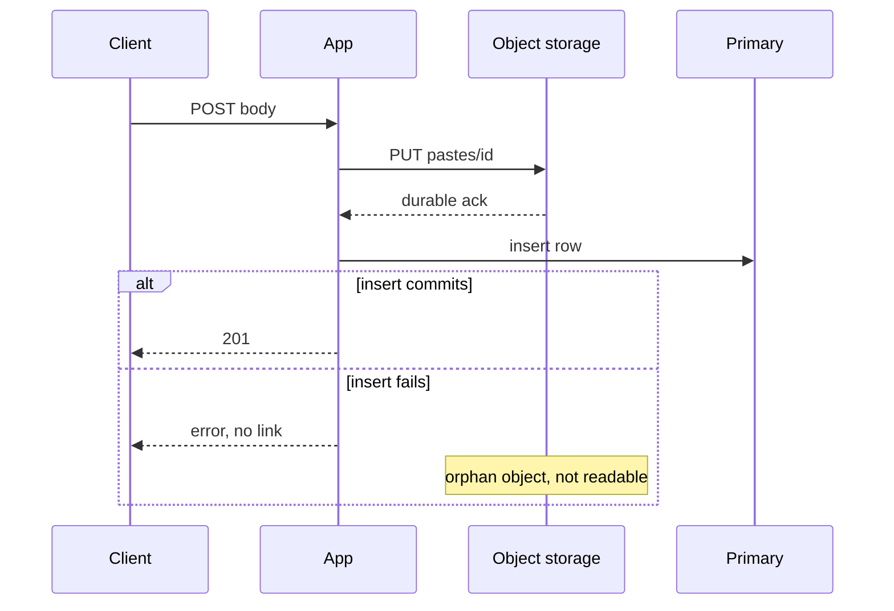
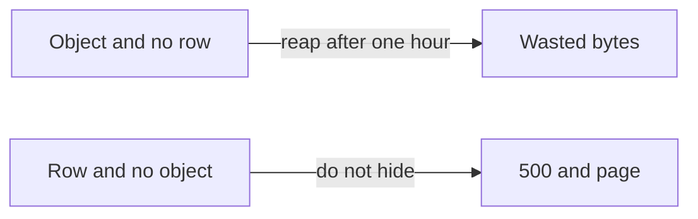

<!-- day-nav -->
[← Day 13 — Replication and the lagging read](13-replication-and-the-lagging-read.md) · [Day 15 — CDN in front of public bytes →](15-cdn-in-front-of-public-bytes.md)

# Day 14 — Object storage for the body

**Do now**

1. Set a timer.
2. Attempt the problem. Stop at the attempt line. Do not scroll.
3. Then read.

## Time box

40 minutes.

| Minutes | Do this |
|---|---|
| 0–12 | Attempt. Why the NVMe layout breaks, the new write order, and the orphan. |
| 12–32 | Read. If you delete the object before the row, walk it back. |
| 32–40 | Say the orphan case and the live-row-missing-object case as two different bugs. |

## Intent

Facing large bodies in the database — or, in this pastebin, hundreds of millions of small files that are just as stuck — leave able to move bytes to object storage and name the orphan-object failure. Object storage is the durability split day 5 deferred. It is not a new product, and it is not where the row moves.

## Problem

> Design a pastebin. People paste text and share a link.

The interviewer says: "Stop describing a directory of 450 million files. Put the bytes somewhere you can restore. Tell me what a crash in the middle leaves behind."

## Attempt before reading

12 minutes. Do not scroll. You still have `/data/{id[0:3]}/{id}` on one NVMe. Postgres, with one async replica, holds the row. Cache-aside holds metadata only. About 4.5 TB resident, about 450 million live objects, mean body 10 KB, cap 1 MB. 201 only after bytes are durable and the row commits.

Write:

1. The operation that fails on the directory even though GET latency is fine (backup, restore, or a dead disk).
2. The write order with an object store: what is durable before the insert, and when you 201.
3. The orphan: a byte object with no row. How it can happen. How you reap it without deleting a live paste.
4. What you refuse to store in the object: the delete token, the index, a public bucket with no expiry check.

---

**Stop. Bytes move. The row stays in Postgres.**

---

## Diagrams

### Write order and the orphan

### Two failures that are not the same

If a design treats both as 404, it will reap the wrong one and hide the other.

## Requirements

Same contract. The body is opaque UTF-8, at most 1,000,000 bytes. The path is not part of the API. Clients never learn a bucket name.

Durability you can now say: an acknowledged paste's bytes have a store that is not one NVMe you administer, and the row has the replica from day 13. You still do not say the paste survives every region. One region. The object store's internal replication is a dependency with a durability claim you are buying, not a protocol you are designing. One sentence: you treat a successful PUT as the durability ack the fsync used to be. If they ask "what if the vendor loses an object," the user sees `body_missing` and a page, same as a missing file. You do not invent a second copy in another cloud unless they make that the deep dive.

The mean object is 10 KB. Object storage is often described for large blobs. You are using it anyway, because **the inode and restore problem is the break**, not the size of one paste. Say that so you do not get talked into packing volumes as the only grown-up answer. Packing is the alternative below. Both beat one flat directory.

## Design

Object key: `pastes/{id}`. The id is 12-character base62 and never reused, so the key is never reused.

The bucket is private. Prefer streaming from the app at today's 174 MB/s peak, which one origin can do, so the expiry check and the byte read stay in one place.

Max body 1 MB. Multipart is how you resume a 5 GB video.

### Write order

1. Validate size, UTF-8, and the TTL allow-list. Reject before any PUT. A 413 writes nothing.
2. Mint the id. Generate the delete token. Hash it.
3. PUT `pastes/{id}` with the raw bytes. This ack replaces the group-commit fsync. Many PUTs are in flight; you are no longer under the 200/s serial fsync ceiling. Peak 350 PUTs of 10 KB is about 3.5 MB/s. That is not a storage-bandwidth problem.
4. Insert the row on the primary. On id conflict, mint again and PUT the new key. The old object is an orphan.
5. Commit. Then 201 with the plaintext token.
6. Do not warm the cache.

If the PUT fails, you do not insert, and you do not 201. No orphan from a failed PUT.

If the PUT succeeds and the insert fails, the client gets an error, not a link. The object exists and nothing points at it.

### The reaper

A loop, same status as the sweeper: not a queue, not a second platform. Do not block 201 on reaping.

Rules so the reaper does not eat a live paste:

- It only deletes an object whose id has **no row**, and whose object is older than a margin, **one hour**. The margin is larger than any in-flight create you are willing to allow, including a stuck request and clock skew between the bucket and the primary. A younger object might be a PUT whose insert has not committed. Leave it.
- It never deletes by prefix listing as the way you expire pastes. Expiry is still `expires_at` on the read, and the sweeper deletes the **row first**, then deletes the object.
- User delete: commit the row removal and the cache tombstone, return 204, then delete the object. Opposite order is the outage: a live row whose object is already gone is a 500 for every reader. An object that outlives the row is an orphan, which is the recoverable direction.
- If the object delete fails, the row is already gone, so readers 404. Retry the object delete. A leftover object is waste, not a read.

How the reaper finds orphans without listing 450 million keys on a timer: keep a small side list of ids whose PUT succeeded and whose insert did not, written only in the failure path, and also accept that a crash between PUT and that side list is why the age rule exists. You cannot `LIST` the whole bucket as your correctness path; at 450 million keys, listing is the same operational cliff as the directory walk you just escaped.

### Read order

Unchanged in shape. Cache, then primary on miss, check `expires_at`, then GET the object by id.

- No row or expired: 404. Do not GET the object.
- Live row, object missing: **500** and `body_missing`. Do not 404. Do not let the reaper be a suspect if you followed the age rule; this is loss or a bug that deleted early.
- Live row, object present: stream `text/plain` with `nosniff`.

The data host loses the NVMe. The app tier is stateless in a way day 8 wanted and could not quite have: any app can PUT and GET.

### What stays out of the object

The row, the token hash, the secondary index, the cache. Analytics.

## Trade-offs

**Choice.** Private bucket, key equals id, PUT then insert, 201 after both, reaper with a one-hour age floor, row deleted before the object on the way out.

**What you give up by choosing the bucket.** A single-machine crash story you could draw with one disk. PUT latency is now on the create path, a network hop with a planning round trip you should state (tens of milliseconds, not the 5 ms local fsync). You take the bill for 4.5 TB plus PUT/GET requests, which at this size is not the thing that changes the design, and you say so rather than pretending it is free.

**10× break.** Ingest becomes ~1 TB/day and ~45 TB resident, ~4.5 billion objects. The metadata primary's commit rate breaks earlier than the bucket's byte rate (day 24).

## Say this in the room

The break is restore of 450 million files, and a dead NVMe taking the only copy. Key is the id, bucket is private, PUT then commit the row, 201 only after both. A failed insert leaves an orphan I reap only if it is older than an hour and has no row. A live row with no object is a 500, not a 404, and not a reap. I am not doing this because 10 KB is a large object.

## Kit artifact

One checklist row.

| Row | Lock |
|---|---|
| Orphan object | PUT succeeded, row did not. Unreadable. Reap only after an age floor and a missing row. Never the reverse order on delete. |

## Design log

One line: the crash window your attempt left, and whether the leftover was an orphan or a 500. If you could not tell those apart, that confusion is the gap.

Next: [Day 15 — CDN in front of public bytes](15-cdn-in-front-of-public-bytes.md).

---

<!-- day-nav -->
[← Day 13 — Replication and the lagging read](13-replication-and-the-lagging-read.md) · [Day 15 — CDN in front of public bytes →](15-cdn-in-front-of-public-bytes.md)
