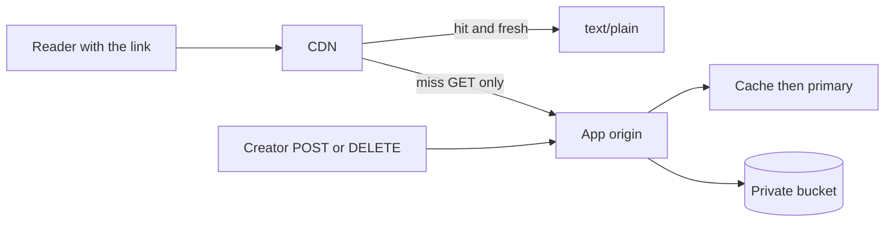
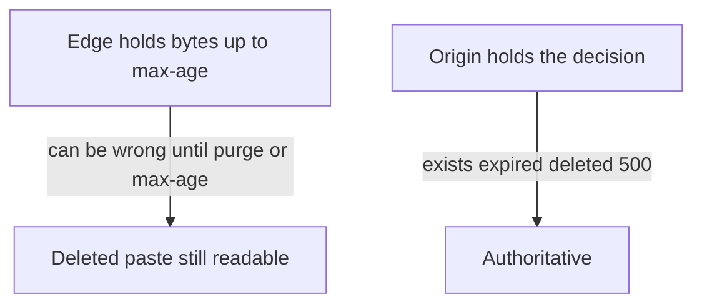

<!-- day-nav -->
[← Day 14 — Object storage for the body](14-object-storage-for-the-body.md) · [Day 16 — Queue for work the user does not wait on →](16-queue-for-work-the-user-does-not-wait-on.md)

# Day 15 — CDN in front of public bytes

## Time box

35 minutes.

| Minutes | Do this |
|---|---|
| 0–10 | Attempt. Which bytes are public, which number forces them off the origin, what must stay on the origin. |
| 10–28 | Read. If the CDN can serve a paste the origin would 404, you have a contract bug. |
| 28–35 | Say the cache lifetime and what a delete does to an edge that already has the object. |

## Intent

Facing origin bandwidth on public reads, leave able to place a CDN and say what stays origin-authoritative. The CDN is a fix for public bytes the origin should not be the one to ship. It is not where you put creates, and it is not your metadata store.

## Problem

> Design a pastebin. People paste text and share a link.

The interviewer says: "Mean-case egress fits one NIC. A single large paste that gets popular does not. Draw the edge, and tell me what the edge is not allowed to decide."

## Attempt before reading

10 minutes. Do not scroll. Bodies are in a private bucket. The app checks the row, then streams. Peak mean-case egress is about 1.4 Gbit/s. Cap is 1,000,000 bytes. One id can take a large fraction of reads (day 11 used half of peak as the hot key).

Write:

1. The bandwidth of one hot paste at the **cap**, not at the 10 KB mean. Use a read rate you state.
2. Where the CDN sits. What it caches. What request never goes there.
3. How long an edge may keep a body, and how that relates to `expires_at` and to delete.
4. What remains origin-authoritative even if the edge is perfect.

---

**Stop. The edge is a cache of public bytes, not the source of truth.**

---

## Requirements

The paste URL returns `text/plain` for anyone holding the link, until expiry or delete. That response is public **with the capability**, not public as in listed. A CDN in front of it is compatible with the product only if the edge cannot be used as a directory and cannot outlive the origin's decision by an unbounded time.

Mean-case peak, restated so you do not forget why day 3 refused this box: **174 MB/s, about 1.4 Gbit/s**, fits a 10 Gbit NIC. The CDN is not earned by the average paste.

It is earned by the hot cap. State the assumption: **2,000 reads/s of one 1 MB paste.** That is 2,000 MB/s, about **16 Gbit/s**, from a single id, while the rest of the site still exists. One origin NIC does not carry it. The metadata cache does not carry it either: day 10 refused to cache the body, correctly, because the body cache is an edge problem, not a row problem. 2,000 reads/s is not even half of peak request rate. The bytes are the break. You do not need 10× traffic to justify the box, and you should say that, because it is the first time in this phase a box shows up **before** the 10× column. The 10× column of the mean case is ~14 Gbit/s and would force the same box even if no single paste were hot.

Creates, deletes, and anything with the delete token are not public cacheable responses. They stay on the origin. A CDN that caches a POST is a bug.

## Design

The CDN sits on the **GET** path only. The origin is the app tier, not the raw bucket. The edge asks the app. The app does the cache-aside metadata check and, on an allowed read, returns the bytes with an explicit cache header. The bucket stays private so the edge is not a second, unchecked front door.

Why the origin is the app and not the bucket: the bucket does not know `expires_at`, does not know the tombstone, and will happily serve an object the row has abandoned if you point the world at it. The app is the visibility decision. The CDN caches the **decision's bytes**, briefly.

### What is cached

- `200` responses of `GET /v1/pastes/{id}`, body and the headers you already return (`nosniff`, syntax, expires-at).
- Cache key is the URL, which already contains the unguessable id. No cookies. There is no session to vary on. If you vary on nothing and you accidentally put a delete token in a query string, you have cached a secret into the edge. Do not put the token on GET.

### What is not cached

- `POST`, `DELETE`, and the 201 body that contains the delete token.
- `404`. Caching a 404 at the edge turns a create that is merely slow, or a paste that just crossed the expiry boundary the other way... creates are not visible before 201, so a cached 404 is less deadly than a cached 200. It still pins "missing" for a scanner's keys and can outlive a clock correction. Do not cache 404 at the edge. Same refusal as the metadata cache.
- `500`. An edge that caches `body_missing` will keep paging a dead paste as an outage after you repair the object. Never cache a 500.

### How long

`Cache-Control: public, max-age=<seconds>` where seconds is

`min(60, seconds until expires_at)`.

Sixty seconds is a cap you choose so a delete has a bound even before a purge runs. It is the same order as the metadata TTL, on purpose: you do not invent a second, longer memory at the edge. If the paste expires in 10 seconds, max-age is 10, not 60. The edge is not allowed to serve past the product deadline just because its object is warm.

A deleted paste can still be served by an edge that fetched it 30 seconds ago, until max-age or until a purge. **That is the user-visible lie.** The origin is authoritative immediately after the row commit: a request that reaches the app 404s. A request that hits a warm edge does not. You say this before they "catch" you. The bound is 60 seconds plus purge lag. Purge is work the user who issued DELETE should not wait on forever; day 16 puts purge on a queue. Today, name the purge as a call you make after the row commit, and accept that it can fail. The max-age is what makes a failed purge survivable.

Do not set max-age to the full remaining paste TTL (up to a year). You would be unable to delete in any sense a human means, and a mistaken fill would live as long as the paste.

### What stays origin-authoritative

- Whether the id exists, is expired, or is deleted.
- The delete-token check.
- The decision to 500 on a missing object.
- Rate limits, when you add them.
- The row and the bucket. The CDN is not a replica of either. If the edge loses the object, the next reader comes back to the origin. Nothing durable lived only at the edge.

Immutable bodies are why this works at all. You refused edits on day 2. If you had allowed replace-in-place, every CDN entry would be a stale version with no natural bound other than max-age. A new id for a new paste is the invalidation strategy you already chose. Do not add edit now because the CDN "supports purge."

### Origin load after the edge

You do not get to claim a hit rate you have not labeled. For the hot paste that forced this box, the steady state after the first fill is **one origin read per edge per max-age**, not 2,000 reads/s. Say it that way. A cold start or a purge sends the herd once; singleflight on the app still applies. You will put a number on the average hit rate on day 21, in the open. Today the justification is the hot cap, which does not depend on a site-wide 95%.

## Diagrams

Mermaid stands in for the whiteboard. SVG figures come later; do not wait on them.

### What the edge may answer

The writer does not go through the cacheable path. If your arrow from POST ends at the CDN as a stored response, erase it.

### Authority

The lie is a trade you are making for 16 Gbit/s you cannot push from one NIC. Name it.

## Trade-offs

**Choice.** CDN on GET only, origin is the app, max-age capped at 60 seconds and at the remaining TTL, no cached 404 or 500, bucket private, purge on delete.

**Alternative.** A bigger origin NIC and more app processes, streaming from the bucket, no edge. Or a public bucket with the object URL as the paste URL.

**What you give up.** Delete is no longer instantaneous for every reader in the world. Some of them are talking to an edge. You take a dependency that can serve stale bytes, and you take a purge mechanism that can fail. You also take cache-key discipline: one accidental cookie or token on the URL and you have either a useless cache or a leaked secret.

**Why not only a bigger origin.** 16 Gbit/s for one paste is a real number, and 10× of the mean case is another. You can buy NICs and still be the wrong place to fan bytes out to readers who are not in your region. You are one region by requirement. The edge is how readers far away do not all pull from that region. Even inside the region, the hot key's bytes are not the app tier's job.

**Why not a public bucket.** You lose the 404 rule, the delete, the expiry check, and `nosniff` as something you control. The object store's own cache is not a substitute for that decision.

**10× break.** Mean-case peak egress ~14 Gbit/s, and the hot cap scales too if the audience does. The CDN is the component you are now trusting to absorb that. The break moves to **purge lag and max-age on a viral delete**: 60 seconds of a paste the world is reading is a lot of copies. You do not fix that by setting max-age to zero; that deletes the CDN. You fix a truly must-vanish paste by purging and by having refused to cache for longer than 60 seconds. If the product cannot tolerate that minute, this pastebin cannot use a CDN, and you are back to buying origin bandwidth. Say the condition. Do not pretend the edge is free of product meaning.

## Talking points

**Say.** "Average egress, 1.4 Gbit/s, does not need this. Two thousand reads a second of a 1 MB paste is about 16 Gbit/s, and that does. The CDN caches GET bodies only. The app stays authoritative for expiry, delete, and the missing-object 500. Max-age is the minimum of 60 seconds and the time left on the paste. I will not point the CDN at a public bucket."

**Say.** "A delete is immediate on the origin and late at the edge, bounded by that max-age if purge fails. I am telling you the lie before you ask. Edits don't exist, so I am not versioning bodies."

**Hand-waving.** "We'll put Cloudflare in front." In front of which methods, with what max-age, and can it outlive a delete?

**Hand-waving.** "Cache forever, the content is immutable." Immutable until delete and until expiry. Forever is how a taken-down paste becomes permanent off-site.

**Hand-waving.** "The CDN is the durability layer." It is not. Durability is the bucket and the row. An edge eviction is a miss, not data loss.

**If they ask about the first reader after publish.** They miss, hit the app, fill the edge. The creator does not go through the CDN for the 201. A friend who clicks immediately may still miss. That is fine. You do not pre-warm hundreds of edges on create.

**If they ask what you page on.** Origin egress back at the full hot-key rate, which means the edge is not hitting. Purge failures. A rise in 200s from the edge for ids the origin 404s, sampled, not imagined. Not the CDN's internal map.

## Kit artifact

One checklist row.

| Row | Lock |
|---|---|
| CDN | Public GET bytes only. Origin stays authoritative for visibility. A number caps how long the edge may be wrong after delete. |

## Design log

One line: the bandwidth that earned the CDN in your attempt, and how long after delete a reader could still see the body. If you had no duration, that is the gap.

Next: [Day 16 — Queue for work the user does not wait on](16-queue-for-work-the-user-does-not-wait-on.md).

---

<!-- day-nav -->
[← Day 14 — Object storage for the body](14-object-storage-for-the-body.md) · [Day 16 — Queue for work the user does not wait on →](16-queue-for-work-the-user-does-not-wait-on.md)
