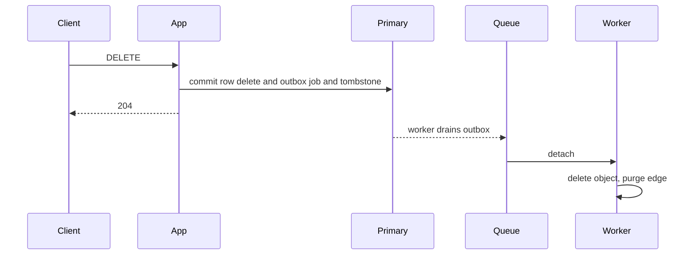
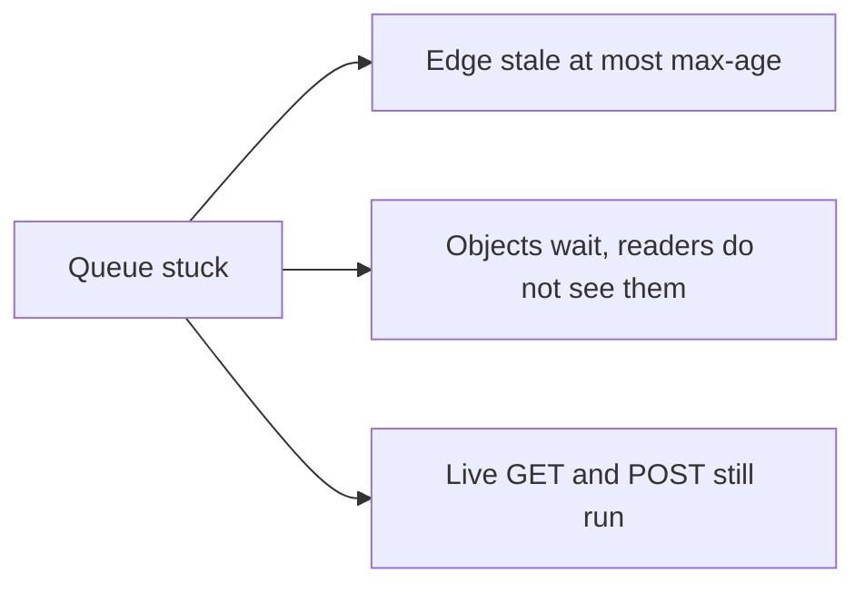

<!-- day-nav -->
[← Day 15 — CDN in front of public bytes](15-cdn-in-front-of-public-bytes.md) · [Day 17 — Rate limits and abuse →](17-rate-limits-and-abuse.md)

# Day 16 — Queue for work the user does not wait on

**Do now**

1. Set a timer.
2. Attempt the problem. Stop at the attempt line. Do not scroll.
3. Then read.

## Time box

35 minutes.

| Minutes | Do this |
|---|---|
| 0–10 | Attempt. List the work after 201 or 204. Say which of it the user is staring at. |
| 10–28 | Read. If the queue is on the create path, take it off. |
| 28–35 | Say the backlog a user can actually see, in seconds or in bytes, not as "eventual." |

## Intent

Facing work that should not block the response, leave able to add a queue and describe the backlog the user can see. The queue is a fix for purge, reap, and unlink. It is not a place to hide the durable write.

## Problem

> Design a pastebin. People paste text and share a link.

The interviewer says: "Delete returns 204 and then you still have to purge the edge, drop the object, and finish the tombstone. The user is not going to wait for all of that. What waits, and what do readers see while it waits?"

## Attempt before reading

10 minutes. Do not scroll. PUT-then-commit is the create path. Delete commits the row before the object goes away. The CDN may serve a deleted paste until max-age, which you capped at 60 seconds. A reaper cleans orphans older than an hour.

Write:

1. The steps that must finish before 201, and the steps that must finish before 204.
2. The steps you would move to a queue, and why a failure of the queue must not lose the paste or resurrect it.
3. What at-least-once delivery does to a purge and an object delete. Are they safe twice?
4. The backlog, as something a user or an operator can see: a delay, a bill, or a stale read. Not "the lag metric" with no unit.

---

**Stop. The queue is beside the request, not under it.**

---

## Requirements

The user waits for two things only:

- **Create:** the link, which means the object PUT has acked and the row has committed. If you enqueue the body and 201 first, you have handed out a URL to bytes you might lose when the worker dies. That is the ack-before-durable lie from day 5, with extra machinery.
- **Delete:** the origin will not serve the paste, which means the row commit and the cache tombstone have happened. You already return 204 after those. The object delete and the CDN purge can lag.

Reads wait for the origin or the edge, not for a worker.

So the queue is allowed to own:

- CDN purge after delete.
- Object delete after the row is gone.
- Orphan reap (the failure-log ids from day 14, plus the age floor).
- The sweeper's object-unlink half, after the row delete has committed on the primary. The decision "this row is expired" can stay a primary query. The slow half is the object and the purge.

The queue is not allowed to own the PUT or the insert.

Steady-state rate of this work is about **116 jobs a second** average, the same order as creates, once retention is full, plus a trickle of orphans. Peak deletes if someone scripts them: you still have the write peak shape, hundreds per second, not millions. This queue is not a firehose. Do not design it like one. One partition, a handful of consumers. The break you are fixing is **coupling and retries**, not throughput.

## Design

One queue. Two job types are enough: `detach` (row is already gone: delete object, purge CDN, tombstone if the request path did not already write it) and `reap` (id from the failure log, delete object only if the row is still absent and the object is old enough). The sweeper enqueues `detach` after it deletes the row. The DELETE handler enqueues `detach` after it commits and writes the tombstone. Create's failure path enqueues `reap`.

The handler returns 204 after commit and tombstone, once the enqueue has been accepted. Here is the small honesty: **enqueue can fail.** If you 204 anyway, the object leaks until a backup sweep notices, and the edge lives until max-age. That is acceptable if you say it: max-age is 60 seconds, so a lost purge does not leak forever, and a leaked object is waste. If you wait for enqueue and it is down, delete latency tracks the queue, which is the coupling you added this box to avoid. Choice: 204 after the row and the tombstone, and **also** write the job to a row in Postgres in the same commit as the delete (a tiny outbox table: id, job type). A worker drains the outbox onto the queue, or just does the work. If the queue is gone, the outbox still has the job.

That is an outbox in miniature. You do not need the full sermon. You need one sentence: the job is durable in the same commit as the row delete, so a lost process cannot forget to detach. The queue is how you retry and how you keep the work off the request thread. If writing that sentence feels like day 39, good — you are allowed to use the idea early because the failure is in front of you. Do not dual-write "delete the row" and "publish to the queue" with no shared commit. That is how jobs vanish.

### At least once

Consumers will see a job twice. Both job types are safe twice:

- Object delete of a missing key succeeds.
- CDN purge of an already-purged URL succeeds.
- Tombstone set twice is a tombstone.
- Reap checks "no row and old enough" again before deleting. A duplicated or late reap cannot hit a new paste, because ids are never reused. **This is why never-reuse is a queue property, not only an id property.** If you recycled ids, a delayed reap would delete the next user's body. Say that.

You do not need exactly-once. You need idempotent jobs and a key space that does not recycle.

### The backlog the user can see

Be specific.

| Backlog | Who sees it | Bound |
|---|---|---|
| Purge lag after delete | A reader who hits a warm edge | max-age, at most 60 seconds, even if the queue is stuck. If the queue is healthy, purge is usually faster. The user-visible contract becomes: origin is immediate, edges within 60 seconds. |
| Object-delete lag | Nobody reading. The bucket bill, and an operator. | The queue depth times the job rate. At 116/s, a one-hour stall is about 400,000 objects waiting, on the order of a few GB at the mean size, not a new tier. |
| Reap lag | Nobody reading, by construction. | The one-hour age floor already dominates. A slow reaper delays waste cleanup, not correctness, as long as it keeps the age check. |
| Queue outage | Creators and readers of existing live pastes: **not blocked**, if you kept PUT and GET off the queue. Delete still 204s. Edges heal on max-age. | This is the point of the box. |

What the user must not see: a 201 whose body 404s because the worker has not PUT yet. If your backlog includes "pastes not durable yet," you put the wrong work on the queue.

There is no user-facing "your paste is processing" page. This product's async work is cleanup. Do not invent a progress bar.

### What you still refuse

A queue of creates "to smooth the peak." Peak writes are ~350/s. Smoothing them behind a worker means the client waits on a worker anyway, or you ack early. Both are worse than a PUT at 3.5 MB/s.

Kafka-shaped machinery, consumer groups as a tour, exactly-once transactions across the bucket and the database. One log or one managed queue with retries and a dead-letter after N tries is the whole design. Dead-letter is how a poison job (a purge that will never succeed because the id is malformed) does not block the 116/s behind it. Page on dead-letter depth. Do not page on queue depth for user-visible staleness: the edge cap already bounds that at 60 seconds whatever the depth. Page on dead-letter and on outbox age, so a stuck worker is visible even when users are not.

### Details that decide whether the queue is boring

**Expiry does not need a purge.** Day 15 set `s-maxage` to the minimum of 60 seconds and the time left on the paste. An expired paste has already aged out of every edge by the time the sweeper sees it. So `detach` from the sweeper is object delete only; `detach` from a user DELETE is object delete **and** purge. That cuts purge volume from about 116 a second to the user-delete rate, which is a small fraction of it. It matters because CDN purge APIs are rate-limited per account, and a design that purges every expiry is the one that discovers that limit in production.

**Order inside a job does not matter.** The row is gone before the job exists. Purge first, then object: an edge miss reaches the origin, which 404s. Object first, then purge: same. The decision already happened in the commit; the job only removes copies. That is why the job can be retried in any order and split across workers without a lock.

**The outbox costs the primary writes.** Every delete, user or sweeper, now inserts an outbox row in the same commit, and the drainer later deletes it. At average rates that is creates (116) plus row deletes (116) plus outbox inserts (116) plus outbox deletes (116): about 460 writes a second instead of about 230. At peak, roughly 1,400. Still fine for a group-committing primary, and still worth saying, because the queue's durability was paid for on the primary, which is the 10× worry already. Drain in batches: poll every second, take up to a few hundred rows, delete them in one statement.

**Retries have a shape.** Exponential backoff with jitter, a visibility timeout longer than the slowest honest purge call, and about eight attempts spread over an hour before dead-letter. The hour is chosen on purpose: a CDN purge API outage of a few minutes heals without a human, and a malformed id reaches dead-letter before it has cost much.

What staff sounds like here is shrinking the queue's job until it is boring. Expiry doesn't purge. Order doesn't matter. Jobs run twice safely. The outbox lives in the commit, and its cost is named on the primary. A senior answer adds a queue and describes its features. A staff answer explains why the queue has almost nothing to get wrong.

## Diagrams

### What the response waits for

The 204 is above the queue on purpose. If your 204 is the last arrow, the user is waiting on the worker.

Caption it: "204 after the commit. Everything below the 204 is copies, not decisions." Label the commit arrow with all three things it carries, row delete, outbox job, tombstone, because "one commit" is the guarantee and three separate arrows would draw a dual write.

### Backlog versus correctness

Caption: "A stuck queue costs a minute of edge staleness and some bytes. It never costs a paste." If any arrow out of "Queue stuck" ends at a 201 or a GET of a live paste, the wrong work is on the queue.

## Failure the user sees, with cleanup off the request

**The queue service is down.** Creates, reads, and deletes all succeed; jobs pile up in the outbox table, where they are durable. Deleted pastes leave edges within 60 seconds anyway. Objects wait in the bucket. Users see nothing. The operator sees outbox age climbing. When the queue returns, the drainer catches up at whatever rate the workers allow.

**The outbox drainer is stuck.** Same user picture, but now nothing is moving and the queue looks healthy and empty. This is the sneaky one: queue depth is zero and the work is not happening. Page on outbox age, the oldest unprocessed row, not on queue depth.

**A poison job.** One malformed id fails every time. Without dead-letter, it is retried forever and, on a single partition, blocks everything behind it; purges stop landing and objects stop being deleted. With dead-letter after about eight tries, it is parked within the hour and the rest flows. Users see nothing either way, because the edge cap bounds staleness. Page on dead-letter depth above zero.

**The CDN purge API rate-limits you.** Purges slow down, retries back off, the job takes longer. The edge cap still bounds what readers see. This is why expiries do not purge: the budget is spent only on user deletes.

**A worker deletes an object for a live row.** The only way is a bug that skips the "row is gone" precondition. Readers of that paste see 500 with `body_missing`. That is why the worker checks the row before the object delete, every time, even though the row was gone when the job was written.

## Trade-offs

**Choice.** Outbox row in the delete commit. Queue plus worker for object delete, purge, and reap. Jobs idempotent. Ids never reused. Create stays synchronous.

**Alternative.** Do the purge and the object delete inside the DELETE request, no queue. Or ack the create before the PUT and "let the queue catch up."

**What you give up.** An outbox table and a worker you must run. Delete's origin work is still synchronous (the commit); only the fan-out is async. You accept up to 60 seconds of edge staleness, which you already accepted when you set max-age. The queue did not invent that lie. It stops the request from getting longer than the lie.

**Why not inline.** A slow CDN purge API on the delete path makes every delete as slow as the most unhappy edge, and a hung purge call ties up an app process. You have four processes and a 5 second drain budget. A stuck purge during deploys will burn that budget and start cutting unrelated requests.

**Why not async create.** The product is the link. A link that 404s until a worker runs is a broken product, not a backlog. There is no user-visible "processing" state in the requirements, and you should not add one to justify the queue.

**Name the refusal inside each alternative.** Against inline cleanup: you refuse to let the slowest CDN purge set the latency of every delete and burn the drain budget. Against async create: you refuse to hand out a link to bytes a worker might lose. Against a bare publish to the queue with no outbox: you refuse a dual write that drops jobs when a process dies between the commit and the publish. Against exactly-once machinery: you refuse to pay for a guarantee idempotent jobs already make unnecessary. Each refusal names the failure it would invite.

**10× break.** ~1,160 cleanup jobs/s average, a few thousand at a peak. Still one queue. The break is a poison job or a worker that cannot call purge fast enough, so outbox age grows. Readers of deleted viral pastes see the max-age bound, not the full outbox age, **only** because you capped the edge. If you had cached for a year, 10× would make the queue the product's correctness. The cap is what keeps this box a cleanup tool at 10×. The primary's commit rate is still the tighter 10× worry, because every delete and every create commits there, queue or not.

## Talking points

**Say.** "The user waits for PUT and row commit on create, and for row delete plus tombstone on delete. Purge, object delete, and orphan reap go through an outbox in that same commit, then a queue. Doing the job twice is safe. Reusing an id is not, because a late reap would delete the next paste. If the queue is down, creates and reads still work. A deleted paste can live on an edge for at most 60 seconds."

**Say.** "I am not queuing the create. That would be an early ack. The backlog I will defend is edge staleness and leftover objects, not missing bodies."

**Hand-waving.** "We'll put it on Kafka for scale." Scale relative to 116 jobs a second? Name the retry and the poison message. The brand is not the backlog.

**Hand-waving.** "Eventual consistency between the row and the object." On delete, the row is ahead and the object is leftover: safe. On create, the object is ahead and the row is missing: an orphan, also safe, as long as you never 201 in that state. Eventual is not a license to reorder the ack.

**If they ask what the user sees if workers are an hour behind.** Live pastes: normal. A just-deleted paste: gone on the origin, maybe present at an edge for the first minute, then gone even without the worker, because max-age elapsed. The bucket is fatter by the hour's objects. You alarm on outbox age so "an hour" is not how you find out.

**If they ask whether expiry purges the CDN.** "No. The edge max-age is never longer than the time left on the paste, so an expired paste has already aged out. Only user deletes purge. That keeps purge traffic well under the provider's rate limits."

**If they ask what the outbox costs.** "An insert in the delete commit and a delete when it drains. That roughly doubles writes from about 230 to about 460 a second at average. The primary can take it, and it's the same primary I'm watching at 10×."

**If they ask how you'd know the worker is stuck.** "Outbox age, oldest unprocessed row. Queue depth can be zero while nothing moves if the drainer is the thing that's stuck."

**If they ask exactly-once.** "I don't have it and I don't need it. Idempotent deletes, ids never reused, a dead-letter for jobs that fail N times."

## Say this in the room

The user waits for the PUT and the row commit on create, and for the row delete plus tombstone on delete. Nothing else. Object delete, purge, and orphan reap are written to an outbox row in the same commit, then drained to a queue. Jobs are copies-removal, so order doesn't matter and running one twice is safe. Ids are never reused, so a late reap can't hit a new paste. Expiry doesn't purge, because the edge max-age never outlives the paste; only user deletes do, which keeps purge under the provider's limits. Retries back off over about an hour, then dead-letter. If the queue is down, creates and reads work, deleted pastes leave edges within 60 seconds, and objects wait. I page on outbox age and dead-letter depth, not queue depth. I'm not queuing the create: that's an early ack with extra machinery.

## Kit artifact

One checklist row.

| Row | Lock |
|---|---|
| Queue | Only work the response does not need. Backlog stated as edge delay or leftover bytes. Create is not on the queue. Jobs are safe to run twice. |

## Design log

One line: the work you put on the queue, and the user-visible backlog in one phrase. If create was in the queue, that is the gap.

Next: [Day 17 — Rate limits and abuse](17-rate-limits-and-abuse.md).

---

<!-- day-nav -->
[← Day 15 — CDN in front of public bytes](15-cdn-in-front-of-public-bytes.md) · [Day 17 — Rate limits and abuse →](17-rate-limits-and-abuse.md)
