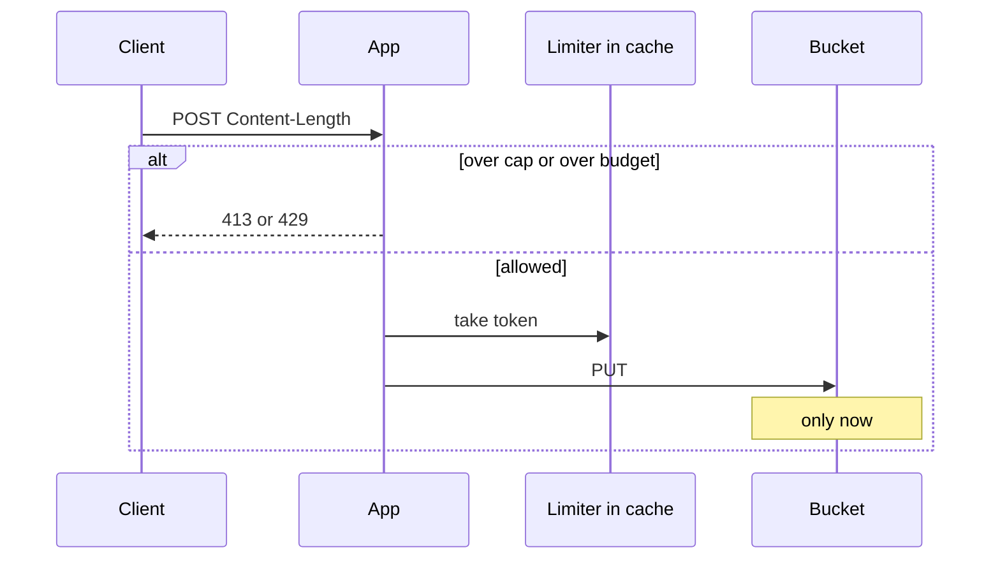
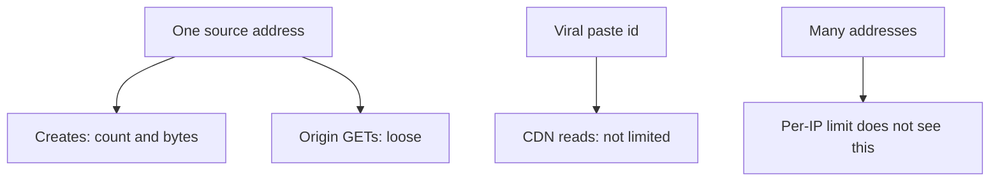

<!-- day-nav -->
[← Day 16 — Queue for work the user does not wait on](16-queue-for-work-the-user-does-not-wait-on.md) · [Day 18 — Consistent hashing when nodes change →](18-consistent-hashing-when-nodes-change.md)

# Day 17 — Rate limits and abuse

## Time box

35 minutes.

| Minutes | Do this |
|---|---|
| 0–10 | Attempt. Where the limit sits, what it counts, and what it refuses to count. |
| 10–28 | Read. If the limit is after the PUT, it is a bill you already paid. |
| 28–35 | Say the 429 path and the one abuse case a per-IP limit will not see. |

## Intent

Facing a public write API, leave able to put rate limits and abuse control on the path before the expensive store. The limiter is a fix for a client who can spend your PUT budget. It is not a classifier, and it is not a moral stance about viral reads.

## Problem

> Design a pastebin. People paste text and share a link.

The interviewer says: "Creates are anonymous. What stops one caller from writing a terabyte before lunch, and where do you stop them?"

## Attempt before reading

10 minutes. Do not scroll. A create is a PUT of up to 1 MB plus a row insert. Average ingest is 100 GB/day because you assumed 10 million honest pastes, not because the API enforces that. The bucket is private. The CDN serves hot reads.

Write:

1. The expensive thing you must not do for a rejected create (name the call).
2. A limit with units: per who, how many, burst or not. Tie the global ceiling to the ~350 writes/s peak you already designed for, not to a new fantasy QPS.
3. Whether reads of a shared link are limited the same way. They should not be, or you need a reason.
4. What you will not build: a malware model, an account system, a reputation graph.

---

**Stop. A token bucket in front of the PUT, below.**

---

## Requirements

Abuse control here means: the storage and the primary cannot be filled by one source faster than the plan you stated, and a rejection does not look like a successful paste or like a missing one.

It does not mean: you detect hostile text. The body is untrusted UTF-8 you already refuse to render. Scanning it for malice is a different product, and it is not this course. You do not add a classifier on the write path "for safety." Safety you can defend in this hour is the cap, the content-type, the unguessable id, and the limit.

There are still no accounts. The tenant you can actually key on is the **source address**, and it is a bad tenant. Carrier-grade NAT puts a stadium behind one address. A botnet uses a million addresses. You say both limits of the idea before you sell it. A per-IP limit cuts the single noisy host and the script on one VM. It does not cut a distributed flood, and it will cut a university if you set it like a home broadband line. That is the trade, not a bug you discover after launch.

Reads are the product. A popular paste is supposed to be fetched many times, ideally from the CDN, without the author's fans presenting a token. You do not put the create budget on GET.

## Design

The check runs on the app, **after** you know the request is a create, **before** you buffer the full body if you can help it, and **definitely before** PUT and before the primary insert.

Order:

1. Read `Content-Length`. If it is missing, or greater than 1,000,000, reject. 413 for too large, 400 for a length you cannot bound. You do not accept a chunked body of unknown size into memory and "check later."
2. Ask the limiter. If it says no: **429**, with `Retry-After`. Nothing is written. No id is minted. No orphan, because no PUT.
3. Only then read the body, validate UTF-8 and the TTL, mint, PUT, insert, 201.

Why before the body is fully read: a 1 MB upload you intend to reject is still 1 MB of bandwidth. You cannot refuse the bytes already on the wire, but you can refuse to read past the cap, and you can refuse the PUT. The expensive store is the bucket and the primary, not the NIC you already spent. Be honest about that. The limit is not free. It is cheaper than 4.5 TB of junk and a primary full of rows you must sweep.

### Budgets you can say

These are assumptions, as visible as the 3× peak. They are not measurements of abusers.

| Bucket | Key | Rate | Burst | Why this number |
|---|---|---|---|---|
| Create count | source IP | **1 per second** sustained | **10** | A human pastebin session is not 10 creates a second for a minute. A script is. 1/s is 86,400 a day from one IP, which is already a lot of text and still under 1% of daily ingest if the mean holds. |
| Create bytes | source IP | **100 KB/s** sustained | **2 MB** | Stops the 1 MB cap from being used as a disk filler at the count limit. At 1 create/s of 1 MB, the count limit alone still allows 86 GB/day from one IP. The byte bucket is what makes "1 per second" not equal to "1 MB per second." |
| Global creates | whole service | **350 per second** | small | This is the peak you sized. Above it, more creates are not "success the limiter should allow." They are overload. Shedding them is day 19. The limiter is where the 429 happens. |

429 is not 404 and not 500. The client can retry later. The body tells them it was a limit, not a missing paste. Do not reuse `not_found`.

Shared state for the buckets lives in the **cache tier you already have**, not in the memory of one app process. Three processes with three private counters allow three times the limit, and a round-robin (you are on least connections, which is worse) lets a client hunt for the empty bucket. One key `rl:{ip}` with an atomic increment and an expiry. If the cache is down, pick a policy and say it: **fail open on the per-IP buckets, fail closed on nothing you cannot compute, and keep the global cap conservative.** A dead cache that rejects every create is an outage the limiter invented. A dead cache that allows the per-IP burst until the global 350/s cap still bounds the cluster. Fail open per IP, enforce a coarse global counter in the primary only if you must... actually a global counter in the primary on every create is a write you do not want. Coarse approach: each app allows a local share of the global cap (350/3, with slack) when the cache is down, and pages. Good enough. Do not stop the product because the limiter's store blinked.

### Reads

A separate, loose ceiling per IP on origin GETs, not on CDN hits. You cannot see CDN hits per IP in the app, and you should not pretend to. Origin GET limit exists to stop a scanner from walking ids and to stop a client from using you as a proxy that misses the CDN on purpose (cache-busting query strings — you ignore unknown query strings and you do not vary the cache key on them).

Planning number: **50 origin GETs per second per IP.** A real reader is on the CDN after the first miss. Fifty is enough for a cold client and useless for scraping 450 million ids, which was already hopeless because the id space is 62^12. The limit is for cost, not for secrecy. Enumeration is not the threat. Cache-busting and forced misses are.

You do **not** rate-limit a paste id's successful CDN reads. That is the viral paste. Limiting it punishes the product. The origin is protected by singleflight and the edge, not by telling the audience to stop.

### What else sits before the store

- Body cap, already there.
- TTL allow-list, already there.
- UTF-8 check, after you have the bytes, still before PUT. Invalid text does not get an object.
- A minimum size? No. Empty pastes can be 400 if you want; they are not the cost problem.

No account lockout, no captcha theater unless they ask. If they ask where a challenge would go: on create, after the limiter, before the PUT, and only for the IP already over a suspicious-but-not-banned rate. It is still not a classifier over the paste text. You can decline to design the challenge. "A hook on create, before the durable write, same place as the 429" is the whole answer.

## Diagrams

Mermaid stands in for the whiteboard. SVG figures come later; do not wait on them.

### Reject before the expensive call

### Who is limited

The bottom box is part of the answer. A limiter you describe as complete, while keyed only on IP, is hand-waving.

## Trade-offs

**Choice.** Per-IP token buckets for create count and create bytes, enforced before PUT, state in the shared cache, global ceiling at the 350/s peak you already planned, loose origin-GET ceiling, no limit on CDN hits of a hot id.

**Alternative.** One global limit only, or a limit after the object is stored ("delete it if they were bad"), or accounts so the tenant is a user.

**What you give up.** Some NATed users will share a budget and get 429s they did not earn. Some attackers with many IPs will walk under the per-IP floor and you will only stop them at the global 350/s, which means they can consume the entire honest peak. You accept that a pastebin without accounts cannot name a human. You also accept limiter state in the cache: a flushed cache resets budgets, and a client can burst again. That is a nuisance, not a durability bug.

**Why not accounts.** Day 2 refused them. They would make the key better and the product a user system. You may say "the limit key becomes the account id if we ever have one." You do not build login today to make the bucket fairer.

**Why not limit-after-write.** You already paid for the PUT and the row, and the reaper is not an abuse system. Cleanup is not admission control.

**10× break.** The global ceiling becomes ~3,500/s if honest traffic grew, and you must move the number with the plan, not leave 350 in the config and 429 the real users. The per-IP numbers do not automatically 10×. A single abusive IP at 10× the site is still one IP; you do not give them 10× the budget because the site grew. The break is the **distributed** abuser, who at 10× of attack also looks like 10× of product. You cannot tell those apart without a tenant. Say that. The next control is a higher layer (account, payment, or a challenge), not a more precise token bucket.

## Talking points

**Say.** "429 before PUT. Per IP, about one create a second with a small burst, and a byte budget so they can't post the 1 MB cap at that rate all day. Global cap at the 350 a second I sized the write path for. State lives in the cache, otherwise three apps are three budgets. I do not rate-limit a viral read at the CDN. I do not scan the text."

**Say.** "Per-IP misses a botnet and punishes a NAT. That is the trade for having no accounts. I'm not adding accounts to fix abuse in this hour."

**Hand-waving.** "We'll use a WAF." A WAF is a place the 429 might live. It is not the budget, and it is not allowed to be the only copy of the rule if creates can also reach the app directly. The check has to be on the path that can PUT.

**Hand-waving.** "Machine learning on the payload." Out of scope, and it sits after you have the bytes. The rejection you can afford runs before the store.

**Hand-waving.** "Fail closed if Redis is down." You just made the cache a hard dependency for creates, which means a cache flush stops the write path. Fail open on the per-IP bucket, keep a coarse global split, page.

**If they ask about the delete token endpoint.** Delete is limited loosely per IP so nobody uses it to grind the primary. It is not the expensive path. Do not spend the design there. A wrong token is a 404, same as before, so the limit is about rate, not about leaking existence.

**If they ask what you page on.** 429 rate as a fraction of creates, sudden changes, not the existence of some 429s. Global cap saturated for more than a blip, which is either attack or under-sizing. PUT bytes per day versus the 100 GB assumption. Not "any abuse."

## Kit artifact

One checklist row.

| Row | Lock |
|---|---|
| Admission | Limit sits before the durable write. Key and units are spoken. Viral reads are not the thing you throttle. No content classifier. |

## Design log

One line: where your limit sat relative to the PUT, and one bypass you already know (NAT or many IPs). If the limit was after the write, that placement is the gap.

Next: [Day 18 — Consistent hashing when nodes change](18-consistent-hashing-when-nodes-change.md).

---

<!-- day-nav -->
[← Day 16 — Queue for work the user does not wait on](16-queue-for-work-the-user-does-not-wait-on.md) · [Day 18 — Consistent hashing when nodes change →](18-consistent-hashing-when-nodes-change.md)
