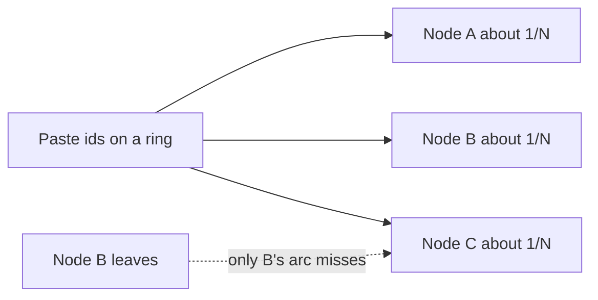
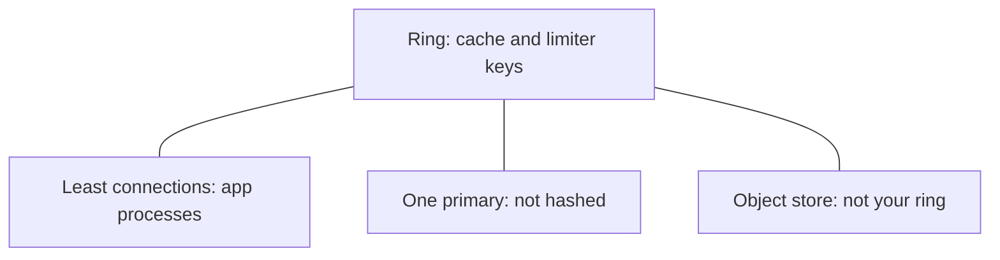

<!-- day-nav -->
[← Day 17 — Rate limits and abuse](17-rate-limits-and-abuse.md) · [Day 19 — Backpressure and load shedding →](19-backpressure-and-load-shedding.md)

# Day 18 — Consistent hashing when nodes change

## Time box

35 minutes.

| Minutes | Do this |
|---|---|
| 0–10 | Attempt. A node joins or leaves. What fraction of keys move, under modulo and under a ring. |
| 10–28 | Read. If you hashed the app tier, undo it. The app tier is not the ring. |
| 28–35 | Say when a fixed slot map is the simpler tool, in one sentence you could defend. |

## Intent

Facing cache or storage nodes that come and go, leave able to use consistent hashing and say when a fixed slot map is simpler. The ring is a fix for a membership change that would otherwise dump the keyspace onto the primary. It is not a default for every tier.

## Problem

> Design a pastebin. People paste text and share a link.

The interviewer says: "You have one cache node. You need several, and you will replace them. What happens to the keys when the count changes?"

## Attempt before reading

10 minutes. Do not scroll. The cache holds metadata by paste id, TTL jittered around a minute, tombstones on delete. The primary's read ceiling is about 15,000/s. Three app processes sit behind least connections. They are not keyed by paste id.

Write:

1. What `hash(id) % N` does when N goes from 4 to 5. A fraction is enough; derive it if you can.
2. What a ring does to that fraction when one node joins.
3. Whether a lost cache node loses pastes, or only hit rate.
4. The tier you would **not** put on a ring (the app processes, the single primary).

---

**Stop. The ring is for the cache, below. Durability does not live on it.**

---

## Requirements

The cache is not durable. A missing entry is a miss, and the miss path is the primary, which is correct and slow. Any hashing scheme you pick is allowed to drop entries on the floor. It is not allowed to turn a small membership change into a **full** miss storm. That storm is day 11's stampede, multiplied by the fraction of keys that moved, aimed at a primary you already said melts around 15,000 point reads/s.

Today's origin read rate, once the CDN is up, depends on a hit rate you still must not treat as measured. The worst case you design the ring for is the one day 10 named: cache cold or cache dying, and the primary sees the read load that reaches origin. If that load is the full 17,400, moving **all** keys is a melt. Moving a quarter of them might not be. The scheme is how you keep "a node died" inside the quarter, not the whole set.

Apps stay on least connections. A paste id must not pick an app. You settled that on day 9, because there is no local cache on the app and a hot id would pin one process. Do not reopen it now that you know the word "hash."

The bucket is not your ring either. You do not operate object-storage nodes. The key `pastes/{id}` is an identifier inside a service that places bytes itself. Consistent-hashing the bucket is role-play.

## Design

**Cache nodes own id ranges on a ring.** Hash the paste id onto a circle. Each node is a point on the circle (in practice, many virtual points). A key is stored on the first node clockwise from its hash. When a node leaves, only the keys that mapped to it move, to the next node clockwise. When a node joins, it takes the keys that now fall between it and its predecessor. Everyone else stays.

With equal shares, one node out of N owns about **1/N** of the keys. Add a fifth node to four: about **1/5** of the keys move, not 4/5. That is the whole trick. You do not need to derive the hash function. You need the fraction, and you need to say the old keys are misses, not migrations you must complete. Because this is a cache, "move" means "the next read misses and fills the new owner." You do not copy RAM from the old node. If the old node is dead, there is nothing to copy.

**Virtual nodes** so one physical box is many points on the ring. Without them, unlucky hashes pile half the keyspace on one machine. With them, the share is close to even. A planning number: on the order of **100 virtual nodes** per physical node, not 2 and not a million. The map of virtual nodes has to fit in memory on every app, because the app computes the owner. It is a small table. Do not put a network call on the read path just to ask who owns a key.

Replication factor: **none for correctness.** A second cache copy of the metadata does not make it more true; the primary is the truth. A replica on the clockwise neighbor would save hit rate when a node dies (the neighbor might already have the entry). It also doubles memory and makes invalidation write to both, and a tombstone must reach every copy or the stale one resurrects the paste. At this size you skip cache replication. A death costs you about 1/N misses, once, until the TTL would have expired anyway. Say the cost. Do not buy a second consistency problem to avoid a cold quarter.

### How big is 1/N, in this product

You do not need many cache nodes for RAM. A metadata entry is a few hundred bytes. Even a generous hot set, a few million keys, is a handful of gigabytes (you will pin this assumption on day 21). **One node can hold it.** The ring is not here because you are out of memory at 1×.

It is here because:

- You will run more than one node so a single cache process is not a total cold start (day 10: cache down throws reads at the primary).
- Replacing a node, or autoscaling one more, must not remap the world.
- The limiter keys from day 17 live here too. Remapping them resets budgets. Moving 1/N of the limiter keys is a brief extra burst from those IPs, which you can live with. Moving all of them is a global burst. Another reason modulo is the wrong default.

Start with **4** cache nodes as a number you can divide. Losing one moves about **25%** of the keys. If origin is seeing, say, a few thousand reads a second in a bad hour, a quarter of that as extra misses is uncomfortable but inside a 15,000 ceiling. `hash % 4` becoming `hash % 3` when a node dies moves on the order of **most** keys (any key whose hash mod 4 differs from hash mod 3 — about three quarters). Three quarters of a cold-ish origin, or of the full 17,400 if the CDN is also cold, is the melt. That is the break this box fixes. Not the steady-state QPS.

### When a fixed slot map is simpler

A fixed map (a table of slot → node, slots pre-declared, classically many thousands) moves the same kind of fraction if you reassign only the slots of the dead node. It is not modulo. It is "explicit ranges."

Use the fixed map when **people** change membership: a runbook says "move slots 0–999 to the new box," the move is visible, and you can pause it. That is the better tool for a primary you are sharding, where the data is durable and a surprise remap is data loss or a double writer. You are not sharding the primary today.

Use the ring when membership changes without a ceremony: a cache node's replacement, a scale event, an instance that disappears at 3 a.m. The app recomputes the owner from the current member list. There is no reshard to finish. The cost is imbalance if you skip virtual nodes, and a member-list you must agree on. Agreement can be a small configuration the apps poll, or a gossip story you should not invent. **Configuration with a version is enough.** If two apps briefly disagree on membership, a key is read and written on two nodes for a moment: a miss or a stale tombstone. The TTL bounds it. For a cache, that is acceptable. For the primary, it would be split brain, which is why the primary is not on this ring.

Modulo is the tool you use when N is fixed forever. N is not fixed forever. So you do not use modulo.

## Diagrams

Mermaid stands in for the whiteboard. SVG figures come later; do not wait on them.

### What moves

### What is not on the ring

## Trade-offs

**Choice.** Consistent hashing with virtual nodes for the cache. Apps compute the owner from a versioned member list. No cache-to-cache replication. No modulo. Primary and app tier stay off the ring.

**Alternative.** `hash(id) % N`, or a single cache node so the question goes away, or a fixed slot map you reshard by hand.

**What you give up.** A member list that can be briefly wrong, and a spread that is only as even as your virtual nodes. You give up the simplicity of one cache process. You take a cold arc of about 1/N on every loss, which the primary must absorb as misses. Singleflight still collapses a hot key; it does not collapse a random quarter of the keyspace. A random quarter is many distinct ids, so it is many primary reads. That is the cost you sized above.

**When the fixed map wins.** The moment the data is the primary and a moved key has to land exactly once. Then you want slots, a visible move, and one writer per slot. The ring's "miss and refill" story is false there: a miss is not a refill, a miss is a lost row. Do not "consistent-hash the database" with the cache's failure semantics.

**10× break.** The hot set grows, and 1/N of a much larger origin QPS may exceed 15,000 misses when a node dies. Then you add nodes (smaller arcs) before you add replication, because replication of a cache brings the tombstone dual-write. If the member list itself flaps — autoscaling oscillating — you will cold-start arcs all afternoon. The fix is damping scale events, not a better hash. Flapping is an operations break that looks like a hashing break.

## Talking points

**Say.** "Modulo 4 to modulo 5 moves almost every key. A ring moves about one over N. I only need that for the cache, which is allowed to miss. Four nodes, one dies, about a quarter of the entries miss once and refill from the primary. I do not replicate cache entries. I do not hash the app tier; least connections stays. I do not hash the primary."

**Say.** "A fixed slot map is what I'd want if this were durable data and a human was moving a range. The cache changes membership without a human, so the ring is the smaller tool. Virtual nodes, on the order of a hundred per box, so one owner doesn't take half the ids by luck."

**Hand-waving.** "We'll consistent-hash everything." Everything includes tiers where a miss is a lie or a loss. Name the tier.

**Hand-waving.** "The hash ring gives us durability." It gives you a stable miss fraction. Durability is still the primary's replica and the bucket.

**Hand-waving.** "Virtual nodes solve hot keys." They balance **ids**, not **traffic**. One viral id is still one id, on one node, at 8,700 reads/s. The ring does not split a single key. Day 11's singleflight and day 15's CDN are what split that load. If you hash a suffix onto the hot key to spread it, you have salting, which is a later phase, and you have broken "the id is the cache key" unless every read knows the suffix scheme. Do not salt today.

**If they ask where the member list lives.** A versioned config the apps refresh. Not a consensus protocol you build in the interview. Disagreement is a short double-place of a cache entry, bounded by TTL.

**If they ask what you page on.** Miss rate jumping by about 1/N when no node was supposed to leave. Member-list version flapping. One cache node at a much higher CPU than the others, which means virtual nodes are too few or a single key is hot. The second case is not fixed by adding nodes.

## Kit artifact

One checklist row.

| Row | Lock |
|---|---|
| Membership | Ring or fixed slots, with the fraction that moves. Modulo only if N never changes. Say whether a miss loses data or only a hit. |

## Design log

One line: the fraction of keys your attempt moved when one node left, and whether that store was allowed to miss. If the fraction was "all of them," the gap is modulo.

Next: [Day 19 — Backpressure and load shedding](19-backpressure-and-load-shedding.md).

---

<!-- day-nav -->
[← Day 17 — Rate limits and abuse](17-rate-limits-and-abuse.md) · [Day 19 — Backpressure and load shedding →](19-backpressure-and-load-shedding.md)
