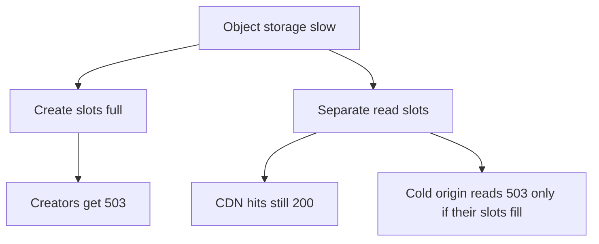
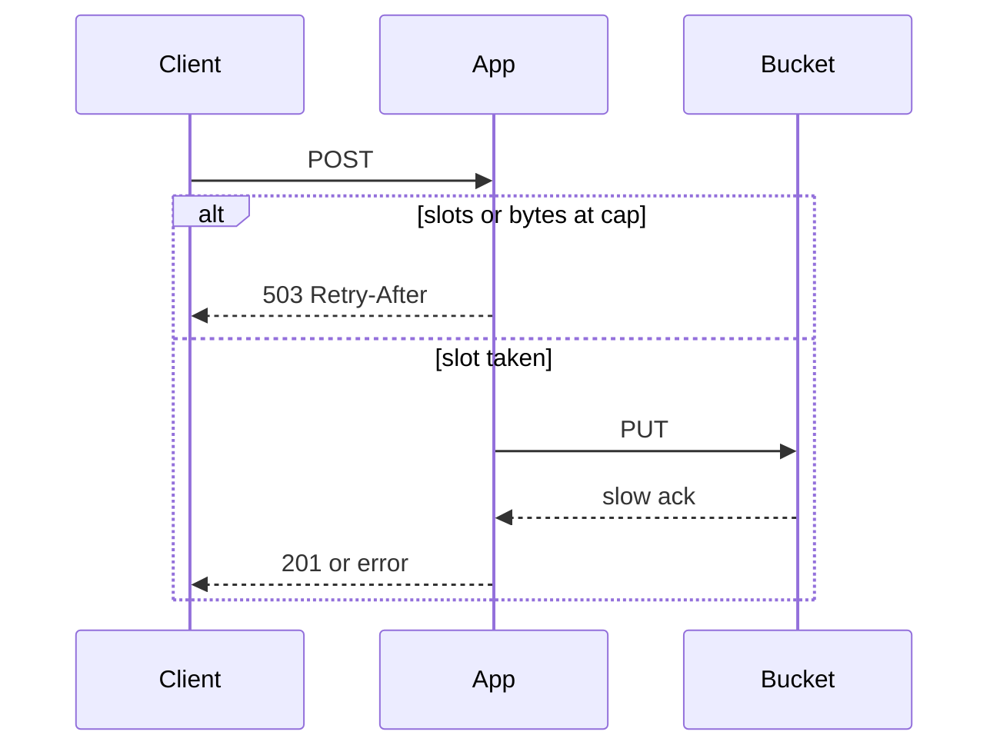

<!-- day-nav -->
[← Day 18 — Consistent hashing when nodes change](18-consistent-hashing-when-nodes-change.md) · [Day 20 — Timeouts and retry storms →](20-timeouts-and-retry-storms.md)

# Day 19 — Backpressure and load shedding

**Do now**

1. Set a timer.
2. Attempt the problem. Stop at the attempt line. Do not scroll.
3. Then read.

## Time box

35 minutes.

| Minutes | Do this |
|---|---|
| 0–10 | Attempt. A dependency slows down. Where do the requests pile up, and who gets the error? |
| 10–28 | Read. If your "queue" is unbounded and sits in front of the user, it is not backpressure. |
| 28–35 | Say who still gets a 200 when you are shedding, and who gets a 503. |

## Intent

Facing a dependency slower than arrivals, leave able to apply backpressure or shed load and say who feels it. Shedding is a fix for a pile-up that would otherwise take the healthy path down with the sick one. It is not a retry policy. That is tomorrow.

## Problem

> Design a pastebin. People paste text and share a link.

The interviewer says: "Object storage starts taking seconds instead of tens of milliseconds. Creates are still arriving at the peak. What do you stop, and who notices?"

## Attempt before reading

10 minutes. Do not scroll. Peak creates are about 350/s. Peak reads are about 17,400/s, most of the bytes supposed to be at the CDN, origin reads still able to hit the bucket. Four app processes. Create is PUT then insert, and the user waits. You refused to queue the create.

Write:

1. How many creates sit in memory if each PUT now takes 5 seconds and you do not refuse anyone. Use 350/s and a body size you state (mean, and the cap as the attack).
2. The cap you would put on in-flight creates per process, and the status code when it is hit.
3. Who you shed first: creators, readers of cold pastes, or readers of hot pastes. One order, with a reason.
4. Why an unbounded in-process queue is not the answer.

---

**Stop. Bound the in-flight work. Shed creates before reads.**

---

## Diagrams

### Who feels a slow bucket

### In flight, bounded

There is no queue arrow in this picture. If you need one, you are looking at day 16's cleanup jobs, which are not this request.

## Requirements

A slow dependency must not turn into a dead site for people who do not need that dependency.

- A reader whose paste is at the CDN does not need the bucket right now.
- A reader whose metadata is a cache hit still needs the bucket for the body, unless the edge has the body. After day 15, the hot body is at the edge. The origin GET is the cold path.
- A creator always needs the bucket. There is no 201 without a PUT.

So the honest priority when the bucket slows: **keep serving edge hits, keep serving origin reads while you can, refuse new creates before you refuse reads.** The product people already shared is the product. A new paste can wait until the store is healthy. You do not build a waiting room that pretends otherwise.

Memory is the immediate break. An app that accepts every create and holds the body until a slow PUT returns will run out of RAM, and the OOM killer does not shed cleanly. It kills the process, which also kills the reads that process was serving. That is why the limit exists. Not politeness.

## Design

### The number

Planning assumption: a healthy PUT returns in well under a second. You do not need the exact millisecond. You need the sick number the interviewer gave: **5 seconds.**

In flight if you accept the whole peak: 350 creates/s × 5 s = **1,750 creates** holding a body. At the 10 KB mean that is about **18 MB**. At the **1 MB cap**, if the slowdown coincides with large bodies, 1,750 × 1 MB is about **1.8 GB**, and it is split across only four processes, and it grows for as long as the sickness lasts because 5 seconds was not a maximum, it was a guess.

So the bound is on **count and on bytes**, per process:

- At most **50** in-flight creates per app process.
- At most **32 MB** of request bodies buffered for creates per process.

Fifty is a choice you can say. Four processes × 50 = 200 in flight, not 1,750. A healthy PUT at tens of milliseconds means 50 slots per process is far more than 350/s needs (the slots turn over).

When a process is at the cap, new creates get **503** and `Retry-After`. They do not get a 201.

Global version of the same idea: day 17's global 350/s is admission by rate. Rate limits do not save you when each of 10 allowed requests holds a slot for 30 seconds...

### Reads

Origin reads that need the bucket get a **separate** pool of in-flight GETs, not the create pool. It is the small version of "noisy neighbor," which day 22 will aim at tenants.

If the read pool is also exhausted, origin GETs 503. Cold readers see 503, not 404. Same rule as day 13: dependency down is not `not_found`.

You do not shed CDN traffic from the origin, because it is not on the origin. If the edge is cold (a purge of a viral paste, or a new paste), singleflight from day 11 means one origin GET fills many waiters.

### What backpressure is, in this system

Backpressure is the 503 propagating to the client who is causing the work, while the dependency is still slow, so you stop adding work. It is not a slower queue that stores the work you refused to refuse.

If the interviewer wants the bucket itself to push back: a 429 or 503 from the bucket counts as "slot free, request failed," and you do not immediately fill the slot with a retry (that is tomorrow's storm). The slot is the local cap. The bucket's own throttle is a signal to keep the cap low, not a signal to retry harder.

Load shedding is the policy on top: **which** requests get the 503 when you cannot do all of them. Order:

1. Creates, when the create cap is hit.
2. Origin GETs, when the read cap is hit.
3. Never a synthetic 404, never a dropped connection with no status if you can still write the 503.
4. Never the health check. A shed that fails `/healthz` will make the balancer drain every process (day 9) and the outage becomes total. The shallow health check stays cheap and local.

### What you refuse

An unbounded memory queue "so we don't drop creates." You will drop them anyway, via OOM, and you will drop reads too.

A durable queue of creates so the 503 becomes a 202 Accepted. Day 16 already kept creates off the queue.

Shedding reads first because "writes are the business." The business at this moment is the links already in the world. New writes are how the bucket got sick. Do not feed it.

## Trade-offs

**Choice.** Per-process caps on in-flight creates (50 and 32 MB) and a separate cap on origin GETs. Over the cap, 503.

**What you give up.** Some creators get 503 while the bucket is slow, including honest ones who happened to arrive then. You will be blamed for errors that are actually the dependency.

**10× break.** Peak creates ~3,500/s. Fifty slots times four processes is 200 in flight. If healthy PUT is 50 ms, one slot does 20 creates/s, 200 slots do 4,000/s, which still clears the ~3,500 peak.

## Say this in the room

If PUTs take 5 seconds and I accept 350 a second, I am holding 1,750 bodies. At the 1 MB cap that is gigabytes, and then the process dies and takes reads with it. I cap each app at 50 in-flight creates and 32 MB, and I 503 the rest. Read GETs use a different pool. People on the CDN see nothing.

## Kit artifact

One checklist row.

| Row | Lock |
|---|---|
| Shed | A named in-flight cap. Who gets 503. Who still gets 200. No unbounded queue in front of a slow dependency. |

## Design log

One line: who felt the shed in your attempt, and what piled up if you did not shed. If reads died first, that order is the gap.

Next: [Day 20 — Timeouts and retry storms](20-timeouts-and-retry-storms.md).

---

<!-- day-nav -->
[← Day 18 — Consistent hashing when nodes change](18-consistent-hashing-when-nodes-change.md) · [Day 20 — Timeouts and retry storms →](20-timeouts-and-retry-storms.md)
