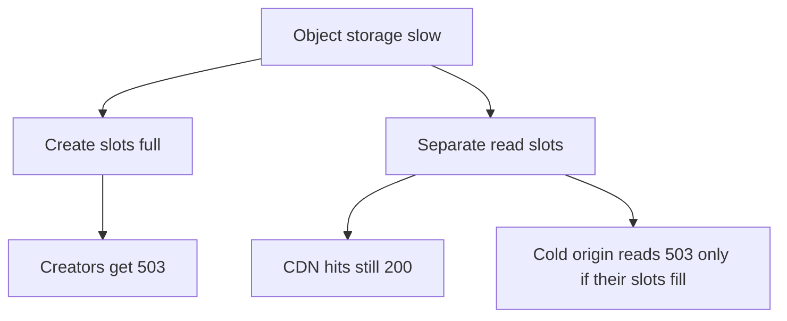
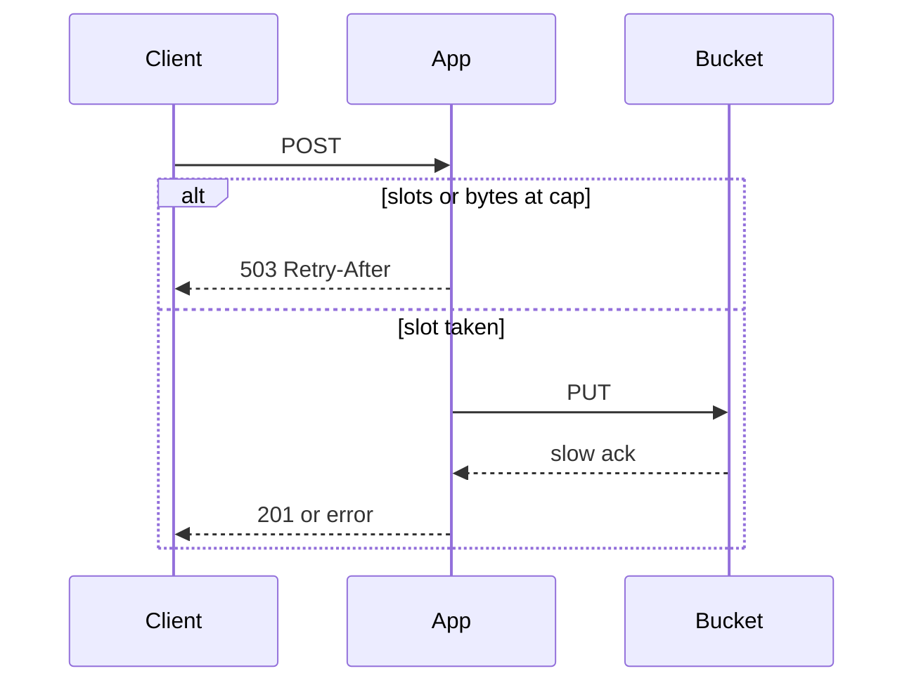

<!-- day-nav -->
[← Day 18 — Consistent hashing when nodes change](18-consistent-hashing-when-nodes-change.md) · [Day 20 — Timeouts and retry storms →](20-timeouts-and-retry-storms.md)

# Day 19 — Backpressure and load shedding

## Time box

35 minutes.

| Minutes | Do this |
|---|---|
| 0–10 | Attempt. A dependency slows down. Where do the requests pile up, and who gets the error? |
| 10–28 | Read. If your "queue" is unbounded and sits in front of the user, it is not backpressure. |
| 28–35 | Say who still gets a 200 when you are shedding, and who gets a 503. |

## Intent

Facing a dependency slower than arrivals, leave able to apply backpressure or shed load and say who feels it. Shedding is a fix for a pile-up that would otherwise take the healthy path down with the sick one. It is not a retry policy. That is tomorrow.

## Problem

> Design a pastebin. People paste text and share a link.

The interviewer says: "Object storage starts taking seconds instead of tens of milliseconds. Creates are still arriving at the peak. What do you stop, and who notices?"

## Attempt before reading

10 minutes. Do not scroll. Peak creates are about 350/s. Peak reads are about 17,400/s, most of the bytes supposed to be at the CDN, origin reads still able to hit the bucket. Three app processes. Create is PUT then insert, and the user waits. You refused to queue the create.

Write:

1. How many creates sit in memory if each PUT now takes 5 seconds and you do not refuse anyone. Use 350/s and a body size you state (mean, and the cap as the attack).
2. The cap you would put on in-flight creates per process, and the status code when it is hit.
3. Who you shed first: creators, readers of cold pastes, or readers of hot pastes. One order, with a reason.
4. Why an unbounded in-process queue is not the answer.

---

**Stop. Bound the in-flight work. Shed creates before reads.**

---

## Requirements

A slow dependency must not turn into a dead site for people who do not need that dependency.

- A reader whose paste is at the CDN does not need the bucket right now.
- A reader whose metadata is a cache hit still needs the bucket for the body, unless the edge has the body. After day 15, the hot body is at the edge. The origin GET is the cold path.
- A creator always needs the bucket. There is no 201 without a PUT.

So the honest priority when the bucket slows: **keep serving edge hits, keep serving origin reads while you can, refuse new creates before you refuse reads.** The product people already shared is the product. A new paste can wait until the store is healthy. You do not build a waiting room that pretends otherwise.

Memory is the immediate break. An app that accepts every create and holds the body until a slow PUT returns will run out of RAM, and the OOM killer does not shed cleanly. It kills the process, which also kills the reads that process was serving. That is why the limit exists. Not politeness.

## Design

### The number

Planning assumption: a healthy PUT returns in well under a second. You do not need the exact millisecond. You need the sick number the interviewer gave: **5 seconds.**

In flight if you accept the whole peak: 350 creates/s × 5 s = **1,750 creates** holding a body. At the 10 KB mean that is about **18 MB**. Survivable. At the **1 MB cap**, if the slowdown coincides with large bodies, 1,750 × 1 MB is about **1.8 GB**, and it is split across only three processes, and it grows for as long as the sickness lasts because 5 seconds was not a maximum, it was a guess. If PUTs take 30 seconds, multiply by six. The mean-case math is how this bug hides in review. The cap is how it kills a process.

So the bound is on **count and on bytes**, per process:

- At most **50** in-flight creates per app process.
- At most **32 MB** of request bodies buffered for creates per process.

Fifty is a choice you can say. Three processes × 50 = 150 in flight, not 1,750. You are leaving peak creates unsatisfied on purpose when each one occupies a slot for a long time. That is the shed. A healthy PUT at tens of milliseconds means 50 slots per process is far more than 350/s needs (the slots turn over). The limit does not bite when the dependency is healthy. If it bites on a healthy day, you sized it wrong; do not hide that by raising it in the incident.

When a process is at the cap, new creates get **503** and `Retry-After`. They do not get a ticket in an unbounded queue. They do not get a 201. They do not sit on a worker. The client is the place that waits, because only the client knows whether the paste is still worth sending.

Global version of the same idea: day 17's global 350/s is admission by rate. Today's cap is admission by **concurrency against a slow dependency.** You want both. Rate limits do not save you when each of 10 allowed requests holds a slot for 30 seconds... actually the per-IP limit would. The global pile-up is many IPs, each under their own limit, which is exactly the honest peak plus a slow store. Per-IP limits are not backpressure. Do not confuse them in the room.

### Reads

Origin reads that need the bucket get a **separate** pool of in-flight GETs, not the create pool. A create storm cannot occupy every outbound connection. Planning: **a connection pool per dependency, split by purpose.** Creates do not borrow the read pool. This is a bulkhead. It is the small version of "noisy neighbor," which day 22 will aim at tenants. Today the neighbor is the other call type.

If the read pool is also exhausted, origin GETs 503. CDN hits never enter the pool. Those users still see the paste. Cold readers see 503, not 404. Same rule as day 13: dependency down is not `not_found`.

You do not shed CDN traffic from the origin, because it is not on the origin. You do not add a feature to "shed reads of large pastes" first. The edge already took that job. If the edge is cold (a purge of a viral paste, or a new paste), singleflight from day 11 means one origin GET fills many waiters. Shedding the waiters' private GETs is already what singleflight does. Do not also build a priority queue of readers.

### What backpressure is, in this system

Backpressure is the 503 propagating to the client who is causing the work, while the dependency is still slow, so you stop adding work. It is not a slower queue that stores the work you refused to refuse.

If the interviewer wants the bucket itself to push back: a 429 or 503 from the bucket counts as "slot free, request failed," and you do not immediately fill the slot with a retry (that is tomorrow's storm). The slot is the local cap. The bucket's own throttle is a signal to keep the cap low, not a signal to retry harder.

Load shedding is the policy on top: **which** requests get the 503 when you cannot do all of them. Order:

1. Creates, when the create cap is hit.
2. Origin GETs, when the read cap is hit.
3. Never a synthetic 404, never a dropped connection with no status if you can still write the 503.
4. Never the health check. A shed that fails `/healthz` will make the balancer drain every process (day 9) and the outage becomes total. The shallow health check stays cheap and local.

### What you refuse

An unbounded memory queue "so we don't drop creates." You will drop them anyway, via OOM, and you will drop reads too.

A durable queue of creates so the 503 becomes a 202 Accepted. That is a new product contract (the paste appears later) and the early-ack lie again. Day 16 already kept creates off the queue. Shedding does not reopen that.

Shedding reads first because "writes are the business." The business at this moment is the links already in the world. New writes are how the bucket got sick. Do not feed it.

## Diagrams

Mermaid stands in for the whiteboard. SVG figures come later; do not wait on them.

### Who feels a slow bucket

### In flight, bounded

There is no queue arrow in this picture. If you need one, you are looking at day 16's cleanup jobs, which are not this request.

## Trade-offs

**Choice.** Per-process caps on in-flight creates (50 and 32 MB) and a separate cap on origin GETs. Over the cap, 503. CDN hits untouched. Health checks untouched. No queue of waiting creates.

**Alternative.** Let them pile up in memory, or queue them durably and ack later, or shed reads first to "protect the write path."

**What you give up.** Some creators get 503 while the bucket is slow, including honest ones who happened to arrive then. You will be blamed for errors that are actually the dependency. Good. The error is visible. A memory pile-up is a crash that looks like the app is the bug. You also give up using the full process memory "efficiently." The cap is idle most days. That is what a bound looks like.

**Why this order of shedding.** Existing readers are not what is making PUTs slow. Punishing them to keep accepting creates couples the healthy path to the sick one, which is the failure mode.

**10× break.** Peak creates ~3,500/s. Fifty slots times three processes is still 150 in flight. A healthy fast PUT still turns over fast enough that you may be fine; do the arithmetic in the room with the PUT latency they give you. If healthy PUT is 50 ms, one slot does 20 creates/s, 150 slots do 3,000/s, which is just under the 10× peak. The cap that was invisible at 1× becomes the write ceiling at 10×. You raise the cap when the dependency is healthy and the process has the RAM, or you add app processes. You do not remove the cap because 10× "needs throughput." The cap is what keeps 10× from being an OOM when latency slips.

## Talking points

**Say.** "If PUTs take 5 seconds and I accept 350 a second, I am holding 1,750 bodies. At the 1 MB cap that is gigabytes, and then the process dies and takes reads with it. I cap each app at 50 in-flight creates and 32 MB, and I 503 the rest. Read GETs use a different pool. People on the CDN see nothing. I do not queue the create."

**Say.** "503 is not 404. Health checks stay local so the balancer doesn't drain the tier because I'm shedding."

**Hand-waving.** "We'll autoscale." Scale into a slow dependency and you open more connections against the thing that is already late. More apps help only after the dependency recovers, or if the bottleneck was the app. Here the bottleneck is the bucket. More senders make it worse. The shed is the opposite of that reflex.

**Hand-waving.** "Backpressure via Kafka." There is no consumer the user is waiting on. A log of rejected creates is an audit, not backpressure. Backpressure is the client receiving 503.

**Hand-waving.** "We never drop." You drop, or the kernel drops. Pick the status code.

**If they ask what you page on.** Create 503s above a trickle. In-flight slots pinned at the cap. Read-pool exhaustion. Process memory, as a backstop, not as the primary signal. Not CDN hit rate, which should stay boring through this incident if you shed correctly.

## Kit artifact

One checklist row.

| Row | Lock |
|---|---|
| Shed | A named in-flight cap. Who gets 503. Who still gets 200. No unbounded queue in front of a slow dependency. |

## Design log

One line: who felt the shed in your attempt, and what piled up if you did not shed. If reads died first, that order is the gap.

Next: [Day 20 — Timeouts and retry storms](20-timeouts-and-retry-storms.md).

---

<!-- day-nav -->
[← Day 18 — Consistent hashing when nodes change](18-consistent-hashing-when-nodes-change.md) · [Day 20 — Timeouts and retry storms →](20-timeouts-and-retry-storms.md)
