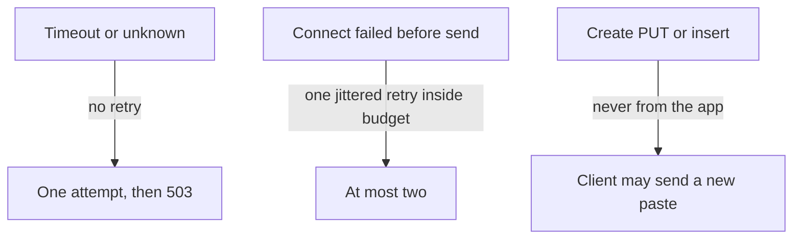

<!-- day-nav -->
[← Day 19 — Backpressure and load shedding](19-backpressure-and-load-shedding.md) · [Day 21 — Capacity redo with visible assumptions →](21-capacity-redo-with-visible-assumptions.md)

# Day 20 — Timeouts and retry storms

**Do now**

1. Set a timer.
2. Attempt the problem. Stop at the attempt line. Do not scroll.
3. Then read.

## Time box

35 minutes.

| Minutes | Do this |
|---|---|
| 0–10 | Attempt. A budget for the read, and what a retry does to a dependency that is already late. |
| 10–28 | Read. If you retry creates, or you retry timeouts, fix that before you add a circuit breaker. |
| 28–35 | Say the retry rule in one sentence: which errors, how many, which calls never. |

## Intent

Facing a slow dependency, leave able to set timeouts and retries so a blip cannot multiply into a storm. The timeout is a fix for a call that would hold a slot until the process is useless. The retry rule is a fix for the amplification you add while "being resilient."

## Problem

> Design a pastebin. People paste text and share a link.

The interviewer says: "The primary blips. Your apps retry. What does the primary see, and what does a create do if you retry it?"

## Attempt before reading

10 minutes. Do not scroll. Peak origin reads can be as high as 17,400/s if the edge is cold. Creates peak at about 350/s and are not idempotent. Day 19 capped in-flight work. A slot that never returns is the same as no cap.

Write:

1. A timeout for: metadata lookup, object GET, object PUT. Units. You may be wrong; you may not be silent.
2. What you retry, with a count. What you do not retry even once.
3. The multiplication: if 20% of 17,400 reads time out and you try each of those three more times, what arrives at the dependency?
4. Whether a create retry from **your** app, not from the client, can mint a second paste or a second object.

---

**Stop. Budgets and a narrow retry rule, below.**

---

## Requirements

A user-facing read has an end-to-end budget. You do not promise a global 100 ms, and you do not leave the budget implicit. Planning budget for an origin read in-region: **300 ms** until you have a histogram. Inside that, each hop gets a slice. If the slices add up to more than the budget, you have already decided to blow it. Add them on the whiteboard.

A create is slower because it waits for durability. Its budget is longer and still finite: a PUT that runs for minutes is a stuck slot. Planning create budget: **2 seconds**, then 503, not an infinite spinner.

The contract facts that constrain retries:

- GET of metadata and GET of an object are idempotent.
- POST create is not. The app must not replay it.
- DELETE is idempotent if the row delete and the detach job are safe twice, which they are. A client retry of DELETE after a lost 204 is fine. An automatic storm of DELETEs is still load.
- A timeout does not mean the call failed. It means you stopped waiting. The primary or the bucket may still be doing the work. A retry then **adds** a second copy of that work on top of the first.

That last point is the storm.

## Design

### Budgets

| Call | Timeout | Retry |
|---|---|---|
| Cache get | 5 ms, then treat as miss | No. A slow cache is a miss path, not three more cache calls. |
| Primary point read | 20 ms | No retry on timeout. One retry only if the connection failed **before** the request was sent, and only if the 300 ms budget still has the 20 ms. |
| Object GET | 200 ms | Same rule: no retry on timeout. One immediate retry only on a fast connect failure, with jitter, inside the budget. |
| Object PUT | 1 s inside the 2 s create budget | **No retry from the app.** You do not know whether the bytes landed. |
| Primary insert | 50 ms | **No retry of the whole create.** A retry of the insert alone, with the same id, is safe if the first might have committed: the unique key makes the second a conflict, and you must treat "unique violation" after a timeout as "the row may exist" and then decide. Simplest rule you can say: **do not retry the insert either; return 500; leave an orphan if the PUT landed; the reaper has the age floor.** A clever retry-on-unique-violation is easy to get wrong in the room. Refuse it unless this is the deep dive. |
| CDN purge, from the worker | seconds, worker-side | Retry with backoff. This is not on the user path. At-least-once is the design. |

Jitter means the retry waits a random slice of a small window, tens of milliseconds, not a synchronized sleep that makes every app hit the primary in the same millisecond. One retry plus jitter is the whole client policy. Exponential backoff across five attempts belongs in the **worker**, where nobody is holding an HTTP request, not in the read path.

### The multiplication

Do it out loud.

Origin reads, cold edge, 17,400/s. Suppose **20%** time out. That is 3,480 timed-out reads a second.

- If each retries **three** more times, the dependency sees the original 17,400 plus three extra copies of the failed fifth: 3 × 3,480 ≈ **10,400 extra reads/s**, about 27,800 attempts a second, roughly 1.6× the traffic. That assumes the retries succeed. If they time out at a growing rate, the tree is bigger. Three retries on a timeout is up to **four times** the load of the sick subset, launched because it was sick.
- The primary's ceiling was 15,000. You can push it over the edge with retries alone, while "only" 20% of calls are slow.

The fix is not a smarter backoff on the read path. The fix is: **a timeout is not retried.** The slot is released. The user gets 503 if you have no answer. The dependency gets to finish or fail the attempt you already sent, without its twin.

What you may retry: a connect error where you are sure the request never left the process. That attempt did not create load on the far side. One retry, jittered, budget permitting. If you are not sure the request was unsent, you treat it as a timeout: no retry.

### Creates

The app does not retry a create. The client might. A client retry is a second paste, which the API has always allowed. Automatic app retries would mint that second paste **without the user asking**, or PUT two objects for one 500. Neither is resilience.

If the PUT timed out, return 503, do not insert, enqueue a reap for that id if you minted one and might have stored bytes. If you have not minted yet, there is nothing to reap. Mint **after** you are committed to trying the PUT, and reap on uncertainty. Do not mint, PUT, time out, mint a new id, and retry inside the same user request. That is two orphans and a slower failure.

### Circuit breaker, only as a cap on attempts

After the retry rule, a breaker is the remaining tool, not the first one. If the primary is failing fast (connection refused, not slow), every app can open a breaker and **stop sending** for a short window, planning **5 seconds**, then let one probe through. That protects a primary that is down from 17,400 connect attempts a second.

If the primary is **slow**, a breaker that waits for error rate may never open, because timeouts are your errors and you already chose not to retry them. The in-flight cap from day 19 is what protects you there. Do not expect a breaker to solve latency. Say the difference:

- Down, errors, breaker opens, shed quickly.
- Slow, slots fill, 503s from the cap, breaker optional.

A breaker that opens on the cache will send every read to the primary. That is the day-10 failure mode. Prefer "cache timeout = miss" for a single call, and only open a cache breaker if the cache is failing so hard that the 5 ms timeouts themselves are the load. Then you shed origin reads rather than melting the primary. One sentence. Do not draw a breaker in front of every box.

### Make the numbers add up

**The read budget, summed.** Cache 5 ms + primary 20 ms + object GET 200 ms = 225 ms of the 300 ms budget. The remaining 75 ms is TLS, the hop through the balancer, and streaming up to 1 MB to the client. Now check the retry allowance against it: a retry of the 20 ms primary read fits; a retry of a 200 ms object GET does not (225 + 200 > 300). So "one retry inside the budget" for the object GET only ever means a connect failure that took a few milliseconds. Say it, because "one retry" without the sum is a promise you cannot keep.

**Propagate the deadline, not just the timeout.** Each hop's timeout is the smaller of its own number and the time left in the request. A read that spent 80 ms waiting for a cache that then missed does not get a fresh 200 ms for the object; it gets what is left. Without that rule, every hop is individually within budget and the request is over.

**Tell the server you stopped waiting.** A timed-out query keeps running on the primary. Set the database's statement timeout a little above the app's, say 25 ms for the 20 ms read, so abandoned work dies there too. Otherwise the app releases its slot and the primary keeps the work, and the "no retry" rule saved you only half the load.

**Timeouts are what make day 19's cap turn over.** With a 1 second PUT timeout, a create slot is never held longer than about a second. At 200 slots that is a floor of about 200 attempts a second through the cap even when the bucket is sick, each one failing in a second instead of hanging for five. The timeout does not make the bucket faster. It makes the failure fast, which is what the creator and the slot both need.

**A retry budget, even for safe retries.** Cap retries at about 10% of requests per process over a short window. A pre-send connect failure is safe to retry once; a thousand of them a second because a network path flapped is still load. With the budget, the worst amplification from your own retries is 1.1×, whatever fails.

**Retry at one layer.** The balancer from day 9 may retry a failed connect on another app. The app may retry a connect to the primary. The client may retry the whole request. Each layer is reasonable alone; together, a failure at the bottom becomes 2 × 2 × 3 attempts. Decide which layer owns which retry: the balancer owns connects to apps, the app owns pre-send connects to dependencies, the client owns everything else, and nobody retries a timeout.

What staff sounds like here is doing the addition before naming the policy. Sum the slices, check the retry against what remains, push the deadline down to the server, and bound the retries you do allow. A senior answer lists timeouts per call. A staff answer shows they fit inside one budget and that the system cannot amplify its own failure by more than a number you named.

### Hedging

A hedge is a second request you send before the first finishes, to cut tail latency. It is a deliberate extra load on the healthy path. You refuse it. This pastebin's read budget is 300 ms and the dependency is one primary. A hedge of 17,400 reads doubles the primary. You do not need the tail that badly.

## Diagrams

### What may be retried

### How a retry becomes a storm

Erase the "3 retries" box and the extra load goes away. That is the design, not a tuning exercise.

Caption it: "17,400 becomes about 27,800 because of our own code." Write the multiplication under the chain. The storm diagram is the one drawing in this phase whose villain is you.

Caption for the retry diagram: "Three exits: no retry, one retry at most, never from the app." Read the arrows aloud in that order. Any arrow labeled "backoff" pointing at the request path is the wrong picture.

## Failure the user sees, with budgets in place

**The primary blips for two seconds.** Reads that miss the cache time out at 20 ms and return 503; hits are untouched. Creates fail at the insert and return 500 with no link; any landed object becomes an orphan for the reaper. No retry wave follows the blip, so the primary comes back to the same load it left. Users see two seconds of errors, not two seconds of errors followed by a minute of overload.

**The primary is slow, not down.** Every miss times out at 20 ms; the database kills the abandoned statements at 25 ms. Readers on cache misses see 503 quickly instead of a spinner. The day 19 cap keeps slots turning over. The breaker does not open, because this is slowness, not refusal.

**The bucket is slow.** Object GETs time out at 200 ms, PUTs at 1 second. Cold readers see 503 within the read budget. Creators see 503 within about a second. Edge readers see nothing.

**Without the rule.** Three retries on 20% of reads add about 10,400 a second to a primary with a 15,000 ceiling. A two-second blip becomes a sustained overload that outlasts the cause, and users see the site failing long after the dependency recovered. That is the retry storm: an outage your own clients keep alive.

## Trade-offs

**Choice.** Explicit budgets. No retry on timeout. At most one retry on a pre-send failure, jittered, inside the budget. No app retry of create. Breaker only for fast failures. No hedging. Workers may retry purge with backoff.

**Alternative.** Retry three times with exponential backoff on every error, including creates and timeouts, because "the network is unreliable."

**What you give up.** Some blips that a retry would have hidden become user-visible 503s. A lost packet is TCP's problem, not yours. A connect failure still gets one retry. You are giving up the **second and third** try of a call that may already be executing. You accept a slightly worse success rate on a healthy day to avoid a much worse day when the dependency is ill.

**Why the alternative fails.** It multiplies the sick subset, it holds slots longer (backoff inside an HTTP request is a self-inflicted timeout), and on creates it double-writes. Backoff belongs off the request path.

**Name the refusal inside each alternative.** Against three retries with backoff on every error: you refuse to multiply the sick subset and hold slots while you wait. Against app retries of create: you refuse a second paste or a second object the user never asked for. Against hedging: you refuse to double the primary to shave a tail you have not been asked about. Against a breaker in front of every box: you refuse a tool that does not open on slowness and, on the cache, sends everything to the primary. Each refusal names the load it would add.

**10× break.** 174,000 cold origin reads, 20% timing out, three retries: on the order of 100,000 extra attempts. The storm scales with the traffic. The rule "do not retry a timeout" scales too: it stays one attempt, and the 10× problem remains the primary's real capacity, not your amplifier. A breaker at 10× must be per process or shared carefully; about 23 app processes each probing every 5 seconds is fine, 23 processes each retrying the world is not. The rule matters more as you get bigger, which is the opposite of "we'll add retries when we're serious."

## Talking points

**Say.** "Origin read budget 300 ms. Primary lookup 20 ms, object GET 200 ms, cache 5 ms then it's a miss. I do not retry a timeout, because the work may still be running and a retry doubles it. I retry once, with jitter, only if the request never left. I never retry a create from the app. Three retries on 20% of 17,400 is about ten thousand extra reads a second, which is enough to tip the primary. I won't do that to look resilient."

**Say.** "Workers retry purges. Users don't wait on those. A breaker is for when the primary is refusing connections, not for when it's slow. Slow is the in-flight cap."

**Hand-waving.** "We have retries and timeouts." The matrix above, or it is not a design. Which call, which error, how many.

**Hand-waving.** "Exponential backoff" on the GET path. You are holding a person and a slot. Backoff in the worker. Fail the request.

**Hand-waving.** "Exactly-once create by retrying until the primary says the id exists." You are designing a protocol under pressure. Return the error. Let the client send a new paste. Idempotency keys were a non-goal on day 4 because anonymous clients will not keep them. Do not add them in the retry section.

**If they ask what the user sees.** A timed-out read is a 503, not a 404 and not a truncated paste. A timed-out create is a 503 with no link. They may try again and get a second paste. You have said that since week 1.

**If they ask whether the timeouts fit the budget.** "Five, twenty, and two hundred is 225 of 300. The rest is TLS and streaming. A retry of the primary read fits; a retry of the object GET only fits if the connect failed in a few milliseconds. Each hop gets the smaller of its timeout and what's left."

**If they ask what the primary does with a query you gave up on.** "Keeps running it, unless I tell it not to. Statement timeout slightly above the app's, so abandoned work dies on both sides."

**If they ask who retries.** "One layer per failure. Balancer for connects to apps, app for pre-send connects to dependencies, client for everything else. With a retry budget of about 10%, my own retries can't amplify a failure by more than 1.1×."

**If they ask what you page on.** Timeout rate per dependency, retry rate (which should be nearly zero on the read path), breaker open, create 503s. A rising retry rate is the storm starting. Alert on it before you alert on "high QPS," because the QPS may be yours.

## Say this in the room

Origin read budget 300 ms: cache 5 ms then it's a miss, primary 20 ms, object GET 200 ms, so 225 with the rest for TLS and streaming. Each hop gets the smaller of its timeout and what's left, and the primary's statement timeout sits just above mine so abandoned queries die there too. I don't retry a timeout, because the work may still be running. I retry once, jittered, only if the request never left, inside a retry budget of about 10%. One layer owns each retry. The app never retries a create: that's a second paste nobody asked for. Three retries on 20% of 17,400 is about 10,400 extra reads a second on a 15,000 primary; that's how a two-second blip becomes a ten-minute outage. Create budget 2 seconds with a 1 second PUT timeout, which is also what keeps day 19's slots turning over. A breaker is for refusal, not slowness; slowness is the cap. No hedging.

## Kit artifact

One checklist row.

| Row | Lock |
|---|---|
| Retry | Timeouts named per call. No retry on timeout. No automatic retry of a non-idempotent create. Extra attempts have a multiplication you can say. |

## Design log

One line: the retry rule you actually wrote down, and the extra QPS it would have created at a 20% failure rate. If you did not compute it, that computation is the gap.

Next: [Day 21 — Capacity redo with visible assumptions](21-capacity-redo-with-visible-assumptions.md).

---

<!-- day-nav -->
[← Day 19 — Backpressure and load shedding](19-backpressure-and-load-shedding.md) · [Day 21 — Capacity redo with visible assumptions →](21-capacity-redo-with-visible-assumptions.md)
