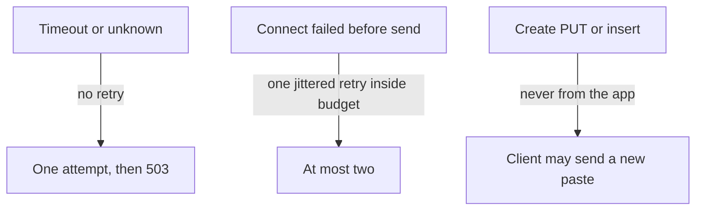

<!-- day-nav -->
[← Day 19 — Backpressure and load shedding](19-backpressure-and-load-shedding.md) · [Day 21 — Capacity redo with visible assumptions →](21-capacity-redo-with-visible-assumptions.md)

# Day 20 — Timeouts and retry storms

**Do now**

1. Set a timer.
2. Attempt the problem. Stop at the attempt line. Do not scroll.
3. Then read.

## Time box

35 minutes.

| Minutes | Do this |
|---|---|
| 0–10 | Attempt. A budget for the read, and what a retry does to a dependency that is already late. |
| 10–28 | Read. If you retry creates, or you retry timeouts, fix that before you add a circuit breaker. |
| 28–35 | Say the retry rule in one sentence: which errors, how many, which calls never. |

## Intent

Facing a slow dependency, leave able to set timeouts and retries so a blip cannot multiply into a storm. The timeout is a fix for a call that would hold a slot until the process is useless. The retry rule is a fix for the amplification you add while "being resilient."

## Problem

> Design a pastebin. People paste text and share a link.

The interviewer says: "The primary blips. Your apps retry. What does the primary see, and what does a create do if you retry it?"

## Attempt before reading

10 minutes. Do not scroll. Peak origin reads can be as high as 17,400/s if the edge is cold. Creates peak at about 350/s and are not idempotent. Day 19 capped in-flight work. A slot that never returns is the same as no cap.

Write:

1. A timeout for: metadata lookup, object GET, object PUT. Units. You may be wrong; you may not be silent.
2. What you retry, with a count. What you do not retry even once.
3. The multiplication: if 20% of 17,400 reads time out and you try each of those three more times, what arrives at the dependency?
4. Whether a create retry from **your** app, not from the client, can mint a second paste or a second object.

---

**Stop. Budgets and a narrow retry rule, below.**

---

## Diagrams

### What may be retried

### How a retry becomes a storm

Erase the "3 retries" box and the extra load goes away. That is the design, not a tuning exercise.

## Requirements

A user-facing read has an end-to-end budget. You do not promise a global 100 ms, and you do not leave the budget implicit. Planning budget for an origin read in-region: **300 ms** until you have a histogram. Inside that, each hop gets a slice. If the slices add up to more than the budget, you have already decided to blow it. Add them on the whiteboard.

A create is slower because it waits for durability. Its budget is longer and still finite: a PUT that runs for minutes is a stuck slot. Planning create budget: **2 seconds**, then 503, not an infinite spinner.

The contract facts that constrain retries:

- GET of metadata and GET of an object are idempotent.
- POST create is not. The app must not replay it.
- DELETE is idempotent if the row delete and the detach job are safe twice, which they are. A client retry of DELETE after a lost 204 is fine. An automatic storm of DELETEs is still load.
- A timeout does not mean the call failed. It means you stopped waiting. The primary or the bucket may still be doing the work. A retry then **adds** a second copy of that work on top of the first.

That last point is the storm.

## Design

### Budgets

| Call | Timeout | Retry |
|---|---|---|
| Cache get | 5 ms, then treat as miss | No. A slow cache is a miss path, not three more cache calls. |
| Primary point read | 20 ms | No retry on timeout. One retry only if the connection failed **before** the request was sent, and only if the 300 ms budget still has the 20 ms. |
| Object GET | 200 ms | Same rule: no retry on timeout. One immediate retry only on a fast connect failure, with jitter, inside the budget. |
| Object PUT | 1 s inside the 2 s create budget | **No retry from the app.** You do not know whether the bytes landed. |
| Primary insert | 50 ms | **No retry of the whole create.** A retry of the insert alone, with the same id, is safe if the first might have committed: the unique key makes the second a conflict, and you must treat "unique violation" after a timeout as "the row may exist" and then decide. Simplest rule you can say: **do not retry the insert either; return 500; leave an orphan if the PUT landed; the reaper has the age floor.** A clever retry-on-unique-violation is easy to get wrong in the room. Refuse it unless this is the deep dive. |
| CDN purge, from the worker | seconds, worker-side | Retry with backoff. This is not on the user path. At-least-once is the design. |

Jitter means the retry waits a random slice of a small window, tens of milliseconds, not a synchronized sleep that makes every app hit the primary in the same millisecond. One retry plus jitter is the whole client policy.

### The multiplication

Do it out loud.

Origin reads, cold edge, 17,400/s. Suppose **20%** time out.

- If each retries **three** more times, you add about **10,400** attempts on top of the original 17,400. The dependency sees roughly 17,400 − 3,480 + 4 × 3,480. The timed-out fifth... keep it simple and say it the way you would in the room: the original traffic, plus three extra copies of the failed fifth. About **10,000 extra reads/s**, and if those also time out you have not even counted the tree. Three retries on a timeout is up to **four times** the load of the sick subset, launched because it was sick.
- The primary's ceiling was 15,000. You can push it over the edge with retries alone, while "only" 20% of calls are slow.

The fix is not a smarter backoff on the read path. The user gets 503 if you have no answer.

What you may retry: a connect error where you are sure the request never left the process. That attempt did not create load on the far side.

### Creates

The app does not retry a create. Automatic app retries would mint that second paste **without the user asking**, or PUT two objects for one 500.

If the PUT timed out, return 503, do not insert, enqueue a reap for that id if you minted one and might have stored bytes. If you have not minted yet, there is nothing to reap.

### Circuit breaker, only as a cap on attempts

After the retry rule, a breaker is the remaining tool, not the first one. If the primary is failing fast (connection refused, not slow), every app can open a breaker and **stop sending** for a short window, planning **5 seconds**, then let one probe through.

If the primary is **slow**, a breaker that waits for error rate may never open, because timeouts are your errors and you already chose not to retry them. The in-flight cap from day 19 is what protects you there.

- Down, errors, breaker opens, shed quickly.
- Slow, slots fill, 503s from the cap, breaker optional.

A breaker that opens on the cache will send every read to the primary. That is the day-10 failure mode.

### Hedging

A hedge is a second request you send before the first finishes, to cut tail latency. This pastebin's read budget is 300 ms and the dependency is one primary.

## Trade-offs

**Choice.** Explicit budgets. No retry on timeout.

**What you give up.** Some blips that a retry would have hidden become user-visible 503s. A single lost UDP-shaped packet...

**10× break.** 174,000 cold origin reads, 20% timing out, three retries: on the order of 100,000 extra attempts. The rule "do not retry a timeout" scales too: it stays one attempt, and the 10× problem remains the primary's real capacity, not your amplifier. A breaker at 10× must be per process or shared carefully; about 23 app processes each probing every 5 seconds is fine, 23 processes each retrying the world is not.

## Say this in the room

Origin read budget 300 ms. Primary lookup 20 ms, object GET 200 ms, cache 5 ms then it's a miss. I do not retry a timeout, because the work may still be running and a retry doubles it. I retry once, with jitter, only if the request never left. I never retry a create from the app.

## Kit artifact

One checklist row.

| Row | Lock |
|---|---|
| Retry | Timeouts named per call. No retry on timeout. No automatic retry of a non-idempotent create. Extra attempts have a multiplication you can say. |

## Design log

One line: the retry rule you actually wrote down, and the extra QPS it would have created at a 20% failure rate. If you did not compute it, that computation is the gap.

Next: [Day 21 — Capacity redo with visible assumptions](21-capacity-redo-with-visible-assumptions.md).

---

<!-- day-nav -->
[← Day 19 — Backpressure and load shedding](19-backpressure-and-load-shedding.md) · [Day 21 — Capacity redo with visible assumptions →](21-capacity-redo-with-visible-assumptions.md)
