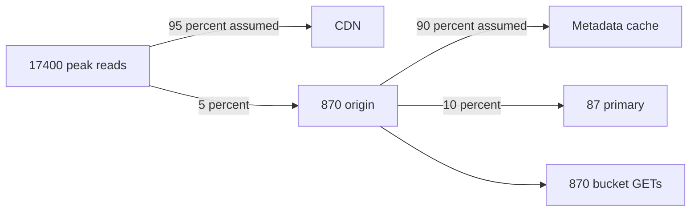
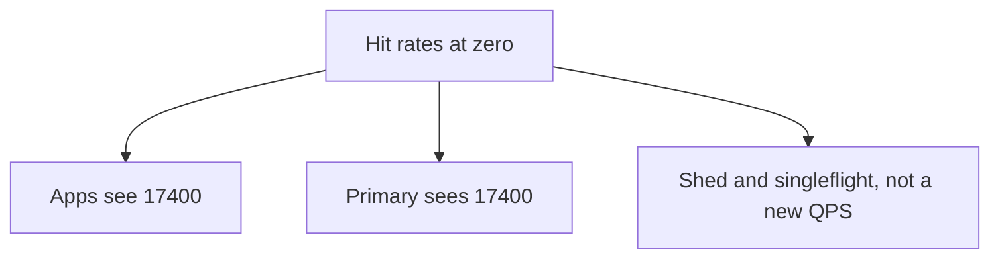

<!-- day-nav -->
[← Day 20 — Timeouts and retry storms](20-timeouts-and-retry-storms.md) · [Day 22 — Noisy neighbor and fairness →](22-noisy-neighbor-and-fairness.md)

# Day 21 — Capacity redo with visible assumptions

**Do now**

1. Set a timer.
2. Attempt the problem. Stop at the attempt line. Do not scroll.
3. Then read.

## Time box

40 minutes. Stop at 40 even if a product is unfinished.

| Minutes | Do this |
|---|---|
| 0–15 | Attempt. Recompute from the week-1 locks, then apply a hit rate you write down as an assumption. |
| 15–35 | Read. Recalculate any line that disagrees. Do not average your page with this one. |
| 35–40 | Close it and say which assumption, if wrong by a lot, puts the full peak back on the primary. |

## Intent

Facing a design that only works at the average, leave able to redo the estimate with fan-out and a stated cache-hit assumption. The new numbers are a fix for a picture that still quotes day-3 QPS at every box. They are not a new traffic model.

## Problem

> Design a pastebin. People paste text and share a link.

The interviewer says: "You have a CDN, a cache, a replica, and a queue. Do the math again. I want the hit rate in the open, and I want to know what each user request actually fans out into."

## Attempt before reading

15 minutes. Do not scroll. Locks you must start from, not the hit rate: 10 million creates a day, 50 reads per write, 10 KB mean, 3× peak, 45-day resident mix. Day 3's results if you need the checkpoint: about 116 writes/s average, 350 peak, 5,800 reads/s average, 17,400 peak, 4.5 TB, 1.4 Gbit/s peak egress.

Write:

1. Two hit rates, each labeled as an assumption: edge, and metadata cache on what the edge missed. Not "about 90" with no base.
2. Peak QPS at the origin, at the primary, and at the bucket, under those assumptions.
3. The same three if both hit rates are zero. That column is the design, not a footnote.
4. One fan-out: a cold read, as a count of downstream calls. A create, as the calls the user waits for.

---

**Stop. Worked redo below. Assumptions are not measurements.**

---

## Requirements

The contract and the week-1 locks do not move. Hit rate is not a requirement the interviewer handed you. It is an assumption you are adding, and day 3 called an invented hit rate a stacked safety factor when you used it to **avoid** a cache. You now have the cache and the edge. Using a hit rate to size what is behind them is legitimate **if the zero-hit column still has an answer.** If the only column that works is 95%, you do not have a design. You have a wish.

Decimal units, same as day 3. No second hidden 2×.

## Design by arithmetic

### Out loud

"Same front door as day 3. 116 writes a second average, 350 peak. 5,800 reads average, 17,400 peak. 100 GB a day in, 4.5 TB resident, peak user-facing egress 174 MB/s, about 1.4 Gbit/s. Those numbers are the readers and the bytes. They are not automatically the QPS of the primary anymore.

I am assuming, and I will instrument, a **95% CDN hit rate** on public GETs. I am assuming a **90% metadata-cache hit rate** on the GETs that still reach the origin. Both are assumptions. The cold-start column sets them to zero.

Origin peak reads: 17,400 × 0.05 = **870/s**. Primary peak reads, if nine out of ten of those are cache hits: 870 × 0.10 = **87/s**. Bucket GETs are the origin reads, not the primary reads, because a metadata hit still needs the body unless the edge had it. At 95% edge hit, the bucket sees **870 GETs/s** peak. Times 10 KB is about **8.7 MB/s**. The 1.4 Gbit/s did not disappear. It moved to the CDN. I am trusting the CDN's capacity for that, and I said so on day 15.

If the edge hit rate is zero, origin reads are 17,400/s again and bucket bandwidth is 174 MB/s again. The metadata cache at 90% would still keep the primary near 1,740/s, which is under the 15,000 ceiling. If the metadata cache is also cold, the primary sees 17,400 and I am over the ceiling I used on day 10. That is not a surprise. That is the shed on day 19 and the reason singleflight exists. I do not get to quote 87 reads a second as 'the load' without the other column.

Creates did not get a hit rate. Every create still PUTs and still inserts. Peak **350 PUTs/s**, about 3.5 MB/s, and **350 commits/s**. The replica ships that WAL asynchronously. Cleanup jobs are about 116/s average, not a second copy of the read path.

Fan-out, cold origin read: one cache get, one primary get, one bucket GET. Three downstream calls, one user request. I must not multiply 17,400 by three and call it QPS unless the edge and the cache both missed. Fan-out, create, user-visible: one limiter check, one PUT, one insert. The user waits for the PUT and the insert. Purge is not on this path.

Cache RAM: I assume the hot metadata set is about **1% of live rows**, 4.5 million entries, a few hundred bytes each, about **2 GB** with overhead. Four cache nodes hold that easily. The ring was for membership, not because 2 GB does not fit. If I had cached bodies, 1% of 4.5 TB is 45 TB, which is why bodies are not in that cache.

The assumption I instrument first is now the **CDN hit rate**, not the mean body size. Mean body size still multiplies every byte column, and it is still the one I fear for the bucket bill. But the QPS story I just told is wrong by 20× if the edge is bypassed, and only by 2× if the mean object is 20 KB. Different knobs. I will not bury the hit rate inside a single QPS figure."

### Check table

| Quantity | Expression | At the assumptions | If both hit rates are 0 |
|---|---|---|---|
| User read QPS, peak | 5,800 × 3 | 17,400 | 17,400 |
| Origin read QPS, peak | 17,400 × (1 − 0.95) | **870** | **17,400** |
| Primary read QPS, peak | 870 × (1 − 0.90) | **87** | **17,400** |
| Bucket GET, peak | origin reads × 10 KB | **870/s, ~8.7 MB/s** | **17,400/s, 174 MB/s** |
| User egress, peak | unchanged | ~1.4 Gbit/s, at the CDN | ~1.4 Gbit/s, at the origin |
| PUT, peak | 350 × 10 KB | **350/s, ~3.5 MB/s** | same |
| Primary commits, peak | creates + deletes | ~350 creates, and deletes in the same order when full | same |
| Cleanup jobs | ~116/s average | queue, not the user path | same |
| Metadata resident | unchanged | ~135 GB, plus a replica | same |
| Bodies resident | unchanged | 4.5 TB in the bucket | same |
| Cache RAM | 1% × 450e6 × ~400 B | **~2 GB** assumption | cold: ~0 until it fills |

Primary reads with edge cold and metadata hot: 17,400 × 0.10 = **1,740/s**. Still fine. The dangerous cell is the bottom of the hit-rate stack, not the average paste.

### Fan-out, written so you cannot skip it

| User call | Downstream calls they wait on | Calls that may happen after the response |
|---|---|---|
| GET, edge hit | none on your origin | none |
| GET, edge miss, metadata hit | cache get, bucket GET | none |
| GET, both miss | cache get, primary get, bucket GET | cache fill |
| POST | limiter, PUT, primary insert | none for correctness |
| DELETE | primary delete, tombstone, outbox row | object delete, CDN purge |

A fan-out of three on the cold GET is not three times the storage. It is three round trips inside the 300 ms budget from day 20. 5 ms + 20 ms + 200 ms fits. If you add a retry, it does not. You already refused that retry.

Deletes at steady state match creates, about 116/s average. Each becomes one commit plus one queued detach. Do not add 116 to the primary **read** column. Do add them to commits if you are sizing WAL. Peak write commits stay in the few hundreds unless deletes burst; a scripted delete of a backlog is the sweeper, batched, which you already keep off the user path.

### Cross-checks a staff answer runs before it trusts the table

**One formula, every cell.** Primary peak reads = 17,400 × (1 − edge) × (1 − meta). Say it once and every row is a substitution. The primary's ceiling is 15,000, so it needs (1 − edge)(1 − meta) ≤ 15,000 / 17,400 ≈ 0.86: a **combined** hit rate of about 14%, the same number day 10 found before the edge existed. Everything above 14% is headroom, not survival. That reframes the whole table: 95% and 90% are the comfortable day; 14% is the line.

| Edge | Meta | Primary peak reads | Against 15,000 |
|---|---|---|---|
| 95% | 90% | 87 | idle |
| 80% | 90% | 348 | idle |
| 0% | 90% | 1,740 | fine |
| 0% | 57% | about 7,500 | half |
| 0% | 0% | 17,400 | over, shed |

**The RAM assumption, checked against the TTL.** An entry cannot live past its jittered TTL, so the cache can never hold more than reads arriving at it per second × the longest TTL. At the assumptions, 870 a second × 75 s ≈ 65,000 entries, about 26 MB at 400 bytes. With the edge cold, 17,400 × 75 ≈ 1.3 million entries, about 520 MB. The "1% of live rows, 2 GB" figure above is a ceiling the TTL never lets you reach. Keep it as a provisioning number; do not mistake it for the working set. Two independent estimates that disagree by 4× to 80× are exactly what you want to notice out loud: it tells the interviewer which number you would trust and why.

**The bill moves with the edge, too.** Day 14 priced bucket GETs at around $6,000 a month with every read going to the bucket. At a 95% edge hit rate, bucket GETs fall to 870 a second at peak, about a twentieth, and the request bill falls with them. The edge's own bandwidth bill replaces part of it. The point for the room: the hit rate is a cost assumption as well as a load assumption, and the zero column is also the worst bill.

**Which assumption to measure first, and how.** The edge hit rate, because it is wrong by 20× if bypassed. The CDN reports cache status on every response; sample it at peak, per hour, for a week, before quoting 95% to anyone who plans capacity. Then the metadata hit rate from the cache's own counters. Then mean body size from `size_bytes` on the rows you already have. Measure in the order of how badly each one moves the table.

What staff sounds like here is collapsing the table to one formula and one line. "The primary needs a combined hit rate of 14%; at our assumptions it sees 87; with both cold it sees 17,400 and we shed" fits in fifteen seconds and survives every push, because each number is a substitution the interviewer can do with you.

### What you will not do with these numbers

You will not go back and delete the CDN because the primary only sees 87 reads a second. The CDN is why. Removing it is the right-hand column.

You will not quote 87 as the capacity plan on a slide without the assumption beside it. Day 3's rule still holds: a number nobody can invert is hand-waving.

You will not add another cache tier "because fan-out." Three calls on a miss, at 87 misses a second peak under the assumption, is idle. Another tier needs a break.

## Diagrams

### Where a peak read goes

Every percent on this picture is an assumption. The arrows are not measurements.

Caption it: "Assumed: 95% edge, 90% metadata. Required: 14% combined." Write the required number beside the assumed ones. A drawing that only shows the happy rates invites the interviewer to ask the question you should have answered on the board.

### The column that has to work

Caption: "The zero column is the design. The 95% column is a good day." If you only have time to draw one of the two diagrams, draw this one.

## Failure the user sees, when an assumption breaks

**The edge is bypassed.** A client appends a cache-buster, or a CDN region comes up empty. Origin reads go toward 17,400. With a warm metadata cache the primary sees about 1,740, fine. The bucket sees up to 17,400 GETs a second and 174 MB/s, and the GET bill climbs toward day 14's figure. Users see slower reads on the bypassed traffic, nothing worse. The page is on edge hit rate and origin egress, not on errors.

**A global purge and a cache restart on the same afternoon.** Both hit rates go to zero together. The primary sees 17,400 against 15,000. Users see creates slow and cold reads shed with 503 until the caches refill, which for hot keys is seconds and for the rest is a TTL. This is the column you designed for; the user experience is degraded, not down.

**The mean body is 20 KB, not 10 KB.** Every byte column doubles: bucket bandwidth, edge egress, storage, the bill. No QPS changes. Users see nothing. Finance does.

**The read ratio drops to 1:1.** The edge hit rate collapses because pastes are rarely read twice. The CDN is back to being justified only by the hot cap. The primary still sees under 15,000 because total reads fell too. Say this to show the hit rate and the read ratio are coupled assumptions.

## Trade-offs

**Choice.** Quote both columns. Size the CDN for the full 1.4 Gbit/s. Size the origin to **survive** the zero-hit column by shedding, not to **enjoy** it. Use 95% and 90% only to say what you expect on a normal day, and instrument both.

**Alternative.** One number, "the database sees about a hundred QPS," with the hit rate implied.

**What you give up.** Four extra minutes, and an interviewer who thinks you are not confident because you showed the ugly column. You can live with that. The ugly column is how you know day 19's caps are still required after a week of adding boxes.

**What the single number gives up.** Checkability. If the edge is bypassed (a client that adds a cache-buster, a purge of the world, a new region of the CDN that is empty), your hundred QPS becomes 17,400 and you have no plan except surprise.

**Name the refusal inside the alternative.** Against the single number: you refuse to quote a primary load that is only true while two caches are warm. Against sizing the origin for the zero column: you refuse to buy a primary for 17,400 reads that shedding and singleflight make survivable. Against dropping the CDN because 87 looks idle: you refuse to delete the reason it is idle. Each refusal names the column it would hide.

**10× break.** User peak reads ~174,000. At the same hit rates, origin is ~8,700/s and the primary is ~870/s. Creates are ~3,500 commits/s. The read math still looks easy **at the same hit rates**. The write math does not, and it never had a hit rate to hide behind. That is the handoff to day 24: the first component that breaks at 10×, if these assumptions hold, is the primary's **commits**, not the CDN and not the cache. If the assumptions do not hold, the origin NIC is the break, same as day 3. You now have two different 10× stories, and you must say which assumption picks between them.

## Talking points

**Say.** "Day 3's peak still stands at the front door: 17,400 reads, 1.4 Gbit/s, 350 writes. I assume 95% of GETs hit the CDN and 90% of what remains hits the metadata cache. That is about 870 origin reads and about 87 primary reads at peak, and about 8.7 MB/s off the bucket. If both rates are zero, the primary sees 17,400 and I shed. I instrument the hit rates before I trust 87 for anything operational. Creates are still 350 PUTs and 350 commits. No hit rate applies."

**Say.** "A cold read is three calls, and they have to fit in 300 ms. I do not multiply all user traffic by three. Most user traffic should never reach me."

**Hand-waving.** "The cache handles it." At which hit rate, and what is the QPS when the cache is empty?

**Hand-waving.** "Fan-out is fine, it's O(1)." O(1) with a 2 second timeout is a stuck slot. The constant is the budget.

**Hand-waving.** "95% is industry standard." It is an assumption you picked. A pastebin whose links are fetched once has a hit rate near zero. Your 50:1 read ratio is what makes 95% plausible, and it is itself an assumption from day 2. If they cut the read ratio to 1:1, take the CDN justification back to the hot-key cap only, and recompute. Do not keep 95% out of habit.

**If they challenge 95%.** Good. Drop it to 80% in your head: origin peak is 20% × 17,400 = 3,480, primary at 90% meta hit is 348. Still fine. At 0% you already have a column. The design does not flip between 80 and 95. It flips between "edge works" and "edge does not."

**If they ask what hit rate you actually need.** "Combined, about 14%. That's 15,000 over 17,400. Everything above that is headroom. The 95 and 90 are what I expect, and I'd sample the CDN's cache status for a week before I let anyone plan on them."

**If they ask whether 2 GB of cache is right.** "It's a ceiling. The TTL bounds entries to arrivals times the longest TTL: about 65,000 at the assumptions, about 1.3 million with the edge cold. Call it tens to hundreds of megabytes. I'd provision the 2 GB and expect to use a fraction."

**If they ask what you page on.** CDN hit rate below the assumption by a wide margin at peak. Metadata hit rate the same. Primary read QPS, which should be near the low column and is an incident if it looks like the high column. Bucket GET bandwidth. These are the assumptions becoming false, which is the only page that matches this day.

## Say this in the room

Front door unchanged: 17,400 reads, 350 writes, 1.4 Gbit/s at peak. One formula: the primary sees 17,400 times the edge miss rate times the metadata miss rate. It needs a combined hit rate of about 14% to stay under 15,000; everything above that is headroom. I assume 95% at the edge and 90% on metadata: about 870 origin reads, 87 primary reads, 870 bucket GETs at peak. Edge cold: 1,740 at the primary, fine, and the bucket bill goes back up twentyfold. Both cold: 17,400, and I shed. Creates have no hit rate: 350 PUTs and 350 commits. A cold read is three calls inside the 300 ms budget; most traffic never reaches me. The cache's working set is bounded by the TTL, tens to hundreds of megabytes, so the 2 GB is a ceiling. I measure the edge hit rate first, because it's wrong by 20× if bypassed. At 10× the reads look easy at these rates; the commits don't, and they never had a hit rate to hide behind.

## Kit artifact

One estimation-sheet row.

| Assumption | Value | If it is wrong |
|---|---|---|
| CDN hit rate | 95% of public GETs | Origin sees the miss fraction. At 0%, primary and bucket return to the day-3 peak and you shed. |

Write a second row yourself for the metadata hit rate. That is the exercise.

## Design log

One line: the primary QPS you got, and whether you had a zero-hit column. If you had only the happy number, the gap is the missing column.

Next: [Day 22 — Noisy neighbor and fairness](22-noisy-neighbor-and-fairness.md).

---

<!-- day-nav -->
[← Day 20 — Timeouts and retry storms](20-timeouts-and-retry-storms.md) · [Day 22 — Noisy neighbor and fairness →](22-noisy-neighbor-and-fairness.md)
