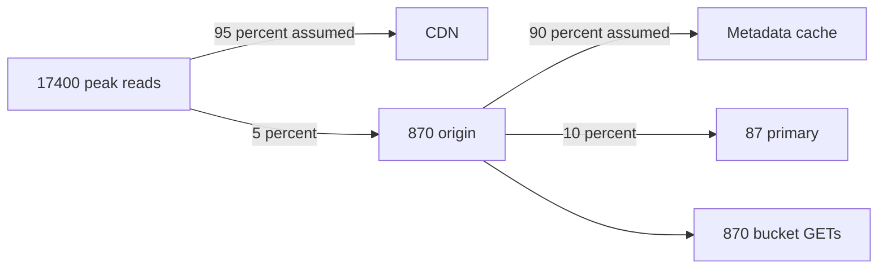
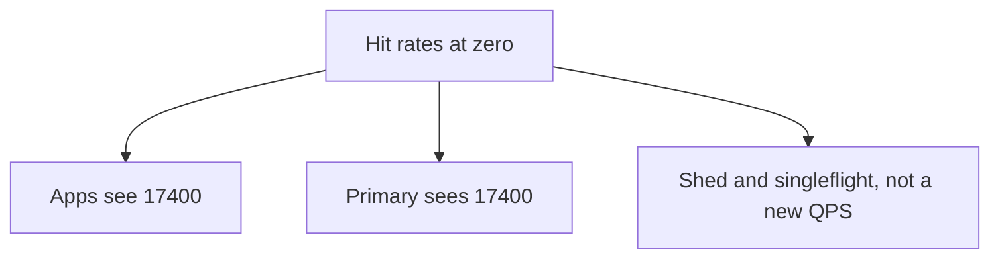

<!-- day-nav -->
[← Day 20 — Timeouts and retry storms](20-timeouts-and-retry-storms.md) · [Day 22 — Noisy neighbor and fairness →](22-noisy-neighbor-and-fairness.md)

# Day 21 — Capacity redo with visible assumptions

**Do now**

1. Set a timer.
2. Attempt the problem. Stop at the attempt line. Do not scroll.
3. Then read.

## Time box

40 minutes. Stop at 40 even if a product is unfinished.

| Minutes | Do this |
|---|---|
| 0–15 | Attempt. Recompute from the week-1 locks, then apply a hit rate you write down as an assumption. |
| 15–35 | Read. Recalculate any line that disagrees. Do not average your page with this one. |
| 35–40 | Close it and say which assumption, if wrong by a lot, puts the full peak back on the primary. |

## Intent

Facing a design that only works at the average, leave able to redo the estimate with fan-out and a stated cache-hit assumption. The new numbers are a fix for a picture that still quotes day-3 QPS at every box. They are not a new traffic model.

## Problem

> Design a pastebin. People paste text and share a link.

The interviewer says: "You have a CDN, a cache, a replica, and a queue. Do the math again. I want the hit rate in the open, and I want to know what each user request actually fans out into."

## Attempt before reading

15 minutes. Do not scroll. Locks you must start from, not the hit rate: 10 million creates a day, 50 reads per write, 10 KB mean, 3× peak, 45-day resident mix. Day 3's results if you need the checkpoint: about 116 writes/s average, 350 peak, 5,800 reads/s average, 17,400 peak, 4.5 TB, 1.4 Gbit/s peak egress.

Write:

1. Two hit rates, each labeled as an assumption: edge, and metadata cache on what the edge missed. Not "about 90" with no base.
2. Peak QPS at the origin, at the primary, and at the bucket, under those assumptions.
3. The same three if both hit rates are zero. That column is the design, not a footnote.
4. One fan-out: a cold read, as a count of downstream calls. A create, as the calls the user waits for.

---

**Stop. Worked redo below. Assumptions are not measurements.**

---

## Diagrams

### Where a peak read goes

Every percent on this picture is an assumption. The arrows are not measurements.

### The column that has to work

## Requirements

The contract and the week-1 locks do not move. Hit rate is not a requirement the interviewer handed you. It is an assumption you are adding, and day 3 called an invented hit rate a stacked safety factor when you used it to **avoid** a cache. You now have the cache and the edge. Using a hit rate to size what is behind them is legitimate **if the zero-hit column still has an answer.** If the only column that works is 95%, you do not have a design. You have a wish.

Decimal units, same as day 3. No second hidden 2×.

## Design by arithmetic

### Out loud

"Same front door as day 3. 116 writes a second average, 350 peak.

I am assuming, and I will instrument, a **95% CDN hit rate** on public GETs. I am assuming a **90% metadata-cache hit rate** on the GETs that still reach the origin.

Origin peak reads: 17,400 × 0.05 = **870/s**. Primary peak reads, if nine out of ten of those are cache hits: 870 × 0.10 = **87/s**.

If the edge hit rate is zero, origin reads are 17,400/s again and bucket bandwidth is 174 MB/s again. The metadata cache at 90% would still keep the primary near 1,740/s, which is under the 15,000 ceiling.

Creates did not get a hit rate. Peak **350 PUTs/s**, about 3.5 MB/s, and **350 commits/s**.

Fan-out, cold origin read: one cache get, one primary get, one bucket GET. I must not multiply 17,400 by three and call it QPS unless the edge and the cache both missed.

Cache RAM: I assume the hot metadata set is about **1% of live rows**, 4.5 million entries, a few hundred bytes each, about **2 GB** with overhead. The ring was for membership, not because 2 GB does not fit.

The assumption I instrument first is now the **CDN hit rate**, not the mean body size. But the QPS story I just told is wrong by 20× if the edge is bypassed, and only by 2× if the mean object is 20 KB.

### Check table

| Quantity | Expression | At the assumptions | If both hit rates are 0 |
|---|---|---|---|
| User read QPS, peak | 5,800 × 3 | 17,400 | 17,400 |
| Origin read QPS, peak | 17,400 × (1 − 0.95) | **870** | **17,400** |
| Primary read QPS, peak | 870 × (1 − 0.90) | **87** | **17,400** |
| Bucket GET, peak | origin reads × 10 KB | **870/s, ~8.7 MB/s** | **17,400/s, 174 MB/s** |
| User egress, peak | unchanged | ~1.4 Gbit/s, at the CDN | ~1.4 Gbit/s, at the origin |
| PUT, peak | 350 × 10 KB | **350/s, ~3.5 MB/s** | same |
| Primary commits, peak | creates + deletes | ~350 creates, and deletes in the same order when full | same |
| Cleanup jobs | ~116/s average | queue, not the user path | same |
| Metadata resident | unchanged | ~135 GB, plus a replica | same |
| Bodies resident | unchanged | 4.5 TB in the bucket | same |
| Cache RAM | 1% × 450e6 × ~400 B | **~2 GB** assumption | cold: ~0 until it fills |

Primary reads with edge cold and metadata hot: 17,400 × 0.10 = **1,740/s**. Still fine.

### Fan-out, written so you cannot skip it

| User call | Downstream calls they wait on | Calls that may happen after the response |
|---|---|---|
| GET, edge hit | none on your origin | none |
| GET, edge miss, metadata hit | cache get, bucket GET | none |
| GET, both miss | cache get, primary get, bucket GET | cache fill |
| POST | limiter, PUT, primary insert | none for correctness |
| DELETE | primary delete, tombstone, outbox row | object delete, CDN purge |

A fan-out of three on the cold GET is not three times the storage. It is three round trips inside the 300 ms budget from day 20.

Deletes at steady state match creates, about 116/s average. Do not add 116 to the primary **read** column.

### What you will not do with these numbers

You will not go back and delete the CDN because the primary only sees 87 reads a second. The CDN is why.

You will not quote 87 as the capacity plan on a slide without the assumption beside it. Day 3's rule still holds: a number nobody can invert is hand-waving.

You will not add another cache tier "because fan-out." Three calls on a miss, at 87 misses a second peak under the assumption, is idle. Another tier needs a break.

## Trade-offs

**Choice.** Quote both columns. Size the CDN for the full 1.4 Gbit/s. Use 95% and 90% only to say what you expect on a normal day, and instrument both.

**What you give up.** Four extra minutes, and an interviewer who thinks you are not confident because you showed the ugly column. You can live with that. The ugly column is how you know day 19's caps are still required after a week of adding boxes.

**What the single number gives up.** Checkability. If the edge is bypassed (a client that adds a cache-buster, a purge of the world, a new region of the CDN that is empty), your hundred QPS becomes 17,400 and you have no plan except surprise.

**10× break.** User peak reads ~174,000. At the same hit rates, origin is ~8,700/s and the primary is ~870/s. Creates are ~3,500 commits/s.

## Say this in the room

Day 3's peak still stands at the front door: 17,400 reads, 1.4 Gbit/s, 350 writes. I assume 95% of GETs hit the CDN and 90% of what remains hits the metadata cache. That is about 870 origin reads and about 87 primary reads at peak, and about 8.7 MB/s off the bucket. If both rates are zero, the primary sees 17,400 and I shed. I instrument the hit rates before I trust 87 for anything operational.

## Kit artifact

One estimation-sheet row.

| Assumption | Value | If it is wrong |
|---|---|---|
| CDN hit rate | 95% of public GETs | Origin sees the miss fraction. At 0%, primary and bucket return to the day-3 peak and you shed. |

Write a second row yourself for the metadata hit rate. That is the exercise.

## Design log

One line: the primary QPS you got, and whether you had a zero-hit column. If you had only the happy number, the gap is the missing column.

Next: [Day 22 — Noisy neighbor and fairness](22-noisy-neighbor-and-fairness.md).

---

<!-- day-nav -->
[← Day 20 — Timeouts and retry storms](20-timeouts-and-retry-storms.md) · [Day 22 — Noisy neighbor and fairness →](22-noisy-neighbor-and-fairness.md)
