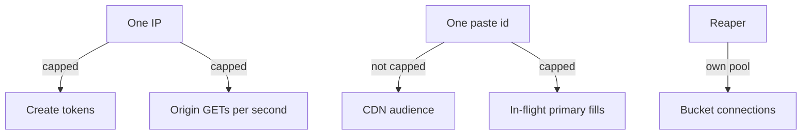
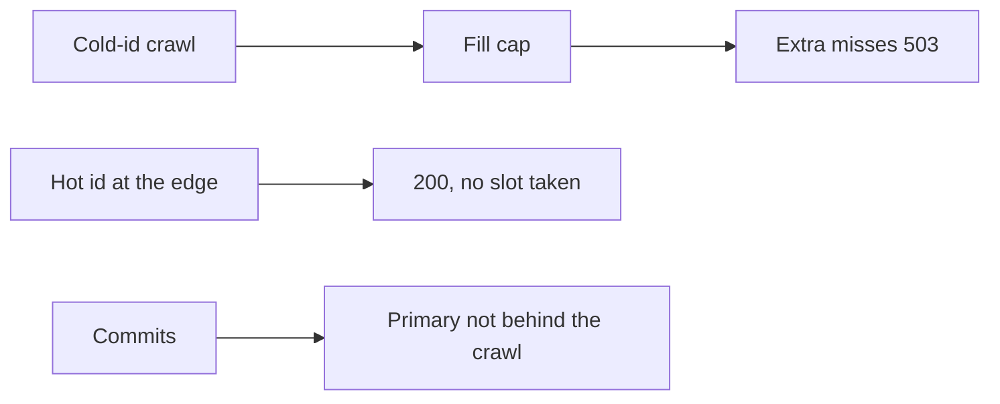

<!-- day-nav -->
[← Day 21 — Capacity redo with visible assumptions](21-capacity-redo-with-visible-assumptions.md) · [Day 23 — Read path and write path →](23-read-path-and-write-path.md)

# Day 22 — Noisy neighbor and fairness

**Do now**

1. Set a timer.
2. Attempt the problem. Stop at the attempt line. Do not scroll.
3. Then read.

## Time box

35 minutes.

| Minutes | Do this |
|---|---|
| 0–10 | Attempt. Name the neighbor. There is no account. Then cap one thing they can spend. |
| 10–28 | Read. If you rate-limited the viral paste at the edge, you capped the product. |
| 28–35 | Say the bulkhead: which pool a creator cannot drain, and which pool a single id cannot drain. |

## Intent

Facing tenants on one cluster, leave able to cap a noisy neighbor so one key cannot spend the whole budget. The cap is a fix for a shared pool. It is not an account system, and it is not a second copy of the rate limit day unless you can say what that day did not isolate.

## Problem

> Design a pastebin. People paste text and share a link.

The interviewer says: "You have no users, but you have neighbors. One of them is about to use the entire origin. Who is it, and what do you refuse them?"

## Attempt before reading

10 minutes. Do not scroll. Per-IP create limits exist (about 1/s and a byte budget). A global create cap is about 350/s. In-flight create slots are 50 per process. The CDN is not supposed to be limited per paste id. The primary ceiling is about 15,000 point reads/s. Cache nodes are on a ring.

Write:

1. Two neighbors you can name without accounts. One is an address. One is a paste id.
2. A pool each can exhaust (connections, primary reads, cache CPU, bucket GETs).
3. The cap, with a number, and the user who should **not** be capped (a reader of a hot link at the edge).
4. What a fair share means when one paste legitimately has half the reads.

---

**Stop. Caps on shared pools, below. The edge stays open for a hot id.**

---

## Requirements

Fairness here is not "every paste gets the same QPS." A paste with 8,700 readers and a paste with one reader are not equal, and should not be. Fairness is: **one neighbor cannot consume a shared origin budget that the others need to stay correct.**

The neighbors you actually have:

- A source IP, already limited on creates.
- A paste id, which can be hot on reads.
- A call type (create versus GET versus detach worker), already split into pools on day 19.
- A cache node, which can be hot because the ring put a busy id, or a busy limiter key, on one node.

You still have no tenant id. Do not invent an account so the fairness story looks like a textbook multi-tenant cluster. Say "the tenant is the IP or the id."

A viral read is not abuse. Day 17 refused to rate-limit it at the CDN. This day does not reverse that. The origin protection for a viral id is singleflight plus the edge, and a cap on **concurrent origin fills**, not a cap on audience size.

## Design

### One id must not own the primary

Singleflight, per process, collapses a hot key's misses to about one fill at a time per app. Four apps, four fills. That is enough when the key is hot and the cache is merely refreshing.

It is not enough when many keys miss at once on purpose: a client that cache-busts, or a neighbor that requests a wide set of cold ids so singleflight never triggers (every id is unique). Per-IP origin GET limit (50/s) bounds one address. Many addresses, one coordinated crawl of cold ids, is the distributed case again. The pool that protects the primary is a **global cap on concurrent cache-miss fills**, separate from singleflight.

Planning cap: **200 in-flight primary reads** cluster-wide, tracked coarsely (a counter in one place, or a per-app share of about 70 so you do not add a hot counter... 3 × 70 = 210). Past the cap, further misses **503** instead of querying the primary. Cache hits, including the hot key, do not take a slot. CDN hits do not take a slot. You are shedding cold origin misses, which are the neighbor's tool, and keeping the hit path.

Why 200: it is far under 15,000, and it is far above the happy-column primary QPS from day 21 (87/s, and a read takes a millisecond, so in-flight on a healthy day is a handful). The cap is idle until something is wrong. When it is wrong, the primary stays up and serves the writes and the deletes, which share the same database and must not wait behind a crawl.

Do not use this cap to "smooth" a normal miss. If honest traffic trips it, you sized it below the zero-hit plan. The zero-hit plan's answer is shed, though, so tripping it when the cache is empty is **correct**. The whole site cold is not a neighbor; it is an incident; 503s on misses and hits still served from the edge is the same priority as day 19.

### One id must not own a cache node

A single hot key is one entry. Metadata gets are cheap; 8,700/s of one small key on one cache node is a load you should be able to say "one node can do." If it cannot, the fix is not to salt the key across nodes (you refused that, the id is the key). The fix is the CDN taking the bytes so the origin, and therefore the metadata cache, does not see 8,700. If the interviewer says the cache node is at CPU limit on that one key anyway, you put a **tiny process-local cache of one entry** in front, a single-key stash with the same TTL rules and the same tombstone check. That is not a new tier. That is "the hot key does not cross the network 8,700 times." The other keys still use the ring. You did not give the hot key a private cluster.

Limiter keys are different: a neighbor who spreads creates across many IPs spreads limiter keys across the ring, which is fine. A neighbor who hammers one IP hammers one limiter key. The atomic increment on that key is the point of the limiter. It is supposed to be hot. One key at the create limit is 1 increment a second, not 8,700. Not a problem. Do not "fix" the limiter by sampling so hard that the budget becomes a suggestion.

### One call type must not own the bucket connections

Day 19's bulkhead, restated as fairness: the detach worker, the origin GET, and the create PUT do not share one pool. A reap backlog of hundreds per second must not check out every connection and stall creates that you intended to serve, and a create shed must not stop the worker from deleting objects. Planning split of a per-process bucket client, say **40** connections if you even need that many:

| Pool | Share | If it is exhausted |
|---|---|---|
| Origin GET | half | 503 cold reads |
| PUT | a third | 503 creates |
| Delete and reap | the rest | outbox age grows, readers of live pastes unaffected |

The exact integers are less important than the fact that they are separate. A single shared pool is how the cleanup job becomes a neighbor of the user.

### What you will not call a neighbor

The replica. It does not take user traffic. It cannot "use up" the read budget because you refused to read it for GETs.

The sweeper's range query, as long as it is batched and slow. If someone runs it as a tight loop, it is a neighbor of the primary's writes. Cap it: one batch at a time, a few hundred rows, sleep. That is fairness between a background job and the commit path. You already had this instinct on day 5 ("limit per batch so it cannot starve reads"). Keep it.

Honest readers of one viral paste at the CDN. They are the workload. A fairness policy that gives every id 10 reads a second will 503 the paste that made the product matter. Do not do that and call it multi-tenant discipline.

## Diagrams

### Pools a neighbor can and cannot spend

### What stays up

## Trade-offs

**Choice.** Keep per-IP create and origin-GET limits. Add a cluster cap on concurrent primary fills. Separate bucket connection pools for GET, PUT, and cleanup. Do not cap CDN traffic per id. A one-entry local stash only if a single cache node is actually hot on one metadata key.

**Alternative.** Equal QPS per paste id, or one shared connection pool because it is simpler, or accounts so you can do "real" tenant quotas.

**What you give up.** A cold-id crawl gets 503s, and so do honest readers of rarely accessed pastes **while** the crawl is happening, if they need the primary. You are punishing cold legitimate reads to save the primary. That is the trade. The alternative is the primary dies and hot path commits fail too, which punishes everyone. You also give up a single pool's simplicity. Three pools can be exhausted independently, which means three graphs to look at. Worth it.

**Why not equal QPS per id.** It confuses abuse with popularity. The expensive shared resource is the origin miss, not the existence of readers.

**10× break.** The fill cap of ~200 in flight still protects a primary at ~3,500 commits/s only if those commits have CPU left. A cap on reads does not enlarge write capacity. At 10× the noisy neighbor can be **honest traffic**: the zero-hit column is ~174,000 origin reads, and the fill cap will shed most of them. That is correct and it will look like an outage. The fairness tool is not a substitute for the CDN assumption holding. If every id is "the neighbor," you do not have a neighbor. You have under-capacity. Say that, or you will spend the incident tuning quotas.

## Talking points

**Say.** "I don't have accounts. My neighbors are a source IP, a paste id, and a background worker. The IP is already capped before the PUT. The id is not capped at the CDN. It is capped at concurrent primary fills, so a crawl of cold keys can't sit on the database. The worker has its own bucket connections so a reap backlog can't starve PUTs, and PUTs can't starve reaps. A viral paste is not the neighbor."

**Say.** "Fair is not equal QPS. Fair is that one key doesn't get to spend the budget the commit path needs."

**Hand-waving.** "We isolate tenants." Which key, which pool, what do the others see when the cap hits?

**Hand-waving.** "Each customer gets a namespace." You have one namespace. The id space is the namespace. Do not draw a tenant service.

**If they ask about the hot key on one cache node again.** "Virtual nodes balance ids, not QPS. One id stays on one node. The audience should be on the CDN. If metadata gets for that one id are actually the CPU problem, I stash that one entry on the app for the TTL window. I don't salt the key."

**If they ask what you page on.** Primary in-flight fills sitting on the cap. One cache node hot while the others are idle, for longer than a single-key refresh. Outbox age, which tells you the cleanup pool is losing. A per-IP 429 is not a page by itself.

## Kit artifact

One checklist row.

| Row | Lock |
|---|---|
| Fairness | The neighbor is named (IP, id, or job). The pool they cannot exhaust is named. Popularity at the edge is not a violation. |

## Design log

One line: the neighbor you capped, and the person you refused to cap. If those were the same person, the gap is the viral paste.

Next: [Day 23 — Read path and write path](23-read-path-and-write-path.md).

---

<!-- day-nav -->
[← Day 21 — Capacity redo with visible assumptions](21-capacity-redo-with-visible-assumptions.md) · [Day 23 — Read path and write path →](23-read-path-and-write-path.md)
