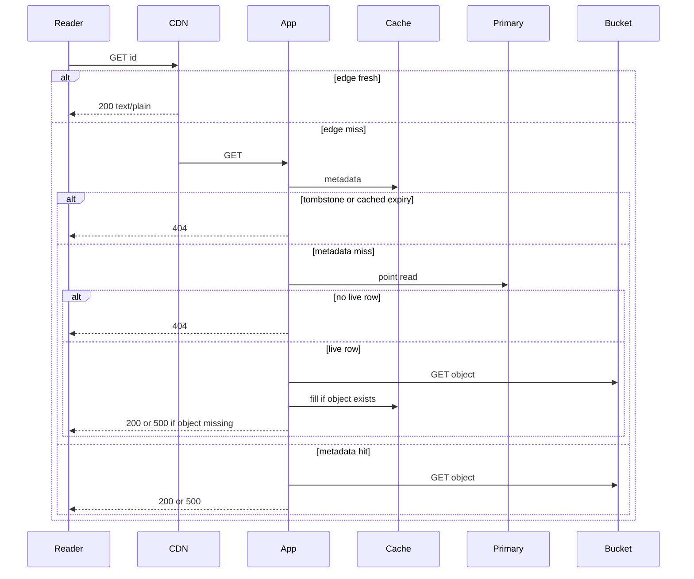
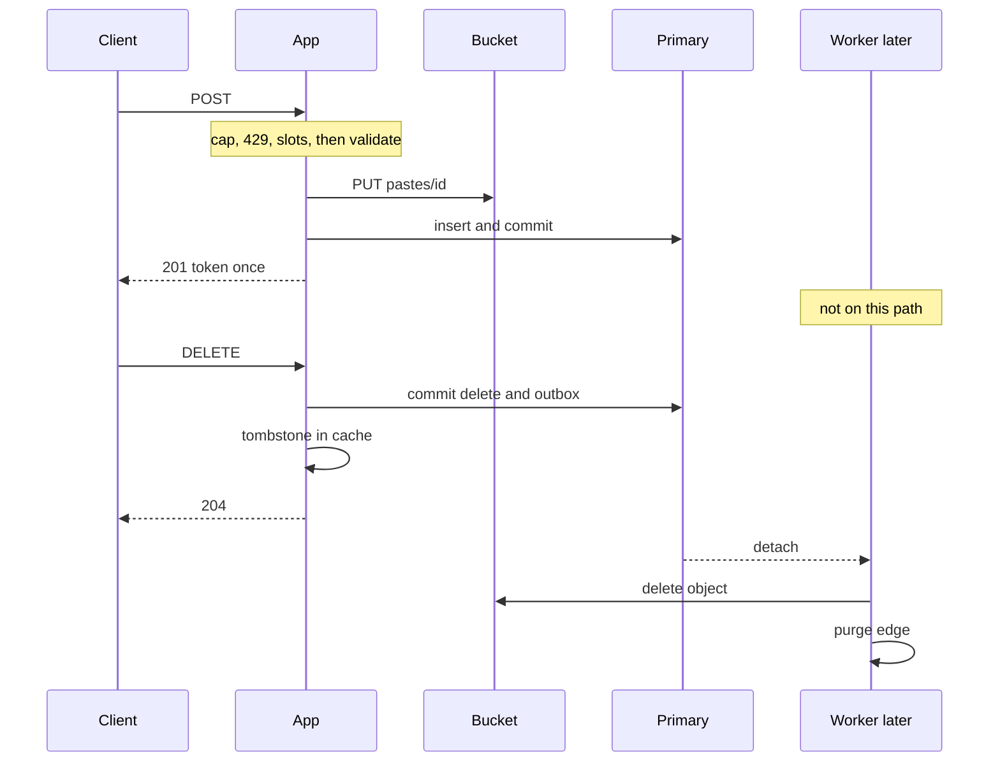

<!-- day-nav -->
[← Day 22 — Noisy neighbor and fairness](22-noisy-neighbor-and-fairness.md) · [Day 24 — The order-of-magnitude break →](24-the-order-of-magnitude-break.md)

# Day 23 — Read path and write path

**Do now**

1. Set a timer.
2. Attempt the problem. Stop at the attempt line. Do not scroll.
3. Then read.

## Time box

35 minutes.

| Minutes | Do this |
|---|---|
| 0–12 | Attempt. Two sequences, not one picture. Every arrow has a name. Mark the ack. |
| 12–28 | Read. Move any box you drew on both paths onto the path that actually uses it. |
| 28–35 | Close the page and narrate both sequences out loud, including the 404 branch and the 201 point. |

## Intent

Facing one tangled picture, leave able to narrate the read path and the write path as separate sequences. No new box today. If a tier does not appear in either sequence, it is decoration.

## Problem

> Design a pastebin. People paste text and share a link.

The interviewer says: "Walk a read, then walk a create, then a delete. I don't want the infrastructure diagram. I want the order."

## Attempt before reading

12 minutes. Do not scroll. The system you have, whether or not you remember every cap: app tier behind a balancer, metadata cache, Postgres primary with an async replica you do not read for GETs, private bucket, CDN on GET only, queue only for detach and reap, limits before PUT.

Narrate, as numbered steps:

1. A GET that hits the edge.
2. A GET that misses the edge and misses the metadata cache. Include 404 and the missing-object 500.
3. A POST, and the exact step where 201 is legal.
4. A DELETE, and what is still true after 204 while the worker has not run.

If a step says "async," replace it with who runs it and whether the user is waiting.

---

**Stop. The sequences below are the pastebin as it stands. Nothing new.**

---

## Requirements

Same contract, now easy to violate by mixing paths:

- 201 only after PUT ack and primary commit.
- 204 only after the row is gone and the tombstone is written. The object and the edge may lag, bounded.
- 404 for missing, expired, and bad delete token, same body on GET.
- 500, not 404, when the row is live and the object is gone, or when a dependency fails.
- Creates are not retried by the app and are not idempotent.
- The replica is not on the GET fill path.

If a sequence contradicts one of those, the sequence is wrong, not the contract.

## Design

You already chose the boxes. This day is the order. Speak it as a story the interviewer can interrupt.

### Read path

**Edge hit.** The reader sends `GET /v1/pastes/{id}`. The CDN has a fresh `200` whose max-age has not elapsed and whose stored `expires_at` was in the future when the origin set max-age to `min(60, remaining)`. The edge returns `text/plain` and `nosniff`. The origin sees nothing. This is the path you want for the hot key. It is not the path you use to argue the primary is "in the design" of that particular read. Say "this read does not touch us."

**Edge miss, metadata hit.** The CDN asks the app. The balancer picks an app by least connections. The app checks the limiter only if this is an origin GET flood; a normal miss is under the cap. The app loads the metadata entry from the cache node that owns the id. The entry is live: `expires_at` is still ahead of the app clock, and it is not a tombstone. The app GETs `pastes/{id}` from the private bucket and streams the body, with `Cache-Control` capped as above. The primary is not read. The replica is not read. The queue is not involved.

**Edge miss, metadata miss.** Cache get returns nothing. The app takes a primary-fill slot (the fairness cap). Point read on the **primary**.

- No row, or `expires_at` already past: 404, do not fill a negative, do not GET the bucket, do not let the CDN cache the 404.
- Tombstone in the cache from a delete that raced: 404, even if you somehow also saw a row. The tombstone wins.
- Live row: GET the object. If it is missing, 500 and `body_missing`, and do not cache a success. If it is present, fill the metadata cache with a jittered TTL of 45 to 75 seconds, singleflight so the other waiters on this process share the result, then stream the body with the cache header.

**Expired entry in the metadata cache.** This is a hit that behaves like a 404. You do not need the primary to reject it. You check the timestamp inside the value.

Say the branches out loud. A straight line from client to bucket is the tour of optimism day 6 warned about.

### Write path

**Create.**

1. Balancer to any app. No stickiness.
2. `Content-Length` against 1,000,000. Over: 413, stop.
3. Per-IP count and byte tokens, and the global create ceiling. Over: 429, stop. No mint, no PUT.
4. In-flight create slots and byte cap on the process. Over: 503, stop.
5. Read the body. Bad UTF-8 or bad TTL: 400, stop. Still no PUT.
6. Mint a 12-character id. Generate the 128-bit token, hash it.
7. PUT `pastes/{id}`. Timeout 1 second, no app retry. On timeout or error: 503, reap if the bytes might have landed, no insert.
8. Insert the row on the primary. Unique conflict: remint a limited number of times and PUT again, or fail. Do not read the replica to "check if it exists."
9. Commit. **Then** 201 with the token, once. The CDN is not warmed. The metadata cache is not warmed. The queue is not used.

The user waited through step 9. Everything you were tempted to call async on create is either before the 201 and required, or it is not on this path.

**Delete.**

1. Any app. Lookup the row on the primary. Wrong token, missing, or expired: 404. Same body as a GET miss.
2. Commit the row delete, the outbox job, and the cache tombstone. These want to be one unit: the outbox row is the same database commit as the delete; the tombstone is a cache write you do before returning. If the tombstone write fails, you still deleted the row; a later GET misses, hits the primary, sees no row, 404s. The race is the other direction (late fill), which the tombstone closes when it lands. Say so if they ask. Do not pretend the cache and the database share a transaction.
3. 204. The user is done.
4. A worker drains the outbox, deletes the object, purges the CDN. Twice is safe. Until purge or max-age, an edge may still serve the body. Origin GETs 404.

**Make step 1 and step 2 one statement.** "Look up, compare the token hash, then delete" in two round trips lets two concurrent deletes both pass the check. Do it as one conditional delete on the primary: delete the row where the id matches, the token hash matches, and `expires_at` is in the future, returning whether a row went. Zero rows is the 404, whichever of the three reasons it was. The outbox insert rides the same transaction. One statement closes the race and keeps the three 404 reasons indistinguishable, which the contract wanted anyway.

**The window between commit and tombstone.** The row is gone before the tombstone lands, by a millisecond or so. A reader whose metadata is a cache hit in that window still gets a 200. Name it as the smallest stale window in the system and move on; it is narrower than the edge's 60 seconds by four orders of magnitude.

**What never appears.** The replica, on all three sequences, except that the insert's WAL will ship after the commit, off to the side, not as a step the user waits for. The sweeper, which is a batch on the primary or a candidate scan on the replica with the delete on the primary, then the same detach job. Mention it if they ask who deletes expired objects. Do not put it inside the GET story. GET already enforced expiry.

### Branch frequencies and latency, so the order has weight

At the day 21 assumptions, of 17,400 peak reads: about **16,530** end at the edge, about **783** are origin reads with a metadata hit, and about **87** go all the way to the primary. With the edge cold: none at the edge, about **15,660** metadata hits, about **1,740** primary reads. Say the branch with its count. "Some reads hit the primary" is vague; "87 a second at the assumptions, 1,740 with the edge cold" is the answer.

Latency by branch, as planning numbers you can be wrong about:

| Branch | Steps the reader waits on | Rough p50 at the origin |
|---|---|---|
| Edge hit | reader to nearest edge | origin adds nothing |
| Edge miss, metadata hit | edge to app, cache get, bucket GET | about 30 to 50 ms, mostly the bucket |
| Both miss | the above plus a primary read | a few ms more |
| Create | limiter, PUT, insert, commit | about 50 to 100 ms, mostly the PUT |

The lesson in the table: the **bucket** is the slowest step on every origin path, and the **primary** is the most fragile. Removing the primary read from a path barely changes its latency. Removing the bucket from a path, which only the edge does, changes everything. When the interviewer asks "how would you make reads faster," the honest answer is the edge hit rate, not a faster database.

### What each dependency's death does to each path

| Dead | Edge hit | Miss, meta hit | Both miss | Create | Delete |
|---|---|---|---|---|---|
| CDN | goes to origin | works | works | works | works, purge fails, no edge to purge |
| Cache | works | becomes both miss | works, slower | works; limiter fails open | works; tombstone missing, late-fill race reopens |
| Primary | works | works | 500 | 500 | 500 |
| Bucket | works | 500 | 500 | 503 | works; object delete queued |
| Queue | works | works | works | works | works; detach waits in the outbox |

Every cell is a sentence the user would feel. Two reads off the table are worth saying unprompted: the **edge hit survives every dependency**, and the **delete survives everything except the primary**. Day 25 takes one row of this and does it properly.

What staff sounds like here is narrating with weights. The order of steps is table stakes; the staff signal is attaching a count and a latency to each branch and knowing which dependency each branch can survive. The interviewer who said "I want the order" is listening for whether you know which order runs most often.

## Diagrams

### Read

### Write

Draw these as two pictures on paper, with a gap between them. The gap is the point of the day.

Caption the read: "Four exits: edge 200, 404, origin 200, 500. The primary sits on one branch of one branch." Write the branch counts, 16,530 / 783 / 87, in the margin beside each `alt`.

Caption the write: "201 after commit. 204 before detach. The worker is below a line the user never crosses." Draw a horizontal line under the 204 and label it "user is gone." Everything under it is copies being removed.

## Failure the user sees, path by path

**Reader of a hot link.** Sees a 200 from the edge through any single dependency's death. The worst case is a CDN outage, which turns the hot link into an origin read that day 15 said one NIC cannot carry.

**Reader of a cold link.** Needs the app, the bucket, and either the cache or the primary. Bucket dead: 500. Primary dead: 500 on a metadata miss, 200 on a hit. Never 404 for an outage.

**Creator.** Needs the limiter's verdict (fails open), a PUT, and a commit. Bucket dead: 503 before anything is written. Primary dead: 500 after the PUT, with an orphan for the reaper. Never a 201 for a paste that is not durable.

**Deleter.** Needs only the primary to commit. Everything else, object, purge, can lag. The bound they experience is the edge's max-age: a reader somewhere may see the paste for up to a minute after the 204.

## Trade-offs

**Choice.** Two sequences. The read can end at the edge, at a 404, at a 500, or at a 200. The create has one legal ack point. The delete acks before detach.

**Alternative.** One diagram with every tier and a single arrow labeled "read/write."

**What you give up.** The comfort of one picture you can point at and say "the architecture." You will redraw two shorter ones under questions. You gain the ability to answer "does this read hit the primary?" with a condition instead of a yes.

**Name the refusal inside the alternative.** Against the single diagram: you refuse a picture that cannot say which reads touch the primary, and that forces "the site is down" when one dependency dies. Against narrating "async" without an owner: you refuse a word that hides whether the user is waiting. Against a two-statement delete: you refuse a check-then-act race on the one path where the token is the only authority. Each refusal names a question the interviewer could no longer answer.

**10× break.** The sequences do not change at 10×. The **branch frequencies** do. If the edge assumption holds, most reads take the first branch and the primary barely appears. If it does not, almost every read takes the miss branch and the fill cap sheds. The order of the create does not get a shortcut at 10×: you still cannot 201 before the PUT. An interviewer who asks "what would you async to survive 10×?" is asking you to move the ack. You refuse. The thing that breaks is the commit rate, which is the next day, not the order of these arrows.

## Talking points

**Say.** "I'll do the read first. Most of them should end at the CDN. If they don't, I check the metadata cache, and I only touch the primary on a miss. 404 if the row is gone or expired. 500 if the row is live and the object isn't. Then the create: nothing is written until the limit and the size pass, PUT, then commit, then 201. Delete commits the row and the outbox, writes the tombstone, returns 204. The worker deletes the object and purges. I don't read the replica on any of these."

**Say.** "The queue is on the delete picture below the 204 line. It is not on the create picture at all."

**Hand-waving.** "The request hits the stack." Which branch? A stack is not a sequence.

**Hand-waving.** "Writes go to the primary, reads go to the cache." Some reads go to the primary. Some reads go nowhere near you. Deletes go to the primary and then the cache as a tombstone, not as a fill.

**If they ask you to merge them.** "I'll keep two. The failure questions are different. A dead bucket stops creates and cold reads, and does not stop an edge hit. One picture makes me say the site is down."

**If they ask which reads touch the primary.** "At my assumptions, about 87 a second at peak: edge miss and metadata miss. With the edge cold, about 1,740. With both cold, all 17,400, and the fill cap sheds."

**If they ask how to make reads faster.** "The bucket is the slow step on every origin path, 30 to 50 ms. The primary read is a few ms. The only thing that removes the bucket from a read is an edge hit, so the lever is the edge hit rate, not the database."

**If they push on two concurrent deletes.** "It's one conditional delete: id, token hash, and not expired, in one statement with the outbox insert. One wins, the other gets zero rows and a 404."

**If they ask where the replica is.** "Off this narration. WAL shipping after commit. Promotion is a failure overlay, not a step in a healthy GET."

## Say this in the room

Read first. A fresh edge copy returns 200 and the origin never sees it; at my assumptions that's about 16,500 of 17,400 peak reads. On an edge miss, the app checks the metadata cache: a tombstone or a past `expires_at` is a 404 without touching the primary; a live entry means a bucket GET and a 200, or a 500 if the object is gone. Only a metadata miss reads the primary, about 87 a second, under the fill cap, then fills with a jittered TTL. The bucket is the slow step on every origin path; the primary is the fragile one. Create: size, limiter, slots, validate, mint, PUT, commit, then 201, and nothing before the commit is a link. Delete: one conditional delete with the outbox row, the tombstone, 204; the worker removes the object and purges later, and an edge may serve it for up to a minute. The edge hit survives every dependency; the delete survives everything but the primary. The replica isn't on any of these paths.

## Kit artifact

One stencil note. The blanks are the kit's, later. The paths are today's practice.

| Stencil | This pastebin |
|---|---|
| Read and write, separate | GET may end at the edge. POST acks only after PUT and commit. DELETE acks before detach. |

## Design log

One line: the step where your attempt returned 201, and whether a GET could reach the bucket without a visibility check. If those were fuzzy, the gap is the fuzzy one.

Next: [Day 24 — The order-of-magnitude break](24-the-order-of-magnitude-break.md).

---

<!-- day-nav -->
[← Day 22 — Noisy neighbor and fairness](22-noisy-neighbor-and-fairness.md) · [Day 24 — The order-of-magnitude break →](24-the-order-of-magnitude-break.md)
