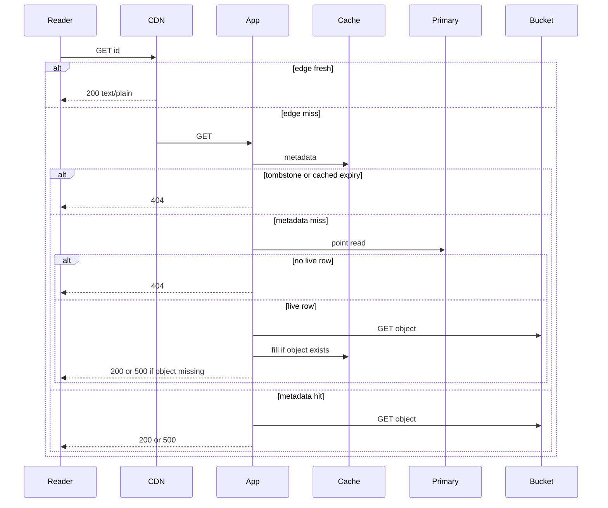
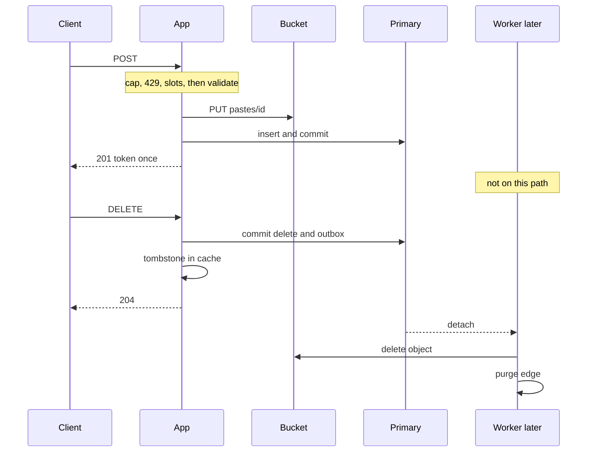

<!-- day-nav -->
[← Day 22 — Noisy neighbor and fairness](22-noisy-neighbor-and-fairness.md) · [Day 24 — The order-of-magnitude break →](24-the-order-of-magnitude-break.md)

# Day 23 — Read path and write path

**Do now**

1. Set a timer.
2. Attempt the problem. Stop at the attempt line. Do not scroll.
3. Then read.

## Time box

35 minutes.

| Minutes | Do this |
|---|---|
| 0–12 | Attempt. Two sequences, not one picture. Every arrow has a name. Mark the ack. |
| 12–28 | Read. Move any box you drew on both paths onto the path that actually uses it. |
| 28–35 | Close the page and narrate both sequences out loud, including the 404 branch and the 201 point. |

## Intent

Facing one tangled picture, leave able to narrate the read path and the write path as separate sequences. No new box today. If a tier does not appear in either sequence, it is decoration.

## Problem

> Design a pastebin. People paste text and share a link.

The interviewer says: "Walk a read, then walk a create, then a delete. I don't want the infrastructure diagram. I want the order."

## Attempt before reading

12 minutes. Do not scroll. The system you have, whether or not you remember every cap: app tier behind a balancer, metadata cache, Postgres primary with an async replica you do not read for GETs, private bucket, CDN on GET only, queue only for detach and reap, limits before PUT.

Narrate, as numbered steps:

1. A GET that hits the edge.
2. A GET that misses the edge and misses the metadata cache. Include 404 and the missing-object 500.
3. A POST, and the exact step where 201 is legal.
4. A DELETE, and what is still true after 204 while the worker has not run.

If a step says "async," replace it with who runs it and whether the user is waiting.

---

**Stop. The sequences below are the pastebin as it stands. Nothing new.**

---

## Diagrams

### Read

### Write

Draw these as two pictures on paper, with a gap between them. The gap is the point of the day.

## Requirements

Same contract, now easy to violate by mixing paths:

- 201 only after PUT ack and primary commit.
- 204 only after the row is gone and the tombstone is written. The object and the edge may lag, bounded.
- 404 for missing, expired, and bad delete token, same body on GET.
- 500, not 404, when the row is live and the object is gone, or when a dependency fails.
- Creates are not retried by the app and are not idempotent.
- The replica is not on the GET fill path.

If a sequence contradicts one of those, the sequence is wrong, not the contract.

## Design

You already chose the boxes. This day is the order. Speak it as a story the interviewer can interrupt.

### Read path

**Edge hit.** The reader sends `GET /v1/pastes/{id}`. The CDN has a fresh `200` whose max-age has not elapsed and whose stored `expires_at` was in the future when the origin set max-age to `min(60, remaining)`.

**Edge miss, metadata hit.** The CDN asks the app. The balancer picks an app by least connections.

**Edge miss, metadata miss.** Cache get returns nothing. The app takes a primary-fill slot (the fairness cap). Point read on the **primary**.

- No row, or `expires_at` already past: 404, do not fill a negative, do not GET the bucket, do not let the CDN cache the 404.
- Tombstone in the cache from a delete that raced: 404, even if you somehow also saw a row. The tombstone wins.
- Live row: GET the object. If it is missing, 500 and `body_missing`, and do not cache a success. If it is present, fill the metadata cache with a jittered TTL of 45 to 75 seconds, singleflight so the other waiters on this process share the result, then stream the body with the cache header.

**Expired entry in the metadata cache.** This is a hit that behaves like a 404. You do not need the primary to reject it. You check the timestamp inside the value.

Say the branches out loud. A straight line from client to bucket is the tour of optimism day 6 warned about.

### Write path

**Create.**

1. Balancer to any app. No stickiness.
2. `Content-Length` against 1,000,000. Over: 413, stop.
3. Per-IP count and byte tokens, and the global create ceiling. Over: 429, stop. No mint, no PUT.
4. In-flight create slots and byte cap on the process. Over: 503, stop.
5. Read the body. Bad UTF-8 or bad TTL: 400, stop. Still no PUT.
6. Mint a 12-character id. Generate the 128-bit token, hash it.
7. PUT `pastes/{id}`. Timeout 1 second, no app retry. On timeout or error: 503, reap if the bytes might have landed, no insert.
8. Insert the row on the primary. Unique conflict: remint a limited number of times and PUT again, or fail. Do not read the replica to "check if it exists."
9. Commit. **Then** 201 with the token, once. The CDN is not warmed. The metadata cache is not warmed. The queue is not used.

The user waited through step 9. Everything you were tempted to call async on create is either before the 201 and required, or it is not on this path.

**Delete.**

1. Any app. Lookup the row on the primary. Wrong token, missing, or expired: 404. Same body as a GET miss.
2. Commit the row delete, the outbox job, and the cache tombstone. These want to be one unit: the outbox row is the same database commit as the delete; the tombstone is a cache write you do before returning. If the tombstone write fails, you still deleted the row; a later GET misses, hits the primary, sees no row, 404s. The race is the other direction (late fill), which the tombstone closes when it lands. Say so if they ask. Do not pretend the cache and the database share a transaction.
3. 204. The user is done.
4. A worker drains the outbox, deletes the object, purges the CDN. Twice is safe. Until purge or max-age, an edge may still serve the body. Origin GETs 404.

**What never appears.** The replica, on all three sequences, except that the insert's WAL will ship after the commit, off to the side, not as a step the user waits for. The sweeper, which is a batch on the primary or a candidate scan on the replica with the delete on the primary, then the same detach job.

## Trade-offs

**Choice.** Two sequences. The read can end at the edge, at a 404, at a 500, or at a 200.

**What you give up.** The comfort of one picture you can point at and say "the architecture." You will redraw two shorter ones under questions. You gain the ability to answer "does this read hit the primary?" with a condition instead of a yes.

**10× break.** The sequences do not change at 10×. The order of the create does not get a shortcut at 10×: you still cannot 201 before the PUT. An interviewer who asks "what would you async to survive 10×?" is asking you to move the ack.

## Say this in the room

Most reads should end at the CDN. On a miss I check metadata, and I touch the primary only if that misses: 404 if the row is gone or expired, 500 if the row is live and the object is not. Create does nothing until the limit passes, then PUT, then commit, then 201. Delete commits the row and the outbox, writes the tombstone, and returns 204 before the worker purges. I do not read the replica on any of these.

## Kit artifact

One stencil note. The blanks are the kit's, later. The paths are today's practice.

| Stencil | This pastebin |
|---|---|
| Read and write, separate | GET may end at the edge. POST acks only after PUT and commit. DELETE acks before detach. |

## Design log

One line: the step where your attempt returned 201, and whether a GET could reach the bucket without a visibility check. If those were fuzzy, the gap is the fuzzy one.

Next: [Day 24 — The order-of-magnitude break](24-the-order-of-magnitude-break.md).

---

<!-- day-nav -->
[← Day 22 — Noisy neighbor and fairness](22-noisy-neighbor-and-fairness.md) · [Day 24 — The order-of-magnitude break →](24-the-order-of-magnitude-break.md)
