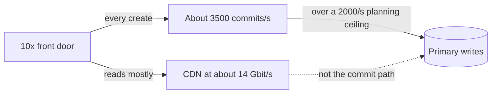
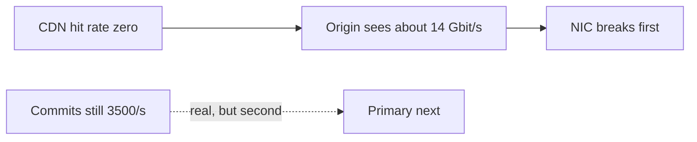

<!-- day-nav -->
[← Day 23 — Read path and write path](23-read-path-and-write-path.md) · [Day 25 — Failure overlay on the pastebin →](25-failure-overlay-on-the-pastebin.md)

# Day 24 — The order-of-magnitude break

**Do now**

1. Set a timer.
2. Attempt the problem. Stop at the attempt line. Do not scroll.
3. Then read.

## Time box

35 minutes.

| Minutes | Do this |
|---|---|
| 0–12 | Attempt. Multiply the front door by ten. Name **one** component that breaks first, under assumptions you write down. |
| 12–28 | Read. If your first break is "we'd shard everything," replace it with one component. |
| 28–35 | Say the next fix in one sentence, and one fix you would not reach for. |

## Intent

Facing a large jump in traffic, leave able to name the first component that breaks and the fix you would reach for next. Ten times is a question about order, not a shopping list.

## Problem

> Design a pastebin. People paste text and share a link.

The interviewer says: "Same product, ten times the ingest, same read ratio, same mean size. What breaks first?"

## Attempt before reading

12 minutes. Do not scroll. From day 21, if you kept them: at 1×, peak 350 writes/s and 17,400 reads/s. With an assumed 95% CDN hit and 90% metadata hit, the primary sees about 87 reads/s and still sees every commit. The primary read ceiling you used was about 15,000/s. The user-facing egress at 1× peak is about 1.4 Gbit/s.

Write:

1. Peak writes, peak user reads, and peak commits at 10×. The commit number has no hit rate.
2. The first component that does not survive **if the hit rates still hold**.
3. The first component that does not survive **if the CDN hit rate is zero**. Different answer. Say which one you are betting.
4. The next fix for the answer you bet on, and a fix that would not touch that break (a CDN does not make commits cheaper).

---

**Stop. One break, under a stated assumption, below.**

---

## Requirements

10× means 100 million new pastes a day, not a new product. 50 reads per write still. 10 KB mean still. 3× peak still. 45-day mix still. No extra safety factor hiding inside "10× plus headroom."

| Quantity | 1× peak | 10× peak |
|---|---|---|
| Writes | ~350/s | **~3,500/s** |
| User reads | 17,400/s | **~174,000/s** |
| Ingest | 100 GB/day | **1 TB/day** |
| Bodies resident | 4.5 TB | **45 TB** |
| Live objects | 450 million | **4.5 billion** |
| User egress | ~1.4 Gbit/s | **~14 Gbit/s** |
| PUT bandwidth | ~3.5 MB/s | **~35 MB/s** |

Ids: day 4 already checked 12-character base62 at this mint rate for a decade. A handful of expected collisions, absorbed by the unique key. The id does not break. Do not start there.

## Design

### The bet

You bet the day-21 assumptions **hold**: 95% of GETs hit the CDN, 90% of origin GETs hit the metadata cache. You say that before you name a component. If they tell you the edge will not hold, you switch bets. You do not give two architectures.

Under that bet, at 10×:

- CDN serves ~14 Gbit/s and ~165,000 of the 174,000 reads. You treat CDN capacity as a quota you must confirm, not as an infinite box. If the quota is below 14 Gbit/s, the CDN is the break and the fix is the quota or a second network path **you pay the CDN for**, not an origin you scale to 14 Gbit/s "just in case." For the rest of this page, assume the quota exists, because that was the point of day 15. Name the assumption.
- Origin reads ~8,700/s. Four app processes at an 8,000 ceiling still fit (32,000, or 24,000 with one down). You do not add a fleet first.
- Primary **reads** ~870/s. Under the 15,000 ceiling. The cache did its job.
- Bucket GETs ~8,700/s × 10 KB ≈ **87 MB/s**. Fine. PUTs ~35 MB/s. Fine.
- Primary **commits ~3,500/s**, plus the delete stream. When the 45-day window is full, deletes are the same order as creates, so the primary may see on the order of **several thousand row commits a second**, not 3,500 reads.

New planning ceiling, same kind as the others: **about 2,000 small commits a second** on one primary that is also shipping WAL to an async replica. Not a benchmark. You might be low. If they say this hardware does 10,000, the break moves and you should be glad. At the ceiling you are willing to say in the room, **3,500 is already over, and the delete stream makes it worse.**

**First component: the Postgres primary, on writes.** Not the CDN, not the app, not the bucket's byte rate, not the cache.

Why it wins over the others: every other hot number has a hit rate in front of it. Commits do not. You refused to queue the create. You refused to ack before the insert. So every one of the 3,500 is a real commit. That honesty is why the primary breaks first. A design that queued creates would break the queue or lie about durability instead. You would rather break the primary on paper.

### The fix you reach for next

**Partition the metadata by id**, still SQL, still the same row. Each partition takes a slice of the hash of the id. Point reads and inserts go to one partition. You do not build it today. You name it, and you name the query it complicates: the sweeper's `expires_at` range, which becomes "each partition sweeps itself" or the time-bucket from day 12. That cost is why you did not partition at 350/s.

A bigger primary is the fix you reach for **before** partitioning if the ceiling was conservative. One step up in hardware is allowed as a sentence. It is not a plan at the next 10× after that. Say "I buy headroom once, I partition when the commit rate is the product."

Do not reach for:

- A CDN upgrade, as the answer to commits. It does not see writes.
- A cache in front of inserts. A cache is not durable. Write-back is the early ack.
- NoSQL as the word you say instead of "partition the key." Day 12's range query is still there.
- More app processes. They are not the ceiling under this bet.
- Consistent hashing of the primary with cache semantics. A missed partition is a lost row.

### The other bet, so you can switch in one sentence

If the CDN hit rate is **zero**, user egress of ~14 Gbit/s hits the origin. One 10 Gbit NIC is the first break, the same break as day 3, and it happens **before** you get to argue about commits, because the site is already failing the read. The fix is the CDN you should already have had, or more origin bandwidth if they forbid an edge. The primary's 3,500 commits are still real, but they are not first.

If they ask "which bet is yours?": the hit-rate bet, because you spent days 10 and 15 earning those boxes, and you will page if the hit rate is wrong (day 21). You do not design the zero-hit 10× as the steady state. You shed it.

### Objects at 4.5 billion

This is the second break, not the first, under the hit-rate bet. 45 TB of 10 KB objects will not break PUT bandwidth. It will break any operation that **lists**. The reaper stays key-directed from the outbox and the failure log. A restore story that is "list the bucket and copy" will not finish. You say that as the follow-on, after the primary, if they ask "what breaks second?" You do not lead with it while commits are already over the ceiling.

## Diagrams

### First break, hit rates holding

### If you bet wrong

Two pictures. You are standing on the first. You can draw the second if they move the assumption. You do not merge them into one outage.

## Trade-offs

**Choice.** Under the stated hit rates, the primary's commit rate breaks first. Next fix is a bigger primary once, then partition by id, with the sweeper redesigned per partition. Not a CDN, not a queue of creates.

**Alternative.** "At 10× we shard everything and add Kafka." Or design only the zero-hit world and buy 14 Gbit/s of origin because you do not trust the edge.

**What you give up.** A single dramatic answer that ignores assumptions. You also give up partitioning early, which would spread 350 commits/s across machinery you would have to operate at 1× for no win. You accept that this answer is conditional. If the ceiling of 2,000 is wrong by 5×, the first break might be the object count's operational story instead. You would rather be corrected on the ceiling than vague on the component.

**10× of this 10×.** A hundred times the original ingest is not the question. If they push, partitions themselves have a commit ceiling, and you add partitions. You still do not queue the 201. The interesting part of 100× is the 450 TB and 45 billion objects, and whether 10 KB in a bucket is still the right packing. That is a day you have not earned. Mention packing only as the thing you would measure, not as a design you sketch now.

## Talking points

**Say.** "Ten times is about 3,500 write commits a second and about 174,000 reads. I am assuming the CDN still eats 95% of reads, so the origin is not the 14 Gbit/s. The reads on the primary stay under a thousand a second. The commits do not have a cache. My planning ceiling is about 2,000 commits a second on one primary, so the primary's write path breaks first. I would buy a larger primary once, and then partition by id. I would not put creates on a queue, and I would not call this a CDN problem."

**Say.** "If the CDN hit rate is actually zero, I was wrong, and the origin NIC breaks first at 14 Gbit/s. I page on that hit rate so I find out which world I am in."

**Hand-waving.** "We'd horizontally scale." Scale which component? The app tier scales and is not the break.

**Hand-waving.** "The database can't handle 10×, so we move to NoSQL." The database can't handle the **commit rate**. A different engine with one writer has the same shape. The fix is more writer capacity, split by key, with a plan for expiry.

**If they challenge the 2,000 commits/s ceiling.** Recompute against theirs. If their number is 20,000, the primary does not break, and you owe them the second component: listing and restore at 4.5 billion objects, or replica apply lag if shipping 3,500 commits/s falls behind. Do not freeze on 2,000 out of pride. It was an assumption. The method is the ordering.

**If they ask what you page on, at 1×, so 10× does not surprise you.** Primary commit latency and WAL ship lag. CDN hit rate. Origin egress. You want the commit latency to creep up in a graph before the 10× launch, not in the interview after it.

## Kit artifact

One checklist row.

| Row | Lock |
|---|---|
| 10× | One component, under a hit-rate assumption you stated. The next fix touches that component. A second bet is allowed only if they change the assumption. |

## Design log

One line: the component you named first, and the assumption it depended on. If you named three components, the gap is the lack of an order.

Next: [Day 25 — Failure overlay on the pastebin](25-failure-overlay-on-the-pastebin.md).

---

<!-- day-nav -->
[← Day 23 — Read path and write path](23-read-path-and-write-path.md) · [Day 25 — Failure overlay on the pastebin →](25-failure-overlay-on-the-pastebin.md)
