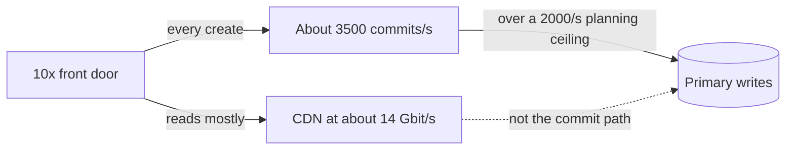
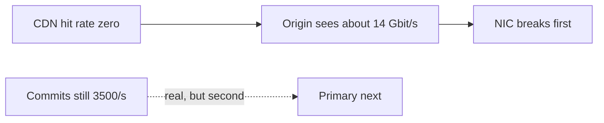

<!-- day-nav -->
[← Day 23 — Read path and write path](23-read-path-and-write-path.md) · [Day 25 — Failure overlay on the pastebin →](25-failure-overlay-on-the-pastebin.md)

# Day 24 — The order-of-magnitude break

**Do now**

1. Set a timer.
2. Attempt the problem. Stop at the attempt line. Do not scroll.
3. Then read.

## Time box

35 minutes.

| Minutes | Do this |
|---|---|
| 0–12 | Attempt. Multiply the front door by ten. Name **one** component that breaks first, under assumptions you write down. |
| 12–28 | Read. If your first break is "we'd shard everything," replace it with one component. |
| 28–35 | Say the next fix in one sentence, and one fix you would not reach for. |

## Intent

Facing a large jump in traffic, leave able to name the first component that breaks and the fix you would reach for next. Ten times is a question about order, not a shopping list.

## Problem

> Design a pastebin. People paste text and share a link.

The interviewer says: "Same product, ten times the ingest, same read ratio, same mean size. What breaks first?"

## Attempt before reading

12 minutes. Do not scroll. From day 21, if you kept them: at 1×, peak 350 writes/s and 17,400 reads/s. With an assumed 95% CDN hit and 90% metadata hit, the primary sees about 87 reads/s and still sees every commit. The primary read ceiling you used was about 15,000/s. The user-facing egress at 1× peak is about 1.4 Gbit/s.

Write:

1. Peak writes, peak user reads, and peak commits at 10×. The commit number has no hit rate.
2. The first component that does not survive **if the hit rates still hold**.
3. The first component that does not survive **if the CDN hit rate is zero**. Different answer. Say which one you are betting.
4. The next fix for the answer you bet on, and a fix that would not touch that break (a CDN does not make commits cheaper).

---

**Stop. One break, under a stated assumption, below.**

---

## Requirements

10× means 100 million new pastes a day, not a new product. 50 reads per write still. 10 KB mean still. 3× peak still. 45-day mix still. No extra safety factor hiding inside "10× plus headroom."

| Quantity | 1× peak | 10× peak |
|---|---|---|
| Writes | ~350/s | **~3,500/s** |
| User reads | 17,400/s | **~174,000/s** |
| Ingest | 100 GB/day | **1 TB/day** |
| Bodies resident | 4.5 TB | **45 TB** |
| Live objects | 450 million | **4.5 billion** |
| User egress | ~1.4 Gbit/s | **~14 Gbit/s** |
| PUT bandwidth | ~3.5 MB/s | **~35 MB/s** |

Ids: day 4 already checked 12-character base62 at this mint rate for a decade. A handful of expected collisions, absorbed by the unique key. The id does not break. Do not start there.

## Design

### The bet

You bet the day-21 assumptions **hold**: 95% of GETs hit the CDN, 90% of origin GETs hit the metadata cache. You say that before you name a component. If they tell you the edge will not hold, you switch bets. You do not give two architectures.

Under that bet, at 10×:

- CDN serves ~14 Gbit/s and ~165,000 of the 174,000 reads. You treat CDN capacity as a quota you must confirm, not as an infinite box. If the quota is below 14 Gbit/s, the CDN is the break and the fix is the quota or a second network path **you pay the CDN for**, not an origin you scale to 14 Gbit/s "just in case." For the rest of this page, assume the quota exists, because that was the point of day 15. Name the assumption.
- Origin reads ~8,700/s. Four app processes at an 8,000 ceiling still fit (32,000, or 24,000 with one down). You do not add a fleet first.
- Primary **reads** ~870/s. Under the 15,000 ceiling. The cache did its job.
- Bucket GETs ~8,700/s × 10 KB ≈ **87 MB/s**. Fine. PUTs ~35 MB/s. Fine.
- Primary **commits ~3,500/s**, plus the delete stream. When the 45-day window is full, deletes are the same order as creates, so the primary may see on the order of **several thousand row commits a second**, not 3,500 reads.

New planning ceiling, same kind as the others: **about 2,000 small commits a second** on one primary that is also shipping WAL to an async replica. Not a benchmark. You might be low. If they say this hardware does 10,000, the break moves and you should be glad. At the ceiling you are willing to say in the room, **3,500 is already over, and the delete stream makes it worse.**

**First component: the Postgres primary, on writes.** Not the CDN, not the app, not the bucket's byte rate, not the cache.

Why it wins over the others: every other hot number has a hit rate in front of it. Commits do not. You refused to queue the create. You refused to ack before the insert. So every one of the 3,500 is a real commit. That honesty is why the primary breaks first. A design that queued creates would break the queue or lie about durability instead. You would rather break the primary on paper.

### The fix you reach for next

**Partition the metadata by id**, still SQL, still the same row. Each partition takes a slice of the hash of the id. Point reads and inserts go to one partition. You do not build it today. You name it, and you name the query it complicates: the sweeper's `expires_at` range, which becomes "each partition sweeps itself" or the time-bucket from day 12. That cost is why you did not partition at 350/s.

A bigger primary is the fix you reach for **before** partitioning if the ceiling was conservative. One step up in hardware is allowed as a sentence. It is not a plan at the next 10× after that. Say "I buy headroom once, I partition when the commit rate is the product."

Do not reach for:

- A CDN upgrade, as the answer to commits. It does not see writes.
- A cache in front of inserts. A cache is not durable. Write-back is the early ack.
- NoSQL as the word you say instead of "partition the key." Day 12's range query is still there.
- More app processes. They are not the ceiling under this bet.
- Consistent hashing of the primary with cache semantics. A missed partition is a lost row.

### Commits versus row writes, at 10×

"Several thousand commits" hides two different numbers, and a staff answer separates them.

**Commits.** Every create is its own transaction: about 3,500 a second at peak. User deletes are their own transactions too, but they are a small slice. Expiry deletes come from the sweeper in batches of a thousand, so 3,500 expiries a second are only a handful of commits. Group commit helps here: many inserts share one WAL flush. The commit **count** is about 3,500 a second, already over the 2,000 ceiling by 1.75×.

**Row writes.** Every create inserts a row and an index entry. Every expiry deletes a row and, from day 16, inserts an outbox row in the same transaction, which the drainer later deletes. At peak that is about 3,500 inserts, 3,500 deletes, 3,500 outbox inserts, and 3,500 outbox deletes: roughly **14,000 row changes a second**. Batching made the commits cheap; it did nothing for the row work. That work is WAL bytes, index maintenance, and dead tuples.

**What the row work does to the replica.** At something like 1 KB of WAL per row change, 14,000 a second is about 14 MB/s, over a terabyte of WAL a day. Day 13 said the replica's apply, essentially one process, is what lags first at 10×. This is the number behind that sentence. As lag grows, the async RPO from day 13 grows with it: thousands of links a second of lag instead of hundreds.

**What it does to vacuum.** About 7,000 dead tuples a second from real deletes and outbox deletes, around 600 million a day. Autovacuum on one table at that rate is a job someone tunes, not a default.

So the break is not only "too many commits." It is too many row changes on one writer, with one replica replaying them. Partitioning fixes all three together, which is why it is the fix and a bigger primary is a stopgap.

### Sizing the partitions

The arithmetic says two partitions clear 3,500 commits at 2,000 each. Do not stop at two. Run each partition at no more than about half its ceiling, so a burst or a slow disk does not put it over: 3,500 / 1,000 = **4 partitions**. Use a power of two so a later split halves a slot range instead of reshuffling. Each partition needs its own replica, so the fleet is **eight Postgres instances**, four failovers to rehearse, four sweepers. That operational cost is the real reason you did not partition at 350 a second, and you should say it as a cost, not a footnote.

**Routing.** The id is random base62, already uniform. Map ranges of the id's leading characters to partitions through a fixed slot table, the tool day 18 said was right for durable data: a human moves slots, the move is visible, and one writer owns each slot. No consistent-hashing ring, because a "miss" here is a lost row, not a refill.

**A property you get for free.** The server mints the id. If one partition is down, mint ids whose slot lands on a healthy partition. Creates continue at three quarters of capacity; reads and deletes of pastes already on the dead partition fail with 500. Say this; it is the kind of consequence of "id is minted, not chosen" that a staff interviewer enjoys hearing you find.

What staff sounds like here is refusing to stop at "the primary breaks." It names which number breaks (commit count, 1.75× over), which number hides behind it (row changes, about 14,000 a second), what that does to the replica and to vacuum, and then sizes the fix with headroom and operational cost. The first break is one sentence. The evidence is what makes it a staff answer.

### The other bet, so you can switch in one sentence

If the CDN hit rate is **zero**, user egress of ~14 Gbit/s hits the origin. One 10 Gbit NIC is the first break, the same break as day 3, and it happens **before** you get to argue about commits, because the site is already failing the read. The fix is the CDN you should already have had, or more origin bandwidth if they forbid an edge. The primary's 3,500 commits are still real, but they are not first.

If they ask "which bet is yours?": the hit-rate bet, because you spent days 10 and 15 earning those boxes, and you will page if the hit rate is wrong (day 21). You do not design the zero-hit 10× as the steady state. You shed it.

### Objects at 4.5 billion

This is the second break, not the first, under the hit-rate bet. 45 TB of 10 KB objects will not break PUT bandwidth. It will break any operation that **lists**. The reaper stays key-directed from the outbox and the failure log. A restore story that is "list the bucket and copy" will not finish. You say that as the follow-on, after the primary, if they ask "what breaks second?" You do not lead with it while commits are already over the ceiling.

## Diagrams

### First break, hit rates holding

### If you bet wrong

Two pictures. You are standing on the first. You can draw the second if they move the assumption. You do not merge them into one outage.

Caption the first: "Reads have hit rates. Commits do not. 3,500 against 2,000." The dotted arrow from the CDN to the primary is labeled "not the commit path" on purpose: it is the answer to anyone who proposes a bigger edge for a write problem.

Caption the second: "Same 10×, different assumption, different first break." Draw it smaller and to the side. You are not designing it; you are showing you know where the bet flips.

## Failure the user sees, at 10× before the fix

**Creators.** Commit latency climbs as the primary passes its ceiling. A create that has already PUT now waits on the insert. Day 19's slots fill with requests that are waiting on the primary, not the bucket. Creators see slow 201s, then 503s. Each 503 after a PUT leaves an orphan for the reaper, so orphan volume climbs with the incident.

**Readers.** Mostly nothing. At the hit-rate bet, about 870 reads a second reach a primary whose read capacity is fine. Hot and cold links both work, slightly slower if the primary's CPU is shared with the commit pile-up.

**Deleters.** Slow 204s, because a delete is a commit. Some 500s at the tail.

**Durability.** Replica lag climbs because apply cannot keep up with 14,000 row changes a second. Nobody sees it until a failover, when the unshipped tail is much larger than the hundreds-per-second-of-lag you quoted at 1×.

**After partitioning, one partition fails.** Creates continue on the other three, by minting into their slots. Reads and deletes of the dead partition's pastes, a quarter of all pastes, fail with 500 until promotion. A quarter of links broken for 30 seconds, instead of all creates broken.

## Trade-offs

**Choice.** Under the stated hit rates, the primary's commit rate breaks first. Next fix is a bigger primary once, then partition by id, with the sweeper redesigned per partition. Not a CDN, not a queue of creates.

**Alternative.** "At 10× we shard everything and add Kafka." Or design only the zero-hit world and buy 14 Gbit/s of origin because you do not trust the edge.

**What you give up.** A single dramatic answer that ignores assumptions. You also give up partitioning early, which would spread 350 commits/s across machinery you would have to operate at 1× for no win. You accept that this answer is conditional. If the ceiling of 2,000 is wrong by 5×, the first break might be the object count's operational story instead. You would rather be corrected on the ceiling than vague on the component.

**Name the refusal inside each alternative.** Against "shard everything and add Kafka": you refuse to spread work across machinery for components that are not the break, and you refuse a queue in front of the 201. Against designing for the zero-hit world: you refuse to buy 14 Gbit/s of origin you would only need if the edge fails, when shedding covers that case. Against partitioning at 1×: you refuse eight databases for 350 commits a second. Each refusal names the assumption it would quietly drop.

**10× of this 10×.** A hundred times the original ingest is not the question. If they push, partitions themselves have a commit ceiling, and you add partitions. You still do not queue the 201. The interesting part of 100× is the 450 TB and 45 billion objects, and whether 10 KB in a bucket is still the right packing. That is a day you have not earned. Mention packing only as the thing you would measure, not as a design you sketch now.

## Talking points

**Say.** "Ten times is about 3,500 write commits a second and about 174,000 reads. I am assuming the CDN still eats 95% of reads, so the origin is not the 14 Gbit/s. The reads on the primary stay under a thousand a second. The commits do not have a cache. My planning ceiling is about 2,000 commits a second on one primary, so the primary's write path breaks first. I would buy a larger primary once, and then partition by id. I would not put creates on a queue, and I would not call this a CDN problem."

**Say.** "If the CDN hit rate is actually zero, I was wrong, and the origin NIC breaks first at 14 Gbit/s. I page on that hit rate so I find out which world I am in."

**Hand-waving.** "We'd horizontally scale." Scale which component? The app tier scales and is not the break.

**Hand-waving.** "The database can't handle 10×, so we move to NoSQL." The database can't handle the **commit rate**. A different engine with one writer has the same shape. The fix is more writer capacity, split by key, with a plan for expiry.

**If they challenge the 2,000 commits/s ceiling.** Recompute against theirs. If their number is 20,000, the primary does not break, and you owe them the second component: listing and restore at 4.5 billion objects, or replica apply lag if shipping 3,500 commits/s falls behind. Do not freeze on 2,000 out of pride. It was an assumption. The method is the ordering.

**If they ask how many partitions.** "Two clear 3,500 at 2,000 each. I want each at half its ceiling, so four, a power of two for later splits. Each with a replica: eight instances, four failovers to rehearse. That's the cost of the fix."

**If they ask whether batching the sweeper solves it.** "It makes expiry deletes cheap in commits. It doesn't touch row changes: inserts, deletes, outbox rows, about 14,000 a second at peak. That's WAL, vacuum, and replica apply. Partitioning splits all three."

**If they ask what happens when one partition dies.** "I mint ids into the healthy partitions' slots, so creates keep going at three quarters. A quarter of existing pastes 500 until that partition promotes."

**If they ask what you page on, at 1×, so 10× does not surprise you.** Primary commit latency and WAL ship lag. CDN hit rate. Origin egress. You want the commit latency to creep up in a graph before the 10× launch, not in the interview after it.

## Say this in the room

Ten times is about 3,500 creates a second and 174,000 reads. I'm betting the edge still takes 95%, so the origin sees about 8,700 reads and the primary under a thousand. Commits have no hit rate. At my planning ceiling of 2,000 a second on one primary, 3,500 is already 1.75× over, and behind the commit count is about 14,000 row changes a second once expiry and the outbox are counted: WAL the replica can't replay fast enough and dead tuples vacuum has to chase. So the first break is the primary's write path. I'd buy a bigger primary once; then partition by id, four partitions at half their ceiling each, through a fixed slot table, each with a replica. If a partition dies, I mint new ids into the healthy ones, so creates keep going and a quarter of existing links fail until promotion. I won't queue the create, and a bigger CDN doesn't touch commits. If the edge hit rate is actually zero, the origin NIC breaks first at 14 Gbit/s, and I page on that hit rate so I know which world I'm in.

## Kit artifact

One checklist row.

| Row | Lock |
|---|---|
| 10× | One component, under a hit-rate assumption you stated. The next fix touches that component. A second bet is allowed only if they change the assumption. |

## Design log

One line: the component you named first, and the assumption it depended on. If you named three components, the gap is the lack of an order.

Next: [Day 25 — Failure overlay on the pastebin](25-failure-overlay-on-the-pastebin.md).

---

<!-- day-nav -->
[← Day 23 — Read path and write path](23-read-path-and-write-path.md) · [Day 25 — Failure overlay on the pastebin →](25-failure-overlay-on-the-pastebin.md)
