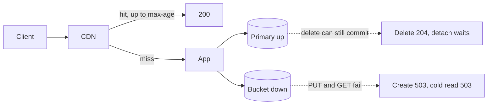
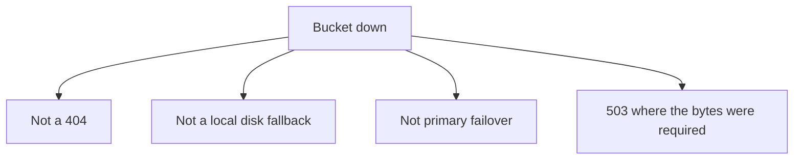

<!-- day-nav -->
[← Day 24 — The order-of-magnitude break](24-the-order-of-magnitude-break.md) · [Day 26 — End-to-end distributed pastebin →](26-end-to-end-distributed-pastebin.md)

# Day 25 — Failure overlay on the pastebin

**Do now**

1. Set a timer.
2. Attempt the problem. Stop at the attempt line. Do not scroll.
3. Then read.

## Time box

35 minutes.

| Minutes | Do this |
|---|---|
| 0–10 | Attempt. One dependency, down. What still returns 200. What returns 503. What must not return 404. |
| 10–28 | Read. If your overlay "fails over" to a copy you never drew, erase the failover. |
| 28–35 | Say the overlay in four sentences: what died, what is durable, what the user sees, what you page on. |

## Intent

Facing "what if this dies," leave able to overlay one dependency failure and the user-visible result. One dependency. The overlay is a fix for a diagram that has no dead box. It is not a disaster-recovery design.

## Problem

> Design a pastebin. People paste text and share a link.

The interviewer says: "The object store is unavailable. Don't tell me about the primary. What does each kind of user see?"

## Attempt before reading

10 minutes. Do not scroll. The bucket holds the only copy of the bytes you acknowledge. The CDN may hold a fresh copy of hot ones, max-age at most 60 seconds. The primary holds the rows and has a replica. The queue deletes objects after the row is gone. Creates PUT before they insert.

Write:

1. Creates, in this outage.
2. A GET that would have been an edge hit.
3. A GET that needs the origin to read the object.
4. A DELETE. Can you still 204? What leaks if you do?
5. The status code you refuse to use for "bucket down."

One dependency only. If you also kill Postgres, you are on a different overlay.

---

**Stop. One dead dependency, the bucket, below.**

---

## Requirements

Unavailable means: PUTs and GETs to the bucket fail or time out inside the budgets from day 20. It does not mean the bucket returns empty objects. An empty success would be worse. Timeouts become 503s, and you do not retry them into a storm.

The contract you must not break while failing:

- Do not 404 a paste because the store is down. 404 means gone on purpose.
- Do not 201 a create you could not PUT.
- Do not delete the row and then tell yourself the object delete "will happen" if you are not sure the bucket is the thing that is down... you are sure, in this overlay. Think before you 204: if you commit the row delete and the object delete cannot run, the object remains until the bucket returns, and the edge may still have the body. That is the same backlog as day 16, extended for the whole outage. Origin readers 404 because the row is gone. That part is fine. You can 204. The detach job sits in the outbox, which is in Postgres, which is up. It will run when the bucket returns. Good. Do not skip the row delete because the bucket is down; a paste you cannot detach is still a paste you can stop serving from the origin.

What is already durable: every paste whose PUT acked and whose row committed, the bytes are in the bucket **if the bucket has not lost data**, only become unreachable. This overlay is unavailability, not silent deletion. `body_missing` is the other overlay (object gone, row present). Do not mix them. If GETs start returning "not found" from the bucket for keys that should exist, you are in data-loss, and the status becomes 500 plus a page, not this 503 story. Ask which one they meant if the interviewer says "unavailable" loosely. You are answering **cannot reach a store that still has the bytes.**

## Design

### Creates

The app tries the PUT, hits the timeout (1 second), does not insert, returns **503** with `Retry-After`. No link. If the PUT might have landed and the response was lost, the reaper's failure log gets the id; the reaper also cannot delete right now, so the orphan waits, which is safe because nothing points at it. You do not keep the create slot busy retrying. Slots fill, further creates 503 immediately at the cap. That is day 19, and it is what you want: a dead bucket should not occupy every app with blocked PUTs.

The primary is healthy and bored. Do not "fail over" creates to local disk. You spent day 14 leaving that disk. A fallback disk is a second store with a split brain the moment the bucket returns. Refuse it.

### Reads that hit the edge

A fresh CDN entry does not consult the bucket. Those readers get **200** until max-age ends. For a hot paste, that can be the whole audience for up to 60 seconds, and then the edge misses, comes to the origin, and the origin cannot fill. After that, even the hot paste fails until the bucket returns or until you are willing to serve a stale edge object past max-age.

Would you extend max-age during the incident? Only as a conscious degrade: serve slightly stale known-good bodies rather than 503 the world. The cost is deletes get even later, and you might serve a paste that expired in that window. A short extension, said out loud, is a staff answer. An automatic "ignore expiry when the origin is sad" is how you serve deleted text and call it resilience. If you have not built the extension, say the truth: hot reads work for at most 60 seconds, then they fail too.

### Reads that need the bucket

Edge miss, or stale entry: the app may still do the metadata check. Cache or primary can say the row is live. The bucket GET fails. The user gets **503**, not 404, not 500-as-`body_missing`. `body_missing` is reserved for the store confirming absence. A timeout is not an absence.

Do not fall through to the replica. The replica does not have the bytes.

Cache hits on metadata do not save the read. You refused to cache the body there. The edge is the only byte cache. That was a real trade on day 10 and day 15, and this outage is when you feel it. You do not add a body cache in the middle of the overlay. You name that cold reads need the bucket and will fail.

### Deletes

As above: commit the row delete, tombstone, outbox, **204**. The worker will fail the object delete and the purge might still succeed (the CDN is a different dependency). If purge succeeds, edges drop the body even while the bucket is down. If purge fails, edges keep it until max-age. Origin will not serve it, because the row is gone. Say all three. They are not the same user.

A delete that cannot reach the **primary** is a different overlay. Do not do it today.

### What you page on

Bucket error rate and timeout rate, which should trip before users finish complaining. Create 503 rate. Origin GET 503 rate. Distinguish `body_missing` (data loss) from timeout (this overlay) in the metric, or you will page the wrong runbook. Outbox age, because detach is stuck, and you expect it to drain after recovery. You do not page on 404.

You do not page "the site is down." It is not, for a reader on a fresh edge. A page that says the whole product is dead will make someone do something dramatic to the primary, which is healthy.

### Recovery

When the bucket returns, creates work without a migration. Outbox drains. You do not replay creates you 503'd; the clients retry if they still want the paste, and a retry is a new id. You do not have their bytes anymore if you never completed the PUT. Do not build a recovery log of request bodies. That is a second bucket.

## Diagrams

### One dead box

### What you will not draw

The right-hand refusals are the overlay. A picture that only says "alert and failover" is the hand-wave.

## Trade-offs

**Choice.** Treat bucket unavailability as 503 for anyone who needed a byte transferred now. Keep serving fresh edge hits. Allow deletes to commit on the primary and ride the outbox. No local-disk fallback. No 404.

**Alternative.** Fail the entire site closed, including edge hits, "so users don't see inconsistency." Or serve the stale edge indefinitely while the bucket is down.

**What you give up.** A simple status. Some users see 200, some see 503, deleters see 204, and a person refreshing a cold paste thinks you lost it if your error page is bad. Write the error so it does not say "not found." You also give up durability theater: you are not copying the bucket onto the app tier for the incident.

**Why not fail the edge closed.** Those hits are correct bytes for a paste that was visible a minute ago. Turning them off makes the outage larger to keep the story uniform. Uniformity is not a user need. A bound of 60 seconds is.

**Why not serve the edge forever.** You would freeze deletes and expirations for the whole outage. A long outage then becomes a correctness bug. Sixty seconds, maybe a deliberate short extension, not "until the bucket comes back" as an unbounded rule.

**10× break.** The same overlay at 10× is the same picture with more 503s. The edge has more readers, so the 60-second grace covers more people, and the cliff when max-age ends is steeper. The primary still does not fix bytes. A bigger failure at 10× is only that 3,500 creates/s all 503 and the clients retry together when you recover — a thundering herd of PUTs. The in-flight cap is what keeps recovery from looking like a second incident. You do not need a new component. You need the cap you already have, and maybe a jittered `Retry-After` so the clients do not align. That jitter is the 10× addition. One sentence.

## Talking points

**Say.** "Bucket down, primary up. Creates 503, I do not write the row. Edge hits keep working until max-age, at most 60 seconds. Cold reads 503, never 404, and I don't call it body_missing unless the store actually says the key is gone. Deletes can still 204, and the outbox drains when the bucket returns. I will not fall back to local disk."

**Say.** "I page on bucket errors, create 503s, and outbox age. I do not page as if Postgres died. It didn't."

**Hand-waving.** "We'd fail over." To what copy of the bytes? If you cannot point at it, you do not have it.

**Hand-waving.** "Multi-region bucket, so this doesn't happen." A second region is a different overlay, with a replication lag and a bill, and it is still a dependency that can be unreachable from the app. You may name it as the thing you would add if this outage is unacceptable. You do not pretend it is drawn. The user-visible story above is the one you can defend today.

**If they ask about the primary dying instead.** "That's a second picture. I'd want it only after this one is solid. Short version, so you know I won't mix them: promote the replica, writes fail during the window, cache fills stop, edge hits continue, misses 503 not 404, and the bucket still has the bytes. RPO is the unshipped WAL tail, so some 201s can 404 after promotion. I am not drawing that today unless you want to switch."

Then stop. One overlay.

**If they ask what the user sees in the first minute versus the tenth.** "First minute: hot links work, cold links and creates fail, deletes succeed at the origin. Tenth minute: hot links fail too, because max-age elapsed and you cannot refill. The outbox is deep. Nothing durable was deleted by the outage itself."

## Kit artifact

One failure-overlay row.

| Dependency down | User sees | Already safe | You refuse |
|---|---|---|---|
| Bucket unreachable | Create 503, cold GET 503, edge hit 200 until max-age, delete 204 | Rows and outbox on the primary. Bytes still in the bucket, just unreachable. | 404, local-disk fallback, calling it `body_missing` |

## Design log

One line: the status code your attempt returned for a cold read, and whether an edge hit survived. If every user "failed over," the gap is the copy you do not have.

Next: [Day 26 — End-to-end distributed pastebin](26-end-to-end-distributed-pastebin.md).

---

<!-- day-nav -->
[← Day 24 — The order-of-magnitude break](24-the-order-of-magnitude-break.md) · [Day 26 — End-to-end distributed pastebin →](26-end-to-end-distributed-pastebin.md)
