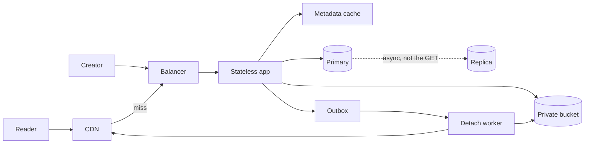
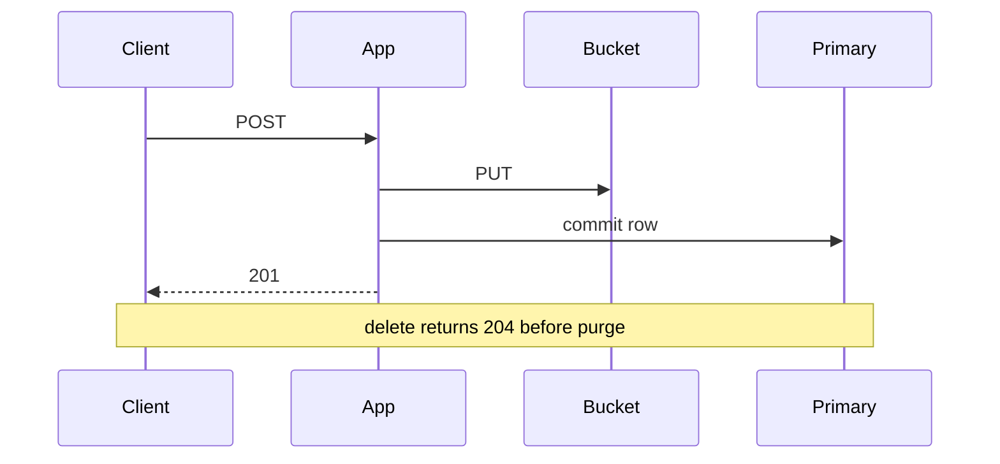

<!-- day-nav -->
[← Day 25 — Failure overlay on the pastebin](25-failure-overlay-on-the-pastebin.md) · [Day 27 — Red-team before they do →](27-red-team-before-they-do.md)

# Day 26 — End-to-end distributed pastebin

## Time box

40 minutes.

| Minutes | Do this |
|---|---|
| 0–20 | Attempt. A full pass, interview order. Blank page. You may use memory, not the earlier lessons. |
| 20–35 | Read. Mark what you added that this page does not have. Those boxes are suspects. |
| 35–40 | Close it and give the 60-second version out loud: contract, numbers, ack, one break, one failure. |

## Intent

Facing a full loop on the spine, leave able to assemble the distributed pastebin in one interview-shaped pass. This is the phase in one sitting. It is not a new feature, and it is not the day-28 product.

## Problem

> Design a pastebin. People paste text and share a link.

The interviewer says: "From scratch. I will stop you if you tour. I want the distributed version, and I want every box to have a reason."

## Attempt before reading

20 minutes. Do not scroll. Spend it in the day-1 order: scope, numbers, API, then the picture, then one deep dive they would actually pull (the 201, or delete versus the edge), then the 10× break and one dependency down. Stop when the timer stops.

If you draw a box you cannot attach to a number or a fault, cross it out before you read on.

---

**Stop. The assembled pastebin is below. It is the phase, compressed, not a second design.**

---

## Requirements

Anonymous client sends UTF-8 text, at most 1,000,000 bytes, and a TTL from the allow-list (1, 7, 30, 365 days, default 30). Server returns an unguessable id, a URL, an expiry, and a delete token once. Anyone with the URL can read until expiry or delete. Expired, missing, and bad token are the same 404. A live row whose bytes are gone is a 500. The body is `text/plain` with `nosniff`. Creates are not idempotent.

Assumptions, unchanged since day 2: 10 million new pastes a day, 50 reads per write, 10 KB mean, 3× peak, 45 days of ingest resident, one region.

Out: accounts, listing, search, edit, vanity ids, rendering, forever retention, a second region, a classifier, a queue on the create path.

## Estimates

Speak day 3, then day 21. Do not skip the first just because the second is more impressive.

116 writes/s average, ~350 peak. 5,800 reads/s average, 17,400 peak. 100 GB/day, 4.5 TB resident, ~450 million live objects, ~135 GB of metadata. Peak user egress ~1.4 Gbit/s.

Hit rates, labeled as assumptions: 95% of GETs hit the CDN, 90% of what remains hit the metadata cache. Happy column: ~870 origin reads/s peak, ~87 primary reads/s, ~8.7 MB/s from the bucket. Zero column: the primary sees 17,400 and you shed. Every create is still a PUT and a commit. Peak ~350 commits/s. No hit rate on writes.

Sensitive knobs: CDN hit rate for the read story, mean body size for the byte story.

## API and data

`POST /v1/pastes`, raw body, `201` only after durability. `GET` by id. `DELETE` with the token, `204` or the same `404`.

One row, primary key the 12-character base62 id, never reused. `expires_at` checked on read and indexed for the sweeper. Delete token stored as a hash. Body not in the row. Object key `pastes/{id}` in a private bucket.

Limiter: per IP, about 1 create/s and a byte budget, burst small, global create ceiling at the 350/s you sized, 429 before any PUT.

## Design

The boxes, each with the break that added it:

| Box | Why it exists | Why it is not something else |
|---|---|---|
| App processes, three | One process's planning ceiling, ~8,000 streaming reads/s, is under the 17,400 peak. | No session. Least connections. Drain on deploy. |
| Primary Postgres | Point key plus expiry range. | Not a key-value store, because the sweeper is a range. |
| Async replica | A dead primary disk must not take every row. | GETs do not read it. It does not have the bytes. |
| Metadata cache, ring | Primary read ceiling ~15,000/s while it is also committing. | Not the body. Tombstone on delete. TTL is not invalidation. |
| Private bucket | 450 million files will not restore, and one NVMe is one disk. | PUT, then commit, then 201. Orphans reaped after an age floor. |
| CDN | A hot 1 MB paste, or 10× mean egress, does not fit one origin NIC. | GET only. Max-age min(60s, remaining TTL). Origin stays authoritative. |
| Queue and outbox | Purge and object delete must not sit inside the user request. | Create is not on it. Jobs are safe twice because ids are never reused. |

Caps, not new boxes: in-flight creates (50 per process, 32 MB), separate bucket pools, a cap on concurrent primary fills so one crawl cannot own the database, timeouts with no retry on timeout and no app retry of create.

### Read, in one breath

Edge hit returns the body and you see nothing. Edge miss: metadata cache, and on a miss the primary, never the replica. Expired or absent is 404, and the edge does not cache that 404. Live row, object missing, is 500. Live row, object present, is `text/plain`, and the edge may keep it for at most a minute.

### Write, in one breath

Limit, then validate, then PUT, then insert, then 201. Delete commits the row and the outbox, writes the tombstone, returns 204. A worker deletes the object and purges. Until then an edge may still be inside max-age.

## Diagrams

Mermaid stands in for the whiteboard. SVG figures come later; do not wait on them.

### Whiteboard

Numbers in the corner: 350 writes/s peak, 17,400 reads/s peak, 1.4 Gbit/s at the edge, 4.5 TB in the bucket. If the corner is empty, the picture will not survive "does it fit?"

### Ack versus lag

You should be able to redraw the read branches from day 23 without this page. If you cannot, that is the practice, not a new component.

### The four sentences that are the design

If you remember nothing else on the board, these four:

1. **201** after the PUT acks and the primary commits. Not before.
2. **GET** may end at the CDN. If it does not, metadata cache, then primary on a miss, then the bucket. 404 if the row is gone or expired. 500 if the row is live and the object is not.
3. **204** after the row delete, the outbox row, and the tombstone. The worker's purge can be late by at most the max-age, 60 seconds.
4. **The replica is not in sentence 2.** It is how the rows survive a dead primary disk, with a tail you can lose.

An orphan is a PUT without a row. It is waste, reaped after an hour only if the row is still missing. It is not a 404 you serve. Say that if they touch create crashes. It is the deep dive you offer when they do not pick the id width.

## Trade-offs

**Choice.** This set, and no more. The create is synchronous. The edge is allowed to be wrong for at most 60 seconds after delete. The replica lags and is not a read source. The cache misses are correct because they hit the primary.

**What you are giving up, said as a list you can speak.** Instant global delete. Create idempotency. Survival of a bucket outage for cold reads. A second region. A primary that can take 10× commits.

**The 10× break you volunteer before they ask.** If the hit rates hold, ~3,500 commits/s breaks a primary whose planning ceiling you put near 2,000. Next fix: bigger primary once, then partition by id, and redo the sweeper per partition. If the hit rates do not hold, the origin NIC breaks first at ~14 Gbit/s. You page on hit rate so you know which one you are in.

**The failure you volunteer.** Bucket unreachable: creates 503, cold reads 503, edge hits work until max-age, deletes still 204, outbox drains later. Not 404. Not a local disk.

That pair, 10× and one failure, is the close. Do not add a third unless they ask.

## Talking points

**Say, as the spine of the hour.** "Capability URL, no accounts, expiry on the read. 116 writes a second, 5,800 reads, times three at peak, 4.5 TB, 1.4 Gbit/s. Id is 12 characters, never reused. Three app processes because one won't take the peak reads. Primary for the row, replica for the row's survival, not for the GET. Cache-aside for metadata because the primary's read ceiling is under the peak. Bucket because I will not restore 450 million files. CDN because a hot 1 MB paste does not fit the origin. Queue only for purge and delete of bytes. 201 after PUT and commit. At 10× the commits break first if the CDN is actually hitting. If the bucket dies, cold reads 503 and fresh edge hits don't."

**Hand-waving.** Any box in that paragraph you cannot attach to the break in the previous sentence. Cut the box, not the sentence.

**Hand-waving.** "And Kafka, and Elasticsearch, and multi-region." None of those has a break in this pass. Search and a second region were non-goals. The cleanup rate is ~116 jobs a second.

**If they pull one deep dive, pick one and finish it.** The best three, still: the id width and never-reuse (including why a late reap is safe only then); the tombstone versus the TTL; the orphan and the one-hour floor. Doing all three is how you run out of clock. Offer one.

**If they ask what you would not build.** Accounts, a public bucket, create-on-a-queue, reads from the replica, retries on timeouts, a body cache inside Redis, a classifier.

## Kit artifact

The script row for a full pass. The kit, later, should time this shape, not a different one.

| Clock | You leave with |
|---|---|
| First 10 minutes | Contract, non-goals, QPS, bytes, the hit-rate assumptions |
| Next 15 | API, key, the boxes each tied to a break, read and write as separate orders |
| Last 10 | One deep dive, the 10× component, one dependency down |

## Design log

One line: the box you drew that you could not justify, or the break you skipped. One gap. This is a lesson, not the day-7 mock, but if you ran it closed-book, log it as if it were.

Next: [Day 27 — Red-team before they do](27-red-team-before-they-do.md).

---

<!-- day-nav -->
[← Day 25 — Failure overlay on the pastebin](25-failure-overlay-on-the-pastebin.md) · [Day 27 — Red-team before they do →](27-red-team-before-they-do.md)
