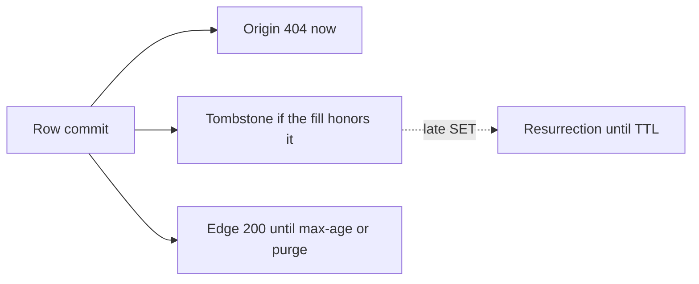
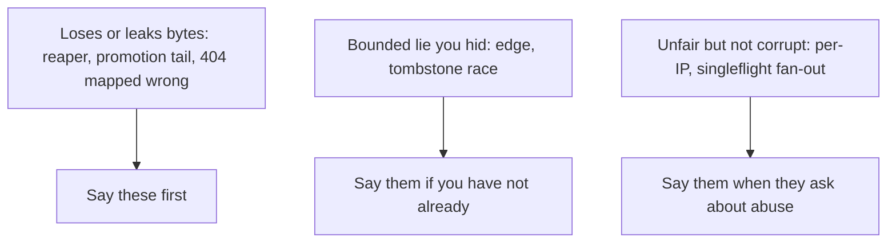

<!-- day-nav -->
[← Day 26 — End-to-end distributed pastebin](26-end-to-end-distributed-pastebin.md) · [Day 28 — Mock: image upload and thumbnails →](28-mock-image-upload-and-thumbnails.md)

# Day 27 — Red-team before they do

**Do now**

1. Set a timer.
2. Attempt the problem. Stop at the attempt line. Do not scroll.
3. Then read.

## Time box

40 minutes.

| Minutes | Do this |
|---|---|
| 0–12 | Attempt. List holes in the day-26 pastebin. Rank them. Patch the top one in words, not with a new platform. |
| 12–32 | Read. Add any hole you missed to your list. Do not "fix" all of them in the picture. |
| 32–40 | Say three holes and one patch out loud. Stop. A red team that rebuilds the system is a new design. |

## Intent

Facing your own finished design, leave able to find the holes a staff interviewer would open and patch the reasoning. The patch is a tighter rule or a bound. It is not a box you were saving for the last day.

## Problem

> Design a pastebin. People paste text and share a link.

The interviewer says: "Assume the design you just walked is in production. Where is it wrong? I want the hole, the user who hits it, and the change in reasoning. Not a wishlist."

## Attempt before reading

12 minutes. Do not scroll. Use the assembled pastebin: synchronous create, CDN max-age 60 seconds, cache tombstone, async replica you do not read, reaper with an age floor, ids never reused, creates not idempotent, per-IP limits.

Write five holes, each as: trigger, user-visible lie or loss, and whether you already bounded it. Star the one you would say first in the room. Patch that one in five lines. If the patch is "add Kafka" or "add a region," it is not a patch.

---

**Stop. Holes and patches below. The product does not grow.**

---

## Requirements

Red-team rules for this hour:

- A hole is a case where the contract, the durability claim, or the capacity claim is false.
- A bound you already stated ("edges can be wrong for 60 seconds") is not a hole unless you hid it. It is a trade. The hole is pretending it is not there.
- No new product: no search, no accounts, no malware model, no second region built on the whiteboard.
- Prefer a patch that makes an existing component tell the truth.

## Design

These are the holes worth your mouth. A staff interviewer needs one or two done properly, not twelve named.

### 1. The edge serves a deleted paste

Trigger: DELETE commits, a warm POP still has the object, purge is slow or lost.

User: a reader with the link gets the text after the deleter thinks it is gone.

You already capped this at max-age. The hole is if you said "delete removes the paste" without the clause. **Patch the sentence, not the CDN:** origin-authoritative immediately, edges within 60 seconds, purge best-effort. If they need faster, the patch is a shorter max-age on pastes that matter, knowing you pay in origin reads, not a new security product. Do not claim a purge API is synchronous worldwide.

### 2. A late cache fill resurrects a delete

Trigger: a miss read the primary before the delete, and `SET` runs after the tombstone, and your fill path does not check.

User: origin serves a deleted paste until the TTL.

**Patch:** the tombstone wins. Fill uses a compare that will not overwrite `gone`. You said this on day 10. If your day-26 narration said "DEL the key," you reopened the hole. The patch is to put the tombstone back in the sentence.

### 3. Create is not idempotent, and timeouts make it worse

Trigger: the client times out waiting for 201. The row committed. They retry. Or the app retried the PUT, which you forbade, but a library retried anyway.

User: two pastes, or an orphan and a paste, and the deleter's token only kills one.

**Patch:** keep the app from retrying. Document that a client retry is a second paste. Do not invent an idempotency key the anonymous client will not store, unless they add that requirement in the room. If they do, the key is a new row with a retention at least as long as the retry window, and it is a different design. The patch for the current contract is honesty plus the reaper, not a hidden dedupe.

### 4. The reaper deletes a live object, or a delayed job deletes a recycled id

Trigger: the age floor is shorter than a stuck create, or someone later reuses ids, or the reaper lists the bucket and deletes "unreferenced" keys while a commit is in flight.

User: `body_missing` 500s, or the next paste's bytes vanish.

**Patch:** age floor (one hour) greater than any in-flight create, reap only from a failure log plus the check "no row," never reuse ids so a late detach cannot hit a successor. If you cannot explain the age floor, you do not have a reaper. You have a data-loss job.

### 5. Promotion loses the tail, and 201s become 404s

Trigger: primary dies after commit and before the async replica applies. You promote.

User: a link you already handed out 404s. The bytes may still be in the bucket with no row. That is an orphan of a worse kind: the user has the URL and the token, and the row is gone, so they cannot prove it. The object is unreachable through the app and will be reaped if a job exists, or will sit forever if none does.

**Patch:** say the RPO. Do not call the replica synchronous. If that user is unacceptable, the patch is sync commit to one replica and a 201 that waits for it, which you priced on day 13 and declined. Re-decide only if they say the tail is the deep dive. A middle patch: on promotion, do not reap orphans younger than the failover window plus the age floor. You would rather leak bytes than reap a tail you might still recover from the dead primary's disk. Say that. It is a good staff sentence.

### 6. Singleflight is per process

Trigger: the hot key expires, and you have four processes, or thirty after a scale-out.

User: the primary sees N identical reads, not one. At three, this is fine. At thirty, with a cold cache, it is a stampede you claimed to have fixed.

**Patch:** say the bound. "Per process, so the fan-out equals the number of apps." If that number times a miss wave exceeds the fill cap, the cap sheds, which is the real protection. Do not add a cluster lock to look thorough. The hole is claiming global collapse you did not build.

### 7. Per-IP limits are not per human

Trigger: a NAT, or a botnet.

User: a campus shares 429s, or the global 350/s is entirely abuse and honest creators shed.

**Patch:** say it before they do. The next control is a tenant you refused (accounts) or a challenge in front of PUT. You do not pretend the token bucket is identity. Do not "fix" a NAT by raising one IP to the global cap.

### 8. App clocks and `expires_at`

Trigger: an app clock is fast, or slow, relative to the primary that wrote `expires_at`.

User: a fast clock 404s early on cache hits. A slow clock serves a little past expiry. The CDN max-age of 60 seconds already dominates a small skew. A clock that is wrong by hours is an operations failure, not a new consistency protocol.

**Patch:** NTP as an assumption, expiry checked as a timestamp you stored, not as a TTL you hope matches the allow-list. Do not design a true-time service. If they push: the authoritative check on a miss uses the primary's `now()`, and cache hits use the app clock inside a skew you believe is seconds. The 60-second edge bound is the larger lie. Spend your courage there.

### 9. 404 versus 503, collapsed by a helper

Trigger: a shared client library maps all failures to not-found, or the CDN caches a 500, or a bucket "no such key" during a partial outage is treated as delete.

User: a live paste looks deleted, or a dead store looks deleted, and you will reap or purge the wrong thing.

**Patch:** one mapping, written down. Timeout and 5xx from the bucket are 503. A confirmed missing object with a live row is 500 and a page, never a reap of the row. 404 only from the row's absence or expiry or a bad token. Nothing in the CDN config caches 404 or 500. This is the highest-leverage patch in the list, because it prevents the other jobs from "helpfully" destroying state.

### Four holes the deeper pages left for you

Each earlier day's numbers hide a hole of their own. These are the ones a staff interviewer who read your whole design would open.

**10. Least connections rewards the fastest failure.** Trigger: one app loses its path to the primary and returns instant 500s. User: well over a quarter of requests fail, because the broken app always looks least loaded. **Patch:** passive outlier ejection on 5xx skew, at most one of four ejected. The bound is the patch; without it, ejection rebuilds the deep-health-check outage.

**11. The global create cap bounds rows, not bytes.** Trigger: a botnet under every per-IP limit posts only 1 MB bodies. User: nobody, until the bucket fills; 350 creates a second × 1 MB is 350 MB/s, about 30 TB a day, against a 4.5 TB plan. **Patch:** a global byte budget around 10 MB/s, about 3× the peak ingest you sized. Worst case becomes about 860 GB a day, visible before lunch.

**12. Connection pools that add up past the database.** Trigger: someone scales the app tier from four to six to "add headroom." Six pools of 20 are 120 connections against a default limit of 100. User: the new apps fail to connect, return 500, and the balancer keeps sending them traffic because their shallow health check is green. **Patch:** pool size is part of the capacity plan, and the sum is checked against the database's limit before scaling, not after.

**13. A stale-if-error window in the wrong overlay.** Trigger: the edge is configured to serve stale on origin errors, and the primary, not the bucket, goes down. User: the origin cannot tell live from deleted, every answer is an error, and edges serve deleted pastes for the full stale window. **Patch:** keep the stale window short, a few minutes at most, and say that it is only delete-safe while the row check works. The degrade that was correct on day 25 is a resurrection on the primary overlay.

### Ranking the holes so you know what to say first

Severity is three questions, asked in this order: can it be undone, how many users, how likely.

| Hole | Reversible? | Who | Say it |
|---|---|---|---|
| 404 mapped wrong, reaper acts on it (9, 4) | No: bytes deleted | Every reader of those pastes | First |
| Promotion tail (5) | Partly: WAL may be recoverable | Hundreds of links per second of lag | First |
| Byte budget missing (11) | Yes, but costly | Everyone, once the bucket fills | Second |
| Least-connections black hole (10) | Yes | A quarter or more of requests | Second |
| Edge and tombstone lies (1, 2) | Yes, self-healing | Readers of deleted pastes | If not already said |
| Per-IP fairness, singleflight fan-out (6, 7) | Yes | Some users degraded | When they ask about abuse |

Irreversibility is the tie-breaker every time. A bug that loses a paste outranks a bug that serves one for a minute too long, even if the second hits more people.

### What a good patch has

Three properties, and you should say them when the interviewer asks "is that enough?": it is a **rule** you can write in one sentence, it has a **metric** that shows when it is violated, and its **cost** is named. "Tombstone wins on fill; page on fills rejected by a tombstone; costs one compare per fill" passes. "Better cache invalidation" fails all three.

### The 20-second shape

Deliver each hole as trigger, user, bound, patch. Hole 9 at speaking speed: "A helper maps a bucket timeout to not-found. The reader sees a 404 for a live paste, and the reaper, trusting that signal, deletes the object. Today nothing bounds it. Patch: one status map, timeouts are 503, a missing object under a live row is a page and never a reap." Twenty seconds, one loss, one rule. Do two of these properly instead of naming twelve.

What staff sounds like here is ranking before reciting. The interviewer asked where the design is wrong; the staff answer leads with the irreversible hole, gives its user and its bound, patches it with a rule that has a metric, and stops. A senior answer lists every race it knows in the order it remembers them.

### What you will not red-team today

Raft, multi-region active-active, a new id scheme, moving off Postgres, a malware model. Those are other interviews. If you bring them up, you are avoiding a hole you could have patched with a sentence.

## Diagrams

### Where a delete is not one moment

The dotted arrow is the hole. The solid ones are the design. A red team that cannot draw this will hand-wave "cache invalidation is hard" and stop.

Caption it: "Origin now, tombstone in a millisecond, edge within a minute. The dotted arrow is the only unbounded one, and the patch bounds it." Write each arrow's time on it. A delete is three moments, and the drawing should show their sizes.

### Severity, so you know what to say first

Lead with loss. A fairness complaint is real and it is not how you open.

Caption: "Irreversible first." The top box is the one where a patch prevents data loss; the bottom box is where a patch improves fairness. Point at the top box when you start talking.

## Trade-offs

**Choice.** Patch by tightening rules: tombstone-wins, 503 versus 404, age floor, stated RPO, stated edge lag, no app retry. Add no box.

**Alternative.** For each hole, a new system: synchronous global purge, a consensus log, idempotency service, multi-region bucket, a global lock.

**What you give up.** The feeling of a closed design. Several holes remain as named trades (60 seconds, async RPO, per-IP fairness). You are betting a staff interviewer would rather hear the trade than watch you bolt on a region in the last five minutes.

**When the alternative is actually the patch.** If they say the promotion tail is unacceptable for this product, sync commit is the patch, and you should have switched on day 13. That is still not a new product. It is the other branch of a trade you already own. Take it cleanly. Do not take "and also Kafka, and also a second region" in the same breath.

**Name the refusal inside the alternative.** Against synchronous global purge: you refuse to make every delete wait on the slowest edge to close a 60 second window you already priced. Against an idempotency service: you refuse a key the anonymous client will not keep. Against a consensus log or a global lock: you refuse new dependencies on the read path to fix fan-outs the fill cap already bounds. Against a multi-region bucket: you refuse a replication design to answer an availability question nobody asked for. Each refusal names the hole it would not actually close better than a rule does.

**10×.** Every hole gets louder. A 60-second edge lie at 10× is ten times the readers. The reaper bug deletes ten times the objects. The reasoning does not change. If your only 10× answer is "the holes matter more," add one concrete: the fill cap and the 503 mapping must be in place before you multiply traffic, because a wrong 404 at 10× becomes a reap of the wrong keys at a rate you cannot undo by hand.

## Talking points

**Say.** "The holes I will own: an edge can serve a deleted paste for up to 60 seconds; a late cache fill can resurrect a delete unless the tombstone wins; a client retry can mint a second paste; a reaper without an age floor can delete a live object; an async replica can lose the tail and turn a 201 into a 404. The one I would patch in the design, not just the sentence, is the 404 mapping. Timeouts are 503. A missing object under a live row is a page, not a reap."

**Say.** "I am not adding a region to answer this. I am telling you which failure loses data and which one only delays a delete."

**Hand-waving.** "There are some race conditions but it's fine." Which race, which user, which bound?

**Hand-waving.** "We'll add monitoring." Monitoring is how you see the hole. It is not the patch, unless the patch is specifically "page on `body_missing` and do not auto-reap." That one counts. "Dashboards" do not.

**If they ask which hole you would not fix.** The 60-second edge. Fixing it completely means not having a CDN, and you needed the CDN for the hot byte. You would rather own the minute than own 16 Gbit/s on one NIC.

**If they ask which hole is worst.** "The one that can't be undone: a wrong 404 mapping that a reaper or purge acts on. It deletes bytes. The edge lie hits more people and heals itself in a minute. Irreversibility outranks reach."

**If they ask how you'd know a patch is working.** "Each one has a metric. Tombstone-wins: count fills rejected by a tombstone. Status map: 404s should never rise with bucket 503s. Byte budget: global bytes per second against the cap. If I can't name the metric, it isn't a patch yet."

**If they ask what you page on, as the red team.** `body_missing`, outbox age, replica lag, CDN hit rate, a rise in 404s that correlates with 503s from the bucket (that correlation means you are mapping wrong). Not raw 404 volume.

## Say this in the room

Ranked by what can't be undone. First: a status map that turns a bucket timeout into a 404 lets the reaper delete live bytes; the patch is one map, timeouts are 503, a missing object under a live row is a page, never a reap. Second: async promotion loses the unshipped tail, hundreds of links per second of lag; I state the RPO and don't reap young orphans after a failover. Then the bounded lies I'd already said: edges can serve a deleted paste for up to 60 seconds, and a late fill can resurrect one unless the tombstone wins. Two holes from the deeper design: the global create cap bounds rows, not bytes, so I add a byte budget around 10 MB a second; and least connections rewards an app that fails fast, so ejection on 5xx skew, one of four at most. Each patch is a rule with a metric and a cost. No region, no Kafka, no lock service.

## Kit artifact

One follow-up row.

| Follow-up they will use | You answer with |
|---|---|
| "Where is this wrong?" | One loss, one bounded lie, one patch that is a rule. No new platform. |

## Design log

One line: the hole you did not see until you read, and whether it loses data or only delays a delete. That distinction is the gap if you could not make it.

Next: [Day 28 — Mock: image upload and thumbnails](28-mock-image-upload-and-thumbnails.md). On day 28 you do not open this page, and you do not open the pastebin lessons.

---

<!-- day-nav -->
[← Day 26 — End-to-end distributed pastebin](26-end-to-end-distributed-pastebin.md) · [Day 28 — Mock: image upload and thumbnails →](28-mock-image-upload-and-thumbnails.md)
