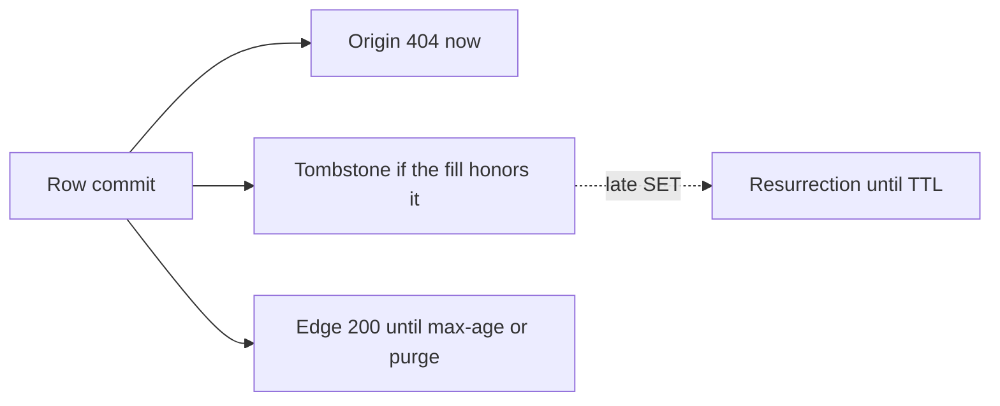
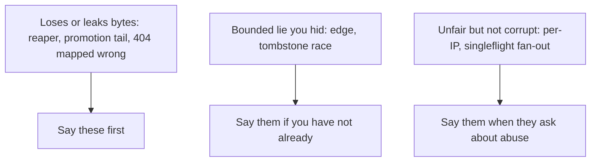

<!-- day-nav -->
[← Day 26 — End-to-end distributed pastebin](26-end-to-end-distributed-pastebin.md) · [Day 28 — Mock: image upload and thumbnails →](28-mock-image-upload-and-thumbnails.md)

# Day 27 — Red-team before they do

**Do now**

1. Set a timer.
2. Attempt the problem. Stop at the attempt line. Do not scroll.
3. Then read.

## Time box

40 minutes.

| Minutes | Do this |
|---|---|
| 0–12 | Attempt. List holes in the day-26 pastebin. Rank them. Patch the top one in words, not with a new platform. |
| 12–32 | Read. Add any hole you missed to your list. Do not "fix" all of them in the picture. |
| 32–40 | Say three holes and one patch out loud. Stop. A red team that rebuilds the system is a new design. |

## Intent

Facing your own finished design, leave able to find the holes a staff interviewer would open and patch the reasoning. The patch is a tighter rule or a bound. It is not a box you were saving for the last day.

## Problem

> Design a pastebin. People paste text and share a link.

The interviewer says: "Assume the design you just walked is in production. Where is it wrong? I want the hole, the user who hits it, and the change in reasoning. Not a wishlist."

## Attempt before reading

12 minutes. Do not scroll. Use the assembled pastebin: synchronous create, CDN max-age 60 seconds, cache tombstone, async replica you do not read, reaper with an age floor, ids never reused, creates not idempotent, per-IP limits.

Write five holes, each as: trigger, user-visible lie or loss, and whether you already bounded it. Star the one you would say first in the room. Patch that one in five lines. If the patch is "add Kafka" or "add a region," it is not a patch.

---

**Stop. Holes and patches below. The product does not grow.**

---

## Diagrams

### Where a delete is not one moment

The dotted arrow is the hole. The solid ones are the design. A red team that cannot draw this will hand-wave "cache invalidation is hard" and stop.

### Severity, so you know what to say first

Lead with loss. A fairness complaint is real and it is not how you open.

## Requirements

Red-team rules for this hour:

- A hole is a case where the contract, the durability claim, or the capacity claim is false.
- A bound you already stated ("edges can be wrong for 60 seconds") is not a hole unless you hid it. It is a trade. The hole is pretending it is not there.
- No new product: no search, no accounts, no malware model, no second region built on the whiteboard.
- Prefer a patch that makes an existing component tell the truth.

## Design

These are the holes worth your mouth. A staff interviewer needs one or two done properly, not twelve named.

### 1. The edge serves a deleted paste

Trigger: DELETE commits, a warm POP still has the object, purge is slow or lost.

User: a reader with the link gets the text after the deleter thinks it is gone.

You already capped this at max-age. **Patch the sentence, not the CDN:** origin-authoritative immediately, edges within 60 seconds, purge best-effort.

### 2. A late cache fill resurrects a delete

Trigger: a miss read the primary before the delete, and `SET` runs after the tombstone, and your fill path does not check.

User: origin serves a deleted paste until the TTL.

**Patch:** the tombstone wins. You said this on day 10.

### 3. Create is not idempotent, and timeouts make it worse

Trigger: the client times out waiting for 201. The row committed.

User: two pastes, or an orphan and a paste, and the deleter's token only kills one.

**Patch:** keep the app from retrying. Document that a client retry is a second paste.

### 4. The reaper deletes a live object, or a delayed job deletes a recycled id

Trigger: the age floor is shorter than a stuck create, or someone later reuses ids, or the reaper lists the bucket and deletes "unreferenced" keys while a commit is in flight.

User: `body_missing` 500s, or the next paste's bytes vanish.

**Patch:** age floor (one hour) greater than any in-flight create, reap only from a failure log plus the check "no row," never reuse ids so a late detach cannot hit a successor. If you cannot explain the age floor, you do not have a reaper.

### 5. Promotion loses the tail, and 201s become 404s

Trigger: primary dies after commit and before the async replica applies. You promote.

User: a link you already handed out 404s. The bytes may still be in the bucket with no row.

**Patch:** say the RPO. If that user is unacceptable, the patch is sync commit to one replica and a 201 that waits for it, which you priced on day 13 and declined.

### 6. Singleflight is per process

Trigger: the hot key expires, and you have four processes, or thirty after a scale-out.

User: the primary sees N identical reads, not one. At three, this is fine.

**Patch:** say the bound. "Per process, so the fan-out equals the number of apps." If that number times a miss wave exceeds the fill cap, the cap sheds, which is the real protection.

### 7. Per-IP limits are not per human

Trigger: a NAT, or a botnet.

User: a campus shares 429s, or the global 350/s is entirely abuse and honest creators shed.

**Patch:** say it before they do. The next control is a tenant you refused (accounts) or a challenge in front of PUT.

### 8. App clocks and `expires_at`

Trigger: an app clock is fast, or slow, relative to the primary that wrote `expires_at`.

User: a fast clock 404s early on cache hits. The CDN max-age of 60 seconds already dominates a small skew.

**Patch:** NTP as an assumption, expiry checked as a timestamp you stored, not as a TTL you hope matches the allow-list. The 60-second edge bound is the larger lie.

### 9. 404 versus 503, collapsed by a helper

Trigger: a shared client library maps all failures to not-found, or the CDN caches a 500, or a bucket "no such key" during a partial outage is treated as delete.

User: a live paste looks deleted, or a dead store looks deleted, and you will reap or purge the wrong thing.

**Patch:** one mapping, written down. Timeout and 5xx from the bucket are 503.

### What you will not red-team today

Raft, multi-region active-active, a new id scheme, moving off Postgres, a malware model. Those are other interviews.

## Trade-offs

**Choice.** Patch by tightening rules: tombstone-wins, 503 versus 404, age floor, stated RPO, stated edge lag, no app retry. Add no box.

**What you give up.** The feeling of a closed design. Several holes remain as named trades (60 seconds, async RPO, per-IP fairness). You are betting a staff interviewer would rather hear the trade than watch you bolt on a region in the last five minutes.

**10×.** Every hole gets louder. A 60-second edge lie at 10× is ten times the readers. If your only 10× answer is "the holes matter more," add one concrete: the fill cap and the 503 mapping must be in place before you multiply traffic, because a wrong 404 at 10× becomes a reap of the wrong keys at a rate you cannot undo by hand.

## Say this in the room

The holes I will own: an edge can serve a deleted paste for up to 60 seconds; a late cache fill can resurrect a delete unless the tombstone wins; a client retry can mint a second paste; a reaper without an age floor can delete a live object; an async replica can lose the tail and turn a 201 into a 404. The one I would patch in the design, not just the sentence, is the 404 mapping. Timeouts are 503. A missing object under a live row is a page, not a reap. I am not adding a region to answer this.

## Kit artifact

One follow-up row.

| Follow-up they will use | You answer with |
|---|---|
| "Where is this wrong?" | One loss, one bounded lie, one patch that is a rule. No new platform. |

## Design log

One line: the hole you did not see until you read, and whether it loses data or only delays a delete. That distinction is the gap if you could not make it.

Next: [Day 28 — Mock: image upload and thumbnails](28-mock-image-upload-and-thumbnails.md). On day 28 you do not open this page, and you do not open the pastebin lessons.

---

<!-- day-nav -->
[← Day 26 — End-to-end distributed pastebin](26-end-to-end-distributed-pastebin.md) · [Day 28 — Mock: image upload and thumbnails →](28-mock-image-upload-and-thumbnails.md)
