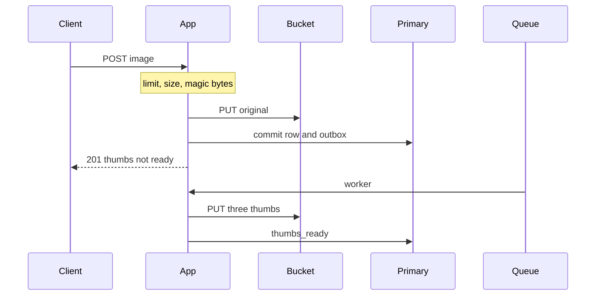
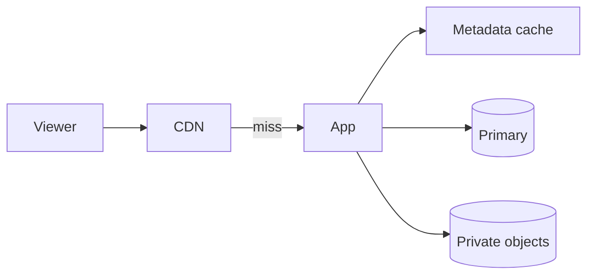

<!-- day-nav -->
[← Day 27 — Red-team before they do](27-red-team-before-they-do.md) · [Checklist →](../CHECKLIST.md)

# Day 28 — Mock: image upload and thumbnails

## Time box

35 minutes for the attempt, then 10 minutes to score and log. The 10 minutes are not part of the interview clock. Do not use them to keep designing.

## Intent

Facing an interview problem that is not the pastebin, leave able to design image upload and thumbnails from the product behavior, then log a self-score. The pastebin lessons are not a script you are allowed to copy. The method is.

## How to run

- Blank paper. No notes, no days 8–27, no search, no chat.
- The only card you may have open is [prompts/image-upload.md](../prompts/image-upload.md). It does not help you.
- Do not scroll past the attempt barrier. The rubric is above the barrier so you can score. The design is below it.
- This is not a pastebin. If you notice yourself saying "10 million pastes," stop and pick numbers for images.
- Timer visible. At zero you stop, even mid-arrow.
- Score, then write the log from **your** page, then scroll.

Score what the product does, not which boxes you remembered. A complete page says what the upload returns, what a viewer sees when a smaller version does not exist yet, and what a second run of the same resize does. If one of those is missing, that is a gap, not a failure of the timer. Log it. Do not scroll to find the missing piece.

If you already scrolled, close the page. Run the mock tomorrow from memory, or it measures nothing.

## Timer

| Clock | You are doing | You are not doing |
|---|---|---|
| 0:00–5:00 | What an upload returns, what a viewer can fetch, non-goals. | A tour of image formats |
| 5:00–10:00 | QPS, bytes in, bytes out, resident set. Average and peak. | The pastebin's 10 KB mean, reused without saying so |
| 10:00–16:00 | API and the row. Where the original bytes live. | A classifier, a feed, or accounts you did not need |
| 16:00–26:00 | Upload path and view path, separate. Where resize runs. | One path that ignores the other |
| 26:00–33:00 | One deep dive: a retried resize, delete, or a hot image's bandwidth. | All of the phase's boxes, copied across |
| 33:00–35:00 | What you did not build, and the 10× break. | A second product |

## Problem

> Design image upload and thumbnails.
>
> People upload an image and share a link. Viewers can open the image and smaller versions of it.

That is the entire problem. Thirty-five minutes. Blank page. No notes.

## Rubric

Same six dimensions as day 7. Score 1–4 from your page only. A senior-shaped loop is mostly 3s. A staff-shaped loop is a 4 on the deep dive and a 4 on failure, not more boxes.

### Requirements

| Score | Anchor |
|---|---|
| 1 | Components first. No non-goals. |
| 2 | Behaviors listed. Constraints are adjectives. |
| 3 | Behavior, constraints, and non-goals locked before the design. The questions you asked would have changed the model. |
| 4 | As a 3, and each non-goal is a product you refused, with a reason. |

### Estimates

| Score | Anchor |
|---|---|
| 1 | No numbers, or one QPS with no numerator. |
| 2 | Numbers exist. Units or assumptions are missing. |
| 3 | Write QPS, read QPS, storage, and bandwidth. Average and peak. Assumptions spoken. |
| 4 | As a 3, plus the assumption you trust least, and a 10× move tied to a named limit. |

### API and data

| Score | Anchor |
|---|---|
| 1 | No API. The database brand is the model. |
| 2 | Endpoints exist. The lookup key or the "not ready" behavior is vague. |
| 3 | Upload, fetch, and delete or expiry. A real key. A defined result when the thumb does not exist yet. |
| 4 | As a 3, plus a key scheme you can justify, and a distinction you refused to leak or to blur (not-ready versus missing versus down). |

### Design

| Score | Anchor |
|---|---|
| 1 | A technology tour, or boxes that ignore the numbers. |
| 2 | A plausible system that is heavier than the numbers, or the ack is vague, or not-ready, missing, and down are the same result. |
| 3 | The smallest design that meets the numbers. The ack does not wait on every smaller version. Not-ready, missing, and down are different where the product needs them to be. |
| 4 | As a 3, and the resize is safe to run twice, and you can say what the user sees while that work has not finished. |

### Deep dive

| Score | Anchor |
|---|---|
| 1 | You cannot go past the boxes. |
| 2 | Under a push, the answer is a product name. |
| 3 | One dive, with a choice and a cost. |
| 4 | The dive uses arithmetic or a concrete fault. You can name what it did not solve. |

### Failure and ops

| Score | Anchor |
|---|---|
| 1 | "We'll have replicas," and no user-visible behavior. |
| 2 | A dependency is named. Impact is fuzzy. |
| 3 | One dependency down. What the user sees. What is already durable. What you page on. |
| 4 | As a 3, plus the crash window you still have after the mitigation you drew. |

Do not average these into one vanity number. The log wants the six scores and **one** gap.

## Attempt first

Do the 35 minutes now.

When the timer stops:

1. Score the six dimensions from the anchors above. Evidence is a phrase on your paper.
2. Copy [design-log/TEMPLATE.md](../design-log/TEMPLATE.md) somewhere private. Fill it from your attempt. Scores are final once written.
3. Only then cross the barrier.

---

# Attempt barrier

You are about to read a reference design for image upload and thumbnails.

If your timer has not hit zero, go back up. If your design log is not filled, go back up. The reference will look like the pastebin with the nouns swapped. It is not. The sizes, the async work, and the "not ready" state are the point. Use it for one amendment line. Do not edit the scores.

---

## Reference design

One legal design, at interview depth. Yours can differ and still be a 3. It is not a 3 if the original lives only on the app's disk, if every view hits the primary, or if the upload request does the resize.

### Requirements

**In.** An anonymous client uploads one image and gets a link. Viewers with the link can fetch the original and three smaller renditions (long edge 64, 256, and 1024). The uploader can delete with a token returned once. Optional: the image stays until delete, but you refuse unbounded retention. Max life **365 days**. Planning mix: **180 days** of ingest resident. Types: JPEG, PNG, WebP, checked by magic bytes and a declared type, not by a model. Max original **20 MB**. Reject oversize; do not resize-to-fit as a silent accept.

**Ack.** 201 only after the original is durable in object storage and the row has committed. Thumbnails are **not** on that path. The response may include thumb URLs that do not work yet.

**Not-ready.** Public fetch of a thumb that is not built yet is **404**, same shape as missing, so a stranger learns nothing. The uploader polls `GET /v1/images/{id}/status` with the token and sees `thumbs_ready` or `failed`. Do not block 201 on the worker. Do not return a half-written image.

**Assumptions.** 1 million uploads a day. Mean original 2 MB. Peak 3×, diurnal. Over the life of an image: about 30 thumb fetches and 5 original fetches, which is an assumption about viewing, not a law. One region.

**Out.** Accounts, galleries, comments, search, tagging, recommendations, face detection, filters, editing, multi-region, a malware model, transcoding video. Resize is CPU, not a model.

### Estimates

| Quantity | Result |
|---|---|
| Upload QPS | 1,000,000 / 86,400 ≈ **12** average, **~36** peak |
| Thumb jobs | the same **12/s** average, **~36** peak |
| Fetches | 12 × 35 ≈ **420/s** average, **~1,260/s** peak |
| Ingest | 1e6 × 2 MB = **2 TB/day** originals, plus ~**0.25 TB/day** of thumbs |
| Resident, 180-day mix | **~360 TB** originals, **~45 TB** thumbs |
| Worst allow-list, 365 days | about **double** the originals, ~730 TB |
| Metadata | hundreds of bytes × 1e6 × 180 ≈ **~90 GB** |
| Egress | originals dominate: 60 fetches/s × 2 MB ≈ **120 MB/s** average, **~360 MB/s** peak, plus ~30 MB/s of thumbs average. Peak total on the order of **3–4 Gbit/s** |

QPS is boring. Bytes are not. A single 20 MB image fetched 200 times a second is 4 GB/s, about **32 Gbit/s**, which is the hot-object break even when the average NIC math looks survivable. That is why public bytes are not streamed through the app as the steady state.

Worker CPU, planning: a resize of a 2 MB image takes ~200 ms of CPU. Peak 36 jobs × 0.2 s ≈ **7 cores**. Say a small worker pool. This is a planning number, not a benchmark. If resize is 2 seconds, you need ~70 cores or you accept a backlog. The queue is what makes that a backlog instead of an upload outage.

**10×.** ~360 uploads/s peak, ~20 TB/day, multi-petabyte resident if the mix holds, egress ~30–40 Gbit/s if viewing scales. The CDN and the bucket are the components you are scaling. The primary's QPS still is not the story. Worker cores scale toward ~70 at the same 200 ms assumption. If they do not, thumb latency is the user-visible 10× break, not upload correctness, as long as 201 did not wait on resize.

Sensitive assumption: mean original size. If the mean is 10 MB, ingest and egress multiply by five and today's bandwidth story is already the 10× story.

### API and data

`POST /v1/images` with the raw bytes and a content type. 413 over 20 MB. 400 if the magic bytes are not in the allow-list. 429 before the body is stored, per source IP (count and bytes). 201: `id`, `url`, `thumb_urls`, `delete_token` once, `thumbs_ready: false`.

`GET /v1/images/{id}` original. `GET /v1/images/{id}/t/{64|256|1024}` thumb. 200 with the bytes and `nosniff` once they exist. 404 if the id is unknown, deleted, expired, or the thumb is not ready. Same public body. Status for the token holder tells the truth.

`DELETE` with the token. 204 after the row is gone. Bytes and edge entries go after.

Row: id (12-character base62, never reused, same birthday reasoning as a paste if you want the deep dive — at 1 million a day you have even more room), `created_at`, `expires_at`, `size_bytes`, `content_type`, `width`, `height`, `thumbs_ready`, `failed`, `delete_token_hash`. Primary key `id`. No user table. Objects: `img/{id}/original`, `img/{id}/t64`, `t256`, `t1024`. Private bucket. Keys derived, not stored.

### Upload path and view path

Upload: limit, check length, take an in-flight slot (these bodies are 2 MB mean and 20 MB cap — an uncapped pile will kill the process), sniff magic bytes, mint id, PUT original, insert row **and** an outbox job in one commit, 201. Then the worker, which the user does not wait on.

Worker: claim the job, GET the original, resize, PUT the three keys, set `thumbs_ready`. Doing it twice overwrites the same keys. A poison image that will not decode: set `failed`, ack the job, do not retry forever. The original remains fetchable. Thumbs stay 404. Status shows failed.

View: CDN in front of public GETs only. Origin is the app, bucket stays private. Metadata cache holds the row, including `thumbs_ready`. Do not cache `thumbs_ready=false` for more than a few seconds, or you will pin "not ready" and the CDN must not cache the 404. Once ready, max-age is min(60 seconds, time left until `expires_at`), same delete bound as any other public byte cache. A hot original is a CDN problem, not a primary problem.

Delete: commit row delete and outbox, tombstone the metadata key, 204. Worker deletes four objects and purges. Ids are never reused, so a late job cannot delete a newer image's keys.

### Diagrams you should have had

### Failure

Bucket down during upload: 503, no 201, no row. During view: CDN hits work until max-age; cold fetches 503, not 404. Worker down: uploads still 201, originals still fetch, thumbs stay 404, status stays not ready, outbox age grows. That backlog is what the user can see: thumb latency. Page on outbox age and on worker failures. Do not page on 404 alone; not-ready is a 404 on purpose.

Primary down: uploads stop (no commit). Views of cached metadata and CDN hits continue until TTL. You do not promote a replica you did not draw. If you drew one, say the window.

### What you did not need

A pastebin's 17,400 reads/s of 10 KB. A search index. A GPU. A second queue for "image events" nobody consumes. Sticky sessions. Caching the 20 MB original on the app.

### After you read this

One amendment line: the concrete miss (the ack waited on resize, the bytes were on local disk, not-ready was a 500, the hot image had no edge, the worker was not safe twice). Leave the scores alone.

Tomorrow is phase 3, which is not in the repo yet. Do not start it by inventing a consistency lecture on top of this reference. The curriculum is the map.

---

<!-- day-nav -->
[← Day 27 — Red-team before they do](27-red-team-before-they-do.md) · [Checklist →](../CHECKLIST.md)
