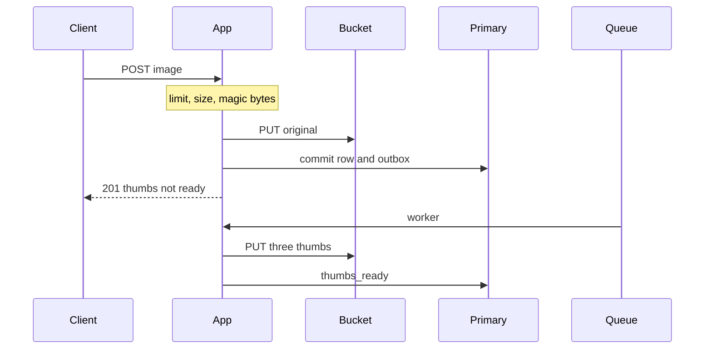
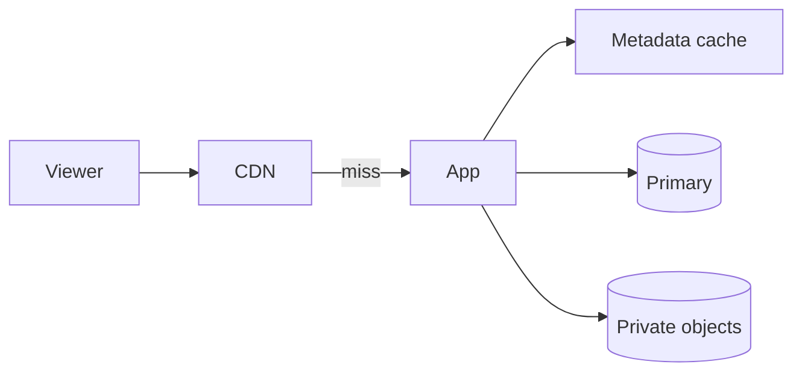

<!-- day-nav -->
[← Day 27 — Red-team before they do](27-red-team-before-they-do.md) · [Day 29 — The guarantee per operation →](29-the-guarantee-per-operation.md)

# Day 28 — Mock: image upload and thumbnails

**Do now**

1. Set a timer.
2. Attempt the problem. Stop at the attempt barrier.
3. Then read.

## Time box

35 minutes for the attempt, then 10 minutes to score and log. The 10 minutes are not part of the interview clock. Do not use them to keep designing.

## Intent

Facing an interview problem that is not the pastebin, leave able to design image upload and thumbnails from the product behavior, then log a self-score. The pastebin lessons are not a script you are allowed to copy. The method is.

## How to run

- Blank paper. No notes, no days 8–27, no search, no chat.
- The only card you may have open is the [image-upload problem](../prompts/image-upload.md) in the problem bank (`prompts/`). It does not help you.
- Do not scroll past the attempt barrier. The rubric is above the barrier so you can score. The design is below it.
- This is not a pastebin. If you notice yourself saying "10 million pastes," stop and pick numbers for images.
- Timer visible. At zero you stop, even mid-arrow.
- Score, then write the log from **your** page, then scroll.

Score what the product does, not which boxes you remembered. A complete page says what the upload returns, what a viewer sees when a smaller version does not exist yet, and what a second run of the same resize does. If one of those is missing, that is a gap, not a failure of the timer. Log it. Do not scroll to find the missing piece.

If you already scrolled, close the page. Run the mock tomorrow from memory, or it measures nothing.

## Timer

| Clock | You are doing | You are not doing |
|---|---|---|
| 0:00–5:00 | What an upload returns, what a viewer can fetch, non-goals. | A tour of image formats |
| 5:00–10:00 | QPS, bytes in, bytes out, resident set. Average and peak. | The pastebin's 10 KB mean, reused without saying so |
| 10:00–16:00 | API and the row. Where the original bytes live. | A classifier, a feed, or accounts you did not need |
| 16:00–26:00 | Upload path and view path, separate. Where resize runs. | One path that ignores the other |
| 26:00–33:00 | One deep dive: a retried resize, delete, or a hot image's bandwidth. | All of the phase's boxes, copied across |
| 33:00–35:00 | What you did not build, and the 10× break. | A second product |

## Problem

> Design image upload and thumbnails.
>
> People upload an image and share a link. Viewers can open the image and smaller versions of it.

That is the entire problem. Thirty-five minutes. Blank page. No notes.

## Rubric

Same six dimensions as day 7. Score 1–4 from your page only. A senior-shaped interview is mostly 3s. A staff-shaped interview is a 4 on the deep dive and a 4 on failure, not more boxes.

### Requirements

| Score | Anchor |
|---|---|
| 1 | Components first. No non-goals. |
| 2 | Behaviors listed. Constraints are adjectives. |
| 3 | Behavior, constraints, and non-goals locked before the design. The questions you asked would have changed the model. |
| 4 | As a 3, and each non-goal is a product you refused, with a reason. |

### Estimates

| Score | Anchor |
|---|---|
| 1 | No numbers, or one QPS with no numerator. |
| 2 | Numbers exist. Units or assumptions are missing. |
| 3 | Write QPS, read QPS, storage, and bandwidth. Average and peak. Assumptions spoken. |
| 4 | As a 3, plus the assumption you trust least, and a 10× move tied to a named limit. |

### API and data

| Score | Anchor |
|---|---|
| 1 | No API. The database brand is the model. |
| 2 | Endpoints exist. The lookup key or the "not ready" behavior is vague. |
| 3 | Upload, fetch, and delete or expiry. A real key. A defined result when the thumb does not exist yet. |
| 4 | As a 3, plus a key scheme you can justify, and a distinction you refused to leak or to blur (not-ready versus missing versus down). |

### Design

| Score | Anchor |
|---|---|
| 1 | A technology tour, or boxes that ignore the numbers. |
| 2 | A plausible system that is heavier than the numbers, or the ack is vague, or not-ready, missing, and down are the same result. |
| 3 | The smallest design that meets the numbers. The ack does not wait on every smaller version. Not-ready, missing, and down are different where the product needs them to be. |
| 4 | As a 3, and the resize is safe to run twice, and you can say what the user sees while that work has not finished. |

### Deep dive

| Score | Anchor |
|---|---|
| 1 | You cannot go past the boxes. |
| 2 | Under a push, the answer is a product name. |
| 3 | One dive, with a choice and a cost. |
| 4 | The dive uses arithmetic or a concrete fault. You can name what it did not solve. |

### Failure and ops

| Score | Anchor |
|---|---|
| 1 | "We'll have replicas," and no user-visible behavior. |
| 2 | A dependency is named. Impact is fuzzy. |
| 3 | One dependency down. What the user sees. What is already durable. What you page on. |
| 4 | As a 3, plus the crash window you still have after the mitigation you drew. |

Do not average these into one vanity number. The log wants the six scores and **one** gap.

## Attempt first

Do the 35 minutes now.

When the timer stops:

1. Score the six dimensions from the anchors above. Evidence is a phrase on your paper.
2. Copy [design-log/TEMPLATE.md](../design-log/TEMPLATE.md) somewhere private. Fill it from your attempt. Scores are final once written.
3. Only then cross the barrier.

---

# Attempt barrier

You are about to read a reference design for image upload and thumbnails.

If your timer has not hit zero, go back up. If your design log is not filled, go back up. Below is a reference, not a renamed pastebin. Use it for one amendment line. Do not edit the scores.

---

## Reference design

One legal design, at interview depth. Yours can differ and still be a 3. It is not a 3 if the original lives only on the app's disk, if every view hits the primary, or if the upload request does the resize.

### What transfers

This is not the pastebin with the nouns swapped. Three moves transfer, and each one is a reason, not a slogan.

**Bytes, not QPS.** About 12 uploads a second will not melt a primary. About 2 TB a day of originals will fill the disk you thought was "just images." One 20 MB object fetched 200 times a second is 4 GB/s, about 32 Gbit/s, which blows a 10 Gbit NIC while the average still looks fine. Do not reuse 17,400 reads of 10 KB as this product's bottleneck. That number points you at a metadata cache you have not earned and away from the bucket and the edge.

**201 before thumbs.** The user is waiting for a link to the original. Resize is CPU you do not control: a poison image, a slow codec, a dead worker. If 201 waits on it, a stuck worker is an upload outage, and a client timeout retries the whole POST. The ack waits until the original is in the bucket and the row, with the job, has committed. The three renditions run after, on a job that is safe to do twice because the keys are derived from the id.

**Public 404 versus the owner.** A viewer who fetches a thumb that is not built yet gets the same 404 body as an unknown, deleted, or expired id. A distinct "not ready" status is an oracle: the image exists, try again in a second. The owner, holding the token, reads status and can see not-ready or failed, because they already know the id exists. Down is not that 404. A cold fetch while the bucket is sick is 503, or the client will treat a blip as deletion and stop retrying.

### Requirements

**In.** An anonymous client uploads one image and gets a link. Viewers with the link can fetch the original and three smaller renditions (long edge 64, 256, and 1024). The uploader can delete with a token returned once. Optional: the image stays until delete, but you refuse unbounded retention. Max life **365 days**. Planning mix: **180 days** of ingest resident. Types: JPEG, PNG, WebP, checked by magic bytes and a declared type, not by a model. Max original **20 MB**. Reject oversize; do not resize-to-fit as a silent accept.

**Ack.** 201 only after the original is durable in object storage and the row has committed. Thumbnails are **not** on that path. The response may include thumb URLs that do not work yet.

**Not-ready.** Public fetch of a thumb that is not built yet is **404**, same shape as missing, so a stranger learns nothing. The uploader polls `GET /v1/images/{id}/status` with the token and sees `thumbs_ready` or `failed`. Do not block 201 on the worker. Do not return a half-written image.

**Assumptions.** 1 million uploads a day. Mean original 2 MB. Peak 3×, diurnal. Over the life of an image: about 30 thumb fetches and 5 original fetches, which is an assumption about viewing, not a law. One region.

**Out.** Accounts, galleries, comments, search, tagging, recommendations, face detection, filters, editing, multi-region, a malware model, transcoding video. Resize is CPU, not a model.

### Estimates

Round one place and then stay there. 1,000,000 / 86,400 = 11.57, which I call **12** uploads/s so the later products are integers. Peak is 3 × 12 = **36**, about 4% above 3 × 11.57. I will not also quote 35.

Thumb bytes are an assumption you say out loud: long edge 64, 256, and 1024 land near **8 KB, 40 KB, and 200 KB**, about **250 KB** together, **0.25 MB**. If your codec is fatter, this column moves and the upload QPS does not.

| Quantity | Work | Result |
|---|---|---|
| Upload QPS | 1,000,000 / 86,400, rounded | **12/s** average, **36/s** peak |
| Thumb jobs | one job per upload, three renditions inside it | **12/s** average, **36/s** peak. Not 36 × 3 jobs. |
| Fetches per image | 5 original + 30 thumb, over its life | **35** |
| Fetch QPS | 12 × 35, then ×3 | **420/s** average, **1,260/s** peak |
| Original fetches | 12 × 5 | **60/s** average, **180/s** peak |
| Thumb fetches | 12 × 30 | **360/s** average, **1,080/s** peak |
| Ingest | 1e6 × 2 MB, and 1e6 × 0.25 MB | **2 TB/day** originals, **0.25 TB/day** thumbs |
| Resident, 180-day mix | 180 × daily ingest | **360 TB** originals, **45 TB** thumbs |
| Worst allow-list, 365 days | 365 × 2 TB | **730 TB** originals, about double the 180-day mix (360 × 2 = 720) |
| Metadata | ~500 bytes × 1e6 × 180 | **90 GB**. "Hundreds of bytes" only lands here if you are near 500. Say 500. |
| Original egress | 60/s × 2 MB | **120 MB/s** average, **360 MB/s** peak |
| Thumb egress | 30 fetches across 3 objects is about **10 reads of each stored thumb byte**: 12/s × 10 × 0.25 MB | **30 MB/s** average, **90 MB/s** peak |
| Total egress | 150 MB/s average, 450 MB/s peak, ×8 | **1.2 Gbit/s** average, **3.6 Gbit/s** peak |

QPS of 12 is a small service. 2 TB/day is not. A single 20 MB original at **200 fetches/s** — one viral image, an assumption, not the mean of 60 — is 20e6 × 200 = 4e9 bytes/s = **4 GB/s = 32 Gbit/s**. Average egress of 3.6 Gbit/s fits a 10 Gbit NIC. That one object does not. Public bytes are therefore not streamed through the app as the steady state. The edge absorbs the viral object. The app checks the row and, on a miss, pulls the private bucket once per edge fill.

Worker CPU, planning, not a benchmark: a resize of a 2 MB image takes ~200 ms of CPU. 36 jobs/s × 0.2 s = **7.2 cores**, call it a small pool of about **7**. If resize is 2 seconds, 36 × 2 = **72 cores**, or you accept a backlog. The queue is what makes that a backlog instead of an upload outage. Do not put those cores on the request that returns 201.

**10×.** Uploads **120/s** average and **360/s** peak. Originals **20 TB/day**. Resident originals **3.6 PB** if the 180-day mix holds (360 TB × 10). Egress **36 Gbit/s** if viewing scales with uploads (3.6 × 10). The CDN and the bucket are what you are scaling. Commits are ~360/s peak, still not a pastebin read problem. At the same 200 ms, workers go to about **72 cores** (10 × 7.2). If you do not have them, thumb latency is the user-visible 10× break. Upload correctness is not, as long as 201 did not wait on resize.

Sensitive assumption: mean original size. If the mean is 10 MB, ingest and original egress multiply by five (10 TB/day, 600 MB/s average) and today's bandwidth story is already the 10× story. The upload QPS does not change when the mean size does. That is the whole point of separating them.

### API and data

`POST /v1/images` with the raw bytes and a content type. 413 over 20 MB. 400 if the magic bytes are not in the allow-list. 429 before the body is stored, per source IP (count and bytes). 201: `id`, `url`, `thumb_urls`, `delete_token` once, `thumbs_ready: false`.

`GET /v1/images/{id}` original. `GET /v1/images/{id}/t/{64|256|1024}` thumb. 200 with the bytes and `nosniff` once they exist. 404 if the id is unknown, deleted, expired, or the thumb is not ready. Same public body. Status for the token holder tells the truth.

`DELETE` with the token. 204 after the row is gone. Bytes and edge entries go after.

Row: id (12-character base62, never reused, same birthday reasoning as a paste if you want the deep dive — at 1 million a day you have even more room), `created_at`, `expires_at`, `size_bytes`, `content_type`, `width`, `height`, `thumbs_ready`, `failed`, `delete_token_hash`. Primary key `id`. No user table. Objects: `img/{id}/original`, `img/{id}/t64`, `t256`, `t1024`. Private bucket. Keys derived, not stored.

### Upload path and view path

Upload: limit, check length, take an in-flight slot (these bodies are 2 MB mean and 20 MB cap — an uncapped pile will kill the process), sniff magic bytes, mint id, PUT original, insert row **and** an outbox job in one commit, 201. Then the worker, which the user does not wait on.

Worker: claim the job, GET the original, resize, PUT the three keys, set `thumbs_ready`. Doing it twice overwrites the same keys. A poison image that will not decode: set `failed`, ack the job, do not retry forever. The original remains fetchable. Thumbs stay 404. Status shows failed.

View: CDN in front of public GETs only. Origin is the app, bucket stays private. Metadata cache holds the row, including `thumbs_ready`. Do not cache `thumbs_ready=false` for more than a few seconds, or a hit will keep saying not-ready after the worker finished, and the CDN must not cache the public 404 or a thumb that becomes ready stays missing for the whole negative TTL. Once ready, max-age is min(60 seconds, time left until `expires_at`), the same bound you already accepted so a delete can be late but not unbounded. A hot original is a CDN problem, not a primary problem. Caching the 20 MB original on the app recreates the 32 Gbit/s object on a process you sized for authorization, not for that NIC.

Delete: commit row delete and outbox, tombstone the metadata key, 204. Worker deletes four objects and purges. Ids are never reused, so a late job cannot delete a newer image's keys.

### The upload is slow-client-bound, not QPS-bound

Little's law on the request, not the bucket. Assume a phone uplink around 10 Mbit/s, about 1.25 MB/s. A 2 MB mean upload takes about 1.6 seconds to arrive; a 20 MB cap upload about 16 seconds. At 36 uploads a second, that is about 58 uploads in flight across the tier at the mean, and about 576 if they were all max-size. Fully buffered, the mean case is about 116 MB of memory and the max-size case is about 11.5 GB. So the in-flight slot from the upload path is a byte cap as much as a count cap, and the app should **stream** the body to the bucket with a small bounded buffer, sniffing the magic bytes from the first few kilobytes, rather than holding 20 MB per request.

**The alternative a staff answer names: upload straight to the bucket.** The client asks for an upload slot; the app creates a pending row and returns a short-lived signed PUT URL for `img/{id}/original`; the client PUTs to the bucket; the client calls "complete"; the app checks the object's size and reads its first bytes, then commits the row as live with the outbox job, and returns 201. It takes the 20 MB bodies and the slow clients off the app entirely. It costs a third round trip, a pending state that must expire on its own, and validation that happens after the bytes landed instead of before. Take it when clients are mostly mobile, when the cap is large, or at 10×. At 36 uploads a second with streaming, the simpler single POST is defensible. Say both and pick one.

### The worker is where the crash windows hide

**Delete races the worker.** The owner deletes while a resize is running. The delete commits, the detach job removes the four objects, and then the slow worker PUTs three thumbnails for an id with no row. Those objects are orphans nobody's failure log knows about. **Patch:** the worker's last step is a conditional update, set `thumbs_ready` where the id still exists. Zero rows updated means the row is gone: the worker deletes the thumbnails it just wrote. If the delete commits after that update instead, the detach job runs after it and removes everything, because every PUT happened before the update. Ordering closes the window; no lock is needed.

**Decompression bombs.** A 20 MB PNG can declare 30,000 × 30,000 pixels: about 900 megapixels, 3.6 GB once decoded at four bytes a pixel. Read width and height from the header before decoding and refuse past a pixel cap, say 50 megapixels, about 200 MB decoded. Mark the image `failed`; the original stays fetchable as uploaded bytes; thumbs stay 404. Give each job a memory limit and a timeout so one image cannot take a worker down with it. This is the "resize is CPU you do not control" sentence made concrete.

**Metadata leaks.** Phone photos carry location in EXIF. Re-encoded thumbnails carry none; the original is served as uploaded unless you decide to strip location at upload. Say the decision. And no SVG in the allow-list: it is a document that can run script.

**Size the pool for catch-up, not for the average.** Seven cores at 200 ms process about 35 jobs a second, which is barely the peak of 36. A one-hour worker outage at peak leaves about 130,000 jobs (36 × 3,600). Seven cores fall further behind through the busy hours and clear it only at the average rate, with about 23 jobs a second of surplus: roughly an hour and a half. Double the pool to about 14 cores, about 70 jobs a second: at the average of 12 arrivals that is about 58 jobs a second of surplus, and the backlog clears in roughly 37 minutes. The user-visible number is thumb latency after an incident, and it is the pool's headroom that sets it.

What staff sounds like on this problem is finding the windows the pastebin did not have: a slow 20 MB upload holding memory, a worker that outlives a delete, an image that is small on disk and huge in memory. Each comes with a number or an ordering, and none of them needs a new box.

### Diagrams you should have had

Caption it: "201 above the queue line. Thumbs below it, and `thumbs_ready` is a conditional update, last." The worker's final arrow is the one that closes the delete race; label it "where id still exists."

Caption: "Same edge-first view path as the pastebin, but the hot object is 20 MB." Write "32 Gbit/s if one viral original misses" beside the CDN. That number is why the edge is not optional here.

### Failure

Bucket down during upload: 503, no 201, no row. During view: CDN hits work until max-age; cold fetches 503, not 404. Worker down: uploads still 201, originals still fetch, thumbs stay 404, status stays not ready, outbox age grows. That backlog is what the user can see: thumb latency. Page on outbox age and on worker failures. Do not page on 404 alone; not-ready is a 404 on purpose.

Primary down: uploads stop (no commit). Views of cached metadata and CDN hits continue until TTL. You do not promote a replica you did not draw. If you drew one, say the window.

### Failure the user sees, per person

**Uploader, bucket slow.** Streaming uploads stall; slots fill; new uploads get 503 with a jittered `Retry-After` before the body is read. A phone that already sent 15 MB loses it. Say that as the cost of not buffering, and the reason direct-to-bucket upload with resumable parts is the 10× conversation.

**Uploader, workers down.** 201 as usual; status says not ready for as long as the backlog lasts, about 37 minutes to clear after an hour's outage with the doubled pool. The original link works from the first second.

**Viewer of a fresh image.** Original works. Thumbs 404 until ready, same body as missing. The viewer's client shows a placeholder and retries with backoff; only the owner needs the truth, from the status endpoint.

**Viewer of a viral original.** Edge hits through any single origin dependency failing, until max-age. If the edge misses at 200 fetches a second of a 20 MB object, one origin NIC is gone in the first second; shed that object before the site.

**Owner deleting.** 204 after the row commit. Objects removed by the worker; a resize still in flight cleans up its own thumbnails via the conditional update. Edges may serve the image for up to 60 seconds.

### Trade-offs you should have named

**Upload through the app versus straight to the bucket.** Through the app: one request, validation before durability, slow clients and 20 MB bodies on your processes. Direct: bodies never touch the app, at the cost of a pending state, a third call, and validation after the fact. You refuse direct at 36 a second with streaming; you take it at 10× or for mobile-heavy traffic.

**Eager versus lazy thumbnails.** You refuse lazy, resize on first fetch, because 30 thumbnail fetches per image means nearly every image is viewed anyway, and lazy puts CPU and a cold-start herd on the read path of a viral image. If viewing dropped to about one fetch per image, lazy with singleflight on the resize would deserve a second look.

**Public 404 versus a "processing" status.** You refuse a public not-ready status because it is an existence oracle; the owner already knows the id and gets the truth from the token-gated endpoint.

### Probes the interviewer will use, with the answer

**"Why not resize in the upload request?"** "A 2 MB decode is about 200 ms of CPU I don't control, and a poison image can take seconds or a worker. If 201 waits on it, a stuck worker is an upload outage and a client timeout retries the whole 2 MB POST."

**"What if the delete lands while the resize runs?"** "The worker's last step is a conditional `thumbs_ready` update. Zero rows means the image is gone, so the worker deletes what it just wrote. Otherwise the detach job runs after and removes all four keys."

**"What's your worst-case memory per upload?"** "If I buffer, 20 MB times every slow client; about 11.5 GB at peak if they were all max-size. So I stream to the bucket with a small buffer and sniff the magic bytes from the first chunk."

### What you did not need

A pastebin's 17,400 reads/s of 10 KB. A search index. A GPU. A second queue for "image events" nobody consumes. Sticky sessions. Caching the 20 MB original on the app.

## Say this in the room

Uploads are about 12 a second because a million a day divided by 86,400 is about 12, and the bytes are the story: 2 MB mean is 2 TB a day, not a read-QPS problem copied from the pastebin. A 20 MB image at 200 fetches a second is 32 Gbit/s, so the edge holds the hot object and the app does not. I return 201 once the original PUT has acked and the row and the job have committed. The three thumbnails run after, on keys derived from the id, so doing the job twice overwrites the same objects. A public fetch of a thumb that is not ready is a 404 with the same body as missing, so a stranger learns nothing, and I do not let the CDN cache that 404. The owner polls status with the token and can see not-ready or failed. If the bucket is down, upload is 503 and a cold fetch is 503; a warm edge can still serve until max-age. That 200 is not a 404, and the 503 is not a 404 either. Uploads are slow-client-bound, so I stream to the bucket rather than buffer 20 MB per request, and I'd move to signed direct uploads at 10×. The worker checks the pixel count before it decodes, and its last step is a conditional update so a delete during a resize cleans up after itself.

### After you read this

One amendment line: the concrete miss (the ack waited on resize, the bytes were on local disk, not-ready was a 500, the hot image had no edge, the worker was not safe twice). Leave the scores alone.

Next: [Day 29 — The guarantee per operation](29-the-guarantee-per-operation.md). Phase 3 is guarantees, keys, and failures on purpose. Do not turn this reference into that lecture.

---

<!-- day-nav -->
[← Day 27 — Red-team before they do](27-red-team-before-they-do.md) · [Day 29 — The guarantee per operation →](29-the-guarantee-per-operation.md)
