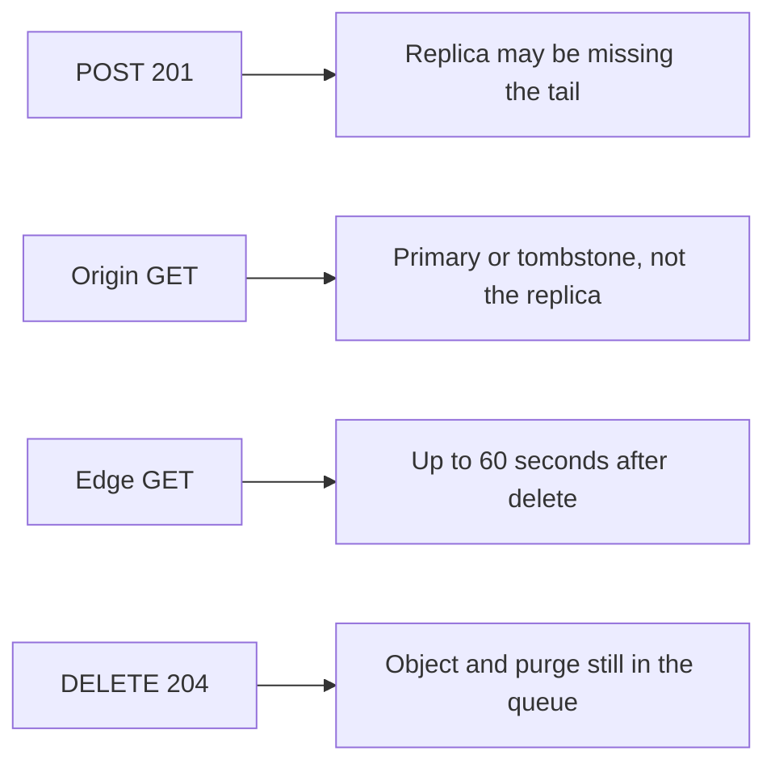

<!-- day-nav -->
[← Day 28 — Mock: image upload and thumbnails](28-mock-image-upload-and-thumbnails.md) · [Day 30 — Linearizability and what you refuse →](30-linearizability-and-what-you-refuse.md)

# Day 29 — The guarantee per operation

**Do now**

1. Set a timer.
2. Attempt the problem. Stop at the attempt line. Do not scroll.
3. Then read.

## Time box

35 minutes.

| Minutes | Do this |
|---|---|
| 0–12 | Attempt. One sentence of guarantee for create, for origin GET, for edge GET, and for delete. Not one word for the whole system. |
| 12–28 | Read. If you wrote "strong" or "eventual" once and stopped, replace it with the four sentences. |
| 28–35 | Say the four guarantees and the failure each one accepts. Stop. |

## Intent

Facing the word "consistent," leave able to state the guarantee per operation instead of one label for the whole system. "The pastebin is consistent" is not a design. It is a word you hid behind.

## Problem

> Design a pastebin. People paste text and share a link.

The interviewer says: "What does consistent mean for this system? I want it per call, and I want the failure you are accepting on that call."

## Attempt before reading

12 minutes. Do not scroll. Use the assembled pastebin: 201 after the primary commit, async replica you do not read, metadata cache with a tombstone on delete, CDN max-age at most 60 seconds, creates not idempotent, ids never reused.

Write four lines, one each for POST, origin GET, edge GET, and DELETE. Each line names the guarantee and the lie or loss you still allow. If a line uses only the word "eventual," it is not finished.

---

**Stop. Worked per-call promises below. Leave the four lines you wrote. Do not revise them to match.**

---

## Requirements

The contract from day 26 does not change today. What changes is that you are no longer allowed to answer consistency questions with a single adjective.

A guarantee is something a caller can test:

- **Durability of a 201.** After the response, the row survives a process crash. It does not have to survive the primary disk until you said it does.
- **Visibility.** After a defined response, a defined reader sees a defined result.
- **Uniqueness.** One id, one row. A remint on conflict is the mechanism, not a vibe.
- **Idempotence, or its absence.** A retry either returns the same result or it is a second product action you have named.

"Eventual consistency" fails the test. Eventual *what*, for *which reader*, after *which bound*? If you cannot fill those in, you have not chosen.

You are not picking a CAP side for the whiteboard. CAP is a theorem about partitions, not a setting on your load balancer. If they say "are you CP or AP," you answer with the operation that stalls and the operation that serves a stale byte. That is the whole translation.

## Design

Say these four. The numbers are the ones you already own. Do not invent a tighter product to sound serious.

### POST, the 201

**Guarantee.** The row is committed on the primary, and the object PUT returned success, before the client sees 201. A crash of the app process after that commit does not lose the row. The id will not be issued again.

**What you do not guarantee.** The async replica does not have the row yet. If the primary disk dies in that window, the 201 becomes a 404 after promotion. That window is the RPO you already accepted on day 13: the last seconds of commits, not zero. A client that times out and POSTs again gets a **second paste**. Create is not idempotent. Do not smuggle idempotency in while defining durability. That is day 37, and only if they add the requirement.

**Failure you accept.** Lost tail on primary death, and a duplicate paste on client retry. Both are named. Neither is "eventual."

### Origin GET

**Guarantee.** A miss reads the primary, not the replica. The row is readable only if it exists and `expires_at` is in the future, checked against the timestamp in the row. After a delete commits, a later origin read does not return the body: the tombstone blocks a late cache fill from putting the row back. Unknown, expired, and deleted are the same 404. A live row whose object is missing is a 500, not a 404.

**What you do not guarantee.** A cache hit filled before the delete can still be served until the tombstone write lands. That is a race of one in-flight read, not a 60-second policy. You do not promise that a GET which *started* before the delete returns 404. Linearizability is a later conversation. Today you promise the origin result **after** the delete has committed and the tombstone is in, for a request that starts then.

**Failure you accept.** Primary down: hits may still serve until their TTL; misses are 503, not 404. You will not promote a lagging replica into this path to "keep GETs consistent." A stale fill would make the lie sticky.

### Edge GET

**Guarantee.** You do not make one. The edge is allowed to serve the body it cached for up to **60 seconds** after a delete or an expiry that the origin already enforces. Purge is best-effort and is not part of the guarantee. You never say the edge is linearizable, strongly consistent, or "invalidated."

**Failure you accept.** A reader with the link sees a deleted paste until max-age. On a hot key at half of peak, half of 17,400 is **8,700 reads/s**. Across a full 60 seconds that is 8,700 × 60 = **522,000** serves of a paste the deleter already killed, if the entry was hot and purge did nothing. You accept that number because the alternative is origin bandwidth you already moved off the NIC. Say the number when they flinch. Do not shrink it in the sentence and leave it in the config.

### DELETE

**Guarantee.** 204 means the row commit succeeded on the primary and the tombstone was written. A later origin GET 404s. The delete is safe to retry: a second DELETE is the same 404 as a missing id, and the token does not get a second life.

**What you do not guarantee.** The object is gone. The edge is dark. Those are the queue from day 16. 204 is not "every copy on earth has forgotten the bytes."

**Failure you accept.** Orphan object until the worker runs, and the 522,000 edge serves above. A lost outbox row leaks the object; it does not resurrect the origin row. If you cannot keep those two failures apart, you will "fix" a leak by making deletes slower, or you will reap a live object to make the leak metric pretty.

### One table, so you cannot hide

| Call | You promise | You accept |
|---|---|---|
| POST 201 | Primary commit and a durable PUT. Id never reused. | Replica may not have it. Client retry is a second paste. |
| Origin GET | Primary or a cache entry the tombstone still dominates. Expiry from the stored timestamp. | Misses 503 when the primary is down. Not a replica read. |
| Edge GET | Nothing tighter than max-age. | Up to 60 seconds, and up to ~522,000 serves of one hot deleted paste. |
| DELETE 204 | Origin will not serve it after this returns. | Object and edge lag. Retry is a 404, not a second effect. |

If they ask for one word anyway: "It depends on the call. The origin delete is a committed primary write. The public read is a 60-second cache. I will not average those into 'eventual.'"

## Diagrams

### Where each call is allowed to be wrong

The picture is four promises. A diagram with one "consistency" box on the side is the adjective you just refused.

## Trade-offs

**Choice.** Four guarantees, four accepted failures, no product change.

**Alternative.** One label, usually "strong" for the room and "eventual" in the notes, or the reverse.

**What you give up.** The comfort of a single answer. You also give up the right to claim the edge is correct the moment DELETE returns. You already gave that up on day 15. Today you stop describing it as a temporary bug.

**10×.** The promises do not get stricter because traffic grew. The edge number does: 10 × 522,000 = **about 5.2 million** serves of one deleted hot paste inside the same 60 seconds, if the hot fraction holds. If that is no longer acceptable, the fix is a shorter max-age on that class of object, paid in origin reads, not a new consistency product. 5.2 × 10^5 × 10 is 5.2 × 10^6. Say it as five million, not "a lot more."

## Talking points

**Hand-waving.** "We are strongly consistent at the database and eventually consistent at the edge." That sentence is almost this lesson, and it is still missing the bound and the operation. Add the 60 seconds and the 201's RPO or it is a slogan.

**Hand-waving.** "CAP means we chose AP." Which call fails closed, and which call returns a stale body? If you cannot point, you chose a letter.

**If they ask whether expiry is consistency.** Expiry is a predicate on a timestamp you stored. A lagging replica that has the row still expires it on time, because the timestamp is in the row. Lag does not un-expire. Lag resurrects a delete and hides a create. Those are different bugs. Do not file them under one word.

## Say this in the room

A 201 means the primary committed the row and the object PUT succeeded, and it does not mean the replica has that row yet. An origin GET reads the primary or a cache entry the delete tombstone still wins over, and a miss while the primary is down is a 503, not a 404. An edge GET has no tighter promise than the 60-second max-age, which on a hot deleted paste is about 8,700 reads a second times 60 seconds, about half a million serves I am explicitly accepting. A 204 means the origin will not serve the paste anymore, and it does not mean the object and the edge are already dark. I will not call that mix strong, eventual, or a CAP letter.

## Kit artifact

One checklist row.

| They say | You answer with |
|---|---|
| "Is it consistent?" | Four lines: 201, origin GET, edge GET, DELETE. Each line has a promise and a bound. |

## Design log

One line: which call you had collapsed into "eventual," and the bound you can now say. That is the gap if the bound is still missing.

Next: [Day 30 — Linearizability and what you refuse](30-linearizability-and-what-you-refuse.md).

---

<!-- day-nav -->
[← Day 28 — Mock: image upload and thumbnails](28-mock-image-upload-and-thumbnails.md) · [Day 30 — Linearizability and what you refuse →](30-linearizability-and-what-you-refuse.md)
