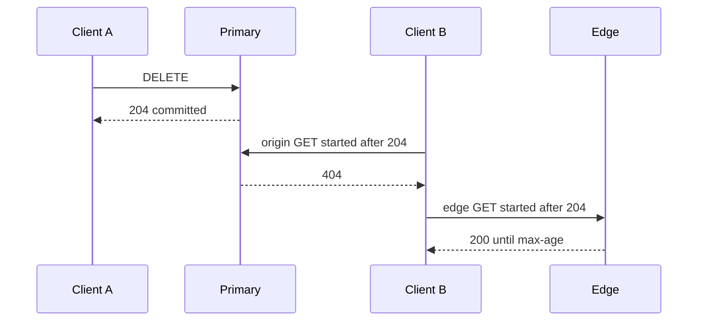

<!-- day-nav -->
[← Day 29 — The guarantee per operation](29-the-guarantee-per-operation.md) · [Day 31 — Partition key, hash, and range →](31-partition-key-hash-and-range.md)

# Day 30 — Linearizability and what you refuse

**Do now**

1. Set a timer.
2. Attempt the problem. Stop at the attempt line. Do not scroll.
3. Then read.

## Time box

40 minutes.

| Minutes | Do this |
|---|---|
| 0–12 | Attempt. Define linearizability in one sentence you could say to a skeptical peer. List the calls you will give it, and the calls you refuse. |
| 12–32 | Read. If every GET is on your "yes" list, price it against 17,400 and take the CDN back off the list. |
| 32–40 | Say the definition, the two calls that have it, and the call that would cost you the primary ceiling. |

## Intent

Facing a demand for linearizability, leave able to say which operations need it and which you will refuse. The demand is usually a word. The answer is a list.

## Problem

> Design a pastebin. People paste text and share a link.

The interviewer says: "Make the reads linearizable." Then they wait to see whether you nod.

## Attempt before reading

12 minutes. Do not scroll. Peak origin-facing reads, if the edge is cold, are **17,400/s**. The primary's planning ceiling while it is also committing is about **15,000** point reads/s. Happy-path origin reads with a warm edge and a warm metadata cache are about **870/s**, and primary reads about **87/s**. Those are assumptions about hit rate, labeled as such on day 26, not measurements.

Write:

1. A definition of linearizability that mentions real time, not just "the latest value."
2. The smallest set of operations that need it for this contract.
3. What breaks in the product if public GET is on that list.
4. The word you will not use as a synonym: serializable, or "quorum," or "strong." Pick the one you have been misusing and define it in a clause, or write that you will not pretend.

---

**Stop. The real-time test is below. Your yes-list and your no-list stay on the attempt.**

---

## Requirements

Linearizability is a property of a single object and the operations on it. An operation appears to take effect at one instant between when the client sent it and when the client received the response. If call A **completes** before call B **starts**, A comes first in that order. That real-time clause is the whole difference from "some order that a database could have produced."

Serializability is the other word people swap in. It says transactions appear in *some* total order. It does not say that order respects the wall clock between clients who did not overlap. A serializable history can still show a later client an older value if the system is allowed to reorder non-overlapping transactions. You are not buying that today, and you are not selling it under the other name.

You do not need a proof. You need to apply the test:

- Client 1's DELETE returns 204. **After that response**, client 2 starts a GET. Linearizable means client 2 does not see the body.
- Client 1's POST returns 201. **After that response**, client 2 starts a GET of that id. Linearizable means client 2 sees the paste, not a 404.
- Two GETs that overlap can return in either order. Linearizability does not freeze the world for readers who raced the writer. Do not claim it does.

The contract's real requirement is narrower than "every GET." The deleter, and anyone who talks to the origin after the 204, must not see the body. A stranger hitting a CDN POP is a different product promise, and you already set it at 60 seconds on day 29.

## Design

### What gets it

**The primary's operations on one row.** Insert of a new id, delete of that id, and a point read that runs on the primary after those commits. One leader, one row, locks or a single commit order. A delete that has committed is ordered before a read that starts after the 204, **if that read hits the primary**. The unique primary key is what makes "one id, one row" linearizable rather than a check-then-act you do in the app.

**The tombstone write, as part of delete.** If delete commits and the cache fill from a read that saw the old row lands afterward, you have broken the real-time order for origin readers. The tombstone is how the cache stays inside the guarantee you just gave the primary. It is not a second consistency model. It is the primary's order pushed at the one cache key.

### What you refuse

**Edge GET.** A POP can serve a body that was cached before the delete. The delete has completed. The GET started after. The GET returned the old body. That is the textbook failure of linearizability. You refuse the property on this call, on purpose, with a 60-second bound. Making it linearizable means the edge asks the origin on every read, or you have a synchronous global invalidation you do not have and should not invent. Synchronous invalidation of every POP is a consensus problem across regions you do not operate. You do not open it.

**A read of the async replica.** The replica does not contain commits that have not shipped. A GET that starts after the 201 can 404. A GET that starts after the 204 can 200. Both violate the real-time clause. You already forbade replica reads for the fill path on day 13. Linearizability is the name of that refusal. Do not rediscover it as a new box.

**Cache hits that ignore the tombstone.** A hit is allowed only when it cannot return a row the primary has already deleted. TTL alone does not give you that. You covered the mechanism on day 11. The property you are protecting is this one.

**Cross-object order.** Linearizability of each paste does not order paste A against paste B. You have no page that lists both. Do not promise "the order of creates" to a client you cannot show a list to. There is no list endpoint.

### The price of nodding

If every public GET is linearizable, it cannot be served by an edge entry that is allowed to be 60 seconds old, and it cannot be served by a replica. The read lands on the primary, or on a cache that is synchronously tied to the primary's commit. Take the pessimistic reading they will take: **17,400 point reads/s** at the primary at peak, before the 3× you already folded in. The planning ceiling is **15,000**. You are over, on the day you say yes.

Even the happy path is a choice you must say out loud. Warm edge, 95% of 17,400 is **16,530** edge hits that are **not** linearizable. The remaining 870 are origin. Ninety percent of those hit the metadata cache: **783** cache hits and **87** primary reads. Those 16,530 are the reads whose linearizability you sold away so the primary could exist. If you want them back, you delete the CDN from the design and you explain the NIC. Day 15's hot object was the reason the CDN exists. A linearizable hot object is served from the primary's region every time. That is the trade, in one breath: **real-time order for strangers, or the edge. Not both.**

Creator read-your-writes is not this property. It is weaker, and it is day 34. Do not offer it today as a synonym, and do not refuse it today either. You have not designed the session token yet. Say "not the same, not today's box."

### What you say when they insist

You can give linearizable origin reads and keep the edge stale. That is the current design, named correctly. You cannot give linearizable edge reads without paying 17,400 primary reads/s or building an invalidation system you cannot explain. If they say the deleter's own next GET through the same POP must not see the body, the honest fixes are: a shorter max-age, a purge you still call best-effort, or the deleter reads origin with a cache-bust you document. None of those is "we turned on linearizability."

## Diagrams

### The test, drawn as two clients

The origin arrow passes the test. The edge arrow fails it. Both arrows are the design.

## Trade-offs

**Choice.** Linearizable single-row operations on the primary, including delete-then-origin-read. Refuse it for the edge and for any replica read.

**Alternative.** Linearizable public reads. Every GET that cares about the latest delete talks to the leader.

**What you give up.** Strangers can observe a deleted paste for up to 60 seconds. You keep a primary that is sized for tens of reads a second on the happy path, not for 17,400. You also give up the right to say "strong" and mean both arrows.

**When the alternative is the product.** A paste that is a secret you just revoked, and 60 seconds of leakage is unacceptable. Then max-age collapses toward zero for that class, origin reads jump, and you respec the primary or you shed. You still do not get a free linearizable CDN. You get a more expensive origin.

**10×.** Cold-edge linearizable reads are **174,000/s**. That is not a tuning. That is a different topology, and it is not this pastebin. The refusal gets more important at 10×, not less. The 60-second lie also gets ten times more readers, which you already priced.

## Talking points

**Hand-waving.** "Our database is linearizable, so the system is." The system includes the edge. The database's property stops at the commit. The response the stranger got did not.

**Hand-waving.** "Linearizable and serializable are both strong." Say the real-time clause, or do not use the first word.

**If they ask about a quorum.** A quorum can be a way to implement a linearizable read of a leaderless object, and it can be a way to implement a stale one. The letters N, R, and W are day 35. They are not a synonym you can throw in today. If you need a sentence: "I would still have to say whether a read is required to see a write that already returned, and a quorum does not answer that until R and W do."

## Say this in the room

Linearizable means a call takes effect at one moment between its send and its response, and a call that starts after another call finishes sees that earlier call. On this pastebin the primary's insert, delete, and point read have that, and a delete's tombstone is what keeps a late cache fill from breaking it at the origin. I refuse it for edge GETs, because a POP is allowed to serve a body for 60 seconds after the 204, which is a completed delete followed by a read that returns the old value. I also refuse replica reads, for the same clause in the other direction: a 201 that the replica has not applied yet. Making every public GET linearizable throws those reads at the primary, and 17,400 is already over the 15,000 ceiling I planned for.

## Kit artifact

One checklist row.

| Follow-up | You answer with |
|---|---|
| "Make reads linearizable." | The test, the origin yes, the edge no, and the QPS you would put back on the primary. |

## Design log

One line: the call you had labeled linearizable that fails the real-time test. If you cannot find one, write the call you refused and the ceiling that made you refuse it.

Next: [Day 31 — Partition key, hash, and range](31-partition-key-hash-and-range.md).

---

<!-- day-nav -->
[← Day 29 — The guarantee per operation](29-the-guarantee-per-operation.md) · [Day 31 — Partition key, hash, and range →](31-partition-key-hash-and-range.md)
