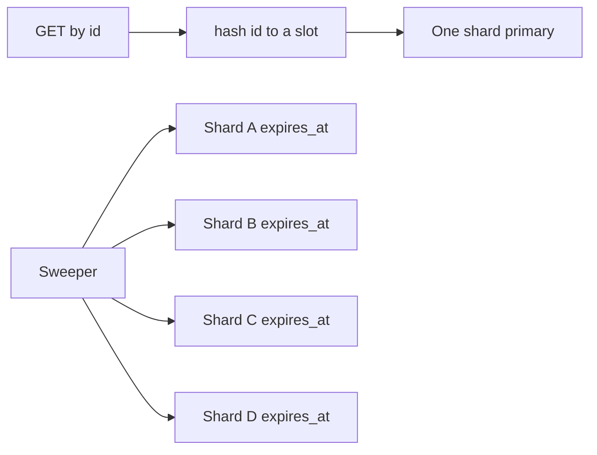
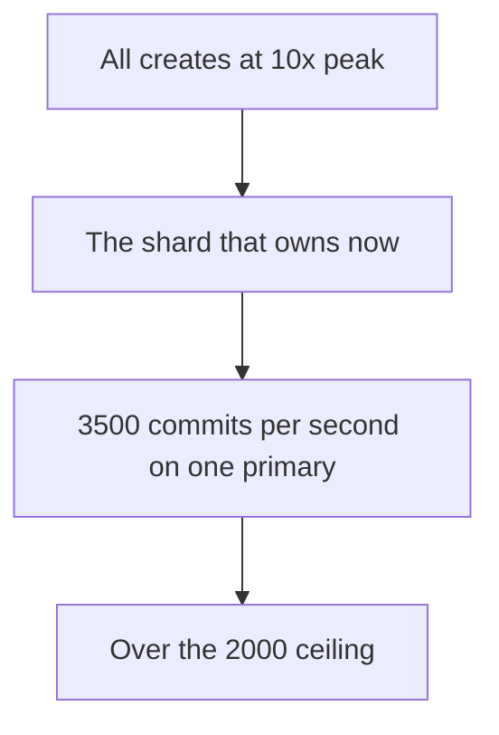

<!-- day-nav -->
[← Day 30 — Linearizability and what you refuse](30-linearizability-and-what-you-refuse.md) · [Day 32 — Hot keys and salting →](32-hot-keys-and-salting.md)

# Day 31 — Partition key, hash, and range

**Do now**

1. Set a timer.
2. Attempt the problem. Stop at the attempt line. Do not scroll.
3. Then read.

## Time box

40 minutes.

| Minutes | Do this |
|---|---|
| 0–12 | Attempt. The key, hash or range, and the query that gets worse. Do not draw shards you cannot justify with a ceiling. |
| 12–32 | Read. Check where today's writes land on the scheme you picked. |
| 32–40 | Say the key, what you gave up, and whether today's traffic even shards. |

## Intent

Facing one hot database, leave able to pick a partition key and say what hash versus range gives up. The key is a decision about queries. The shard count is arithmetic you do after, from a ceiling you state.

## Problem

> Design a pastebin. People paste text and share a link.

The interviewer says: "One primary will not be the plan forever. Pick the partition key now, while you still have a single node, and tell me what hash gives up that range would have kept."

## Attempt before reading

12 minutes. Do not scroll. Today's peak is about **350 commits/s** and **135 GB** of metadata. You do not have a measured write ceiling in your notes. Pick one and label it as a planning ceiling, the same way you picked 15,000 point reads. The sweeper's query is `expires_at` before now. The user-facing lookup is the id. There is no list of recent pastes.

Write:

1. The column you partition on, and the one lookup that must stay a single hop.
2. Hash or range. The query or the write that becomes a fan-out or a hotspot.
3. How many shards at today's 350/s, and how many at 10× peak writes. Show the division.
4. What a dead shard does to keys it owned. "The others take the load" is a sentence you have to justify or strike.

---

**Stop. The worked key, hash or range, and the shard counts are below. Do not copy them onto the attempt.**

---

## Requirements

You are not sharding because a diagram looks unfinished. You are choosing the key **now** so a later split does not require a second data model. The key has to be in the id, or be a pure function of the id, or every GET pays a directory lookup you must then operate.

Lookups you must keep:

- GET, DELETE, and the unique insert are point operations on `id`. One shard. No scatter.
- The sweeper needs the rows that expire. It may visit every shard. It may not miss a shard and leak that shard's objects forever.

Lookups you still refuse: list by time, list by syntax, search. A partition scheme that exists to serve a query you refused is a feature you smuggled in.

Durability does not change. Each shard is a primary plus the async replica from day 13. A shard is not a cache node. Losing it is not a miss. Day 18's ring is the wrong picture: on that ring a dead node drops entries and the next read refills. Here a dead primary without its replica is a lost slice of rows. Do not reuse the ring vocabulary and hope the difference goes unnoticed.

## Design

### The ceiling, said before the count

Planning ceiling, not a benchmark: **one primary that is group-committing, with the primary-key index and the `expires_at` index, takes about 2,000 commits/s** before you are out of the headroom you are willing to promise. WAL, two index updates, and the replica shipping are in that number. If they hand you a benchmark at 8,000, you redraw the count. You do not defend 2,000 as physics.

Today's peak is **~350/s**. 350 is under 2,000. **You run one shard today.** Drawing four primaries at 350/s is how you get four times the failover drills and no relief. Say "one, and here is the key I will split on."

At 10×, peak writes are about **3,500/s**. 3,500 / 2,000 = **1.75**, so two shards clear the rate if both are up and the hash is even. Two shards at 1,750/s each leave almost no room for the sweeper, a deploy, or a key that is hotter than the hash. **Four shards** at 10× put about 3,500 / 4 = **875 commits/s** on each, under half the ceiling. That is the count you would stand up when the product actually crosses the line, not on this whiteboard's current traffic. Metadata at 10× is about **1.35 TB** (135 GB × 10). Four ways, about **340 GB** of rows and indexes per primary. Restore of one of those is the other reason you split: you refused to restore a single multi-terabyte primary under an incident clock. You did not split so the diagram would say "shard."

### Hash the id

`slot = hash(id) mod 256`. A map assigns each slot to a shard. Apps hold the map. GET is one hop: compute the slot, go to that shard's primary. No directory row, no second system "to look up the shard."

Ids are random, so slots fill evenly. Creates do not pile onto a newest shard. A single paste still lives entirely on one shard, which is what you want: the row, the unique constraint, and any later outbox row for that id commit together. Day 40 is why that sentence matters. Do not split a paste across shards to look clever.

256 slots is a planning choice. It is enough that moving load means moving a handful of slots, and small enough to redraw the map by hand. It is not a hash-ring membership protocol. When you add a fifth shard later, you move about 256 / 5 ≈ **51 slots**, about **20%** of the rows, by **copying** them, then fencing the old owner. Until the fence, one writer owns the slot. Two writers on one slot is how a unique id stops being unique. The copy is a migration, day 83's shape, not a sentence you execute today. You name it so nobody thinks `mod N` with a changing N is free. `hash mod 4` rewritten as `hash mod 5` moves most keys and, unlike the cache, you must copy every one. The fixed slot count is what makes the move a subset.

### What hash gives up

The sweeper cannot ask one index "everything expiring in the next minute" and trust that to be global. Each shard has its own `expires_at` index. The sweeper fans out to all of them. At four shards that is four range scans, each over about a quarter of the expiries, because expiry is not the hash key and ids are random. You can live with that. The scan was never the user's request.

You also give up any future "recent pastes" page. That page wants a range on `created_at`. You refused the page. Say that the refusal is now structural, not only a product preference. If someone adds the page later, they add a different store fed by the outbox. They do not range-scan four primaries on the create path.

### What range would have kept, and what it costs

Range on `created_at`: the sweeper's cousin, "recent," is local, and **every create hits the shard that owns now**. At 10× that shard takes **3,500 commits/s** by itself. 3,500 is over 2,000. You built the hot database you were here to escape, and you built it on a clock. A quiet Tuesday shard and a Monday shard that is on fire is the shape. Rebalancing a range means splitting the hot edge, which is the one split you cannot do calmly.

Range on `expires_at` is worse for this allow-list. The default TTL is 30 days, so a whole day's creates share an expiry day and land on **one** shard. That is not a mild skew. That is the write ceiling spent on a calendar.

Range earns its keep when the dominant query is the range and the writes are not all at one end: time-series you read by recent window and you partition by time **knowing** the write head is hot and sizing that head as its own fleet. This pastebin's dominant query is a point read by id. Hash matches the query. Range matches a query you do not serve.

### A dead shard

Four shards, one primary dead. The quarter of ids in its slots **fail** until that shard's replica is promoted. The other three shards do not have those rows. They cannot "pick up the traffic." That sentence is the app-tier sentence from day 8, and it is false for data. Promotion is the same window you already named, about **30 seconds**, and it applies to a quarter of the keyspace, not to the product. Cache hits and edge hits for that quarter still serve. Misses 503. Creates for that quarter 503. The other three quarters stay up. That partial failure is the point of the split, and it is also the new bug: you must not report "the pastebin is down" when one slot map entry is down, and you must not 404 those ids.

Today, with one shard, a dead primary is the day-13 story unchanged. The slot map has one entry. Building the map now costs you nothing at runtime and saves you a rewrite when 3,500/s arrives.

## Diagrams

### Point read stays put, sweep does not

### Where a time range puts the writes

## Trade-offs

**Choice.** Hash `id` into 256 fixed slots. One shard at 350/s. Four shards when peak commits are about 3,500/s. Sweeper fans out. Each shard has its own replica. A dead shard takes its slots with it until promotion.

**Alternative.** Range on `created_at` or `expires_at`, so a time query is local.

**What you give up.** A single global expiry scan, and any honest "latest pastes" query. You keep create traffic spread out, and you keep GET to one hop without a directory.

**10×.** This is the 10× plan. At 100× peak writes, 35,000/s, four shards at 2,000/s are over (35,000 / 2,000 = 17.5, so you are talking about on the order of **20 shards** if the ceiling held, before skew). The key does not change. If the key were time, 100× would still be one hot edge. That is the argument for choosing the key before the traffic, not for drawing 20 databases today.

## Talking points

**Hand-waving.** "We'll shard by user." There is no user. A missing key is not a default.

**Hand-waving.** "Consistent hashing, so we can add nodes." That was the cache. These nodes hold the only copy of a slot's rows besides the replica. Say slots, copy, and fence.

**If they ask which shard the object store uses.** The bucket already places bytes. The object key is still `pastes/{id}`. You do not hash the bucket onto these four primaries. The partition is for the row that makes the guarantee. The bytes stay a blob.

## Say this in the room

I partition by the paste id and hash it into 256 fixed slots, so a later move copies a subset instead of remapping the world. I do not range on created time, because at ten times traffic every create would hit the shard that owns now, about 3,500 commits a second against a ceiling near 2,000. Hash makes the sweeper visit every shard, which I accept because that scan is not the user's request. Today's peak is about 350 commits a second, so the count is one shard, and four shards is the ten-times drawing. A dead shard hides its own slots until its own replica is promoted, and the other shards do not have the rows.

## Kit artifact

One checklist row.

| Follow-up | You answer with |
|---|---|
| "How do you shard this?" | The key, hash or range, the query you fan out, today's count, the 10× count. |

## Design log

One line: whether your attempt sharded today's 350/s, and the query your key made worse. The gap is a shard count with no ceiling.

Next: [Day 32 — Hot keys and salting](32-hot-keys-and-salting.md).

---

<!-- day-nav -->
[← Day 30 — Linearizability and what you refuse](30-linearizability-and-what-you-refuse.md) · [Day 32 — Hot keys and salting →](32-hot-keys-and-salting.md)
