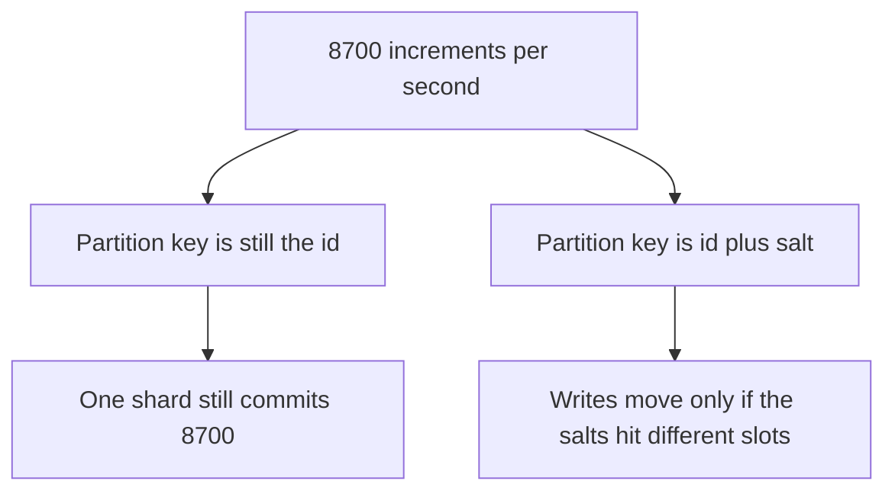

<!-- day-nav -->
[← Day 31 — Partition key, hash, and range](31-partition-key-hash-and-range.md) · [Day 33 — Invalidation and TTL →](33-invalidation-and-ttl.md)

# Day 32 — Hot keys and salting

**Do now**

1. Set a timer.
2. Attempt the problem. Stop at the attempt line. Do not scroll.
3. Then read.

## Time box

40 minutes.

| Minutes | Do this |
|---|---|
| 0–12 | Attempt. One celebrity key, the shard it sticks to, and a salt that still lets you read it back. |
| 12–32 | Read. Check whether the salt changed which shard the writes hit. |
| 32–40 | Say what you would salt, what you would not, and the fan-in on the read. |

## Intent

Facing a celebrity key, leave able to salt or split it without destroying the lookup you still need. A salt you cannot reassemble is a lost write. A salt that hashes to the same shard is a shorter lock and the same fire.

## Problem

> Design a pastebin. People paste text and share a link.

The interviewer says: "One paste is half your traffic. Also, product now wants a view count on it, incremented when it is read. Do not tell me the cache solves a write."

## Attempt before reading

12 minutes. Do not scroll. Half of peak reads is **8,700/s** on one id, from day 11. Shards, if you are in the 10× drawing, are hash-of-id. One id is one slot. The planning commit ceiling is about **2,000/s** per primary. The read ceiling on a primary is about **15,000** point reads/s, and that number was never a license to add a write per read.

Write:

1. Where the 8,700 reads go if the metadata cache holds. Where they go for the second they miss. Which of those is a hot *partition*.
2. What a view-count increment does to that partition, per second.
3. A salt scheme: how many buckets, what the partition key becomes, how a reader gets the total.
4. The lookup you refuse to salt. If you salted the paste id itself, say how a GET with only the id finds the body.

---

**Stop. Worked hot-key decision below. Do not revise the salt you drew.**

---

## Requirements

Day 11 left the view counter as a non-goal because it is a write hot spot on the read path. The interviewer just made it a goal. You may still say no once, with the arithmetic, and then design it if they keep it. Designing it first, without the refusal, is how a celebrity paste becomes a second product you did not price.

The count is allowed to be wrong by a stated amount. It is not a billing ledger. If they want it exact, the design gets more expensive and you say that. Default: **lossy is acceptable, exact is the expensive branch.**

You must not break GET by id. The client has the id and nothing else. Any split of the paste row has to be computable from that id alone.

## Design

### The read is probably not the melted partition

With the metadata cache up, those 8,700 GETs hit one cache key and then the bytes (the edge, if day 15 is in place). The primary does not see them. A single key's expiry is the stampede from day 11, which you collapse per process and bound with the fill cap. That is a cache problem. Do not salt the paste to solve it. Sixteen copies of the metadata mean sixteen keys to invalidate on delete, and the origin still has one row.

On a full miss, 8,700 identical point reads of one row land on **one shard**, because the partition key is the id. 8,700 is under the 15,000 read ceiling and far over a polite per-row rate, but Postgres will serve one cached heap tuple to all of them. You might survive the reads. You will not survive 8,700 **updates** of that tuple. The interviewer's counter is the update.

### The increment is the hot key

One row, `views = views + 1`, at 8,700 commits/s. That is four times the 2,000 commit ceiling, on one primary, on one row lock. The other shards are idle. Hashing did its job: it isolated the celebrity. Isolation is not capacity. The celebrity's slot is the hot database, just smaller.

Salting inside the shard, partition key still `id`: you write `views(id, salt)` for salt in `0..15`, and each increment picks a salt. Row locks: about 8,700 / 16 ≈ **544 updates/s** per row, which a single row can take. The shard still commits **8,700/s**. You cooled the lock and left the primary on fire. If your attempt stops here, you have not salted the thing that was hot.

The partition key has to become `(id, salt)` so the sixteen rows are **allowed** to land on different slots. `slot = hash(id, salt) mod 256`. Now the writes spread. With 16 salts and 4 shards, an even spread is about 8,700 / 4 = **2,175 commits/s** on each shard from this paste alone, before any ordinary creates. 2,175 is over the 2,000 ceiling. Sixteen salts did not save four shards. The minimum number of shards this one key must touch is `ceil(8,700 / 2,000)` = **5**, and that is with a perfect spread and **zero** other traffic. On the four-shard 10× plan, this counter does not fit beside the pastes.

So the honest layouts are:

- **Refuse the synchronous exact counter.** The GET does not write. A sampled increment, say **1 in 100**, is about **87 writes/s** on one row. That fits on the paste's shard with room. The displayed count is `stored × 100`, and you say it is a sample, not a ledger. This is the branch you recommend.
- **If they require every view to count,** put the counter on its **own** set of shards, sized for it, not on the four paste shards. Eight counter shards: 8,700 / 8 ≈ **1,090 commits/s** each, under 2,000. The paste primary stays a paste primary. You just bought a second slot map for one feature.
- **Do not salt the paste body.** A GET would have to know which salt holds the bytes. If the salt is random and not a closed set, the GET cannot find them. If the salt is a closed set, the GET fans out to every salt to find the one body, which is a scatter read on the path you just spent a month making into a point read.

### The closed set is the lookup

A salt works only when every reader knows the full set. Writer picks `salt = random(0..N-1)` or `salt = hash(request) mod N`. Reader sums `N` rows. N is **16** or **8** above, not "some." A salt taken from a uuid that you do not store anywhere is a write you can never add back in. That is data loss with extra steps.

The sum is a fan-in. If you display the count on every GET, you just put 8 or 16 reads on the paste read path, at 8,700 GETs/s, which is 8,700 × 16 = **139,200** counter reads/s. You salted the write into a read stampede. Cache the summed total for a few seconds and accept that the number on the page is that stale. The stale window is the point of the cache. Do not recompute the fan-in per GET to look exact. You already admitted the sample branch is inexact. The exact branch is inexact on the read side the moment you cache the sum, **or** it is a 139,200 read problem. Pick the lie.

Delete of the paste does not need to delete the counter in the same transaction. The counter shards are a different map. A saga, later, can drop the salt rows. Until then a deleted paste's count sitting for the counter's TTL is harmless because you do not show a count for a 404. Say the cross-shard delete is not atomic. Do not pretend the salt rows commit with the paste row. They are not on that shard.

### What a celebrity key is, in one line

It is a key whose traffic does not shrink when you add shards, **unless the key itself contains a factor you are allowed to spread.** The paste id does not contain that factor. `(id, salt)` does, and only for a value you are allowed to reassemble by a commutative sum. A view count sums. A paste body does not. Stock that must not go negative does not either, but that is a different problem on a different day. Do not reach for it here.

## Diagrams

### Same salt, two different keys

The left path is the attempt that felt like salting and did not change the partition.

## Trade-offs

**Choice.** No exact counter on the GET. If forced: a closed salt set, partition key `(id, salt)`, shards that are actually under the 2,000 ceiling, fan-in on read, cached sum. Prefer a 1-in-100 sample on the paste's own shard instead.

**Alternative.** One row, `views + 1`, and "the database will handle a hot row."

**What you give up.** An exact number, or, on the exact branch, a single-shard transaction and a cheap GET. You keep the paste lookup as one id, one slot, one body.

**10× on the celebrity, not on the site.** If the hot paste is half of 10× reads, the increment is **87,000/s**. Sampled at 1 in 100 that is **870 writes/s**, still one row, still under 2,000, uncomfortable, and honest. Exact, you are at `ceil(87,000 / 2,000)` = **44** counter shards for one paste, which is the moment you say the feature is a pipeline, not a column. The refusal ages well. The salt count does not.

## Talking points

**Hand-waving.** "We'll just add a cache in front of the counter." The cache does not absorb an increment that must hit a row. A cache of the *displayed* sum absorbs reads of the total. Those are different calls. Name which one.

**Hand-waving.** "Consistent hashing spreads hot keys." It spreads keys that differ. One id is one key. The hash is doing what you asked. You asked the wrong key.

**If they ask about the limiter.** A single NAT'd IP was already a hot limiter key on day 22. The same shape: salt only if you can sum the buckets back into one budget, and put the salt in the key the nodes hash. A salt the next request cannot find is a second, quieter budget, which means you over-admit.

## Say this in the room

Half of peak is about 8,700 reads a second on one paste id, and that id is one slot, so those reads should hit the cache and adding shards does not move them. The melt is a view-count increment on that same id, 8,700 commits a second against a per-primary ceiling near 2,000. Salting into 16 rows only helps if the partition key is the id plus the salt, and if the key is still the id I only cooled the row lock. I would rather sample one write in a hundred, about 87 a second, and call the number a sample. An exact count wants its own shards and a fan-in I will not put on every GET.

## Kit artifact

One checklist row.

| Follow-up | You answer with |
|---|---|
| "This one key is hot." | Reads versus writes. Whether the salt is in the partition key. The closed set on the read. |

## Design log

One line: did your salt change the partition key, and what was the per-shard commit rate after? The gap is a salt that you cannot sum.

Next: [Day 33 — Invalidation and TTL](33-invalidation-and-ttl.md).

---

<!-- day-nav -->
[← Day 31 — Partition key, hash, and range](31-partition-key-hash-and-range.md) · [Day 33 — Invalidation and TTL →](33-invalidation-and-ttl.md)
