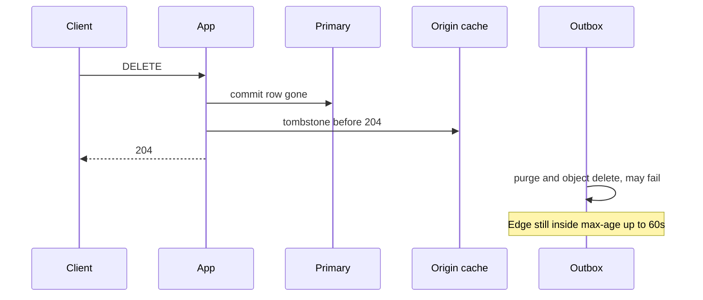

<!-- day-nav -->
[← Day 32 — Hot keys and salting](32-hot-keys-and-salting.md) · [Day 34 — Lag, monotonic reads, read-your-writes →](34-lag-monotonic-reads-read-your-writes.md)

# Day 33 — Invalidation and TTL

**Do now**

1. Set a timer.
2. Attempt the problem. Stop at the attempt line. Do not scroll.
3. Then read.

## Time box

35 minutes.

| Minutes | Do this |
|---|---|
| 0–10 | Attempt. For the origin cache and for the edge, pick invalidation or TTL, and write the stale window in seconds. |
| 10–28 | Read. If both layers share one mechanism, you have probably made the edge synchronous or the origin lazy. |
| 28–35 | Say the window a deleter feels, and the window a stranger feels. They are not the same number. |

## Intent

Facing stale or thundering cache entries, leave able to choose invalidation or TTL and the stale window you accept. TTL is a bound on ignorance. Invalidation is a message you must actually deliver. Using one word for both is how a delete becomes a hope.

## Problem

> Design a pastebin. People paste text and share a link.

The interviewer says: "Walk delete through the cache and the CDN. Which one do you invalidate, which one do you let expire, and how wrong is the read in between?"

## Attempt before reading

10 minutes. Do not scroll. Origin metadata TTL is 60 seconds with jitter, from day 11. Edge max-age is at most 60 seconds, from day 15. Tombstone-on-delete exists in your notes if you kept day 10. Peak hot key: **8,700 reads/s**.

Write:

1. What you do to the origin cache key at the moment DELETE commits. If the answer is "wait for TTL," say what a reader gets during that wait.
2. What you do to the edge, and why a failed purge is not an outage.
3. The stale window, in seconds, for a reader at the origin and for a reader at the edge, **after** your mechanism, not before.
4. One place a TTL is the right tool and invalidation is impossible. Hint: you cannot name every holder of the byte.

---

**Stop. Worked invalidation and TTL below. Compare the two windows to the ones you wrote.**

---

## Requirements

Delete's promise, from day 29: after 204, the **origin** does not serve the body. The edge may, for up to 60 seconds. Today you bind each of those sentences to a mechanism. You do not get to keep the promise and also "just TTL everything" unless the origin window you are willing to say is the full TTL.

A stale window is the longest time after the commit during which a read that you still claim is correct can return the old value. If you cannot say the number, you chose TTL and forgot.

You are not adding a message bus whose only job is cache invalidation. The delete path already has an outbox for purge and object delete. Invalidation of the origin key happens **in the delete request**, before 204, because the promise is about the 204. The outbox is for work you already said the user does not wait on.

## Design

### Origin cache: invalidate

On the primary commit of the delete, the app writes the tombstone into the metadata cache and then returns 204. The tombstone **is** the invalidation. A later GET sees `gone` and 404s without asking the primary. A fill that was in flight, and that read the row before the delete, must not overwrite `gone`. That compare is the whole correctness of the invalidation. A bare `DEL` of the key is not an invalidation. It is an invitation for the late fill to put the deleted row back until the TTL.

The tombstone itself needs a TTL, or deleted ids occupy cache forever. That TTL is not the stale window. The stale window at the origin is the time until the tombstone write succeeds. Planning: the cache write is on the delete path, timeout a few milliseconds, and if it **fails** you still have a committed delete. A GET that misses will read the primary, see no row, and 404. The only hole is a **hit** that was filled before the delete and that you failed to tombstone. So if the tombstone write fails, you have two honest options: retry the tombstone before you return 204, or return 204 and accept a stale hit until that entry's TTL, up to **60 seconds**, at the origin. Retry a few times, then **fail the request's success** only if you are unwilling to extend the origin window. The staff sentence: **204 waits for the tombstone, not for the CDN.** If the cache is down, you cannot write a tombstone. Then either delete returns 503 even though the row is gone (the client retries, delete is idempotent), or you accept origin hits stale for up to the remaining TTL. Prefer **503 when the tombstone cannot be written**, because a 204 you do not believe is the bug day 29 was about. The row stays deleted. The client retries. This is a few milliseconds of dependency, not a new system.

Do not "invalidate" by setting a short TTL on every paste in case someone deletes it. A 5-second TTL on every key multiplies misses: every key misses 12 times a minute instead of once. That is a stampede schedule. Day 11 said this. It is still true. TTL is not how you delete.

### Edge: TTL, purge as a hint

You cannot name every POP that holds the object, and you cannot wait for them inside the 204. The mechanism is max-age. The window is **min(60 seconds, time left until `expires_at`)**. Purge is an optimization that often makes the window shorter and sometimes does nothing. The guarantee does not mention purge. If you say "we invalidate the CDN," the interviewer will ask what happens when the purge call times out. The answer has to be "the window is still 60 seconds," or you do not have a design.

Negative caching: a 404 at the edge must not stick for the max-age, or a create that is followed by a read at a POP looks missing. You already refused to cache 404s. Same for 500. TTL applies to the **200 of a live body**, not to every status.

### The windows, side by side

| Reader | Mechanism | Stale window after a successful 204 |
|---|---|---|
| Origin, tombstone written | Invalidation | Effectively the in-flight request that started before the tombstone. Not 60 seconds. |
| Origin, tombstone failed and you still returned 204 | Whatever TTL is left | Up to **60 seconds**. You chose not to take this branch. |
| Edge | TTL, purge best-effort | Up to **60 seconds**. |

Hot-key arithmetic, same as day 29, now tied to the mechanism: 8,700 × 60 = **522,000** edge serves. Origin serves of that deleted paste, on the branch you chose, are the requests already inside the app when the tombstone landed. You do not multiply those by 60. If your attempt had one window for both, you either slowed delete to a global lock or you let the origin lie for a minute. Both are worse than the split.

### Where TTL is the right tool

Any holder you cannot address. The edge. A browser. An intermediate proxy you do not operate. You cannot invalidate what you cannot name. You can only bound it. Max-age is that bound. Jitter on the origin TTL is the other job of a TTL: memory, and not expiring the whole keyspace in one second. That is day 11. It is not delete.

Invalidation is the right tool when you can name the key and you promised a reader who talks to you directly that the new value is visible when the write returns. That reader is the next origin GET. You can name `meta:{id}`. Write the tombstone.

A hybrid that sounds clever and is not: "TTL of 1 second so we do not need invalidation." You just set the stale window to 1 second **and** took 60× the misses. Say the miss rate if you do it. Origin reads that were cache hits become misses every second. For the hot key, 8,700/s already miss the moment you refuse to cache it usefully. You have deleted the cache with a short number. Invalidation exists so the TTL can stay long on the keys nobody deleted.

## Diagrams

### Delete touches one cache for sure, and the edge only as a wish

The 204 is under the tombstone, not under the purge.

## Trade-offs

**Choice.** Invalidate the origin key by a tombstone the 204 waits for. TTL the edge at 60 seconds. Purge if you can. Do not couple them.

**Alternative.** TTL only, both layers, and a short TTL if someone complains about deletes.

**What you give up.** A 204 that is a few milliseconds slower, and a cache you depend on for the meaning of 204. You keep long TTLs for the common case, which is a paste nobody deletes during its life. You accept 522,000 possible stale edge reads of one hot delete.

**10×.** The edge window does not change. The count does: about **5.2 million** serves if the hot key scales. The origin mechanism does not get a new design at 10×. A failed tombstone write at 10× is still a 503 on that delete, not a new bus. If 60 seconds becomes unacceptable at that audience size, you lower max-age and you recompute origin QPS. You still do not claim you invalidated every POP.

## Talking points

**Hand-waving.** "We invalidate the cache." Which key, before or after the status code, and what a failed invalidation returns to the client?

**Hand-waving.** "Everything is TTL, invalidation is a myth." The myth is synchronous invalidation of the entire internet. The local key you own is not a myth. You write it on the way out.

**If they ask about the body in the app.** You do not cache the body on the app. There is no body key to invalidate there. The edge holds the body. That split is why the two mechanisms differ. Do not invent an app-level body cache so you have something to invalidate.

## Say this in the room

The origin cache is invalidated by a tombstone I write before I return 204, so a late fill cannot put the paste back, and if I cannot write it the client gets a 503 and retries even though the row is already gone. The edge is not invalidated: it is a TTL of at most 60 seconds, and a purge that fails leaves that window in place on purpose. On a hot paste that is about 8,700 reads a second times 60, about half a million stale serves, which I would rather own than make delete wait for every POP. A one-second TTL everywhere would be a stampede, not an invalidation strategy.

## Kit artifact

One checklist row.

| Follow-up | You answer with |
|---|---|
| "How do you invalidate?" | Origin key, before 204. Edge, you do not. The window for each. |

## Design log

One line: the stale window you had left unnamed, and which layer it belonged to.

Next: [Day 34 — Lag, monotonic reads, read-your-writes](34-lag-monotonic-reads-read-your-writes.md).

---

<!-- day-nav -->
[← Day 32 — Hot keys and salting](32-hot-keys-and-salting.md) · [Day 34 — Lag, monotonic reads, read-your-writes →](34-lag-monotonic-reads-read-your-writes.md)
