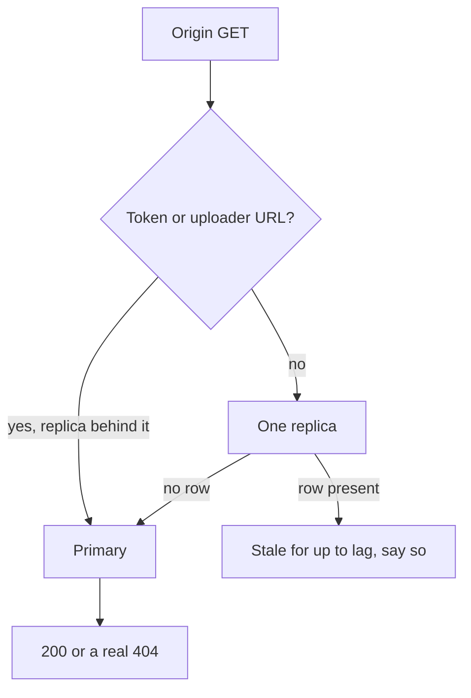

<!-- day-nav -->
[← Day 33 — Invalidation and TTL](33-invalidation-and-ttl.md) · [Day 35 — Quorums in plain language →](35-quorums-in-plain-language.md)

# Day 34 — Lag, monotonic reads, read-your-writes

**Do now**

1. Set a timer.
2. Attempt the problem. Stop at the attempt line. Do not scroll.
3. Then read.

## Time box

40 minutes.

| Minutes | Do this |
|---|---|
| 0–12 | Attempt. Who may read a lagging replica, and how the creator's next GET is different from a stranger's. |
| 12–32 | Read. Check what you return when the replica has no row. |
| 32–40 | Say read-your-writes and monotonic reads as two different bugs, each with the mechanism. |

## Intent

Facing replica lag, leave able to give the right operations monotonic reads or read-your-writes. "Read from the replica" is not a strategy until you say which client is allowed to go backwards, and which client just wrote the row you would hide.

## Problem

> Design a pastebin. People paste text and share a link.

The interviewer says: "The primary should not serve reads. Use the replica. Keep the product honest for the person who just clicked save."

## Attempt before reading

12 minutes. Do not scroll. The replica is async. You have been refusing to fill the cache from it since day 13. Planning lag, label it as a planning number: **p99 apply lag 200 ms** while the primary is healthy, and **seconds** if the replica is sick. Creates are not idempotent. Origin GET of a missing row is a 404 that you do not cache at the edge.

Write:

1. What the uploader sees if their GET immediately after 201 hits a replica that is 200 ms behind.
2. What a stranger sees if two replicas disagree and you round-robin them.
3. A rule for "replica says no row." Is that a 404?
4. Whether you actually take reads off this primary at today's numbers, or only if a ceiling forces you. Use the happy-path primary read rate from day 26, about **87/s**.

---

**Stop. Worked session rules below. Your call on today's primary reads stays on your page.**

---

## Requirements

Two guarantees, and they are not the same.

**Read-your-writes.** If this client has been told their write committed, a later read **by this client** sees that write. The uploader's GET after 201 must return the paste. The uploader's GET after 204 must not.

**Monotonic reads.** If this client has already seen a value, a later read by this client does not see an older one. They saw the paste. Refresh does not 404 because you picked a slower replica. They saw a delete. Refresh does not bring the body back.

Neither promise is about a stranger who has never talked to you. A stranger's first GET may be behind the primary by the lag you state. That is not a monotonic-read bug. They had not seen a newer value yet. It **is** a linearizability bug, which you already refused for anyone not on the primary.

The other two session phrases exist so you are not surprised: monotonic writes (this client's writes apply in the order they sent them) and writes-follow-reads (a write happens on a state at least as new as what that client last read). One leader gives you both for free. Do not spend the hour on them. You have one writer per shard.

Anonymous clients have no account to pin. Anything you promise the uploader has to ride on something the 201 handed them, or you keep their read on the primary by the shape of the URL. You do not get a session for free.

## Design

### Do not move this GET, at this QPS

Happy-path primary reads are about **87/s**. The ceiling is about **15,000**. The interviewer asked you to empty the primary of reads. The primary is not full. Taking GETs off it is how you inherit lag bugs you do not need. The staff answer starts with that refusal. Then you design the guarantees for the moment they say "the ceiling moved, answer anyway."

When that moment comes, the rules below are the design. Until it comes, origin GET stays on the primary, and read-your-writes at the origin is free because there is nothing to lag. The edge is still the 60-second exception. Do not describe the edge as a replica. It does not apply your WAL. It expires.

### A replica miss is not a 404

This is the rule that keeps the rest honest. The replica has no row. That means either the paste does not exist, or the create has not applied, or the delete **has** applied and the primary is ahead... a missing row on a replica that lags means "at least as deleted as the replica," not "deleted on the primary." A create that has not applied looks exactly like a missing id.

So: **if the replica has no row, read the primary before you decide.** A 404 is a primary fact. If you skip this, every paste is publicly missing for the lag after create, and if anything caches that 404 you have frozen a lie. At 116 creates/s and a client that always fetches what it just saved, a naive replica read is on the order of **116 false 404s/s**, one per uploader, for up to 200 ms each. Small in QPS. Fatal as a product. The person who just saved thinks you lost their text.

A replica **hit** is the dangerous direction for deletes. The row is present, the primary has already committed the delete, the replica has not applied it. You would serve a deleted paste for the lag. If you serve replica hits, the origin stale window becomes the replica lag, and you must say so. Planning p99 **200 ms** while healthy. You are amending the day-29 origin promise. Do not amend it quietly. For this pastebin, that amendment is not worth 87 reads/s. If you are forced: either accept a **200 ms** resurrection on replica hits, or treat a replica hit as a candidate and re-check the primary anyway, which means you did not take the read off the primary. There is no third magic. The useful replica read is one where the caller tolerates both a slightly stale existence and a re-check on absence. The sweeper's candidate scan, from day 13, is that caller. The interactive GET is not.

### Read-your-writes, when replica reads are real

The 201 returns the primary's commit position, an LSN or a monotonic token, not a wall clock. The uploader sends that token on the next GET. A replica may answer only if its applied LSN is **at least** the token. Otherwise the GET goes to the primary. When the uploader has no token, you cannot know they are the uploader. Do not guess from IP. The NAT from day 22 will pin a campus to the primary or pin nobody.

A time-based shortcut, "read primary for 2 seconds after create," is a heuristic you can offer if you will not change the client. It is not the guarantee. A replica that is **3 seconds** behind still 404s a client inside a 2-second pin that already expired, and a healthy 200 ms lag did not need 2 seconds of primary reads. The token matches the lag you actually have. The fixed window matches a lag you hoped for. Prefer the token. If the client will not send it, you do not promise read-your-writes on the replica path. You promise it only for GETs that hit the primary, and you say the client has to use the origin URL the 201 gave them, not a cached edge URL, for that first read. The edge will lie for up to 60 seconds even with a perfect token. The token does not cross the POP. Say that, or they will think a header fixes the CDN.

### Monotonic reads, when replica reads are real

Round-robin across two replicas is how a refresh goes backwards. Replica A has applied the create. Replica B has not. The client saw the paste on A, refreshed, landed on B, and got a miss. If you then follow the miss rule and hit the primary, the primary still has the row and the user is fine, at the cost of a primary read. If you 404 on the replica miss, you broke monotonic reads in public.

If the primary would also 404 because the delete has committed, the client who saw the body on a lagging replica and now sees 404 has moved **forward**, not backward. That is allowed. Monotonic reads forbid the older value, not a newer one.

Mechanisms that work:

- **Stick the client to one replica** for the session, and that replica only moves forward. This gives monotonic reads of what **that replica** has seen. It does not give read-your-writes. A sticky replica can be 200 ms behind the write the client just did somewhere else. People conflate these. Do not.
- **Send the highest LSN the client has observed,** and refuse any replica behind it. This is monotonic reads across replicas, and it is the same token as read-your-writes if the highest LSN includes their own write. One mechanism, two promises, if the client actually stores the token. Anonymous browsers will drop it. Then you do not have the promise. You have a hope.

Sick lag is a different number. If the replica is seconds behind, the token rule sends those readers to the primary. That is correct, and it is a thundering herd onto the primary exactly when replication is unhealthy. Cap it. If the primary is the fallback for every read, you have deleted the replica's purpose and you should shed, not stampede. The fallback is for token-holders and for replica misses, not for "replica looks slow, everyone come back."

### What you will not build

A global "read your writes" layer in front of the CDN. Multi-region session affinity. A client clock compared to `created_at`. Clock skew will both false-404 and false-serve, and day 44 is why. The LSN is an order the primary already has. Use it.

## Diagrams

### The miss is a question, not an answer

Sticky without the token never enters the top branch. That is why sticky is not read-your-writes.

## Trade-offs

**Choice.** Keep interactive origin GETs on the primary at ~87 reads/s. If forced off it: replica hit only with a stated lag window, replica miss always re-reads the primary, uploader carries an LSN token or uses an origin URL.

**Alternative.** Every GET on a round-robin replica, 404 when the replica has no row.

**What you give up.** A primary that still does the authoritative reads, which it can afford. On the forced branch, you give up a pure replica-read QPS win: misses and token-holders come back. You keep the uploader from seeing a false 404 of the paste they just saved.

**10×.** Happy-path primary reads become about **870/s** if the hit rates hold (87 × 10). Still under 15,000. You **still** do not need replica GETs. The forced branch at 10×, with a 200 ms lag and naive 404s, is about **1,160 false 404s/s** of brand-new pastes (116 × 10). The rule is the same. The embarrassment is larger.

## Talking points

**Hand-waving.** "We have read-your-writes because we sticky-session the replica." Sticky is monotonic for one replica's log. The write might be ahead of that log. Different bug.

**Hand-waving.** "Lag is under a second, so it is fine." Fine for which client? The uploader is not a percentile. They are the person who just watched the spinner stop.

**If they ask for the numbers you need in prod.** Applied LSN on the replica versus the primary's LSN, as a lag in **milliseconds** and in **bytes of WAL**. Page on lag, not on "replication is green." A green replica can be green and ten seconds behind if the check is "process is up."

## Say this in the room

Read-your-writes means the client who just got the 201 sees the paste on their next read, and monotonic reads means a later read does not fall back to an older replica; sticky sessions only give you the second. I am not taking interactive GETs off the primary for about 87 reads a second. If I am forced to, a replica with no row is not a 404, and I ask the primary before I say the paste is gone. The uploader sends the commit token from the 201, and a replica behind that token does not answer them. The edge still ignores that token for up to 60 seconds.

## Kit artifact

One checklist row.

| Follow-up | You answer with |
|---|---|
| "Read from the replica." | Who, the miss rule, the token, and why sticky is not read-your-writes. |

## Design log

One line: which of the two guarantees your attempt actually implemented, and which one you only named.

Next: [Day 35 — Quorums in plain language](35-quorums-in-plain-language.md).

---

<!-- day-nav -->
[← Day 33 — Invalidation and TTL](33-invalidation-and-ttl.md) · [Day 35 — Quorums in plain language →](35-quorums-in-plain-language.md)
