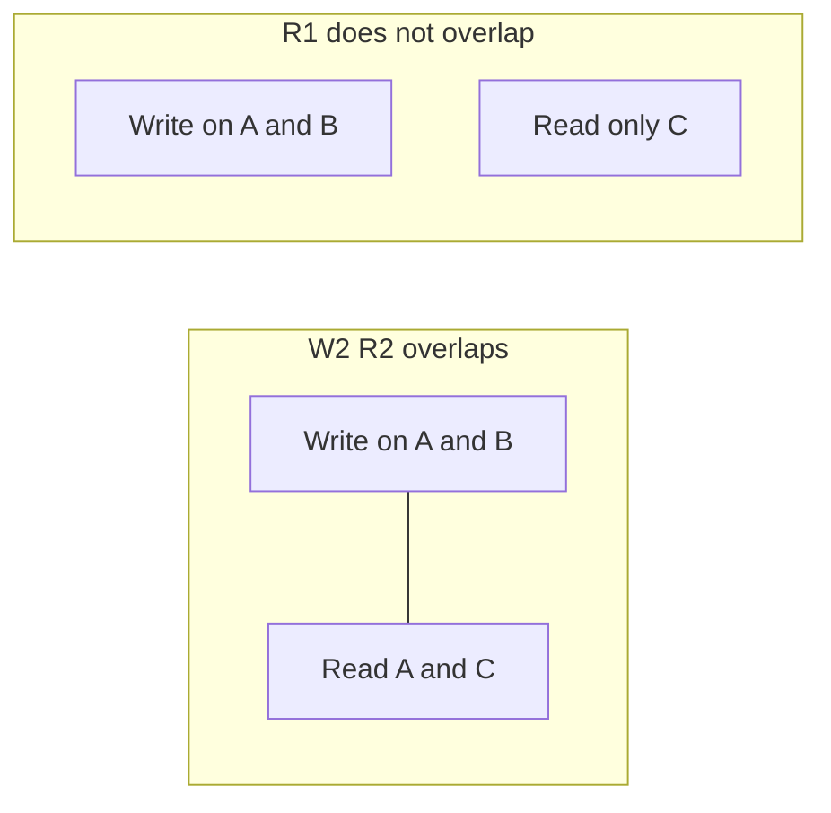

<!-- day-nav -->
[← Day 34 — Lag, monotonic reads, read-your-writes](34-lag-monotonic-reads-read-your-writes.md) · [Day 36 — A leader is a dependency →](36-a-leader-is-a-dependency.md)

# Day 35 — Quorums in plain language

**Do now**

1. Set a timer.
2. Attempt the problem. Stop at the attempt line. Do not scroll.
3. Then read.

## Time box

35 minutes.

| Minutes | Do this |
|---|---|
| 0–12 | Attempt. Pick N, R, and W. Say what a write waits for, and the outcome you took: unavailable, or stale. |
| 12–28 | Read. If W + R is only equal to N, find the read that misses the write. |
| 28–35 | Say whether you replace the primary, in one sentence, after you have the integers. |

## Intent

Facing a quorum design, leave able to explain what N, R, and W buy and the unavailable or stale outcome you took. A quorum is an overlap rule. It is not a personality you assign to the storage engine, and it is not this pastebin's metadata path.

## Problem

> Design a pastebin. People paste text and share a link.

The interviewer says: "Forget the primary for a minute. Three copies of the row, no leader. What has to ack a write, what has to answer a read, and what did you just make impossible?"

## Attempt before reading

12 minutes. Do not scroll. Three copies. You may not say "majority" without saying of how many, and for which call.

Write:

1. N, R, and W as three integers. What the client waits for on POST. What a GET waits for.
2. Whether W + R is greater than N. If it is not, a concrete miss: which nodes took the write, which nodes you read, and the value you did not see.
3. The failure you chose. Either a write fails while some copies are up, or a read can miss a write that already returned. You do not get to skip this.
4. Whether you would actually replace the pastebin's primary with this. One line, with a reason that is not "quorums are web scale."

---

**Stop. Overlap, staleness, and unavailability below. Your yes or no on replacing the primary stays on your page.**

---

## Requirements

N is how many copies you intend. R is how many must answer a read before you return it. W is how many must ack a write before you tell the client the write happened. They are integers you pick per operation. A system can write with one W and read with another R. Saying "we use quorum" without the integers is the adjective problem from day 29 again.

The only theorem you need: if **W + R > N**, every read set overlaps every write set. At least one node that answered the read was one of the nodes that acked the write. That is overlap. It is not, by itself, "you see the latest value."

You see the latest value only if you also:

- leave a version on the write, and the read returns the highest version it found, and
- the write did not succeed on a **different** set of nodes than the ones you think are the copies (a sloppy stand-in), and
- two successful writes did not fork into siblings you forgot to reconcile.

Overlap without versions is how a read returns whichever copy answered last, which may be the older one that was merely up.

You are explaining this because they asked. You are not migrating the pastebin off the primary in this sitting. The last paragraph says why.

## Design

### A worked triple

**N = 3, W = 2, R = 2.** 2 + 2 > 3, so the sets overlap.

A POST waits for **two** acks, not three. The slowest copy does not get a vote in the latency. That is what you bought versus waiting for everyone. A GET waits for two answers and takes the higher version. One copy can be down, or slow, and both calls still succeed.

**Unavailable outcome.** Two copies down. W = 2 cannot complete. You fail the POST even though one copy is up and would have stored the row. You chose that. A write that only one copy saw can vanish if that copy then dies, and a later R = 2 would not have overlapped it anyway (the two you read might be the two that never saw it). Refusing the write is the durable choice. Say it as a user-visible 503, not as "quorum loss."

**The stale alternative you did not take.** **R = 1, W = 2.** 1 + 2 is not greater than 3. Write acked by copies A and B. Read hits C only. C never saw the write. You return a miss, or an older row, after you already sent 201. You bought a faster read, one response instead of two, and you gave up the overlap. That is a legal design if the call is allowed to be stale. It is not legal if you also claim the GET sees the POST. Do not pair R = 1 with the word linearizable.

**The other corner.** **W = 3, R = 1.** Overlap holds (3 + 1 > 3). Reads are cheap. Any one copy down stops writes, because you insisted all three ack. You moved the unavailability onto the write path completely. For a pastebin whose reads dwarf writes, this looks tempting and is how one sick disk becomes a create outage. You did not pick it.

### Where overlap is not order

Two POSTs, no leader, both with W = 2. Write 1 acks on A and B. Write 2 acks on B and C. Both return success. They overlapped on B and still forked: A has only write 1, C has only write 2, B has whichever arrived last unless B **kept both**. A read of A and C sees the siblings. A read of A and B might see only write 1 if B stored write 2 badly.

So W + R > N guarantees you **meet** a copy of each acknowledged write, not that the writes formed a single line. If these are two creates of **different** ids, you do not care: different keys, no fork. If they are two updates of one row, you need a rule. Version-and-reconcile, last-writer-wins with a clock you do not trust, or a conditional write that fails the second writer. That rule is day 42. Today you name the fork so you do not describe N = 3, W = 2 as "strongly consistent" and sit down.

A delete in a leaderless set is a write with a version, a tombstone, or it is nothing. An absent row on one copy is indistinguishable from a copy that missed the delete. You will do that properly on day 46. The sentence you need now: **a silent delete does not overlap with anything, because it is not a write.** W does not apply to a hole.

### Sloppy quorum, in one breath

If the two "copies" you wrote are not from the three you meant, but a stand-in you used because a preferred node was unreachable, a strict read of the preferred three can miss the write. The inequality assumed the sets were drawn from the same N. Sloppy quorum breaks that assumption on purpose, to take the write during a partition, and hinted handoff is supposed to repair it later. Until the repair, you are stale. Dynamo's name for this is not required in the room. The outcome is. **You refuse sloppy quorum for a delete.** A delete that landed on a stand-in, while the preferred copies still serve the body, is a resurrection you already decided the origin does not get. For a create, a sloppy ack is a 201 that the next strict read 404s. Same class of lie as the async replica tail, with a worse story. If you cannot explain the repair, you do not take the write. You 503.

### Latency and unavailability, with integers

**W = 2 of N = 3.** The 201 waits for the second-fastest ack. In-region that is typically a couple of milliseconds beyond the first disk. You are not buying that latency today because you are not adopting the quorum. If forced, say the 201 includes that second ack, and a timeout after one ack is **unknown**, not failure — day 37 owns the client retry.

**Two copies down.** W = 2 cannot complete. Creates 503 even though one disk is up. At peak that is **350 failed creates/s** until a second copy returns. Same class of error as a leader election window, without the 30-second bound.

**R = 1, W = 2 (the stale branch).** Faster reads. After a 201 acked by A and B, a read of only C can 404. Legal if the call may be stale. Not linearizable.

**Fork under two W = 2 writes of one row.** Both return success; siblings appear. Overlap met a copy of each write; it did not make one order. Day 42 owns the rule. Refuse "strongly consistent" for N=3,W=2 without versions.

### Why the pastebin does not buy this

You already have one primary and one async replica. The primary gives you a single order for one row without sibling versions. The replica is not a member of an R = 2 read. Turning the row store into N = 3, W = 2, R = 2 means you operate a leaderless replication protocol, you reconcile forks, and you still have the edge at 60 seconds, which no quorum on the origin fixes. The primary's happy-path read rate is about 87/s. You are not capacity-bound into this. The quorum is the answer when they **forbid a leader** or when the store you were handed is already leaderless. Then you pick **N = 3, W = 2, R = 2**, versions on the row, no sloppy deletes, and you say the unavailable outcome: two copies down, writes fail. You do not pick it because the word quorum sounded like durability. The bucket's three-way replication of the **bytes** can stay the bucket's problem. You do not reimplement it on the whiteboard.

**Compare to the election window you already own.** Day 36 budgets ~30 seconds without a leader: ~10,500 failed creates at peak on one shard. Quorum with two copies down has no such bound — it lasts until capacity returns. Quorum with one copy down has **no** write hole. That comparison is the only fair one: you are trading a bounded election outage for unbounded dual-failure outage plus sibling reconciliation. Pick with that table, not with the word "quorum."

**Versions are not optional if you switch.** A read of R = 2 that returns the first body it sees can return the older copy that also answered. Highest version wins only if every write stamped one. Without that, overlap is a meeting, not a newest-value guarantee. Budget the version column and the read compare in the same breath as N, R, W.

Latency, so the integers mean something physical: a W = 2 write takes the **second**-fastest ack, in-region, on the order of a couple of milliseconds plus the disk, not the third. You do not add those milliseconds to a design you are not adopting. If they force the adoption, the 201 waits for that second ack, and a timeout after one ack is an unknown, not a failure. The client retry problem is day 37. The quorum did not solve it.

## Diagrams

### Overlap, and a read that misses

The left read met the write at A. The right read cannot meet a write that never touched C.

Caption: "Left: R=2 meets the write at A. Right: R=1 can miss it on C." Write W=2 on both write boxes so the only variable is R.

## Failure the user sees

**Quorum adopted, one copy down.** W=2,R=2 still work. Slightly higher write latency. Fine.

**Quorum adopted, two copies down.** Every create 503s; cold reads needing R=2 also 503. Cache/edge hits unaffected. You cannot promote a single survivor into lone W=1 without changing the contract mid-incident.

**Sloppy write of a delete.** User got 204; preferred copies still serve the body. Resurrection. Refuse sloppy deletes.

**Leader kept (current design).** No sibling forks. You still have the election window (day 36) and async lag (day 34), not quorum loss.

## Trade-offs

**Choice.** Keep the leader for the paste row. Be able to say N = 3, W = 2, R = 2, overlap, the fork, and the 503 when two copies are down. Refuse sloppy deletes.

**Alternative.** Replace the primary with that quorum today.

**What you give up.** Nothing on the current path, because you did not switch. If you switch, you give up the single commit order and you take on sibling versions, and you still do not fix the edge. You gain a write that survives one copy being down without an election. That gain is real. It is not free, and it is not this week's capacity problem.

**Name the refusal inside each alternative.** Against replacing the primary with N=3,W=2,R=2 today: you refuse sibling versions for a primary not capacity-bound at 87 reads/s. Against R=1 with W=2 while claiming linearizable GET: you refuse a non-overlapping read set. Against W=3,R=1: you refuse a create outage when any one copy is down. Against sloppy quorum for delete: you refuse a 204 preferred copies can resurrect. Against "majority" without integers: you refuse an adjective.

**10×.** Still not the reason. 3,500 commits/s is a shard-count problem from day 31, and each shard can keep a leader. A quorum per shard multiplies the forks by the number of shards. Do not "upgrade" the 10× plan to leaderless in the same breath as you hash the id.

## Talking points

**Hand-waving.** "Majority quorum, so it's consistent." Majority of N = 3 is 2. Say 2. Then say whether the read is also 2. A majority write with a single-copy read is the stale branch.

**Hand-waving.** "W + R > N means linearizable." It means the sets overlap. Linearizability still wants one order in real time, which two racing writes do not have until you add a leader or a conditional version that makes one of them fail.

**Hand-waving.** "We'll use the bucket's quorum for metadata too." The bucket replicates bytes you do not query by version for paste identity. The row store's guarantee is which id exists and whether it is deleted. Do not conflate erasure coding of objects with R/W of rows.

**If they ask what the user sees when two of three are down.** "Creates 503 until a second copy returns — about 350 a second at peak. I chose that over a write only one copy saw."

**If they ask whether W+R>N is linearizability.** "It is overlap. Linearizability still needs one real-time order. Two racing writes need a leader or a conditional version — day 42."

**If they ask where Raft fits.** It is one way to **elect the leader** you already have, inside a product you do not write. It is not the quorum you just drew. Day 36. You will not derive it.

## Say this in the room

N is the copies, W is how many must ack before I return 201, and R is how many must answer a read. With 3, 2, and 2 the sets overlap, so a read can meet the write, but I still need a version or I may return the older copy that also answered. I wait for the second ack, not the third, and if two copies are down the write fails on purpose — about 350 creates a second of 503 at peak — rather than land on one copy a later read can miss. R = 1 with W = 2 does not overlap, so that read can be stale after a 201, and I would be lying to call it linearizable. Sloppy quorum for delete is how a 204 comes back as a body on preferred nodes; I refuse it. This pastebin keeps a leader; the quorum is what I would say if they took the leader away, not a box I am adding at 87 primary reads a second.

**What staff sounds like.** Integers first (N,R,W), then overlap, then the fork, then the 503 when two copies are down. Comparing that unbounded dual-failure hole to day 36's bounded 30-second election. Refusing sloppy deletes because a 204 that preferred nodes can resurrect is the day-29 bug with extra steps. Keeping the leader at 87 primary reads/s because capacity did not force the migration.

### Worked unavailability sentence

With N=3,W=2, two copies down means creates hard-fail at ~350/s until capacity returns — unbounded relative to day 36's 30-second election. With one copy down, W=2,R=2 still works. That comparison is how you choose a leader vs a quorum without slogans. Versions on every write remain mandatory if you switch; overlap without versions returns whichever copy answered.

## Kit artifact

One checklist row.

| Follow-up | You answer with |
|---|---|
| "What quorum?" | N, R, W, whether the sum beats N, and which outcome you took: 503, or a stale read. |

## Design log

One line: the triple you picked, and the miss you can demonstrate if the sum does not beat N.

Next: [Day 36 — A leader is a dependency](36-a-leader-is-a-dependency.md).

---

<!-- day-nav -->
[← Day 34 — Lag, monotonic reads, read-your-writes](34-lag-monotonic-reads-read-your-writes.md) · [Day 36 — A leader is a dependency →](36-a-leader-is-a-dependency.md)
