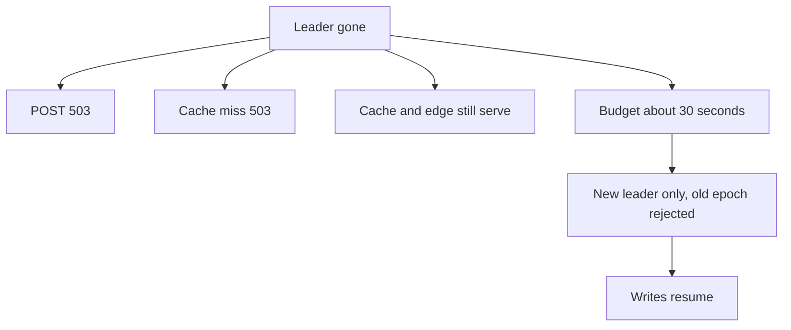

<!-- day-nav -->
[← Day 35 — Quorums in plain language](35-quorums-in-plain-language.md) · [Day 37 — Idempotency on an at-least-once path →](37-idempotency-on-an-at-least-once-path.md)

# Day 36 — A leader is a dependency

**Do now**

1. Set a timer.
2. Attempt the problem. Stop at the attempt line. Do not scroll.
3. Then read.

## Time box

35 minutes.

| Minutes | Do this |
|---|---|
| 0–10 | Attempt. What fails when the shard has no leader, for how long, and what must not accept a write from the old one. |
| 10–28 | Read. If you explained an election protocol, delete it and keep the window. |
| 28–35 | Say the dependency in four beats: one writer, a window, a fence, a user-visible 503. |

## Intent

Facing a single-writer partition, leave able to treat leader election as a dependency with an unavailable window, not as a protocol lecture. You buy a leader from the database. You do not build one on the whiteboard. Raft, if you need the vocabulary, is an appendix, not this day.

## Problem

> Design a pastebin. People paste text and share a link.

The interviewer says: "You have one writer per partition. It dies. What happens in the next minute, and what do you refuse to explain?"

## Attempt before reading

10 minutes. Do not scroll. One shard today, so one primary is the writer for every row. The day-13 promotion window you already used was about **30 seconds**. Cache hits and edge hits do not need the primary. Creates do.

Write:

1. What a client gets on POST while there is no leader. The status code matters. 404 is the wrong one.
2. The window, as a number, and what you do if the real window is longer than the number.
3. Why the old leader must not keep committing after a new one exists. One concrete sin it could commit. Not a protocol step.
4. The list of mechanisms you will **not** draw: votes, terms, log matching, timeouts in milliseconds. If one of those is already on your page, cross it out.

---

**Stop. A leader-shaped hole below. Not an election algorithm.**

---

## Requirements

A single-writer partition means one ordered log for the rows in that slot. That order is why day 30 could say the primary's operations on one row are linearizable, and why day 35's sibling versions are not your problem. The leader **is** that writer. When it is gone, the order is gone, and writes that need the order wait or fail. They do not get clever.

You depend on three things the database already ships, and you will not re-derive:

- a **leader**, the only node allowed to commit,
- a **log**, so a replica can become leader without inventing a past,
- an **election window**, during which there is no leader and you do not write.

Those three words are the whole protocol content of this day. The appendix on Raft exists so the words mean something if you read them later. Deriving terms, votes, and commit indexes in the room is how you spend the hour not designing the pastebin. If they ask "how does the election work," the answer is: "I treat it as a dependency with a timeout. I will not implement it. If we have to discuss the paper, it is after this loop, not instead of the 503."

The user-visible contract during the window has to match day 29. A missing leader is not a missing paste.

## Design

### What fails closed

No leader, this shard:

- **POST** returns **503**. You do not queue the create on the app and return 201. A 201 is a commit. There is nothing to commit against. Queuing the user's text on a disk the leader will not know about is a second log, which is a second leader you just invented.
- **DELETE** returns **503**, same reason. A delete that "succeeds" in the cache only, while the row is still live, will be undone by the next fill. Do not tombstone a delete you did not commit.
- **Authoritative GET** (cache miss) returns **503**, not 404. You do not know whether the row exists. Day 13 already said this. It is the same bug with the leader named.
- **Cache hits and edge hits** still serve. They are inside the windows you already accepted. You do not flush the cache because the leader is gone. Flushing would turn a metadata outage into a total read outage, and it would stampede the moment a leader returns.

Today there is one shard, so this is a product-wide write outage and a miss-path outage. In the four-shard 10× drawing, it is **the slots that leader owned**, about a quarter of ids. The other leaders keep committing. Your status page has to be per shard or you will call a partial outage a green board, or a quarter-outage a full one.

### The window

Planning number, same as day 13: **30 seconds** to notice, elect, and point the apps at the new leader. Say 30. If you say "a few," they cannot ask you what the user does for that long, and you will improvise.

During those 30 seconds the user sees 503 on create and on cold read. A hot paste still loads from the edge. A retry of the create after the window is a **second paste**, because you still have not added idempotency. Do not "fix" the election by making the client retry automatically inside the 30 seconds. That is the storm from day 20, aimed at a leader that is still absent, and then a duplicate when it returns.

If the window exceeds 30 seconds, you page. You do not raise the number in the incident so the page goes away. The number is a contract with yourself. A dependency that routinely takes two minutes to elect is the wrong dependency, or the timeout is mis-set. You will not tune that timeout on the whiteboard. Aggressive timeouts elect a second leader while the first is only slow. That is the next section. Your job is to refuse a design that needs the election to be instant. Instant is how you get two writers.

### The fence

The old leader comes back, or it was never dead, only slow, and a new leader has been elected. Both accept an insert. For two different new ids, you get two pastes the client did not relate, which is bad if one client retried, and merely wasteful if they did not. For **one** idempotency key, or one slot both think they own, you get two commits that both believe they are the order. The cache fill will pick one at random. A delete on one and an insert on the other fork the row. That is the sin. Not "split brain" as a mood. A concrete double commit.

**Fencing:** the old leader's writes must be rejected. The usual shape is an epoch, a term, a fencing token, a generation the storage layer checks. You need the word and the direction. You do not need the message format. A new leader has a higher epoch. The log, or the disk, refuses writes stamped with the old one. The old process can still believe it is leader. Belief is not a commit. If you cannot say where the rejection happens, you do not have a fence. You have a runbook that says "please shut down the old host," which fails when the host is sick and still accepting TCP.

Apps must also move. A connection string baked into four processes, edited by a deploy, is not a 30-second failover. Something the apps already refresh, a proxy or a small map, has to learn the new leader. One sentence. Do not design the control plane. Do not put leader election **in the app**. Four app processes electing a writer is how you get four writers. The database elects. The apps follow.

### What you refuse to draw

Votes. Randomized election timeouts. Who is a candidate. Log matching. Commit index. A picture of five circles and a term number. If the interviewer wants that, they wanted a consensus round, and the curriculum put that round in the appendix on purpose. You can say: "The vendor's Raft group, or the managed primary, is the dependency. I budget 30 seconds without it. I fence the old writer. I 503 the calls that need an order." Then stop talking.

You also refuse to build a leader for the **app tier**. There is nothing for an app leader to order. Creates are already ordered by the database. An app leader is a single process you will forget to drain.

## Diagrams

### The window is a user-visible hole, not a diagram of votes

Nothing in that picture is a protocol. If your picture has arrows labeled RequestVote, you left the lesson.

## Trade-offs

**Choice.** One leader per shard, bought from the database. Writes and authoritative reads fail closed for about 30 seconds. Old leader fenced by epoch. Apps follow a map, they do not elect.

**Alternative.** Leaderless writes, the quorum from day 35, so a dead node does not create a 30-second hole.

**What you give up.** Create and cold-read availability during the window. You keep a single order and you do not reconcile siblings. You also give up the performance of "explaining Raft" as a substitute for the 503.

**When the alternative wins.** If 30 seconds of create outage is unacceptable **and** they will not accept a synchronous replica that becomes the failover target faster, you are in the leaderless design and you should say so cleanly. You do not hybrid them: a leader plus a sloppy quorum on the side is two orders. This pastebin tolerates 30 seconds of 503. It is not a payments switch. Do not import a payments availability target into a paste.

**10×.** Four leaders, four independent windows. A single election takes down a quarter of ids, not the site. That is better for the user who was not on that shard, and it is four times the elections to drill. You still do not draw the protocol four times.

## Talking points

**Hand-waving.** "We use Raft, so failover is fine." Raft is why there is an election, which is why there **is** a window. It is not why the window is zero.

**Hand-waving.** "The cluster is highly available, so writes proceed." Proceed on which node, with what fence? If you cannot name the node, both are proceeding.

**If they ask for the paper.** "Appendix, after the loop. The part I use is leader, log, and an election window. I am not deriving it, and I am not proposing we write our own."

## Say this in the room

Each shard has one leader, which I buy from the database instead of electing in the app. While there is no leader I return 503 on create, delete, and cache-miss reads, I keep serving cache and edge hits, and I budget about 30 seconds before I page rather than quietly lengthening the budget. The old leader has to be fenced by an epoch the storage checks, or it will commit next to the new one and fork a row. I will not draw votes, terms, or log matching. That protocol is a dependency with a timeout, and the paper lives in the appendix.

## Kit artifact

One checklist row.

| Follow-up | You answer with |
|---|---|
| "Walk me through failover." | 503s, 30 seconds, fence, apps follow. No election diagram. |

## Design log

One line: the status code you had wrong during the window, or the protocol detail you had drawn that you can now delete.

Next: [Day 37 — Idempotency on an at-least-once path](37-idempotency-on-an-at-least-once-path.md).

---

<!-- day-nav -->
[← Day 35 — Quorums in plain language](35-quorums-in-plain-language.md) · [Day 37 — Idempotency on an at-least-once path →](37-idempotency-on-an-at-least-once-path.md)
