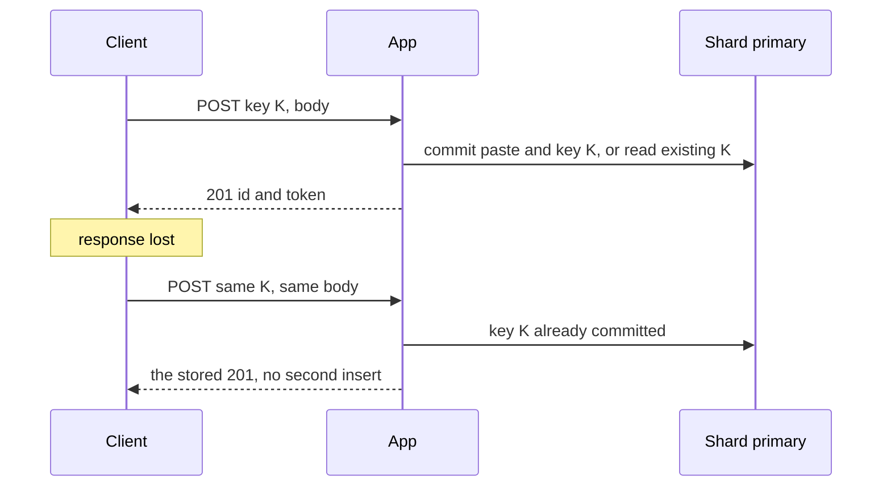

<!-- day-nav -->
[← Day 36 — A leader is a dependency](36-a-leader-is-a-dependency.md) · [Day 38 — Dedupe and the inbox →](38-dedupe-and-the-inbox.md)

# Day 37 — Idempotency on an at-least-once path

**Do now**

1. Set a timer.
2. Attempt the problem. Stop at the attempt line. Do not scroll.
3. Then read.

## Time box

40 minutes.

| Minutes | Do this |
|---|---|
| 0–12 | Attempt. The key, where it is stored, how long it lives, and one retry that still creates two pastes. |
| 12–32 | Read. If the key and the paste row can commit apart, you still have the duplicate. |
| 32–40 | Say the contract change out loud. Creates were not idempotent yesterday. Today they are, under a retention you name. |

## Intent

Facing retries, leave able to make an at-least-once write safe with idempotency keys and name what can still arrive twice. At-least-once is a delivery fact. Idempotency is how the second delivery stops being a second paste. It does not stop every duplicate in the building.

## Problem

> Design a pastebin. People paste text and share a link.

The interviewer says: "The client times out, retries, and now there are two pastes. Fix that. Do not tell me the app will simply not retry. The client will."

## Attempt before reading

12 minutes. Do not scroll. Day 20 forbade the **app** from retrying a create. Day 27 said a client retry is a second paste unless they add a key and you store it at least as long as the retry window. They just added it. Peak creates are about **350/s**. Average is about **116/s**. The delete token is shown once and you store only its hash on the paste row.

Write:

1. What the client sends, and what you return on the retry: same id, or a 409, or a new paste.
2. The transaction that stores the key and the paste. If those are two commits, what does a crash in the middle return on the retry.
3. How long you keep the key, and what a retry one hour after that does.
4. A duplicate you still cannot prevent. There is at least one.

---

**Stop. One commit, a retention, and the duplicates that remain, below.**

---

## Requirements

This is a contract change. Say it before you draw. Until today, POST was not idempotent and a retry was a second paste on purpose, because an anonymous client had nothing stable to send. Now the client **must** send an idempotency key, a UUID they generate once per save and reuse on retry. Missing key: **400**, not a silent new paste. You do not support both contracts on one endpoint and hope the client picked. Two behaviors for one POST is how the old bug survives in the clients that "forgot."

The retry must get the **same 201 body**: same id, same expiry, same delete token. If you only hash the token, you cannot rebuild that body. The idempotency record holds the response, including the raw delete token, until the record expires. That is a secret at rest you did not have yesterday. Bound it by the retention below, and do not log the row. The paste row still stores only the hash. Anyone who reads the idempotency table during the window can delete the paste. Say that. Then keep the window short on purpose.

Same key and a **different** body is not a retry. It is a bug or a collision of keys. Return **409**. Do not create a second paste, and do not return the first paste's token for a body the client did not ask to save. Store a hash of the request next to the response so you can tell.

GET and DELETE do not get this treatment. GET is already safe. DELETE is already idempotent: the second call is a 404 with the same body as a missing id. A key on DELETE adds a row and no new guarantee.

## Design

### One transaction on one shard

The key chooses the slot: `slot = hash(idempotency key) mod 256`. The paste id is minted **on that slot**, and the id **carries the slot** in its first two characters (base62), with the same twelve random characters as day 4 after them. The URL grows by two characters. You do not steal those two from the twelve. Day 4's collision budget was for twelve random characters over the whole mint rate. Eating them to encode a slot would reopen a width argument you already closed. GET routes by decoding the prefix. It does **not** hash the whole id. Hashing the id would send the read to whatever shard the random characters imply, which is not the shard the key chose, and the row would 404 on a live paste.

In **one** transaction on that shard:

1. Look up the key.
2. If it is present and the request hash matches, return the stored 201. Do not insert. Do not PUT.
3. If it is present and the hash differs, 409.
4. If it is absent, PUT the object, then insert the paste row, the idempotency row (key, request hash, response body, `expires_at`), and commit.

The PUT is still outside the transaction, before the commit, as on day 14. A crash after PUT and before commit leaves an orphan and **no** idempotency row. The retry is a new attempt from the database's point of view. It mints a new id, PUTs a new object, and commits once. The user still has one paste. The first object is the reaper's problem, with the same age floor as before. That is not a double paste. That is the orphan you already priced.

A crash **after** commit, before the client sees the bytes: the retry finds the row and returns the stored 201. One paste. This is the case the key is for.

If the idempotency insert and the paste insert are two commits, a crash between them is the bug you think you fixed. Retry does not find the key, inserts a second paste. **Same commit or it is not idempotency.** It is a log you hoped would be consulted.

Do not put this key in a global table "because keys are not ids." A global table is a second shard for every create, and the two commits will drift. Colocation is the design. The prefix on the id is the cost.

### Retention

Clients retry for **24 hours**. You keep the row for **25 hours**. The extra hour is clock skew and a client whose retry timer is a little slow, not a new product. A retry after that is a **new paste**. Say it in the API docs in one sentence, or you will "fix" a duplicate a day later by keeping keys forever.

Storage, average rate, not peak: 116 keys/s × 25 hours × 3,600 s/h = 116 × 90,000 = **10.44 million** rows live. A row that holds a UUID, a request hash, the 201 body, and timestamps is about **512 bytes**. 10.44e6 × 512 ≈ **5.3 GB**. That fits on the same primary that already holds 135 GB of paste metadata. It is not a new database. At 10× it is about **53 GB**, still not the reason you shard. The reason you shard remains day 31's commit ceiling. The idempotency rows ride along in the same slot as their paste, so they split the same way.

A sweeper deletes expired keys. It must not delete the paste. Different `expires_at`. Do not reuse the paste TTL as the key TTL. A paste lives 30 days by default. A key that lives 30 days stores the raw delete token for a month. 30 days is 720 hours, and 720 / 25 = **28.8**, 28.8 × 5.3 GB is about **150 GB** of secrets. You refused that by picking 25 hours. Show the multiplication if someone says "just keep them with the paste."

### What can still arrive twice

- **A new key per click.** The client generated a fresh UUID on retry. You will create a second paste, correctly, against the contract you published. You cannot detect "same human." Do not fingerprint the body and dedupe. Two users pasting the same text get two ids. That non-goal is still a non-goal. Day 4's `body_sha256` is not unique.
- **A retry after 25 hours.** New paste. The first one is still there until its own TTL.
- **The object PUT.** It is outside the commit. Retries and crashes can leave orphans. The reaper remains. Idempotency did not move the bytes inside the database.
- **The outbox worker.** Create still has no user-facing queue. Delete's purge and object-delete can still be delivered twice. That is day 38. An idempotency key on POST does not dedupe a consumer.
- **Two leaders, if you skipped the fence.** Both commit the same key on divergent logs. Day 36. The unique key on one log does not constrain the other log. Fencing is still the fix, not a second idempotency layer.

The app **still does not retry the POST itself**. The key makes the **client's** retry safe. An app that retries internally, times out, and also lets the client retry is two loops you do not need. One retry policy: the client's, with a stable key.

## Diagrams

### The retry that must not mint

A different body with the same K returns 409 and does not enter this picture as a success.

## Trade-offs

**Choice.** Required idempotency key, same commit as the paste, slot chosen by the key, slot prefix on the id, retain 25 hours, store the 201 body.

**Alternative.** Leave creates non-idempotent, which was the design through day 36, and tell the client a timeout means "look at your pastes," which they cannot. There is no list.

**What you give up.** Anonymous POST without a key. A slightly longer id. The delete token at rest for 25 hours. A routing rule that is "decode the prefix," not "hash the id." You gain one paste per save under retry, which is the requirement they added. You do not gain exactly-once execution of the bucket PUT or of the worker.

**10×.** About 53 GB of idempotency rows and the same 25-hour rule. Do not lengthen retention because the table "can take it." The token exposure scales with the window, not with how roomy the disk feels.

## Talking points

**Hand-waving.** "We use at-least-once, which is basically exactly-once." At-least-once is the transport. Exactly-once is a key plus a commit plus a retention, and even then the side effects outside that commit run at least once. Say which side effect.

**Hand-waving.** "UUID primary key, so retries are fine." A new UUID per attempt is the duplicate. The UUID has to be **stable** across the attempts that should collapse.

**If they ask about the delete token.** You hand it back on the retry because the client may never have seen it. You store it only on the idempotency row, only for 25 hours. You do not put it back on the paste row in the clear.

## Say this in the room

The client sends one idempotency key and reuses it on retry, and I store it in the same commit as the paste, on the shard the key hashes to, with that slot written into the id. A retry with the same key and body gets the stored 201, including the delete token, and a different body is a 409. I keep the key 25 hours, about 10.4 million rows and about 5 GB, and after that a retry is a new paste on purpose. A client that mints a new key per click still gets two pastes. So does any side effect outside that commit, the object PUT and later the worker.

## Kit artifact

One checklist row.

| Follow-up | You answer with |
|---|---|
| "Retries will double-create." | Stable key, same commit, retention, and one duplicate you still allow. |

## Design log

One line: the duplicate your scheme still permits. If you cannot name one, you have not finished.

Next: [Day 38 — Dedupe and the inbox](38-dedupe-and-the-inbox.md).

---

<!-- day-nav -->
[← Day 36 — A leader is a dependency](36-a-leader-is-a-dependency.md) · [Day 38 — Dedupe and the inbox →](38-dedupe-and-the-inbox.md)
