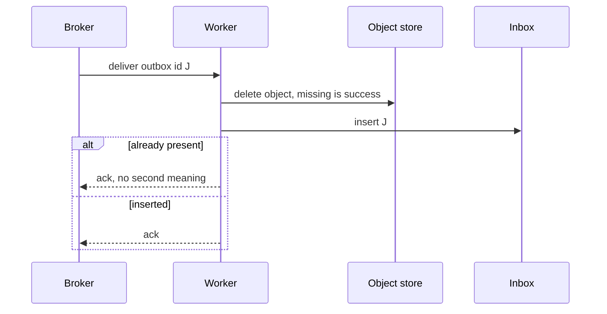

<!-- day-nav -->
[← Day 37 — Idempotency on an at-least-once path](37-idempotency-on-an-at-least-once-path.md) · [Day 39 — Outbox, not dual write →](39-outbox-not-dual-write.md)

# Day 38 — Dedupe and the inbox

**Do now**

1. Set a timer.
2. Attempt the problem. Stop at the attempt line. Do not scroll.
3. Then read.

## Time box

35 minutes.

| Minutes | Do this |
|---|---|
| 0–10 | Attempt. The key the consumer trusts, when you write it, and how long it lives. |
| 10–28 | Read. If you recorded the inbox before the side effect, a crash skips the work forever. |
| 28–35 | Say one effect that is safe twice, and one that is not, and which of them the inbox is allowed to forget. |

## Intent

Facing a consumer that can see a message twice, leave able to dedupe with an inbox and a defined retention for those keys. The broker's at-least-once delivery is not a defect you configure away. The inbox is how the second delivery becomes a no-op, until you expire the key and it isn't.

## Problem

> Design a pastebin. People paste text and share a link.

The interviewer says: "The purge worker saw the same delete twice. Walk the dedupe. I want the key, the order against the side effect, and when you delete the key."

## Attempt before reading

10 minutes. Do not scroll. Deletes and expiries are on the outbox from day 16. Steady state, every paste ends once, so the completion rate matches creates: about **116 jobs/s** average, not a second copy of that number for "expiry plus delete." An early delete replaces the later expiry. It does not add a second life. The broker can redeliver. Assume it will, for as long as it retains the message. Pick a retention and label it.

Write:

1. The id inside the message that stays the same across redelivery. If you use the broker's delivery id, say what happens on the second attempt.
2. Whether you insert the inbox row before the object delete and the purge, or after. What a crash at that point does on the retry.
3. How long the inbox row lives, and what a redelivery after that does.
4. Whether the inbox alone makes a non-idempotent effect safe. Name the effect you still refuse to run twice even with an inbox, or say there is none and why.

---

**Stop. Worked inbox below. Check it against the crash and the order you wrote.**

---

## Requirements

The worker's job is still the one day 16 named: delete the object and purge the edge. Neither must happen before the row commit. Both may happen twice. The user does not wait. A duplicate purge is a second HTTP call to the CDN, not a second delete of the paste. A duplicate object delete of a key that is already gone is a success. You are deduping to keep the worker cheap and to keep a future effect honest, not because the second purge resurrects anything.

You need a retention. "We store processed ids" without a TTL is a table that grows with every paste you have ever deleted. That number is below, and it is large enough that "forever" is a decision you should see.

The inbox is per consumer that has a side effect, not a decoration on every topic because a diagram showed a box called dedupe.

## Design

### The key is yours, not the broker's

The message body carries the **outbox row id**, which you inserted once, in the same commit as the delete. Redelivery sends that same id. The broker's own delivery handle changes every attempt, by design, so the broker can tell attempts apart. If you dedupe on the delivery handle, you never hit. Two deliveries look like two jobs. You will purge twice and call it a mystery.

Unique key: `(consumer, outbox_id)`. One row. The consumer name is in the key so a second worker type can do different work for the same outbox row later without the first worker's inbox suppressing it. Do not share one inbox across effects that are not the same effect.

### Order: effect, then inbox, for this job

Object delete and purge are **idempotent**. The safe order is:

1. Delete the object. A missing object is success.
2. Purge the edge. A purge of an already-purged id is success.
3. Insert the inbox row. On conflict, you already finished. Commit.

A crash before step 3 redelivers, and you do the work again. That is cheap. A crash after step 3 does not redeliver into the work, because the next delivery sees the inbox and acks.

The **wrong** order for a skip-on-seen inbox: insert the inbox, crash, redeliver, see the inbox, ack, and never delete the object. You have recorded a success you did not achieve. That order is only safe if "insert inbox" and "the effect" are the **same** transaction and the effect is a row in the same database. Purge and object delete are not rows in the paste primary. They cannot share the inbox's commit. So you do them first, and you tolerate a double apply.

If the effect is **not** idempotent, this order double-applies on the crash, and the other order drops the effect. Neither is acceptable. Then you need a state on the inbox row, in a database you can commit with the decision:

- `in_progress` inserted first, uniquely, so two deliveries cannot both start,
- the external call carries **its own** idempotency key (the outbox id), so the other system collapses a retry,
- then `done`.

You do not have that effect on this pastebin. Do not build the state machine for a purge. Do name it, so when someone adds "email the uploader that the paste expired" you do not mark the inbox done before the email provider accepts a key. An email is the effect you still refuse to run twice on a bare inbox. The inbox without a provider-side key **and** without a long enough retention will send it twice. Day 37's lesson applied to someone else's API.

### Retention

Planning assumption: the broker retains a message and may redeliver it for **7 days**, including a human hitting "replay" on the dead-letter queue inside that week. The inbox lives **8 days**. One day of margin, same shape as the idempotency hour. A replay on day 9 looks like a new job. For purge and object delete, running again is correct. For the email you refused, running again is a second email. **The inbox retention has to exceed the replay window of any effect that is not itself idempotent.** If someone can press replay after 30 days, an 8-day inbox does nothing for them. Either the effect is idempotent, or the inbox lives longer than the replay, or replay is a new business action with a new id. Pick one. Do not leave it as "ops knows."

Size: 116 jobs/s × 8 days × 86,400 s/day = 116 × 691,200 = **about 80.2 million** rows. At about **200 bytes** a row (consumer, id, timestamp), that is about **16 GB**. Fine next to the paste metadata. Kept forever, a year is 116 × 86,400 × 365 = **about 3.66 billion** rows, times 200 bytes is about **732 GB** a year, of keys whose only job was to ignore a redelivery. You will not keep them forever. The sweeper that drops an inbox row is not the sweeper that drops a paste. Different predicate, different TTL. Dropping them early resurrects work. Dropping them late fills the disk. Eight days is the sentence.

The inbox has to live where the consumer can do a point lookup before it decides to skip, and it has to be durable across a worker crash. A hash set in the worker's memory is empty on deploy, and the broker will redeliver everything that was in flight. That is not an inbox. That is a cache of one you just flushed. Put the row on the same shard as the paste if the outbox id maps there, so the lookup is local to the slot. A single global inbox is a hot key's cousin: every worker writes one table at 116/s today and 1,160/s at 10×, which still fits, and then it becomes the one database every consumer shares. Prefer the shard you already have. 116/s is not why. Blast radius is why.

### Crash windows and who gets hurt

**Effect-then-inbox (correct for purge).** Crash after object delete, before inbox insert: redelivery deletes again (no-op on missing) and inserts. User impact: none beyond a duplicate purge API call. Cost: cheap.

**Inbox-then-effect (wrong for purge).** Crash after inbox insert, before delete: redelivery sees inbox, acks, object leaks forever. User impact: none visible immediately; bucket grows; GDPR/delete-token promises fail quietly. This is why order is the design.

**Non-idempotent effect (email).** Neither order is safe without a provider key and/or `in_progress` state. Effect-then-inbox double-emails on crash. Inbox-then-effect drops the email. Staff names both holes before drawing a state machine.

**Memory set as inbox.** Deploy or crash empties it; broker redelivers everything in flight. At 116 jobs/s with 30 seconds of in-flight work that is ~3,500 jobs that look new. You purge 3,500 times (OK) or send 3,500 duplicate emails (not OK). Durability of the inbox row is the point.

**Global inbox vs per-shard.** 116 inserts/s fits one table; blast radius does not. One bad migration locks every consumer. Prefer the paste's shard via outbox id mapping. At 10×, 1,160/s still fits one primary's commit ceiling but the blast-radius argument gets louder, not quieter.

**Retention vs replay.** 8 days > 7-day broker replay. Day-9 replay of a purge: runs again, fine. Day-9 replay of an email with an expired inbox: second email. Either lengthen inbox past any human replay button, make the effect idempotent at the provider, or treat replay as a new business id. "Ops knows" is not a third option.

### What the inbox does not do

It does not make create idempotent. That was the client's key. It does not order two different jobs. It does not replace the age floor on the reaper. A duplicate "reap this orphan" message must still respect the age floor, because the second delivery might be the one that arrives while a create is in flight if you ever publish a reap early. The inbox collapsing two reaps into one does not make a too-young reap safe. Idempotent and **correct** are different. A reap of a live object, done once, is still data loss.

**Consumer name in the unique key.** `(consumer, outbox_id)` lets a later "notify search index" worker process the same outbox row without the purge worker's inbox suppressing it. Sharing one inbox across different effects is how a finished purge blocks a notification that never ran. Different effects, different consumer names, or you have coupled them into one pretend exactly-once bit.

**Ack timing.** Ack the broker after the inbox insert commits, not after the object delete alone. If you ack after delete and crash before inbox, the broker will not redeliver and you have no inbox row — the next path that needs "was this done?" cannot tell. For an at-least-once broker, visibility timeout or nack-on-crash is what brings the message back; your inbox is what makes the second delivery cheap. Get the ack after the durable dedupe record, matching the "effect then inbox" order: effect, inbox commit, then ack.

**Poison messages.** A purge that 500s because the bucket is down should not inbox-insert. Leave the message for retry with backoff (day 20's worker rules). Inbox means "this outbox id's effect succeeded." Recording success on failure is the wrong-order bug with a different costume. Cap retries and dead-letter; do not mark done to clear the alert.

**Page on.** Inbox insert failures, dead-letter depth, age of oldest unacked outbox-derived message, and — separately — bucket 404 rates on deletes you expected to find. A quiet inbox with a growing orphan metric means someone marked done early.

What staff sounds like here is ordering the three writes (effect, inbox, ack) so a crash can only cause a safe repeat, sizing retention against the replay button a human can still press, and refusing to reuse a purge inbox for an email that will hate a repeat.

## Diagrams

### Record success after the work, for an effect you can repeat

If the worker dies between the delete and the insert, the next delivery takes the same path again. The object delete is the step that is allowed to repeat.

Caption: "Work first, inbox second — because the work may repeat." If the insert arrow sits above the object delete, you drew the leak.

## Failure the user sees

**Worker crash mid-purge, correct order.** Brief duplicate purge; object gone; next delivery no-ops. Owner who deleted sees origin 404; edge drains by max-age. No user-visible bug.

**Worker crash, wrong order.** Origin 404; object still in bucket; edge may still serve until max-age then origin cannot fill. Eventually `body_missing` class failures if something expects the object. Leak until a separate reaper finds orphans — if you have one for this path.

**Replay after inbox expiry on a purge.** Second purge, harmless. User sees nothing.

**Replay after inbox expiry on an email you added later.** Second email. User sees spam from your "delete confirmation." That is the product failure that makes retention a contract.

**Deploy that wiped an in-memory dedupe set.** Storm of redeliveries. Purges OK; any non-idempotent consumer doubles.

## Trade-offs

**Choice.** Dedupe on the outbox id, inbox row after a successful idempotent purge and object delete, retain 8 days against a 7-day replay window, about 16 GB.

**Alternative.** Exactly-once delivery from the broker, or an inbox you keep forever, or an inbox you write before the call.

**What you give up.** A pure "I have processed J" bit that survives a 30-day replay. You accept a second purge after day 8. You refuse to pretend a memory set is that bit. You also refuse to mark done before the external call, because that drops the only purge you were going to do.

**Name the refusal inside each alternative.** Against broker exactly-once: you refuse a promise the first kill-after-side-effect disproves. Against inbox-before-effect for purge: you refuse a permanent object leak. Against forever retention: you refuse ~732 GB/year of ignore-keys. Against a memory set: you refuse a dedupe that empties on deploy. Against one global inbox: you refuse a blast radius that couples every consumer. Against treating purge dedupe as sufficient for email: you refuse a second email on replay.

**10×.** About **160 GB** for eight days (16 × 10). Still not forever: a year becomes about **7 TB** of inbox (732 GB × 10). The retention sentence gets more important as the product lives, not less. The per-second rate, 1,160 inserts/s, is a rounding error next to that disk.

## Talking points

**Hand-waving.** "The queue is exactly-once." Then the inbox is unnecessary, and the first redelivery proves it was not. Design for the redelivery you can force by killing the worker after the side effect.

**Hand-waving.** "We dedupe in the consumer." On which key, written when, kept how long? Those three are the design. The word dedupe is not.

**If they ask why 8 days not 7.** "One day of margin past the broker's replay window — same shape as idempotency's 25 vs 24. A replay on day 7 must still hit a row."

**If they ask how big the inbox is.** "About 80 million rows and 16 GB at eight days. A year is about 732 GB. I will not keep them forever."

**If they ask about the email.** State machine plus the provider's idempotency key, or do not send it. An 8-day inbox and a 30-day replay sends two emails. You do not "add dedupe" and walk away.

## Say this in the room

The broker will deliver the purge at least twice, so the message carries the outbox id, not the broker's delivery handle. I delete the object and purge first, because both are safe to repeat, and only then insert the inbox row; if I insert first and crash, the retry skips a delete I never did — that is a permanent leak. I keep that row 8 days against a 7-day replay, about 80 million rows and 16 GB; a year would be about 732 GB of ignore-keys, so I will not keep them forever. A replay after the inbox expires runs the job again, which is fine for a purge and not fine for an email — that effect needs a provider key and a state machine. A memory set is not an inbox: a deploy empties it and redelivers everything in flight. I put the row on the paste's shard so one bad migration does not lock every consumer.

**If they ask when you ack the broker.** "After the inbox row commits. Ack after the delete alone and a crash before inbox loses both the redelivery and the dedupe record."

## Kit artifact

One checklist row.

| Follow-up | You answer with |
|---|---|
| "The consumer will see this twice." | Stable id, order against the effect, retention longer than replay. |

## Design log

One line: the effect you had marked done before it happened, or the retention you had left as forever.

Next: [Day 39 — Outbox, not dual write](39-outbox-not-dual-write.md).

---

<!-- day-nav -->
[← Day 37 — Idempotency on an at-least-once path](37-idempotency-on-an-at-least-once-path.md) · [Day 39 — Outbox, not dual write →](39-outbox-not-dual-write.md)
