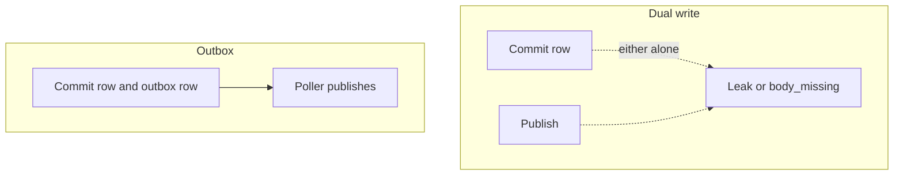

<!-- day-nav -->
[← Day 38 — Dedupe and the inbox](38-dedupe-and-the-inbox.md) · [Day 40 — Transactions that stop at the shard →](40-transactions-that-stop-at-the-shard.md)

# Day 39 — Outbox, not dual write

**Do now**

1. Set a timer.
2. Attempt the problem. Stop at the attempt line. Do not scroll.
3. Then read.

## Time box

35 minutes.

| Minutes | Do this |
|---|---|
| 0–10 | Attempt. Two places that must not diverge after a delete. Draw the commit and the publish as one step or as two. |
| 10–28 | Read. If the queue publish can succeed without the row commit, or the reverse, you still have the dual write. |
| 28–35 | Say the poll, the lag a user can see, and why a CDC pipe is not required for this product. |

## Intent

Facing a write that must also become a message, leave able to replace a dual write with an outbox. Two commits to two systems is how a paste is deleted in the database and kept on the edge forever, or purged when it still exists. One of those is a leak. The other is a data loss you dress up as cleanup.

## Problem

> Design a pastebin. People paste text and share a link.

The interviewer says: "On delete you update the database and you publish a purge. Guarantee those do not diverge. Do not say the queue is reliable."

## Attempt before reading

10 minutes. Do not scroll. The delete path returns 204 after the row and the outbox row commit, from day 16. The worker does the object delete and the purge. Peak deletes are a fraction of creates. Use **35 deletes/s** as a planning peak (10% of the 350 create peak), not because you measured it.

Write:

1. The dual-write failure modes: commit then fail to publish, and publish then fail to commit. Which one resurrects, which one leaks.
2. The single commit that replaces both. What is in that transaction.
3. How the worker learns about the row. Poll, listen, or a side channel you invented.
4. The backlog the user can see, in seconds or in edge serves, not as "eventual."

---

**Stop. How the row and the message stay coupled, and the lag a stranger can see, is below.**

---

## Requirements

A dual write is: `commit(row)` and, separately, `publish(queue)`. Either can succeed alone.

- Commit succeeds, publish fails: the paste is gone at the origin, the object and the edge still exist. Orphan. Leak of bytes you promised you would delete. Origin is honest.
- Publish succeeds, commit fails: the worker deletes an object whose row is still live, or purges a key that is still valid. The next GET is `body_missing` 500, or a warm edge goes dark while the origin still has the row. Data loss of a live paste, or a false 404 at the edge. Origin can look fine.

You refuse both. The requirement is: **the message exists if and only if the row change committed.** That is the outbox. It is not "we retry the publish." Retrying the publish after a commit is how you paper over the first failure until the process dies between the retry and the next one. A process that dies is the dual write again.

Create's 201 does not publish a user-facing message. Day 16 kept the queue off create on purpose. Today you do not put one on. If you invent a "paste.created" topic nobody consumes, you have bought the outbox machinery for a ghost. The delete (and expiry) outbox is the one that must exist.

## Design

### The transaction

On DELETE, in one transaction on the paste's shard:

1. Delete the paste row (or mark it deleted; hard delete is fine, the id is never reused).
2. Insert into `outbox(id, kind='purge_and_delete_object', paste_id, created_at)`.
3. Commit.
4. Write the tombstone to the origin cache.
5. Return 204.

Steps 1 and 2 are atomic. Step 4 is the day-33 invalidation, not part of the outbox. A failed tombstone is a 503, as before. The outbox row is already committed if you got that far. A 503 after commit is fine: the client retries DELETE, which is a 404, and the outbox row is still there to be worked. Do not roll the outbox back because the cache write failed. The cache will miss and ask the primary, which has no row. Origin is correct. The worker still has a job to do.

The outbox table is on the **same primary** as the paste. A different database is a dual write with a new name. Cross-database commits are not on this whiteboard.

### How the message leaves

A poller, or the same worker, reads `outbox where published_at is null order by id limit 100`, publishes those rows to the broker (or works them inline), then marks them published, or deletes them, in a second transaction. The second transaction is the worker's bookkeeping. It is not the user's delete. Losing a mark-as-published and republishing is day 38's redelivery. The inbox handles it.

Polling interval, planning: **1 second**. Peak 35 deletes/s is 35 rows a second. A one-second poll with a batch of 100 is not the bottleneck. The lag the user can see is: after 204, the edge may still serve for up to **60 seconds** of max-age, and the object may exist until the worker runs. With a 1-second poll and a healthy worker, the object is usually gone in a few seconds. The **guarantee** is still the 60-second edge, not the poll. Do not advertise "deletes within 1 second" because the poll is 1 second. The CDN is 60. The poll is how you avoid the dual-write hole, not how you beat the edge.

A LISTEN/NOTIFY, or a logical-decoding stream, is a faster wake-up. It is not required at 35/s. If you name CDC, say what you are not building: a second store of "the truth," a Kafka Mirror, a schema registry. The outbox table **is** the durable intent. CDC reading the WAL of that table is an optimization of the poller. It does not replace the outbox. CDC of the paste table without an outbox is a dual write in reverse: the stream can lag or drop a slot, and you have no row that says "this delete still needs work." Prefer the outbox row you can count. Page on `max(now() - created_at)` of unpublished rows, not on "CDC lag looks fine."

### Publish is not the commit

The broker ack is not the database commit. If you "publish then mark," and mark fails, you redeliver. That is expected. If you "mark then publish," and publish fails, you have a row that thinks it is done and a broker that never saw it. That is the dual write again, inside the worker. Order for the poller: **publish, then mark**, and treat a mark conflict as success. Or delete the outbox row only after the inbox has the job. Either way, the publish happens while the outbox row still exists so a crash retries. Day 38's "effect then inbox" is the cousin of this "publish then mark."

Do not return 204 after the publish. The user wait must not include the broker. The 204 waits for the database commit and the tombstone. The publish is the poller's problem a second later.

### Dual-write holes, priced

**Commit then publish fails.** Row gone, outbox missing if you never used one: object and edge remain. At peak ~35 user deletes/s plus ~116 expiry detaches, a process that dies between commit and publish once a day leaves that day's orphans until a sweeper notices. The outbox makes the intent a row you can count: page on `max(age)` of unpublished rows, not on "publish error rate looked fine."

**Publish then commit fails.** Worker deletes object for a live paste → `body_missing` 500 on cold read; or purges while origin still has the row → edge dark, origin 200. User who still has the link sees a broken paste. This direction is data loss of a live document. Refuse it harder than the leak.

**Poll lag vs edge guarantee.** 1-second poll means the object is usually gone in a few seconds when healthy. The **promise** remains 60-second max-age. Advertising "deletes in one second" because the poll is one second is a lie the CDN will disprove. Say both numbers: poll for ops, max-age for the product.

**CDC without an outbox.** Stream of paste deletes can lag or drop a slot; you have no countable "still needs work" row. Prefer the outbox table as durable intent; CDC of that table can wake the poller faster but does not replace it. Page on unpublished outbox age.

**Create outbox for a ghost topic.** Nobody consumes `paste.created`. You bought dual-write machinery and a consumer you will invent to justify it. Refuse. Search index later is a different outbox row committed with the paste — still not a dual write, and not today's product.

### Create stays off the outbox

PUT, insert paste, insert idempotency key, commit, 201. No outbox. There is no consumer for "a paste was created" in this product. Adding one so "everything is event-driven" is a second source of truth you will then have to reconcile when a consumer is behind. Refuse it. If they force a search index later, that is day 57's shape and a different outbox row, still committed with the paste, still not a dual write. Today there is no index.

### Staff depth: intent you can count

The outbox exists so "delete committed" and "work remains" are one fact. Dual write splits them; CDC of the paste table without an outbox hopes a stream is that fact. Staff pages on the oldest unpublished outbox row because that age is the user's bytes-still-at-rest and the edge's eventual darkness, measured in a number on-call can act on.

**Two failure directions, unequal severity.** Commit-without-publish leaks objects — privacy and cost, usually recoverable by a reaper if you still have the id in logs or a separate orphan scanner. Publish-without-commit deletes bytes for a live row — `body_missing` for anyone who still has the link. Rank them: data loss of a live paste outranks a leak. Any design that can take the publish-first path in a retry library is ranked wrong.

**204's dependencies.** Commit of row+outbox, then tombstone, then 204. Not publish. A 503 after commit because the tombstone failed still leaves correct origin on the next miss and a worker job pending. Rolling back the outbox because the cache blinked reintroduces "committed delete with no intent row." Leave the outbox; fix the tombstone on retry of DELETE (idempotent 404 path) or on a repair job.

**Poller order mirrors day 38.** Publish (or run) while the outbox row exists; then mark published. Mark-then-publish drops work on crash. At ~35 user deletes/s and ~116 expiry jobs/s average, a 1-second poll with batch 100 is idle most ticks — the design is correctness, not throughput. At 10×, 350 deletes/s still fits one poller; the break remains the edge and the bucket, not the outbox table.

**Create stays quiet.** No consumer means no outbox. Inventing `paste.created` so the architecture looks event-driven is how teams grow a second source of truth and then spend a year reconciling it. When search arrives, add an outbox row in the same create transaction — still one commit, still not a dual write to a broker from the request path.

**What the status page says during poller lag.** Origin deletes work. Public links may work for up to a minute. Bytes disappear as workers catch up; outbox age is N minutes. That is honest. "Deletes are slow" without the split sends people to restart primaries.

What staff sounds like: ranking the two dual-write holes, binding 204 to commit+tombstone only, paging on intent age, and refusing a create topic nobody reads.

## Diagrams

### Dual write, and the outbox that replaces it

The dotted arrows are the bug. The outbox has one solid commit the message depends on.

Caption: "One commit holds row and intent; poller is downstream." The dotted arrows on the dual-write side are the only paths that create leak or body_missing.

## Failure the user sees

**Healthy delete.** 204 after commit+tombstone. Edge may serve up to 60s. Object gone within seconds if poller healthy. Owner checking CDN thinks delete failed briefly — expected.

**Poller down for 10 minutes.** Origin correct (404). Edge drains by TTL. Objects accumulate ~35×600 ≈ **21,000** pending deletes at peak user-delete rate, plus expiry detach. Outbox age alert fires. Users who care about bytes-at-rest see a delay; readers see correct origin.

**Dual write, publish-first bug in production.** Live pastes lose bytes. Support sees `body_missing`. That is the pager you avoid by never taking that order.

## Trade-offs

**Choice.** Delete and outbox in one transaction. Poller publishes. 204 does not wait for the broker. Page on outbox age. No create outbox.

**Alternative.** Dual write with retries, or "the CDC of the paste table is the queue."

**What you give up.** Instant publish. You take about a second of poll lag on top of the 60-second edge you already owned, and you keep a table of unpublished work you can measure. You give up a design where the broker and the database can disagree about whether a delete happened.

**Name the refusal inside each alternative.** Against dual write with retries: you refuse a hole that returns every crash between the two calls. Against spanning Postgres and Kafka in "one transaction": you refuse two commits you hoped would finish together. Against CDC of the paste table as the queue: you refuse intent you cannot count. Against create outbox with no consumer: you refuse ghost machinery. Against 204 after publish: you refuse making the user wait on the broker.

**10×.** 350 deletes/s peak. Still one poller or a small pool. The outbox is not the 10× break. The edge and the object store are. A CDC pipe you cannot page on age of **intent** is a worse 10× story than a table of pending rows.

## Talking points

**Hand-waving.** "We'll write to the DB and the queue in a transaction." Across which system? A transaction that spans Postgres and Kafka is two transactions you hoped would finish together. That hope is the dual write.

**Hand-waving.** "Outbox is overkill at this QPS." The bug is a correctness bug, not a load bug. It fires once per crash between the two writes. QPS does not make it rarer as a fraction of deletes. It makes the absolute count of crashes that matter larger over a year.

**If they ask what you page on.** "Age of unpublished outbox rows. Not CDC lag alone. If the oldest intent is five minutes old, deletes are not finishing."

**If they ask whether the poll beats the CDN.** "No. Poll is a few seconds when healthy; the product promise is still 60 seconds at the edge. I will not advertise the poll as the user-visible delete bound."

**If they ask for exactly-once publish.** You have at-least-once publish from the outbox and at-least-once consume with an inbox. That pair is the design. The broker's "exactly once" mode does not remove the dual write between the database and the broker. The outbox does.

## Say this in the room

A dual write is a row commit and a queue publish that can each succeed alone: one way I leak the object, the other way I delete bytes for a paste that is still live — and publish-first is the data-loss direction. I replace both with one transaction that inserts the outbox row next to the delete, return 204 after that commit and the tombstone, and let a poller publish about a second later. The user-visible lag is still the 60-second edge, not the poll; I will not advertise one-second deletes. I page on the age of unpublished outbox rows. I do not publish on create, because nothing consumes that event, and a CDC stream of the paste table is not a substitute for a row I can count. Publish then mark in the worker; mark then publish is the dual write again inside the poller.

### Poller and CDC, said without romance

**Publish then mark.** The poller reads unpublished outbox rows, publishes, then marks. Crash after publish before mark: day 38 redelivers; inbox makes it cheap. Mark then publish: crash after mark leaves work that will never run unless a repair scan exists — you just built a dual write inside the worker.

**Inline vs queue.** At 35 deletes/s you could run the worker inline from the poller without a broker. The outbox still matters: it is the durable intent. The broker is how you scale workers and survive poller restarts without losing the list. Do not skip the outbox because you skipped Kafka.

**Metric that matters.** `outbox_oldest_unpublished_age_seconds`. Alert at 60s, page at 300s. Publish error rate alone can be zero while the poller is dead (no attempts). Age catches silence.

**Create-outbox temptation scored.** Cost: extra write per create (~116/s), a consumer to build, reconciliation when the consumer lags. Benefit today: none. Score: refuse. When search lands, the benefit becomes "index eventually matches primary," and the outbox row commits with the paste — same pattern as delete, new `kind`.

**User-visible copy on delayed detach.** "Your paste is deleted. It may take up to a minute to disappear from cached copies. Storage cleanup usually finishes within a few seconds." Two timescales, one status page.

## Kit artifact

One checklist row.

| Follow-up | You answer with |
|---|---|
| "How do you keep the DB and the queue in sync?" | You do not. One commit holds both facts. The queue is a downstream of that row. |

## Design log

One line: which dual-write order your attempt left open, and the user who hits it.

Next: [Day 40 — Transactions that stop at the shard](40-transactions-that-stop-at-the-shard.md).

---

<!-- day-nav -->
[← Day 38 — Dedupe and the inbox](38-dedupe-and-the-inbox.md) · [Day 40 — Transactions that stop at the shard →](40-transactions-that-stop-at-the-shard.md)
