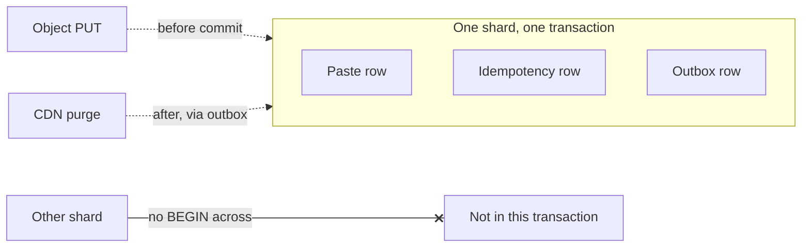

<!-- day-nav -->
[← Day 39 — Outbox, not dual write](39-outbox-not-dual-write.md) · [Day 41 — Sagas and compensation →](41-sagas-and-compensation.md)

# Day 40 — Transactions that stop at the shard

**Do now**

1. Set a timer.
2. Attempt the problem. Stop at the attempt line. Do not scroll.
3. Then read.

## Time box

40 minutes.

| Minutes | Do this |
|---|---|
| 0–12 | Attempt. Draw the rows that commit together. Name the isolation level. Name one change that would cross a shard. |
| 12–32 | Read. If your transaction spans two slot maps, you have a distributed transaction you did not price. |
| 32–40 | Say the isolation level, what anomaly you refuse, and the boundary the transaction does not cross. |

## Intent

Facing a multi-row change, leave able to draw the transaction at one shard and pick an isolation level on purpose. A transaction that "covers everything" is a wish. A transaction that covers the rows that must not diverge is a design.

## Problem

> Design a pastebin. People paste text and share a link.

The interviewer says: "You have the paste row, the idempotency row, and the outbox row. What is in one transaction, what isolation do you run, and what happens if I ask you to move a paste between shards?"

## Attempt before reading

12 minutes. Do not scroll. Day 37 colocated the idempotency key with the paste. Day 39 put the outbox on the same primary. Day 31's slots are the partition. Isolation levels you may name: read committed, repeatable read, serializable. Pick one. Do not invent a fourth.

Write:

1. The create transaction's rows. The delete transaction's rows. What is deliberately outside both (the object PUT, the purge).
2. The isolation level, and one anomaly it stops that matters for this product.
3. What a "move this paste to another shard" request would require. Two-phase commit, a saga, or a refusal.
4. Whether two concurrent creates with different keys can serialize without blocking each other. If your level makes them wait, say so.

---

**Stop. The transaction boundary and the isolation level are below. Your level stays on the attempt until you compare.**

---

## Requirements

A transaction ends at the shard boundary. That is not a Postgres preference. It is the day-31 decision: one slot's rows live on one primary, and that primary's log is the order. Crossing two primaries means a different protocol (two-phase commit, or a saga on day 41). You do not smuggle a cross-shard transaction into "BEGIN" by hoping both hosts are up.

What must be atomic for create:

- the paste row exists iff the idempotency key exists for that request,
- the 201 body you will replay is the one that describes that paste.

What must be atomic for delete:

- the paste is gone iff the outbox row that will purge it exists.

What is allowed to be outside:

- the object bytes (PUT before commit, orphan on crash),
- the origin cache tombstone (day 33),
- the broker message (day 39's poller).

If those outside pieces were inside the database transaction, you would be waiting on the bucket inside a held lock. You already refused that. The transaction is the metadata claim. The bytes are a precondition you enforce with order and a reaper, not with a distributed commit.

## Design

### Isolation, chosen

**Read committed** is the default on many systems, and it allows a second transaction to insert a row you already checked for. Check-then-insert of an idempotency key under read committed is a race: two creates with the same key both see absence, both insert, one unique-constraint conflict. The unique constraint is what saves you, not the isolation level. You still want the unique constraint. You do not want to rely on "I SELECTed and it was empty."

**Repeatable read** (Postgres's, which is snapshot isolation) gives each transaction a stable view of committed data as of its start. Two concurrent creates of **different** keys do not block each other. A concurrent delete of a paste you are not touching does not rewrite your snapshot mid-flight. A write-write conflict on the **same** row aborts one of you. That is the level you run: **repeatable read**, and unique constraints on `paste.id` and on `idempotency.key`.

What anomaly you care about stopping: a delete that commits while a create's transaction is open does not matter for different ids. For the **same** id you never create twice, because ids are unique and never reused. The anomaly that would hurt is two retries with the same key both inserting. The unique key turns that into one commit and one conflict. On conflict of the idempotency key, you abort, re-read, and return the stored 201. You do not invent a second paste. That path is the same under read committed **if** the unique constraint is present. Repeatable read buys you a stable read of related rows if you ever SELECT more than one, and it is the level you can say without pretending you need serializable.

**Serializable** would refuse concurrent transactions that could produce a cycle. At 350 creates/s you do not want a serializable abort storm because two unrelated pastes touched an index page the planner decided to fight over. You do not need it. The product has no "total of all pastes" row that two transactions increment. If they invent that counter, day 32's salt applies, and serializable still would not fix a hot key. Refuse serializable until a constraint requires it. Say which constraint that would be: a check that spans rows without a unique index to enforce it. You do not have one.

### What is in the BEGIN / COMMIT

Create:

```
BEGIN
  SELECT idempotency WHERE key = K
  if found and hash matches: return stored (no write)
  if found and hash differs: 409
  INSERT paste
  INSERT idempotency (key, hash, response, expires)
COMMIT
```

The PUT was before BEGIN, or between a short "reserve" and BEGIN, as day 37 said. Holding BEGIN across the PUT is how you pin the primary for a 1-second object write. Do not. Open the transaction for the metadata, not for the network.

Delete:

```
BEGIN
  SELECT paste WHERE id = I FOR UPDATE
  if missing or token mismatch: 404 path
  DELETE paste
  INSERT outbox
COMMIT
```

`FOR UPDATE` takes the row lock so a concurrent delete of the same id does not both think they won. The second gets no row and 404s. That is correct. You do not need serializable for two deletes of one id. You need the row lock.

### The edge of the world

"Move paste P from shard A to shard B" is a cross-shard transaction if you try to do it in one BEGIN. Options:

1. **Refuse.** Ids encode the slot. Moving would change the id or break GET routing. You never reuse ids, so you cannot renumber. Refusal is the product answer.
2. **Saga.** Copy to B, flip a pointer, delete from A, with compensations if a step fails. Day 41. You do not need it for this pastebin.
3. **Two-phase commit.** A coordinator prepares on A and B, then commits. You take a coordinator, a blocking prepare, and a recovery story. At this QPS and this product, it is a paper you cite to refuse, not a box you draw. Spanner-shaped external consistency is the appendix. You are not inventing TrueTime to move a paste.

Any SELECT that joins two shards is also outside a single transaction. The sweeper fans out and deletes with a per-shard predicate. It does not open a transaction that holds locks on four primaries. That would be a distributed deadlock with a sweeper as the victim or the villain.

### Long transactions

A transaction that stays open while the app waits on the CDN purge is a lock you gave to a network. Keep BEGIN short. The outbox exists so the long work is not in the transaction. If your attempt has "BEGIN, delete row, purge CDN, COMMIT," open it again. The purge is the worker. The transaction ends before 204.


### Staff depth: the shard is the world

A transaction that stops at the shard is not a limitation you apologize for. It is the boundary that keeps day 37's idempotency key and day 39's outbox in the same commit as the paste. Cross that boundary and you inherit day 41's saga whether you drew the boxes or not. Staff says the boundary first, then the isolation level, then what is forbidden to put inside BEGIN.

**Isolation, chosen for the anomaly you fear.** The anomaly on create is two retries both inserting. A unique constraint on the idempotency key kills that anomaly under read committed or repeatable read once both transactions try to commit. Serializable will also kill it, and will additionally abort transactions that never touched the same key when the engine's SSI detects a dependency you do not care about. At ~350 creates/s that abort tax is unnecessary theater. Name the anomaly. Pick the weakest level that closes it. Do not "upgrade" isolation because the interview room likes the word.

**Inside BEGIN on create.** Insert or find idempotency row; insert paste row; commit. The object PUT completed before BEGIN (day 14/37). Holding the transaction open across the PUT pins a connection and a slot for a network write that can take a second. At 200 create slots from day 19, a 1-second PUT held inside BEGIN is how you exhaust the primary's working set while waiting on the bucket.

**Inside BEGIN on delete.** Delete paste row; insert outbox row; commit. Then tombstone (day 33). Then 204. Purge and object delete are the worker's problem. A BEGIN that waits on the CDN is a delete that fails when a POP is slow, which is the coupling you refused.

**The id is the fence against cross-shard transactions.** Slot prefix means GET, DELETE, and the idempotency lookup land on one primary. An API that "moves" a paste to another user's shard would need to copy, dual-write, and then delete — a saga. Refuse the move. If product forces it, schedule a migration job; do not open two BEGIN blocks and hope.

**Long transactions are self-inflicted outages.** A sweeper that locks 10,000 expiring rows in one transaction stalls creates that need unrelated row locks on the same heap pages and raises replication lag. Cap the batch: hundreds of rows, commit, repeat. More round trips beat one multi-second lock. At 350 creates/s, a 5-second stop-the-world sweeper is ~1,750 creators waiting.

**10× does not change isolation.** Four shards at ~875 commits/s each still use the same level. Serializable abort rates get worse with concurrency — another reason not to "upgrade" because traffic grew. The key and the shard count grow. The transaction shape does not.

What staff sounds like: listing every row inside the transaction, every network call left outside, and the move API you will not offer because it is a saga in disguise.


## Diagrams

### The boundary



Solid is atomic. Dotted is ordered but not atomic with the rows. The link that stops is the refusal.


Caption: "BEGIN ends at the shard box; PUT and purge sit outside." If an arrow from BEGIN reaches the bucket, you drew the stall.

## Failure the user sees

**Create with PUT inside BEGIN, bucket slow.** Creators hang until timeout; slots fill; unrelated creates 503. The bucket blip became a primary outage.

**Delete waiting on purge inside the request.** Owner's DELETE 504s when one POP is sick; row may or may not be gone; retries multiply confusion. Outbox-after-commit avoids this.

**Cross-shard "transaction" attempted in the app.** Partial success: paste on shard A, idempotency on shard B missing after a crash. Retry creates a second paste. The user has two links and no idea why.

## Trade-offs

**Choice.** Repeatable read. Unique constraints. Create and delete transactions stop at the shard. PUT and purge stay outside. Cross-shard moves refused by the id encoding.

**Alternative.** Serializable everywhere, or a distributed transaction for anything that looks related.

**What you give up.** The ability to move a paste without a saga. The ability to hold a lock across a network call. You keep create and delete free of dual-write holes inside the shard, and you keep unrelated creates from serializing behind each other.

**Name the refusal inside each alternative.** Against serializable everywhere: you refuse abort tax on unrelated creates. Against BEGIN across PUT: you refuse pinning the primary on a blob store. Against BEGIN across purge: you refuse delete coupled to CDN health. Against two-phase commit for a move: you refuse a protocol that is a saga with extra coordinator failure modes. Against a directory lookup per GET to find the shard: you refuse a second system on the read path when the id can carry the slot.

**10×.** 3,500 creates/s across four shards is still ~875/s per shard. Repeatable read holds. Serializable abort rates get worse with concurrency. That is another reason not to "upgrade" isolation because traffic grew. The key and the shard count grow. The isolation level does not.

## Talking points

**Hand-waving.** "We're ACID." Which A, which rows, which isolation? ACID without a boundary is a brand.

**Hand-waving.** "We'll use a distributed transaction." Name the coordinator, the prepare timeout, and what the user sees when one branch prepared and the other did not. If you cannot, you wanted a saga or a refusal.

**If they ask about the object store in the transaction.** You cannot. The object store does not join your BEGIN. The order PUT-then-commit, and the reaper, is the substitute for atomicity across that boundary. Say the orphan failure. Do not call it ACID.

**If they ask why not serializable.** "The anomaly I fear is two retries inserting. The unique key closes it. Serializable aborts work that never touched that key."

**If they ask what is in the transaction.** "On create: paste and idempotency rows. On delete: row gone and outbox row. PUT and purge stay outside."

**If they ask how you move a paste across shards.** "I don't, in the request path. That is a migration or a saga. The id encodes the slot so I refuse to pretend BEGIN can span two primaries."


## Say this in the room

A create commits the paste row and the idempotency row in one transaction on one shard, under repeatable read, with a unique key so two retries cannot both insert — I do not need serializable for that anomaly. A delete commits the removal and the outbox row the same way. The object PUT and the CDN purge stay outside that transaction on purpose so a slow bucket or POP cannot pin the primary. I will not BEGIN across two shards, and the id encodes the slot, so I refuse a move rather than invent two-phase commit. If something must cross shards later, that is a saga, not a longer BEGIN. Long sweeper batches that lock thousands of rows are a self-inflicted stall at 350 creates a second.

### Cross-shard fantasies you will hear

**"We'll use a transaction manager."** 2PC across shards: coordinator failure blocks; latency is sum of prepares; abort storms under load. You bought a distributed systems product to avoid encoding a slot in an id. Keep the slot.

**"Read committed is never enough."** Enough for what? Lost update on two counters needs a different design (day 32/42). Phantom reads on a range you do not query do not matter. Match isolation to the query shape.

**Connection pool math.** Each in-flight transaction holds a connection. BEGIN across a 1-second PUT at 350 creates/s wants 350 connections on the primary for blob waits alone. Postgres default limits and day 8's pool sizing collapse. Outside-PUT is a pool design, not only a consistency design.

**Sweeper fairness.** Schedule expiry work in small transactions interleaved with creates. A dedicated sweeper login with a statement timeout still must commit often. Measure create p99 while sweeper runs; if it climbs, the batch is too big.


### More on the boundary

**Idempotency + outbox colocation is why the boundary matters.** If the key were on another service, create becomes day 41. If the outbox were in another database, delete becomes a dual write again. The shard boundary is load-bearing for both lessons.

**Read-only transactions.** A GET that starts a transaction "for consistency" and then calls the bucket holds a snapshot while doing network I/O. Prefer point reads without an open transaction wrapping the blob GET. The row check and the byte GET are ordered; they need not share one BEGIN.

**Savepoints and partial rollback.** Useful inside a complex local transaction; not a substitute for cutting the transaction at the shard. Do not invent nested distributed savepoints in the room.

## Kit artifact

One checklist row.

| Follow-up | You answer with |
|---|---|
| "Is this transactional?" | The rows inside one shard, the isolation level, and the boundary you will not cross. |

## Design log

One line: the row you had left outside the transaction that can diverge, or the isolation level you named without an anomaly.

Next: [Day 41 — Sagas and compensation](41-sagas-and-compensation.md).

---

<!-- day-nav -->
[← Day 39 — Outbox, not dual write](39-outbox-not-dual-write.md) · [Day 41 — Sagas and compensation →](41-sagas-and-compensation.md)
